# Byredo 18色 BIBLIOPHILIA 图书馆眼影盘

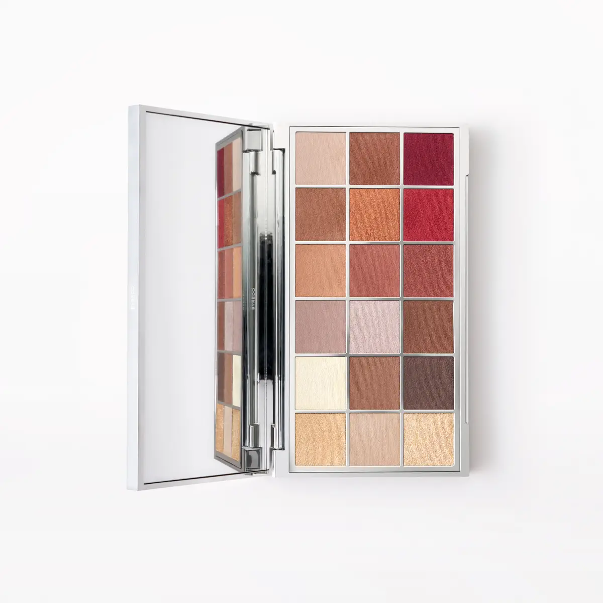

[Official Page](https://www.byredo.com/eu_de/p/bibliophilia-palette-eyeshadow-18-colours)

18色眼影盘，灵感来源于图书馆的静谧魔法。涵盖柔和米色、温暖赭黄、轻盈金调以及各式棕色中性色，搭配铜红与勃艮第酒红作为跳色点缀。三种质地：奶油金属、发光缎光、丝绒哑光，持妆可达12小时。

---

## Shade 1: Mind Solace - Ivory Cream Matte

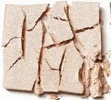

Use: A pure, soft ivory-cream matte. The perfect all-over lid base for all skin tones, it brightens and primes the eye. Blend through the inner corner and brow bone to open up the eye.

##### 色号 1：Mind Solace（心之慰藉）—— 柔软象牙白哑光色。
用途：适合所有肤色作全眼打底铺色，提亮双眸；晕染于眼头和眉骨，可放大眼部轮廓。

---

## Shade 2: Wordsmith - Warm Copper Bronze Metallic

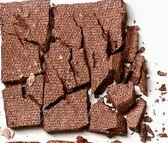

Use: A rich, warm copper-bronze metallic evoking aged literary craft. Apply across the lid for an artisan, editorial look, or concentrate on the centre of the lid as a focal point.

##### 色号 2：Wordsmith（铸词人）—— 温润铜棕金属色。
用途：全眼铺色打造富有质感的文艺风；也可集中点于眼皮中央作视觉焦点。

---

## Shade 3: Librarium - Deep Wine Metallic

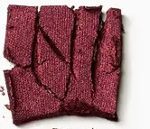

Use: A deep, dark wine-red metallic like the covers of antique leather-bound books. Use on the outer lid and crease for dramatic intensity, or blend into the lower lashline as a moody liner accent.

##### 色号 3：Librarium（古典书苑）—— 深邃暗酒红金属色。
用途：用于眼尾和眼窝打造戏剧感；沿下睫毛根部晕染，增添神秘感。

---

## Shade 4: Chronicle - Medium Warm Brown Satin

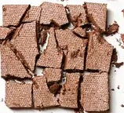

Use: A versatile, medium warm-brown satin. Blend through the crease as a transitional shade, apply all over the lid for a wearable everyday look, or deepen the outer corners for subtle definition.

##### 色号 4：Chronicle（编年史）—— 百搭中等暖棕缎光色。
用途：用于眼窝作过渡色，或全眼铺色打造易驾驭日常妆；叠加于眼尾，增添柔和轮廓感。

---

## Shade 5: Epitome - Bright Copper Metallic

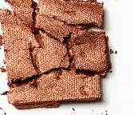

Use: A vivid, intense copper metallic — the signature statement shade of the palette. Apply on the centre of the lid for maximum impact, or use across the entire eye for a burnished, copper-glazed look.

##### 色号 5：Epitome（精华之作）—— 鲜亮明铜金属色。
用途：点于眼皮中央打造最强视觉冲击；全眼铺色可呈现锻铜般的华丽金属感，为本盘标志性色号。

---

## Shade 6: Archivist - Deep Burgundy Wine Satin

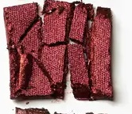

Use: A rich, deep burgundy-wine with a satin sheen. Use on the outer lid and crease to anchor the look with depth, or layer over matte browns for a polished, library-red finish.

##### 色号 6：Archivist（典藏者）—— 深沉勃艮第酒红缎光色。
用途：用于眼尾和眼窝锚定妆效深度；叠加于哑光棕之上，可打造精致书房红色感。

---

## Shade 7: Epilogue - Soft Peachy Salmon Matte

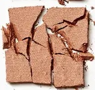

Use: A soft, peachy-salmon matte with warm undertones. Blend through the crease as a warm transition shade, or apply across the entire lid for a sun-touched, natural everyday finish.

##### 色号 7：Epilogue（尾声）—— 柔和蜜桃鲑鱼粉哑光色。
用途：晕染于眼窝作暖调过渡色；全眼铺色可呈现晒后自然感日常妆效。

---

## Shade 8: Bibliophile - Medium Rose Mauve Satin

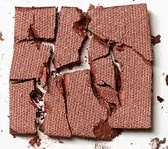

Use: A medium rose-mauve satin — the heart of the palette. Use as an all-over lid colour for a romantic, reader's reverie, or blend at the crease and outer corner for gentle dimension.

##### 色号 8：Bibliophile（爱书人）—— 中等玫瑰粉棕缎光色。
用途：全眼铺色打造浪漫书痴感；晕染于眼窝和眼尾增添柔和立体感，为全盘核心色号。

---

## Shade 9: Authors Note - Dark Chocolate Brown Matte

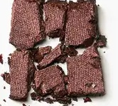

Use: A deep, dark chocolate-brown matte. Use to define the crease, deepen the outer corners, and line the upper lash line. Works as a rich base beneath metallics and satins for dramatic depth.

##### 色号 9：Authors Note（作者手记）—— 深邃巧克力棕哑光色。
用途：用于眼窝定型、眼尾加深、上睫毛根部描线；作为金属色和缎光色的打底，可强化戏剧深度。

---

## Shade 10: Alliteration - Light Lavender Grey Matte

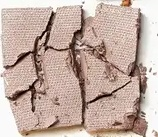

Use: A soft, cool lavender-grey matte. Blend across the lid as an understated base, or use in the crease as a cool-toned transition. Pairs with wine and mauve tones for a literary, grey-purple look.

##### 色号 10：Alliteration（头韵）—— 淡雅薰衣草灰哑光色。
用途：作全眼铺底或眼窝冷调过渡色；与酒红、浅紫搭配，可呈现文学气息的灰紫感妆效。

---

## Shade 11: Gateway - Medium Taupe Grey Matte

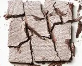

Use: A neutral, medium taupe-grey matte. An ideal transitional shade that works on any look — blend through the crease, use as a shadow base, or layer beneath deeper shades for extra depth.

##### 色号 11：Gateway（入口）—— 百搭中等棕灰哑光色。
用途：适合任何妆容的过渡色；晕染于眼窝，或作为深色的基底，叠加后层次更丰富。

---

## Shade 12: Pages of Wisdom - Dark Espresso Matte

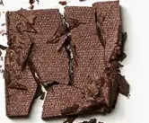

Use: A deep, velvety espresso-brown matte. Use to build intensity in the outer corner and crease, line the upper and lower lash lines, or fill in brows for brunettes and those with dark hair.

##### 色号 12：Pages of Wisdom（智慧之页）—— 深沉浓缩咖啡棕哑光色。
用途：叠加于眼尾和眼窝增强深度；沿上下睫毛根部描线；深棕或黑发人群也可用于修眉。

---

## Shade 13: Book Shop - Cream Gold Shimmer Metallic

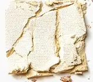

Use: A warm, cream-white with golden shimmer — evoking the cosy glow of a bookshop window. Apply on the inner corner and brow bone as a highlight, or over the entire lid for a luminous, antique-gold base look.

##### 色号 13：Book Shop（书店）—— 温暖金光闪烁奶油白色。
用途：点于眼头和眉骨作提亮高光；全眼铺色打造温暖发光的古金感底妆。

---

## Shade 14: Manuscript - Medium Sand Tan Matte

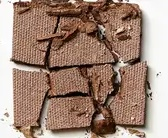

Use: A warm, sandy-tan matte like aged parchment. Blend through the crease as a soft, neutral transition, apply all over the lid for a light, natural finish, or use as a base beneath metallics.

##### 色号 14：Manuscript（手稿）—— 温暖羊皮纸沙棕哑光色。
用途：晕染于眼窝作中性过渡色；全眼铺色打造轻盈自然妆效；也可作为金属色的底色。

---

## Shade 15: Passage of Time - Dark Charcoal Brown Matte

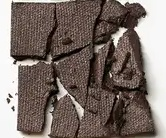

Use: A very deep, dark charcoal-brown matte. The darkest shade in the palette — use for dramatic liner, outer-corner deepening, or a bold smoky eye base across the lid on deeper skin tones.

##### 色号 15：Passage of Time（岁月流逝）—— 极深炭棕哑光色。
用途：全盘最深色，适合深肤色全眼烟熏打底；也可用于描绘戏剧眼线或加深眼尾。

---

## Shade 16: Mind Reader - Rose Gold Champagne Metallic

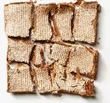

Use: A romantic rose-gold champagne metallic. Apply across the lid for an intuitive, feminine shimmer, or pair with berry tones at the outer corner for a warm, rosy eye finish.

##### 色号 16：Mind Reader（读心者）—— 浪漫玫瑰金香槟金属色。
用途：全眼铺色打造温柔女性感；与浆果色叠搭于眼尾，呈现温暖玫瑰感妆效。

---

## Shade 17: Soul Escape - Light Beige Sand Metallic

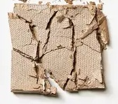

Use: A soft, light beige-sand metallic with gentle luminosity. Use as an inner-corner highlight, brow bone brightener, or apply all over the lid for an effortless, warm-neutral everyday glow.

##### 色号 17：Soul Escape（灵魂逃逸）—— 柔和浅米沙金属色。
用途：点于眼头提亮、眉骨打亮；全眼铺色打造轻松温暖的自然日常感。

---

## Shade 18: Bibliotheca - Warm Golden Metallic

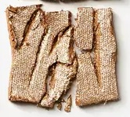

Use: A rich, warm golden metallic — the grand finale of the palette, like the gilded spines of a library collection. Apply across the lid for full-on golden glamour, or layer in the centre over deeper tones for a collector's-gold focal point.

##### 色号 18：Bibliotheca（藏书馆）—— 温润金色金属质地。
用途：全眼铺色打造金色满溢感；叠加于深色之上作眼皮中央焦点，呈现珍藏镀金感，为全盘压轴色号。
