# Byredo 18色 VESUVIO 火山眼影盘

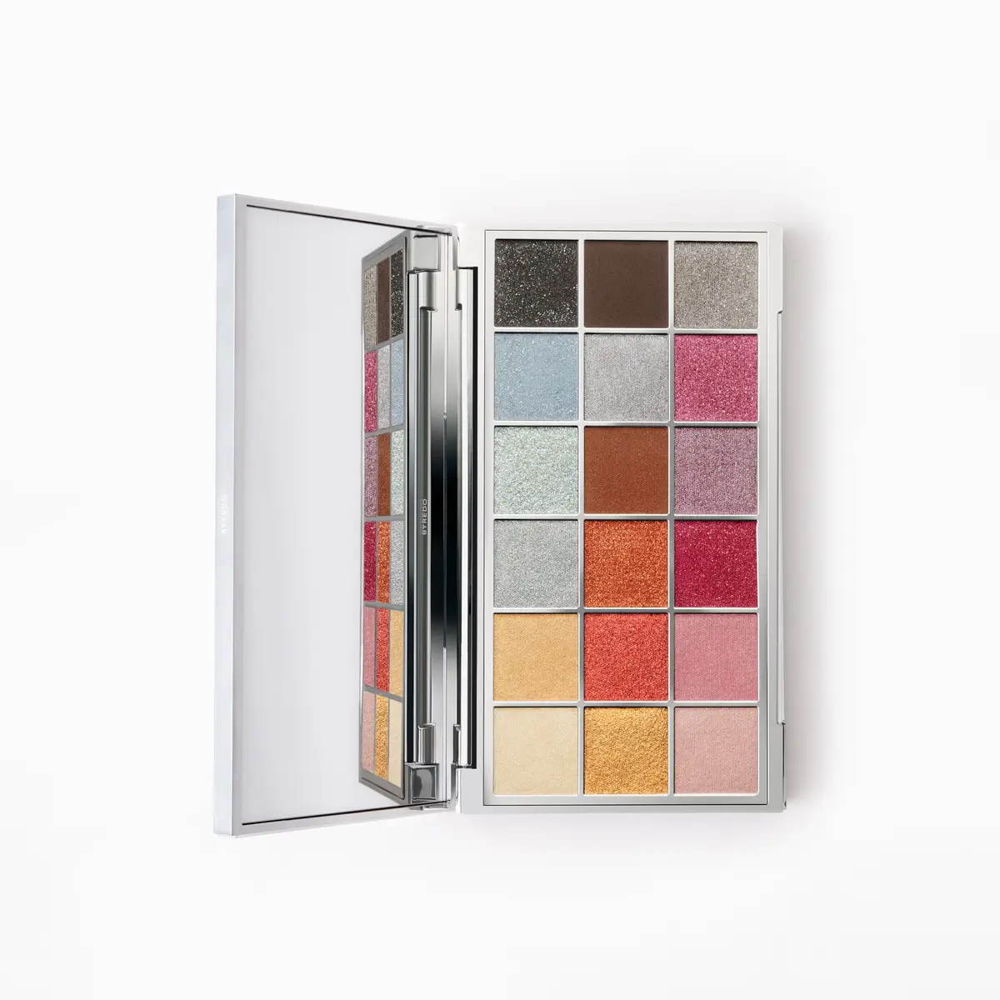

[Official Page](https://www.byredo.com/eu_de/p/vesuvio-palette-eyeshadow-18-colours)

18色眼影盘，灵感来源于18世纪那不勒斯画派描绘维苏威火山的画作，由创意总监 Lucia Pica 主导设计。质地细腻丝滑，持妆可达12小时。

---

## Shade 1: Volcanic Aura - Dark Charcoal Glitter Metallic

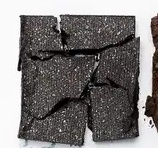

Use: A dramatic, near-black charcoal metallic with dense glitter. Apply over the entire lid for a high-impact smoky effect, or concentrate in the crease and outer corners for depth. Works beautifully as an eyeliner with a damp fine brush.

##### 色号 1：Volcanic Aura（火山光晕）—— 近黑色炭灰亮粉金属质地。
用途：浓郁亮粉感深色，全眼铺色可打造高强度烟熏妆；集中于眼窝和眼尾可增添深邃感；配合微湿细刷也可作眼线使用。

---

## Shade 2: Burnt Umber - Chocolate Brown Matte

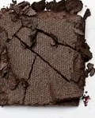

Use: A rich chocolate-brown matte shade. Use as an all-over lid colour on medium to deep skin tones, blend through the crease as a transitional shade, or build definition at the outer corners. Also works as a brow filler for brunettes.

##### 色号 2：Burnt Umber（焦棕）—— 浓郁巧克力棕哑光色。
用途：适合中至深肤色全眼铺色；晕染于眼窝作自然过渡色；叠加于眼尾强化轮廓；深棕发人群也可用于修眉。

---

## Shade 3: Flowing Horizon - Silver Grey Metallic

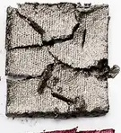

Use: A cool, luminous silver-grey metallic. Layer over the lid for a polished, editorial look, or blend into the outer corner as a shadow. Pairs with darker metallics for a dimensional smoked grey effect.

##### 色号 3：Flowing Horizon（流动地平线）—— 冷调银灰金属色。
用途：铺满眼皮打造精致光泽感；与更深的金属色叠搭，可呈现多层次烟灰眼妆。

---

## Shade 4: Smoky Blue - Ice Blue Shimmer

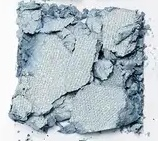

Use: A hazy ice-blue shimmer inspired by volcanic haze. Apply on the lid for a cool, ethereal effect. Blend with silver shades for a wintry look, or place at the inner corner as a highlight.

##### 色号 4：Smoky Blue（烟熏蓝）—— 冰蓝珠光色。
用途：铺满眼皮打造飘逸冰蓝感；与银色调叠搭呈现冷冽冬日妆容；点于眼头可作提亮使用。

---

## Shade 5: Blurred Sky - Silver Grey Metallic

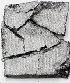

Use: A softer silver-grey metallic with a hazy quality. Blend across the lid for a diffused, atmospheric effect. Ideal as a transitional tone between deeper shades and a bright inner-corner highlight.

##### 色号 5：Blurred Sky（朦胧天空）—— 柔和银灰金属色。
用途：晕染于眼皮，打造雾感氛围；适合用作深色与亮色之间的过渡调和色。

---

## Shade 6: Volcanic Purple - Deep Burgundy Wine Shimmer

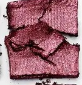

Use: A deep, volcanic burgundy-wine shimmer. Use on the outer third of the lid or the crease for rich, moody intensity. Layer over a primer for maximum pigmentation.

##### 色号 6：Volcanic Purple（火山紫）—— 深邃酒红珠光色。
用途：用于眼尾三分之一或眼窝，打造浓郁神秘感；叠加在打底膏上可使显色更饱满。

---

## Shade 7: Eternal Vesuvio - Sage Teal Shimmer

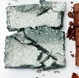

Use: A unique sage-teal shimmer evoking the seascape surrounding Vesuvius. Apply across the lid as a statement colour or in the crease for a subtle cooler dimension. A versatile accent tone.

##### 色号 7：Eternal Vesuvio（永恒维苏威）—— 鼠尾草绿青色珠光。
用途：铺满眼皮可打造独特青绿宣言妆；放入眼窝可增添冷调层次感；是百搭的点缀色。

---

## Shade 8: Painting - Warm Copper Rust Matte

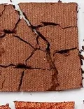

Use: A warm, terracotta-copper matte evoking 18th-century Neapolitan pigments. Blend through the crease and outer corners to add warmth and depth, or use as an all-over lid colour for an earthy, artistic effect.

##### 色号 8：Painting（画作）—— 温暖陶土铜色哑光。
用途：晕染于眼窝和眼尾，增加暖调和立体感；也可全眼铺色，打造大地色艺术感妆效。

---

## Shade 9: Violet Veil - Dusty Mauve Metallic

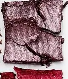

Use: A soft, dusty mauve-purple metallic. Perfect for a romantic, diffused eye look. Apply on the lid for a veiled, violet haze effect, or layer in the outer corner over deeper tones.

##### 色号 9：Violet Veil（紫罗兰面纱）—— 柔雾淡紫金属色。
用途：全眼铺色可打造浪漫紫雾感；叠加于眼尾深色之上，增添紫调光泽层次。

---

## Shade 10: Vesuvius Veil - Cool Grey Metallic

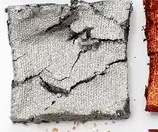

Use: A cool, slate-grey metallic recalling volcanic ash and stone. Apply on the lid for a graphic, polished effect. Deepen with darker metallics at the outer corners for a volcanic grey look.

##### 色号 10：Vesuvius Veil（维苏威面纱）—— 冷调石板灰金属色。
用途：全眼铺色打造利落金属感；在眼尾叠加更深金属色，呈现火山灰质感层次。

---

## Shade 11: Magma Orange - Burnt Orange Shimmer

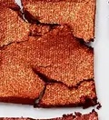

Use: A vivid burnt-orange shimmer evoking flowing lava. Apply across the lid for a fiery, volcanic statement look. Blend with gold tones for a molten sunset effect.

##### 色号 11：Magma Orange（岩浆橘）—— 浓烈燃橙珠光色。
用途：全眼铺色打造火焰感宣言妆；与金色叠搭，呈现熔岩落日感。

---

## Shade 12: Fiery Pink - Deep Berry Cherry Shimmer

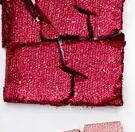

Use: A deep, intense berry-crimson shimmer. Concentrate on the outer lid and crease for a bold, passionate look. Pairs with violet or mauve metallics for a rich, volcanic intensity.

##### 色号 12：Fiery Pink（炙热粉）—— 浓郁浆果樱桃红珠光。
用途：集中于眼尾和眼窝，打造大胆热烈眼妆；与紫调或浅紫金属色搭配，呈现火山般的浓烈张力。

---

## Shade 13: Golden Halo - Gold Metallic

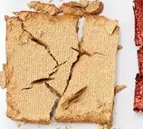

Use: A warm, luminous gold metallic. Apply over the entire lid for a golden, Neapolitan sun effect. Works beautifully as a highlighter on the brow bone or inner corner. Layer with orange shades for a molten look.

##### 色号 13：Golden Halo（黄金光晕）—— 温暖明亮金色金属质地。
用途：全眼铺色打造那不勒斯阳光感金色妆；点于眉骨或眼头作提亮；与橘调叠搭呈现熔岩感。

---

## Shade 14: Gold Lava - Dark Burnt Copper Metallic

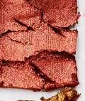

Use: A deep, smouldering burnt-copper metallic evoking solidified lava. Apply on the outer lid and crease for dimension, or use as a transition between orange and deeper tones.

##### 色号 14：Gold Lava（金色熔岩）—— 深邃燃铜色金属质地。
用途：用于眼尾和眼窝增加立体感；也可作为橘调与深色之间的过渡色使用。

---

## Shade 15: Delicate Pastel - Blush Pink Satin

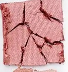

Use: A soft, delicate blush-pink satin. Apply over the entire lid for a fresh, wearable everyday look. Ideal as a base tone beneath shimmer shades or as a soft highlight on the brow bone.

##### 色号 15：Delicate Pastel（细腻粉彩）—— 柔嫩玫粉缎光色。
用途：全眼铺色打造清新日常妆；适合作为珠光色的打底或眉骨柔和提亮色。

---

## Shade 16: Pastel Cloud - Ivory Cream Satin

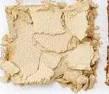

Use: A soft, cloud-like ivory-cream satin. Use as an all-over lid base, inner corner highlight, or brow bone brightener. Layering beneath shimmers and metallics enhances their luminosity.

##### 色号 16：Pastel Cloud（粉彩云朵）—— 柔软云感象牙白缎光色。
用途：作全眼铺底色、眼头提亮或眉骨打亮；叠在珠光色和金属色下方可提升光泽感。

---

## Shade 17: Painted Memories - Warm Gold Yellow Metallic

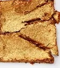

Use: A warm, antique-gold metallic with a yellow-gold tone. Apply on the central lid for a sun-drenched, Neapolitan fresco effect. Layer with orange or copper tones for a warm, gilded look.

##### 色号 17：Painted Memories（绘画记忆）—— 暖色古金黄金属质地。
用途：用于眼皮中央打造那不勒斯壁画般的日晒感；与橘调或铜色叠搭呈现镀金温暖妆效。

---

## Shade 18: Painted Horizon - Pale Nude Shimmer

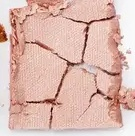

Use: A soft, pale nude-pink shimmer evoking the gentle tones of a painted Italian horizon. Wear across the entire lid for a luminous, ethereal finish, or use as an inner corner and brow bone highlight.

##### 色号 18：Painted Horizon（画中地平线）—— 裸调淡粉珠光色。
用途：全眼铺色打造发光感轻透妆效；也可点于眼头和眉骨作高光提亮使用。
