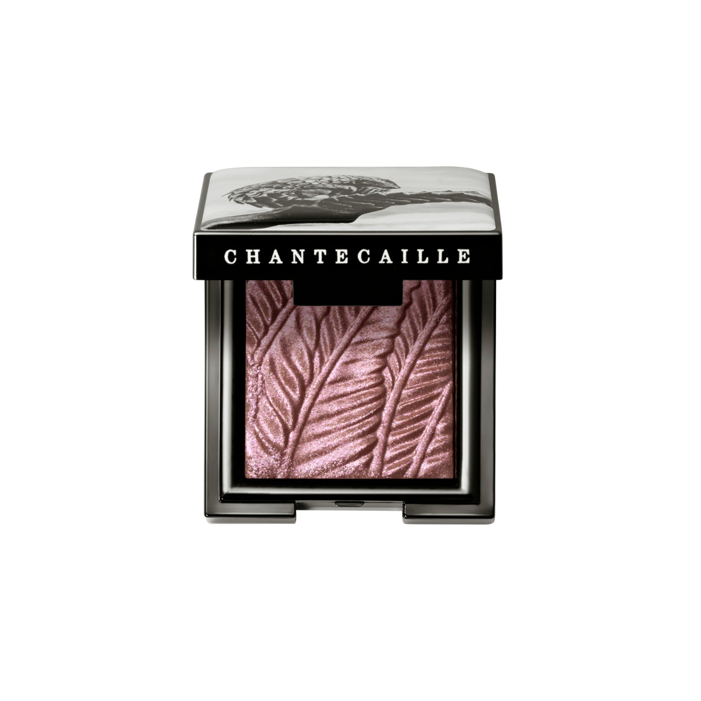
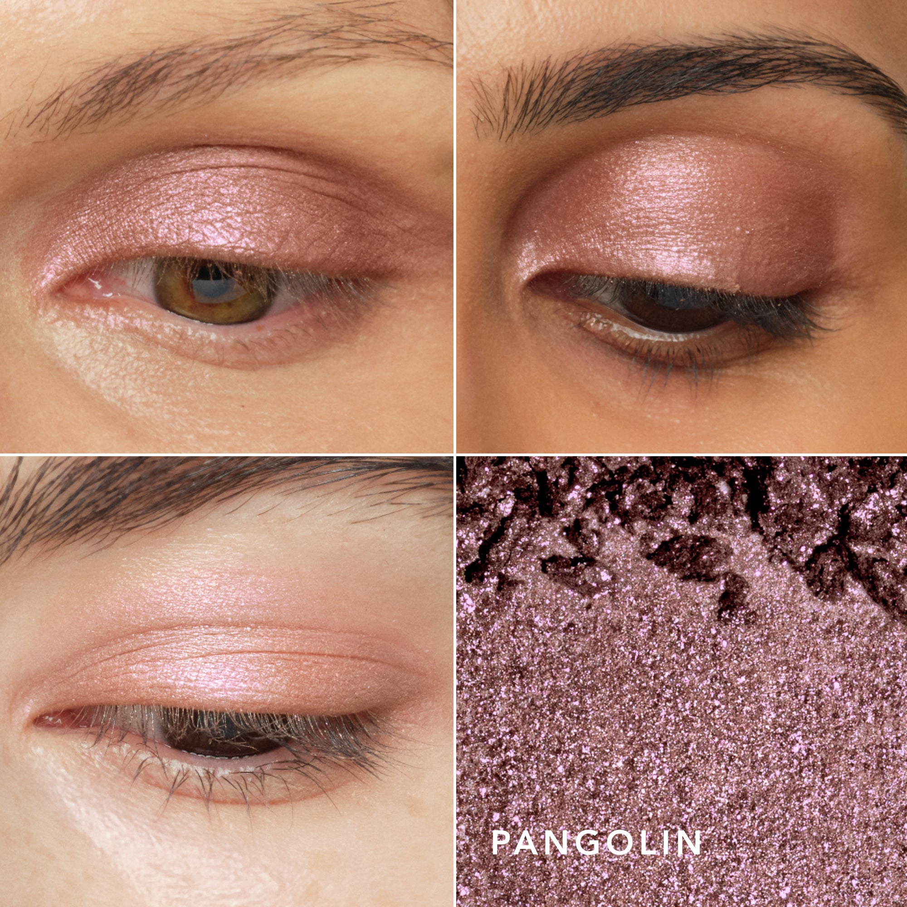

# 香缇卡 珠光眼影 暮暮淡紫 Luminescent Eye Shades Pangolin
*Pearlescent Eye Shadow · 2.5g*

> 暮色般的淡紫调，低调神秘，为眼妆带来一抹空灵的紫色韵味。以穿山甲之名，这款珠光淡紫不仅承载着色彩之美，更凝聚着对这一濒危物种的深切关注与保育情怀。

> *A dusky lilac that carries the quiet mystery of dusk — a shimmer tinged with purple, soft and otherworldly. Named for one of the world's most trafficked mammals, Pangolin carries beauty with purpose.*

---

### 使用方法 How To Use

> 以眼影刷平面一侧，在眼睑上均匀铺色，打造闪耀色彩效果。用刷子尖端一侧，在内眼角和眉骨处晕染提亮。可轻松调节显色深浅，不飞粉，不折痕。

> *Apply with the flat side of Shade and Sweep Eye Brush to create a shimmering wash of color on the eyelid. Use the tapered side to blend and highlight the inner corner of the eye and the brow bone.*

---

### 产品信息

- **系列：** Luminescent Eye Shades
- **色调：** Dusky lilac（暮暮淡紫）
- **容量：** 2.5g / .08 oz
- **荣誉：** Allure Best of Beauty 大奖
- 无动物实验 · 无对羟基苯甲酸酯 · 无香精 · 无邻苯二甲酸酯

---

*Chantecaille 为部分销售额捐助野生动物保育组织，致力于保护非洲及全球濒危物种与其栖息地。*
