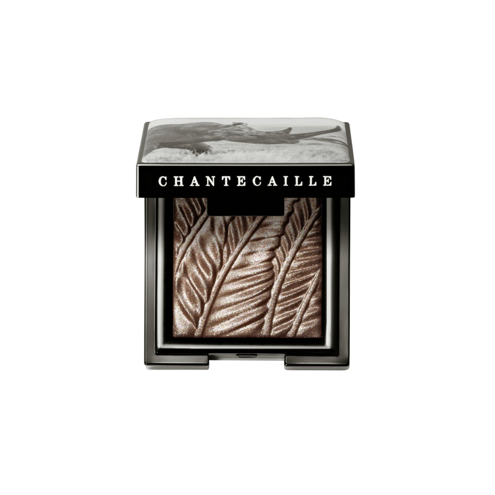
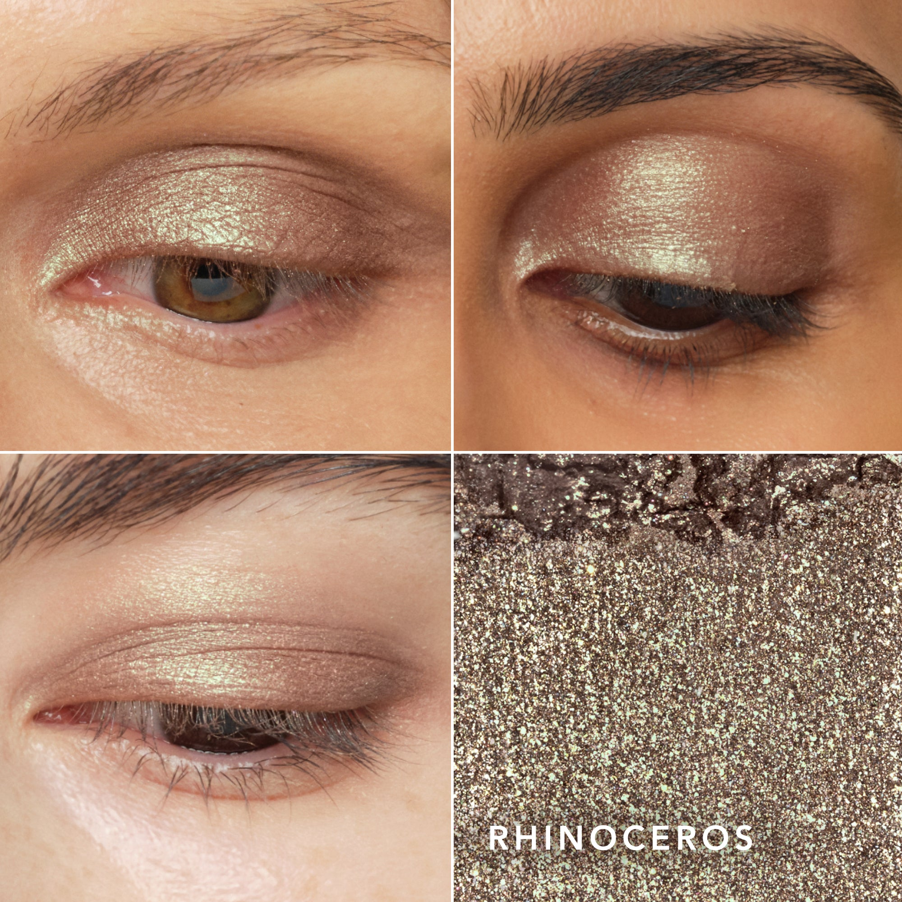

# 香缇卡 珠光眼影 精致橄榄绿 Luminescent Eye Shades Rhinoceros
*Pearlescent Eye Shadow · 2.5g*

> 精致的橄榄绿，中性摩登，令眼妆展现出独特的绿调时髦感。以犀牛之名，承载着品牌对非洲濒危动物保育的郑重承诺。与棕调叠加可打造大地色渐变，单独铺色则呈现低调有辨识度的个性妆效。

> *A sophisticated olive that brings a modern, gender-neutral edge to the eye. Named for one of Africa's most iconic and endangered species, Rhinoceros pairs beautifully with browns for an earthy gradient or stands alone for a quietly distinctive look.*

---

### 使用方法 How To Use

> 以眼影刷平面一侧，在眼睑上均匀铺色，打造闪耀色彩效果。用刷子尖端一侧，在内眼角和眉骨处晕染提亮。可轻松调节显色深浅，不飞粉，不折痕。

> *Apply with the flat side of Shade and Sweep Eye Brush to create a shimmering wash of color on the eyelid. Use the tapered side to blend and highlight the inner corner of the eye and the brow bone.*

---

### 产品信息

- **系列：** Luminescent Eye Shades
- **色调：** Sophisticated olive（精致橄榄绿）
- **容量：** 2.5g / .08 oz
- **荣誉：** Allure Best of Beauty 大奖
- 无动物实验 · 无对羟基苯甲酸酯 · 无香精 · 无邻苯二甲酸酯

---

*Chantecaille 为部分销售额捐助野生动物保育组织，致力于保护非洲及全球濒危物种与其栖息地。*
