# Natasha Denona 15色 冷调烟熏盘 I Need a Cool Eyeshadow Palette

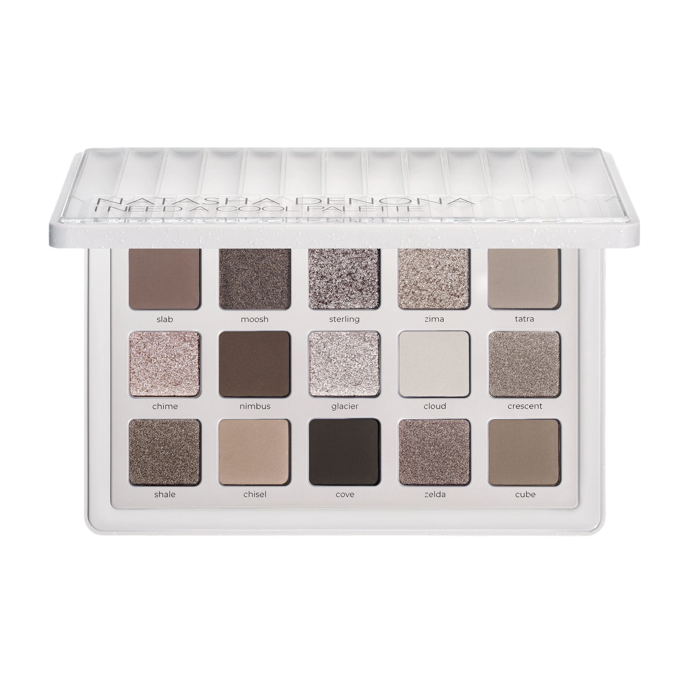

冷调大地中性色系，收录冷调灰棕、烟熏冷棕和雾霭感哑光，共 15 色。包含 7 款奶油/丝滑哑光、5 款金属感、3 款箔光闪，质地丰富，轻松打造从日常到烟熏的多种眼妆。

€77.44 · 18.15g / 0.64 oz · 产地意大利

**认证：** 无对羟基苯甲酸酯 · 无矿物油 · 无动物测试

---

## 质地说明

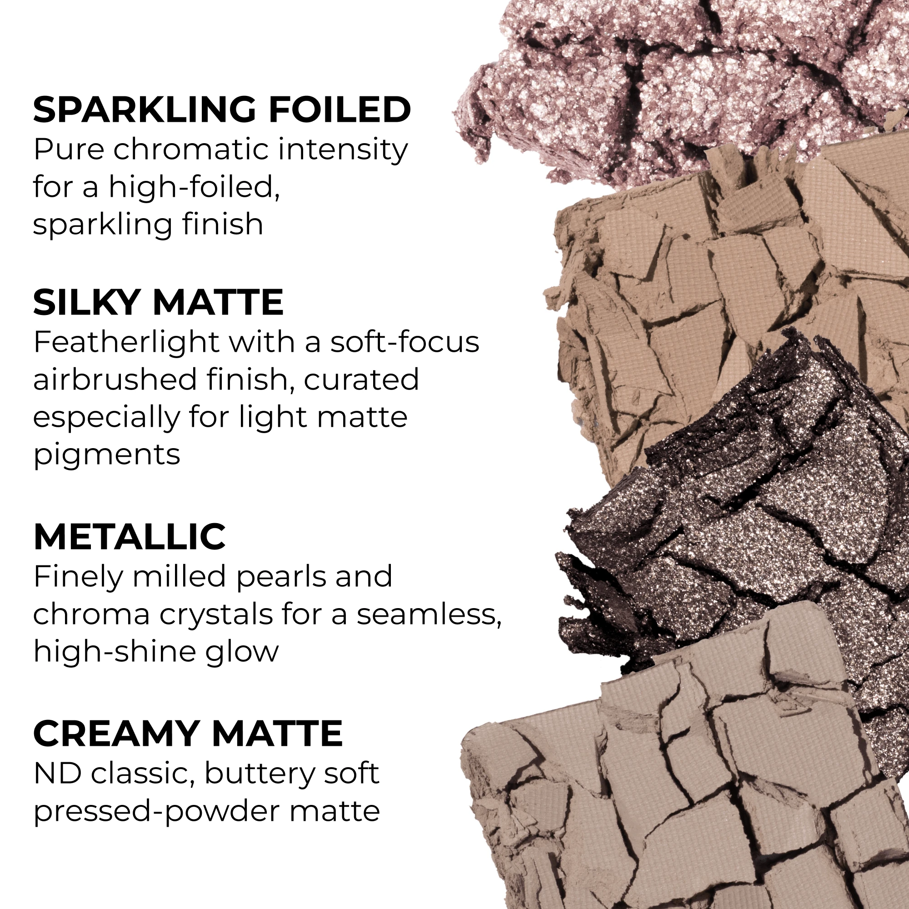

| 代码 | 质地 | 特点 |
|------|------|------|
| CM | Creamy Matte 奶油哑光 | 品牌经典配方，柔滑厚实的压粉哑光，发色饱满 |
| SKM | Silky Matte 丝滑哑光 | 轻薄质地，柔焦气雾感，适合浅调哑光色 |
| SF | Sparkling Foiled 箔光闪 | 高折射箔光，纯粹色彩强度，超强光泽 |
| M | Metallic 金属感 | 细磨珍珠粉 + 色彩晶体，无缝高光泽感 |

**哑光上色建议：** 用紧密刷头按压上色，再用蓬松刷晕染。
**金属/箔光上色建议：** 用湿刷或指腹涂抹，获得最强反光和发色。

---

## 手臂试色

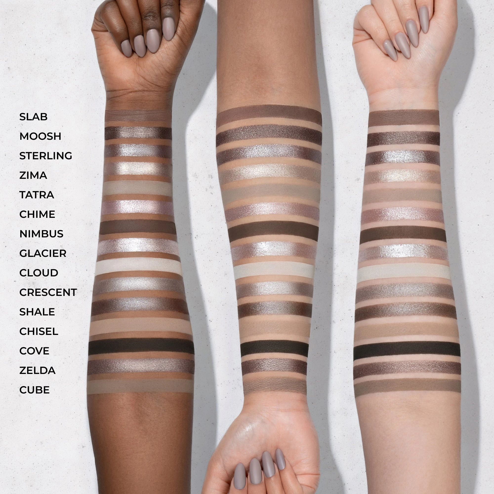

---

## 眼妆分区指南

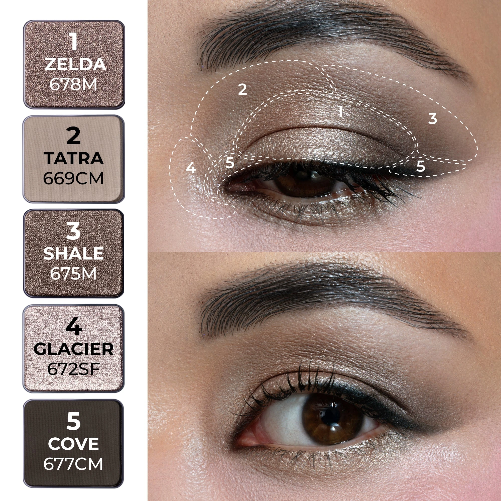

---

## 色号总览

| # | 色名 | 代码 | 质地 | 颜色描述 |
|---|------|------|------|----------|
| 1 | Slab | 671CM | Creamy Matte | 中调暖棕灰，奶油哑光 |
| 2 | Moosh | 666M | Metallic | 中调暖棕灰，金属感 |
| 3 | Sterling | 667SF | Sparkling Foiled | 中调冰棕灰，箔光闪 |
| 4 | Zima | 668M | Metallic | 浅冷香槟色，金属感 |
| 5 | Tatra | 669CM | Creamy Matte | 浅中调石灰色，奶油哑光 |
| 6 | Chime | 670SF | Sparkling Foiled | 浅冰粉尘色，箔光闪 |
| 7 | Nimbus | 665CM | Creamy Matte | 深木棕色，奶油哑光 |
| 8 | Glacier | 672SF | Sparkling Foiled | 浅冰白色，箔光闪 |
| 9 | Cloud | 673CM | Creamy Matte | 浅尘雾白，奶油哑光 |
| 10 | Crescent | 674M | Metallic | 中调棕灰色，金属感 |
| 11 | Shale | 675M | Metallic | 深冷棕色，金属感 |
| 12 | Chisel | 676SKM | Silky Matte | 浅棕色，丝滑哑光 |
| 13 | Cove | 677CM | Creamy Matte | 深冷棕黑，奶油哑光 |
| 14 | Zelda | 678M | Metallic | 中调冷棕色，金属感 |
| 15 | Cube | 679CM | Creamy Matte | 中调棕灰色，奶油哑光 |

---

## Shade 1: Slab 671CM — Creamy Matte Medium Warm Taupe
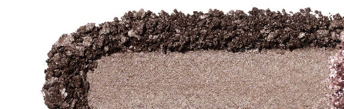

Use: All-over base for medium to deep skin tones. Crease transition to build depth. Pairs with Nimbus in the outer corner for a warm-cool smoky eye.

##### 色号 1：石板棕哑 (Slab) —— 中调暖棕灰，奶油哑光。
用途：中至深肤色可用作全眼底色；适合眼窝过渡晕染加深层次；与 `Nimbus` 搭配可做冷暖对比烟熏妆。

---

## Shade 2: Moosh 666M — Metallic Medium Warm Taupe
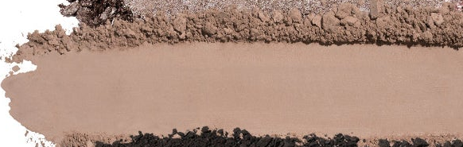

Use: All-over lid for a warm metallic taupe. Center lid pop over a matte base. Pairs with Slab in the crease for a tone-on-tone metallic look. Damp brush for maximum glow.

##### 色号 2：暖棕金属 (Moosh) —— 中调暖棕灰，金属感。
用途：可全眼铺色打造暖调金属棕；叠于哑光底色之上点亮眼皮中央；与 `Slab` 搭配可做同色调金属妆；湿刷加强光泽。

---

## Shade 3: Sterling 667SF — Sparkling Foiled Medium Icy Taupe
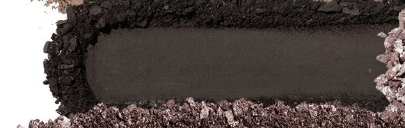

Use: All-over lid for a cool icy sparkle. Inner corner and center lid highlight. Damp fingertip for intense foiled finish. Pairs with Shale in the outer corner for depth.

##### 色号 3：银棕箔光 (Sterling) —— 中调冰棕灰，箔光闪。
用途：可全眼铺色打造冷调冰光感；用于眼头和眼皮中央提亮；指腹湿用发色最强烈；与 `Shale` 搭配可做有深度的冷调箔光妆。

---

## Shade 4: Zima 668M — Metallic Light Cool Champagne
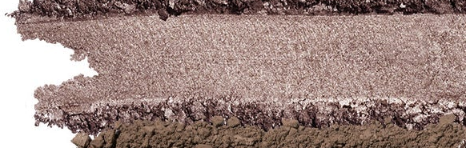

Use: Inner corner and center lid highlight. All-over lid for a barely-there metallic glow. Apply damp for maximum mirror shine. Flatters all skin tones.

##### 色号 4：冰霜香槟 (Zima) —— 浅冷香槟色，金属感。
用途：用于眼头和眼皮中央提亮；可全眼铺色打造隐约金属光泽；湿刷可获得镜面高光效果；适合所有肤色。

---

## Shade 5: Tatra 669CM — Creamy Matte Light Medium Stone
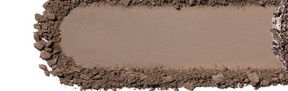

Use: Base for most skin tones. Crease transition and blend-out shade. Brow bone highlight for medium to deep skin. Works as a soft day-time all-over shade.

##### 色号 5：石灰哑光 (Tatra) —— 浅中调石灰色，奶油哑光。
用途：适合大部分肤色作底色；用于眼窝过渡和晕染柔化；中至深肤色可用于眉骨提亮；可用作日常柔和全眼色。

---

## Shade 6: Chime 670SF — Sparkling Foiled Light Icy Dusty Pink
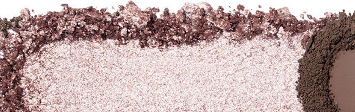

Use: All-over lid for a romantic icy pink sparkle. Inner corner highlight. Pairs with Zelda on the outer corner for a cool smoky look. Damp for maximum foil payoff.

##### 色号 6：冰粉箔光 (Chime) —— 浅冰粉尘色，箔光闪。
用途：可全眼铺色打造浪漫冰粉光泽；用于眼头提亮；与 `Zelda` 搭配可做冷调烟熏妆；湿刷可获得最强箔光发色。

---

## Shade 7: Nimbus 665CM — Creamy Matte Dark Wooden Brown
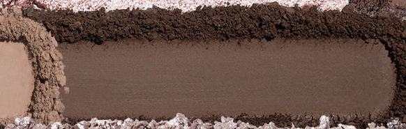

Use: Outer corner and deep crease for definition. Lower lash line for a smoky effect. Use with a small brush for precision liner work. Pairs with any metallic for a classic dark-lid look.

##### 色号 7：乌木棕哑 (Nimbus) —— 深木棕色，奶油哑光。
用途：用于眼尾和深眼窝加深轮廓；沿下眼睑打造烟熏效果；用细刷可做精准眼线；与任意金属色搭配可做经典深眼妆。

---

## Shade 8: Glacier 672SF — Sparkling Foiled Light Icy Ivory
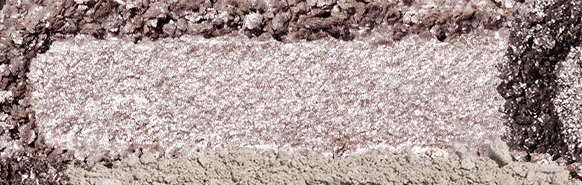

Use: Inner corner and center lid for a luminous icy highlight. Brow bone highlight for all skin tones. Apply damp for intense foiled glow. Light all-over lid for minimal looks.

##### 色号 8：冰川白光 (Glacier) —— 浅冰白色，箔光闪。
用途：用于眼头和眼皮中央打造冰白高光；适合所有肤色作眉骨提亮；湿刷可获得强烈箔光光泽；可用作极简日妆全眼底色。

---

## Shade 9: Cloud 673CM — Creamy Matte Light Dusty Off-White
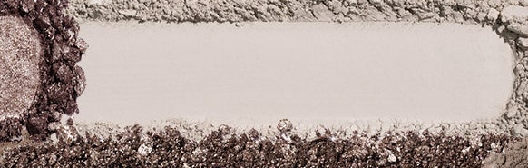

Use: Base for lighter skin tones. Brow bone highlight and blend-out. Transition shade to soften hard edges. Pairs with any deep shade for contrast.

##### 色号 9：云雾白哑 (Cloud) —— 浅尘雾白，奶油哑光。
用途：浅肤色可用作底色；用于眉骨提亮和柔化边缘；作过渡色柔化深色；与任意深色搭配可增加对比层次。

---

## Shade 10: Crescent 674M — Metallic Medium Taupe
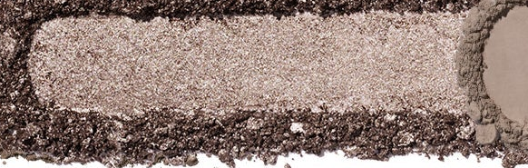

Use: All-over lid for a neutral metallic taupe. Pairs with Cove in the outer corner for a classic smoky look. Damp brush for maximum metallic shine. Works for all skin tones.

##### 色号 10：弦月棕金 (Crescent) —— 中调棕灰色，金属感。
用途：可全眼铺色打造中性金属棕；与 `Cove` 搭配可做经典烟熏妆；湿刷加强金属光泽；适合所有肤色。

---

## Shade 11: Shale 675M — Metallic Dark Cool Brown
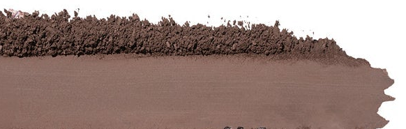

Use: Outer corner for deep cool metallic definition. Lower lash line for intensity. Pairs with Glacier for a dramatic dark-to-light metallic eye. Damp brush for deepest payoff.

##### 色号 11：岩层深棕金 (Shale) —— 深冷棕色，金属感。
用途：用于眼尾打造深邃冷调金属感；沿下眼睑加强立体感；与 `Glacier` 搭配可做深浅对比金属妆；湿刷获得最深发色。

---

## Shade 12: Chisel 676SKM — Silky Matte Light Brown
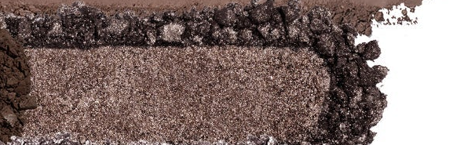

Use: Base for most skin tones. Crease transition and brow bone blend-out. All-over lid for a clean neutral. Acts as a blending buffer between deeper shades.

##### 色号 12：轻棕丝哑 (Chisel) —— 浅棕色，丝滑哑光。
用途：适合大部分肤色作底色；用于眼窝过渡和眉骨柔化；可全眼打造干净中性妆；用作深浅色之间的晕染缓冲色。

---

## Shade 13: Cove 677CM — Creamy Matte Deep Cool Brown
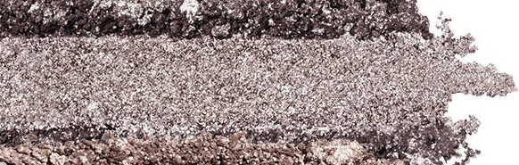

Use: Outer corner and crease for deep cool drama. Liner effect along upper and lower lash line. Pairs with Sterling for a cool-toned glam eye. Use sparingly on lighter skin tones.

##### 色号 13：海湾深棕哑 (Cove) —— 深冷棕黑，奶油哑光。
用途：用于眼尾和眼窝打造深邃冷调感；沿上下眼睑可做眼线效果；与 `Sterling` 搭配可做冷调华丽眼妆；浅肤色适量使用。

---

## Shade 14: Zelda 678M — Metallic Medium Cool Brown
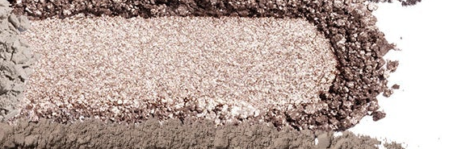

Use: All-over lid for a cool metallic brown. Outer corner for smoky depth. Pairs with Chime for a cool metallic look. Damp brush intensifies the metallic payoff.

##### 色号 14：冷棕金属 (Zelda) —— 中调冷棕色，金属感。
用途：可全眼铺色打造冷调金属棕感；集中于眼尾加深烟熏感；与 `Chime` 搭配可做冷调金属妆；湿刷加强金属发色。

---

## Shade 15: Cube 679CM — Creamy Matte Medium Taupe
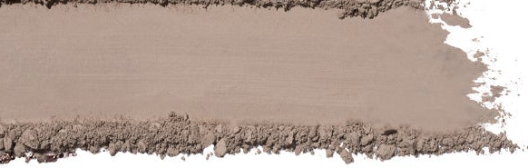

Use: All-over neutral base for all skin tones. Crease transition shade. Pairs with any shimmer on the lid for a classic eye. Versatile daily wear shade.

##### 色号 15：方块棕哑 (Cube) —— 中调棕灰色，奶油哑光。
用途：适合所有肤色的全眼中性底色；用于眼窝过渡晕染；与任意闪色叠搭可做经典眼妆；百搭日常用色。
