# Natasha Denona 15色 梦幻星空盘 My Dream Eyeshadow Palette

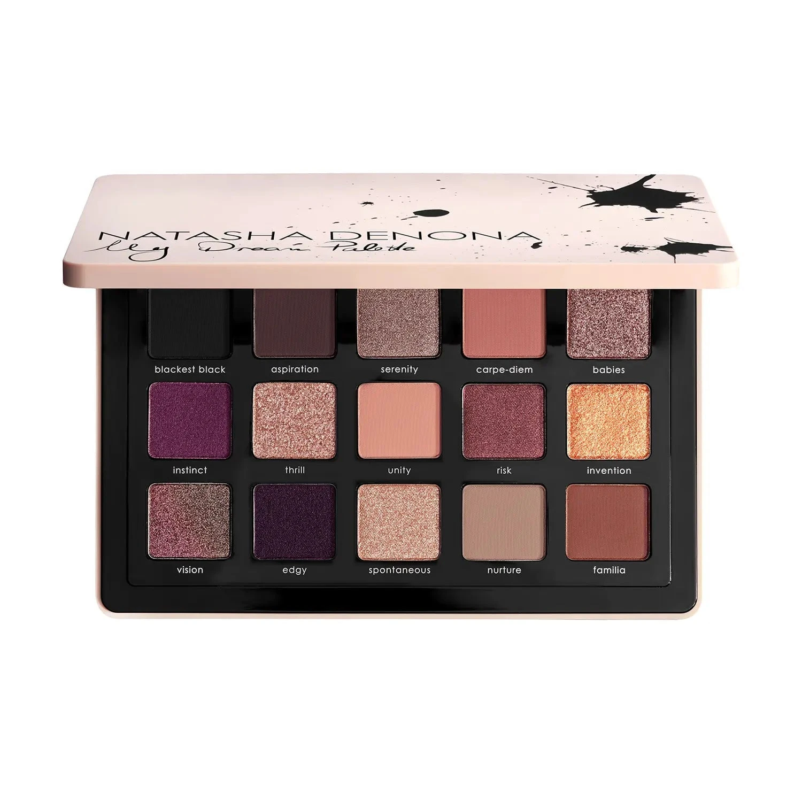

梦幻星空系列，融合哑光、金属、奶粉哑光和 Sparkling Duo Chrome 双色闪光质地，以纯正黑色为基底，向上延伸至桃裸、裸粉、酒红、品红与多变彩虹色，最终以大地焦糖收尾。15色横跨深邃烟熏至空灵裸感，一盘实现所有妆效。

€77.44 · 17.4g / 0.61 oz · 产地意大利

**认证：** 无对羟基苯甲酸酯 · 无矿物油 · 无动物测试

---

## 质地说明

| 代码 | 质地 | 特点 |
|------|------|------|
| CM | Creamy Matte 奶油哑光 | 品牌经典配方，柔滑压粉哑光，发色饱满 |
| CP | Cream Powder 奶粉哑光 | 轻盈奶粉质地，柔焦自然 |
| M | Metallic 金属感 | 细磨珍珠粉 + 色彩晶体，无缝高光泽 |
| DC | Duo Chrome 双色变幻 | 随角度呈现双色光效 |
| DCS | Sparkling Duo Chrome 双色闪光 | 双色变幻加入多维闪光粒子 |
| MC | Multichrome 多变色 | 随角度变换多色调反射 |

**哑光上色建议：** 用紧密刷头按压上色，再用蓬松刷晕染。
**金属/双色变幻上色建议：** 用湿刷或指腹涂抹，获得最强光泽和变色效果。

---

## 手臂试色

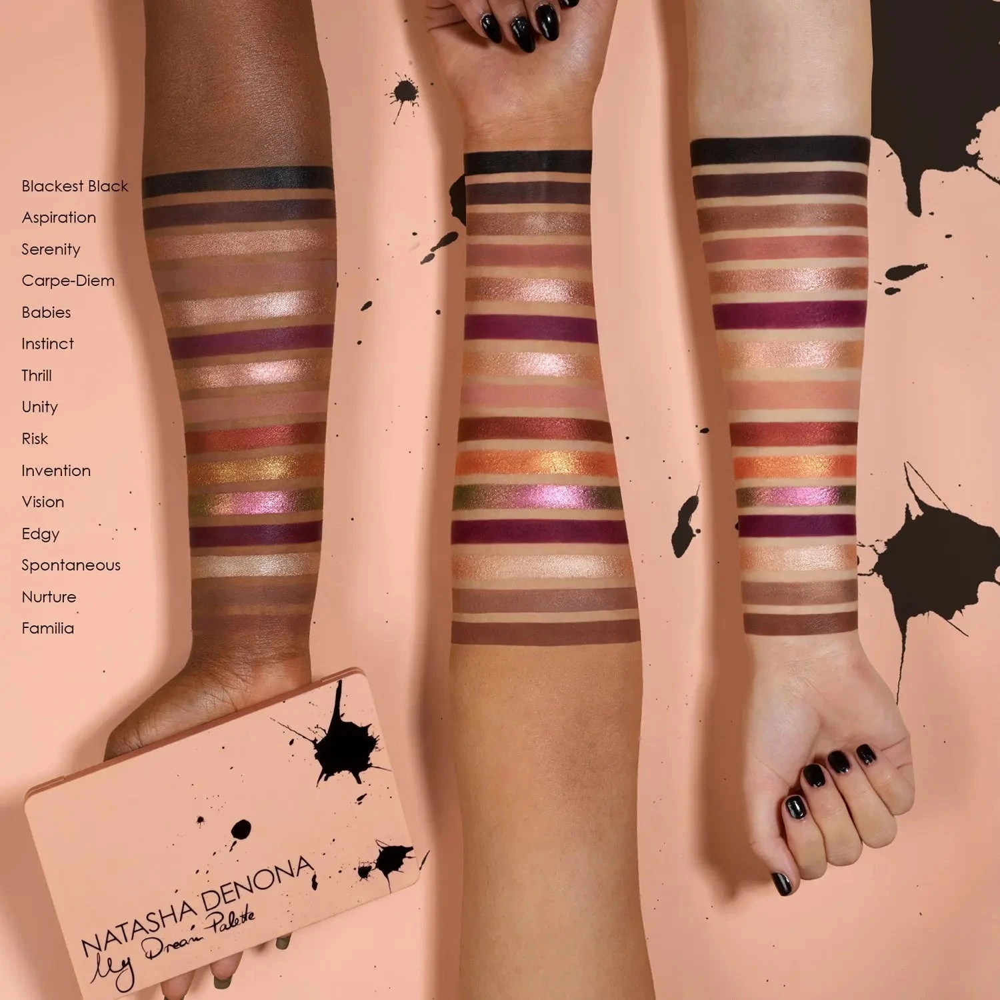

---

## 色号总览

| # | 色名 | 代码 | 质地 | 颜色描述 |
|---|------|------|------|----------|
| 1 | Blackest Black | 439CM | Creamy Matte | 纯正黑色，奶油哑光 |
| 2 | Aspiration | 440CM | Creamy Matte | 深铜棕色，奶油哑光 |
| 3 | Serenity | 114DC | Duo Chrome | 中调冷棕双色变幻 |
| 4 | Carpe Diem | 442CM | Creamy Matte | 中调尘桃色，奶油哑光 |
| 5 | Babies | 441M | Metallic | 浅中调玫裸色，金属感 |
| 6 | Instinct | 443CP | Cream Powder | 中调品红色，奶粉哑光 |
| 7 | Thrill | 444DCS | Sparkling Duo Chrome | 金裸带粉色变幻双色闪 |
| 8 | Unity | 445CM | Creamy Matte | 浅粉裸色，奶油哑光 |
| 9 | Risk | 446M | Metallic | 中调酒红色，金属感 |
| 10 | Invention | 447DCS | Sparkling Duo Chrome | 橘橙带铜金多维闪光双色变幻 |
| 11 | Vision | 448MC | Multichrome | 绿/粉/裸/金多变色 |
| 12 | Edgy | 449CP | Cream Powder | 中深茄紫色，奶粉哑光 |
| 13 | Spontaneous | 450M | Metallic | 浅珠光裸色，金属感 |
| 14 | Nurture | 451CM | Creamy Matte | 中调冷裸色，奶油哑光 |
| 15 | Familia | 452CM | Creamy Matte | 中调焦糖棕，奶油哑光 |

---

## Shade 1: Blackest Black 439CM — Creamy Matte Intense Black
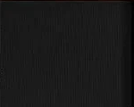

Use: Liner effect along lash lines. Outer corner for maximum drama. Deep crease for graphic smoky eye. Pairs with any shimmer for bold contrast.

##### 色号 1：极致黑哑 (Blackest Black) —— 纯正黑色，奶油哑光。
用途：沿睫毛根部可做精准眼线；集中于眼尾打造极强立体感；用于眼窝可做强烈烟熏妆；与任意闪色搭配可做强烈对比。

---

## Shade 2: Aspiration 440CM — Creamy Matte Dark Penny Brown
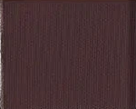

Use: Outer corner and crease for deep warm definition. Pairs with Blackest Black for a layered dark look. Transition from deep to mid shades. Liner effect on the lower lash line.

##### 色号 2：深铜棕哑 (Aspiration) —— 深铜棕色，奶油哑光。
用途：用于眼尾和眼窝打造深暖轮廓；与 `Blackest Black` 搭配可做叠层深色妆；用于衔接深色与中调色；用于下眼睑可做眼线效果。

---

## Shade 3: Serenity 114DC — Duo Chrome Medium Cool Brown
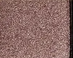

Use: All-over lid for a subtle color-shifting effect. Pairs with Carpe Diem in the crease. Apply damp for maximum duo chrome intensity. Center lid for dimensional depth.

##### 色号 3：冷棕双变 (Serenity) —— 中调冷棕双色变幻。
用途：可全眼铺色展现细腻变色效果；与 `Carpe Diem` 搭配可做眼窝过渡；湿刷可获得最强双色光效；点于眼皮中央增添立体维度。

---

## Shade 4: Carpe Diem 442CM — Creamy Matte Medium Dusty Peach
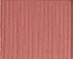

Use: Crease transition and all-over lid for warmer skin tones. Transition buffer between light and dark shades. Pairs with Aspiration for a warm crease gradient.

##### 色号 4：尘桃哑光 (Carpe Diem) —— 中调尘桃色，奶油哑光。
用途：用于眼窝过渡或暖肤色全眼铺色；用作浅色与深色之间的晕染缓冲；与 `Aspiration` 搭配可做暖调眼窝渐变。

---

## Shade 5: Babies 441M — Metallic Light Medium Rosy Nude
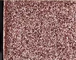

Use: All-over lid for a soft rosy metallic glow. Inner corner highlight. Center lid pop over a matte base. Damp brush for maximum metallic payoff. Flatters all skin tones.

##### 色号 5：玫裸金属 (Babies) —— 浅中调玫裸色，金属感。
用途：可全眼铺色打造柔和玫瑰金属感；用于眼头提亮；叠于哑光底色点亮眼皮中央；湿刷加强金属光泽；适合所有肤色。

---

## Shade 6: Instinct 443CP — Cream Powder Medium Fuchsia
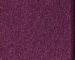

Use: All-over lid for a bold fuchsia statement. Crease definition on deeper skin tones. Pairs with Edgy in the outer corner for a purple-fuchsia look. Dry brush for buildable coverage.

##### 色号 6：品红奶粉 (Instinct) —— 中调品红色，奶粉哑光。
用途：可全眼铺色打造大胆品红宣言妆；深肤色可用于眼窝加深轮廓；与 `Edgy` 搭配可做紫粉眼妆；干刷可逐层叠加。

---

## Shade 7: Thrill 444DCS — Sparkling Duo Chrome Golden Nude with Pink Shift
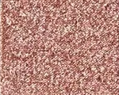

Use: All-over lid for a dazzling golden-pink duo chrome sparkle. Apply wet for maximum intensity. Inner corner highlight. Pairs with Risk in the outer corner for a contrasting look.

##### 色号 7：金裸粉变闪 (Thrill) —— 金裸带粉色变幻双色闪。
用途：可全眼铺色展现炫目金粉双色变幻闪光；湿刷获得最强光效；用于眼头提亮；与 `Risk` 搭配可做深浅对比眼妆。

---

## Shade 8: Unity 445CM — Creamy Matte Light Medium Pink Nude
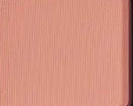

Use: Base for most skin tones. Brow bone highlight. Crease transition and blend-out. Subtle all-over lid for a clean everyday look.

##### 色号 8：粉裸哑光 (Unity) —— 浅粉裸色，奶油哑光。
用途：适合大部分肤色作底色；用于眉骨提亮；用于眼窝过渡和晕染；可做简约日常全眼铺色。

---

## Shade 9: Risk 446M — Metallic Medium Maroon
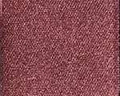

Use: All-over lid for a rich maroon metallic. Outer corner for dramatic depth. Damp brush for maximum metallic intensity. Pairs with Aspiration for a dark smoky eye.

##### 色号 9：酒红金属 (Risk) —— 中调酒红色，金属感。
用途：可全眼铺色打造浓郁酒红金属感；集中于眼尾加深戏剧感；湿刷获得最强金属光泽；与 `Aspiration` 搭配可做深邃烟熏眼妆。

---

## Shade 10: Invention 447DCS — Sparkling Duo Chrome Tangerine with Bronze & Golden Sparks
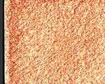

Use: All-over lid for a vibrant duo chrome spectacle. Apply wet for maximum bronze-golden sparks. Center lid statement over mattes. Unique bold shade.

##### 色号 10：橘铜金变幻 (Invention) —— 橘橙带铜金多维闪光双色变幻。
用途：可全眼铺色展现鲜活橘铜双色变幻；湿刷获得最强铜金闪光效果；叠于哑光底色之上做视觉焦点；盘内最独特大胆色。

---

## Shade 11: Vision 448MC — Multichrome Green Pink Nude Gold
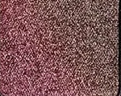

Use: All-over lid for a mesmerizing multi-shift effect. Apply wet for maximum multichrome intensity. Center lid accent over a neutral matte base. The most transformative shade in the palette.

##### 色号 11：绿粉金多变 (Vision) —— 绿/粉/裸/金多变色。
用途：可全眼铺色展现迷幻多色调变幻；湿刷获得最强多变色效果；叠于中性哑光底色之上点亮眼皮中央；盘内最具变幻感的宣言色。

---

## Shade 12: Edgy 449CP — Cream Powder Medium Dark Eggplant
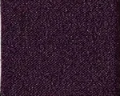

Use: Outer corner and crease for deep eggplant drama. Pairs with Instinct for a purple-fuchsia eye. Liner effect on lower lash line. Deep definition for evening looks.

##### 色号 12：茄紫奶粉 (Edgy) —— 中深茄紫色，奶粉哑光。
用途：用于眼尾和眼窝打造深邃茄紫感；与 `Instinct` 搭配可做紫粉眼妆；用于下眼睑可做眼线效果；夜妆深度轮廓用色。

---

## Shade 13: Spontaneous 450M — Metallic Light Pearl Nude
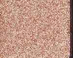

Use: Inner corner highlight and center lid brightener. All-over lid for a luminous pearl nude glow. Damp brush for maximum metallic shine. Flatters all skin tones.

##### 色号 13：珠光裸金属 (Spontaneous) —— 浅珠光裸色，金属感。
用途：用于眼头提亮和眼皮中央增亮；可全眼铺色打造发光珠光裸色感；湿刷获得最强金属光泽；适合所有肤色。

---

## Shade 14: Nurture 451CM — Creamy Matte Medium Cool Nude
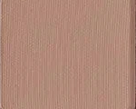

Use: Crease transition and all-over lid base. Versatile everyday nude for most skin tones. Blend-out shade for softening edges. Pairs with any shimmer for a polished look.

##### 色号 14：冷裸哑光 (Nurture) —— 中调冷裸色，奶油哑光。
用途：用于眼窝过渡和全眼底色；百搭日常裸色适合大部分肤色；用于晕染柔化边缘；与任意闪色搭配可做精致眼妆。

---

## Shade 15: Familia 452CM — Creamy Matte Medium Caramel Brown
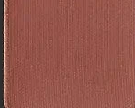

Use: Outer corner and crease for warm earthy depth. All-over lid for medium to deep skin tones. Pairs with Aspiration for a warm gradient eye. Grounding shade for the whole palette.

##### 色号 15：焦糖棕哑 (Familia) —— 中调焦糖棕，奶油哑光。
用途：用于眼尾和眼窝打造暖调大地深度；中至深肤色可全眼铺色；与 `Aspiration` 搭配可做暖调渐层眼妆；全盘稳定基础用色。
