# Natasha Denona 15色 魅影全能盘 Glam Eyeshadow Palette

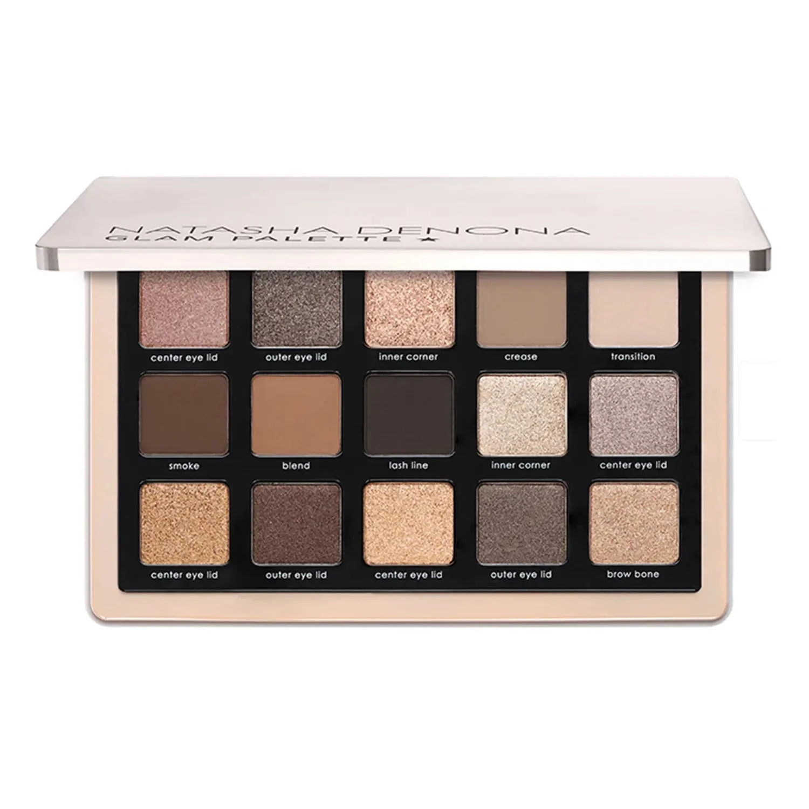

品牌迄今最畅销的调色盘。每个色号以在眼部的具体用途命名——眼皮中央、眼尾、眼头、眼窝、过渡、烟熏、晕染、睫毛根——配合组合指南，提供4种根据肤色定制的上色方案，让从裸感日妆到浓郁烟熏的一切妆效触手可及。

€77.44 · 19.25g / 0.68 oz · 产地意大利

**认证：** 无对羟基苯甲酸酯 · 无动物测试

---

## 质地说明

| 代码 | 质地 | 特点 |
|------|------|------|
| CM | Creamy Matte 奶油哑光 | 品牌经典配方，柔滑压粉哑光，发色饱满 |
| M | Metallic 金属感 | 细磨珍珠粉 + 色彩晶体，无缝高光泽 |
| K | Chroma Crystal 彩晶闪 | 多维彩色晶体颗粒，高折射闪光 |

**哑光上色建议：** 用紧密刷头按压上色，再用蓬松刷晕染。
**金属/彩晶上色建议：** 用湿刷或指腹涂抹，获得最强光泽。

---

## 手臂试色

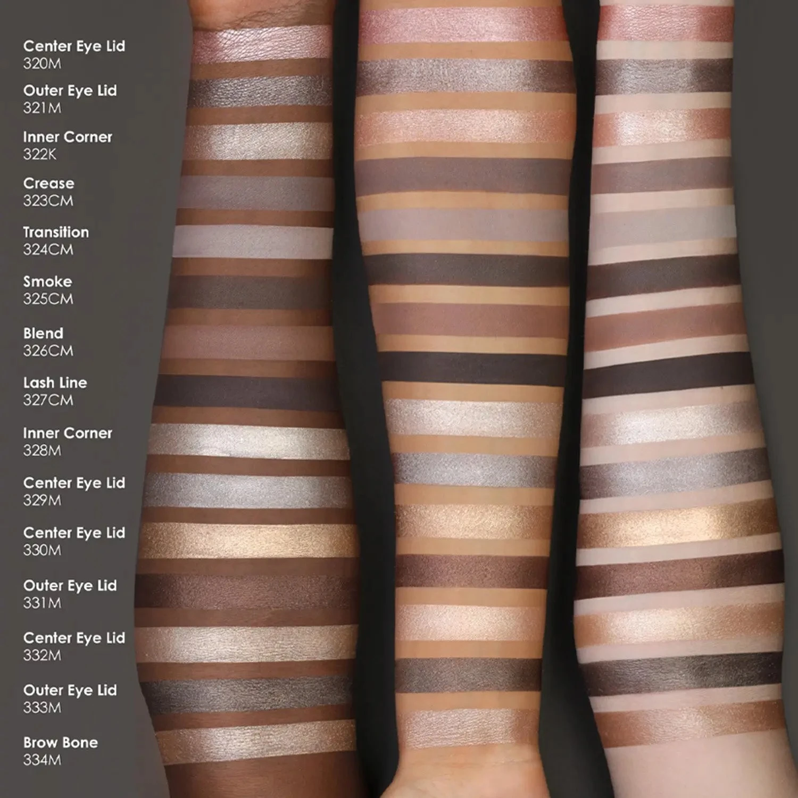

---

## 组合指南

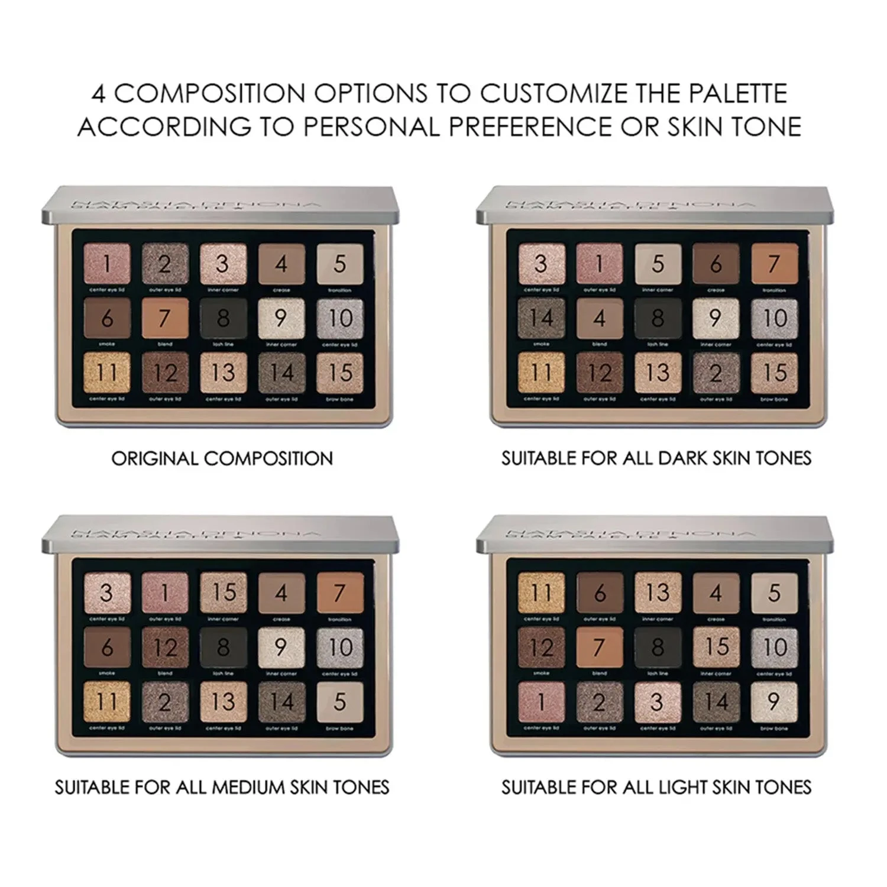

---

## 色号总览

| # | 色名（用途） | 代码 | 质地 | 颜色描述 |
|---|-------------|------|------|----------|
| 1 | Center Eye Lid | 320M | Metallic | 浅尘玫裸色，金属感 |
| 2 | Outer Eye Lid | 321M | Metallic | 中调暖灰棕，金属感 |
| 3 | Inner Corner | 322K | Chroma Crystal | 蜜桃香槟色，彩晶闪 |
| 4 | Crease | 323CM | Creamy Matte | 中调冷灰棕，奶油哑光 |
| 5 | Transition | 324CM | Creamy Matte | 蘑菇灰色，奶油哑光 |
| 6 | Smoke | 325CM | Creamy Matte | 中调冷棕，奶油哑光 |
| 7 | Blend | 326CM | Creamy Matte | 冷赭棕色，奶油哑光 |
| 8 | Lash Line | 327CM | Creamy Matte | 深冷棕，奶油哑光 |
| 9 | Inner Corner | 328M | Metallic | 鲍鱼贝光色，金属感 |
| 10 | Center Eye Lid | 329M | Metallic | 中调暖银色，金属感 |
| 11 | Center Eye Lid | 330M | Metallic | 金裸色，金属感 |
| 12 | Outer Eye Lid | 331M | Metallic | 碧根果棕，金属感 |
| 13 | Center Eye Lid | 332M | Metallic | 浅裸色，金属感 |
| 14 | Outer Eye Lid | 333M | Metallic | 中调冷灰棕，金属感 |
| 15 | Brow Bone | 334M | Metallic | 中性香槟色，金属感 |

---

## Shade 1: Center Eye Lid 320M — Metallic Dusty Light Rose
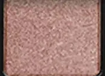

Use: All-over lid for a soft rose metallic glow. Center lid highlight pop. Pairs with Smoke or Blend in the crease for a warm rosy eye. Inner corner highlight for a brightened look.

##### 色号 1：中央眼皮 (Center Eye Lid 320M) —— 浅尘玫裸色，金属感。
用途：可全眼铺色打造柔和玫裸金属感；点于眼皮中央提亮；与 `Smoke` 或 `Blend` 搭配可做暖玫瑰眼窝；用于眼头提亮眼神。

---

## Shade 2: Outer Eye Lid 321M — Metallic Medium Warm Grey Brown
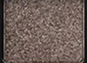

Use: Outer lid for warm grey-brown definition. Pairs with Center Eye Lid 320M for a two-tone lid. Blends into Smoke for a deeper look. Versatile every-occasion shade.

##### 色号 2：眼尾眼皮 (Outer Eye Lid 321M) —— 中调暖灰棕，金属感。
用途：集中于眼尾打造暖灰棕轮廓；与 `Center Eye Lid 320M` 搭配可做双色眼皮；晕染至 `Smoke` 可加深层次；百搭日常妆效色。

---

## Shade 3: Inner Corner 322K — Chroma Crystal Peachy Champagne
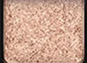

Use: Inner corner highlight for an eye-brightening sparkle. Center lid for a dazzling peachy champagne. Apply damp for maximum chroma crystal intensity. Brow bone accent.

##### 色号 3：眼头 (Inner Corner 322K) —— 蜜桃香槟色，彩晶闪。
用途：用于眼头打造提亮星光效果；可全眼铺色展现炫目蜜桃香槟感；湿刷获得最强彩晶光泽；可用于眉骨提亮。

---

## Shade 4: Crease 323CM — Creamy Matte Medium Cool Taupe
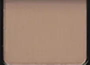

Use: Primary crease shade for seamless blending and eye depth. Transition buffer between shimmer lids and dark outer shades. Versatile for all skin tones.

##### 色号 4：眼窝 (Crease 323CM) —— 中调冷灰棕，奶油哑光。
用途：主要眼窝晕染色，打造无缝眼部轮廓；用作闪光眼皮与深色眼尾之间的过渡缓冲；适合所有肤色。

---

## Shade 5: Transition 324CM — Creamy Matte Mushroom Grey
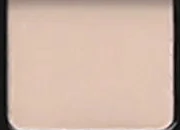

Use: Upper crease and brow bone transition. Blend-out shade for softening edges above the crease. Base for lighter skin tones. The lightest matte in the palette.

##### 色号 5：过渡 (Transition 324CM) —— 蘑菇灰色，奶油哑光。
用途：用于眼窝上缘和眉骨过渡；柔化眼窝上方边缘；浅肤色可用作底色；盘内最浅哑光色。

---

## Shade 6: Smoke 325CM — Creamy Matte Medium Cool Brown
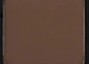

Use: Deep crease and outer corner for classic smoky definition. Blend into Crease for a medium smoky look. All-over lid base for deeper skin tones. Foundation of the smoky eye.

##### 色号 6：烟熏 (Smoke 325CM) —— 中调冷棕，奶油哑光。
用途：用于眼窝深处和眼尾打造经典烟熏轮廓；晕染至 `Crease` 可做中等烟熏感；深肤色可全眼铺底；烟熏妆的核心用色。

---

## Shade 7: Blend 326CM — Creamy Matte Cool Sienna
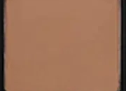

Use: Outer corner and lower crease for warm depth. Transition shade between Smoke and Lash Line. All-over lid for medium skin tones as a warm neutral base.

##### 色号 7：晕染 (Blend 326CM) —— 冷赭棕色，奶油哑光。
用途：用于眼尾和眼窝下缘增添暖调深度；用作 `Smoke` 和 `Lash Line` 之间的过渡色；中肤色可全眼铺色做暖中性底色。

---

## Shade 8: Lash Line 327CM — Creamy Matte Deep Cool Brown
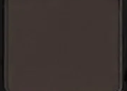

Use: Along the lash line for a precise liner effect. Outer corner for deep dramatic definition. Lower lash line for balanced drama. The deepest dark anchor of the palette.

##### 色号 8：睫毛根 (Lash Line 327CM) —— 深冷棕，奶油哑光。
用途：沿睫毛根部做精准眼线效果；集中于眼尾打造强烈戏剧感；下眼睑用于平衡深邃感；盘内最深定型色。

---

## Shade 9: Inner Corner 328M — Metallic Abalone
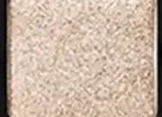

Use: Inner corner highlight for a unique iridescent glow. Center lid for an ethereal abalone shimmer. Pairs with Center Eye Lid 329M for a cool silver lid look.

##### 色号 9：眼头 (Inner Corner 328M) —— 鲍鱼贝光色，金属感。
用途：用于眼头打造独特虹彩光泽；可全眼铺色展现空灵鲍鱼贝金属感；与 `Center Eye Lid 329M` 搭配可做冷调银色眼皮。

---

## Shade 10: Center Eye Lid 329M — Metallic Medium Warm Silver
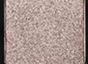

Use: All-over lid for a luminous silver metallic. Center lid pop over any crease shade. Pairs with Smoke for a classic silver smoky eye. Flatters cool and neutral skin tones.

##### 色号 10：中央眼皮 (Center Eye Lid 329M) —— 中调暖银色，金属感。
用途：可全眼铺色打造发光银色金属感；叠于任意眼窝色之上点亮中央；与 `Smoke` 搭配可做经典银色烟熏；适合冷调和中性肤色。

---

## Shade 11: Center Eye Lid 330M — Metallic Golden Nude
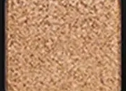

Use: All-over lid for a radiant golden nude metallic. Center lid highlight over mattes. Pairs with Blend or Smoke for a warm golden smoky eye. Flatters warm skin tones.

##### 色号 11：中央眼皮 (Center Eye Lid 330M) —— 金裸色，金属感。
用途：可全眼铺色打造亮泽金裸金属感；叠于哑光底色点亮眼皮中央；与 `Blend` 或 `Smoke` 搭配可做暖调金色烟熏；适合暖调肤色。

---

## Shade 12: Outer Eye Lid 331M — Metallic Pecan Brown
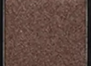

Use: Outer lid for warm pecan brown depth. Pairs with Center Eye Lid 330M for a warm golden-brown eye. Crease definition for deeper skin tones. Rich earthy metallic accent.

##### 色号 12：眼尾眼皮 (Outer Eye Lid 331M) —— 碧根果棕，金属感。
用途：集中于眼尾打造暖调碧根果棕深度；与 `Center Eye Lid 330M` 搭配可做暖金棕眼妆；深肤色可用于眼窝加深轮廓；浓郁大地金属感点缀色。

---

## Shade 13: Center Eye Lid 332M — Metallic Light Nude
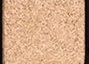

Use: All-over lid for an ethereal light nude shimmer. Inner corner highlight. Flatters all skin tones as a brightening lid shade. The most versatile metallic in the palette.

##### 色号 13：中央眼皮 (Center Eye Lid 332M) —— 浅裸色，金属感。
用途：可全眼铺色展现空灵浅裸光泽；用于眼头提亮；适合所有肤色做提亮眼皮；盘内最百搭的金属色。

---

## Shade 14: Outer Eye Lid 333M — Metallic Medium Cool Grey Brown
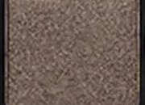

Use: Outer lid for cool grey-brown metallic depth. Crease accent for a polished finish. Pairs with Lash Line for a dark metallic outer corner. Cool-toned versatile shade.

##### 色号 14：眼尾眼皮 (Outer Eye Lid 333M) —— 中调冷灰棕，金属感。
用途：集中于眼尾打造冷灰棕金属深度；用于眼窝加深层次；与 `Lash Line` 搭配可做深邃金属眼尾；冷调百搭用色。

---

## Shade 15: Brow Bone 334M — Metallic Neutral Champagne
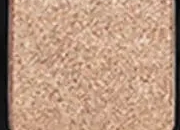

Use: Brow bone highlight for a lifted arch effect. Inner corner brightener. All-over lid for a clean fresh look. The lightest metallic and ideal finishing highlight.

##### 色号 15：眉骨 (Brow Bone 334M) —— 中性香槟色，金属感。
用途：用于眉骨打造提拉弓形效果；用于眼头提亮眼神；可全眼铺色做清爽自然妆；盘内最浅金属色，理想收尾提亮色。
