# Natasha Denona 15色 黄金金属盘 Golden Eyeshadow Palette

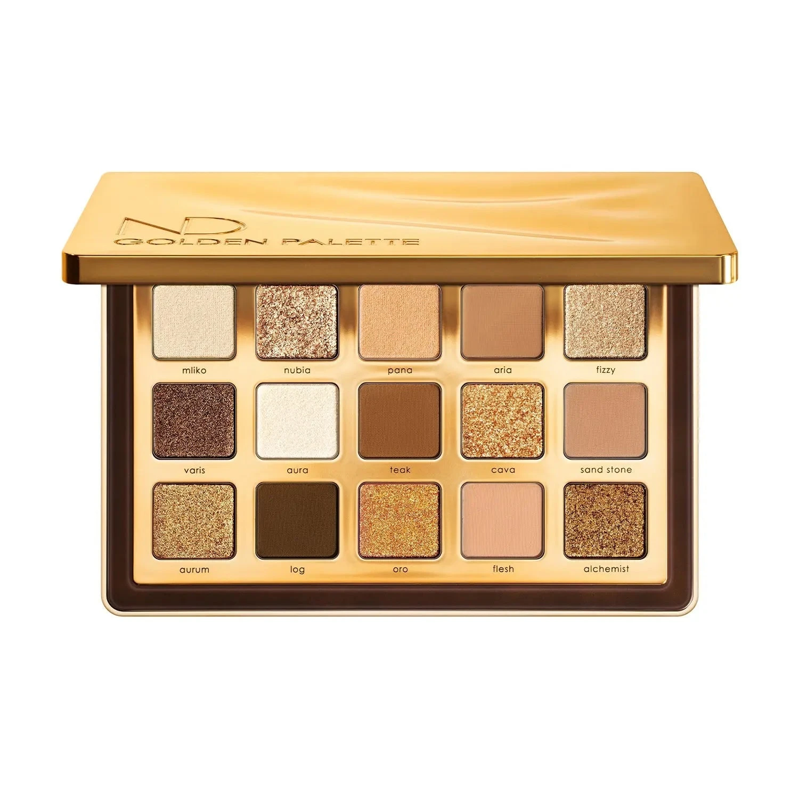

黄金系列全新升级版，在经典 Gold Palette 基础上扩充为15色，收录奶白、蜜棕、香槟金到浓郁焦糖棕等多层次金色调，融合 Metallic、Sparkling Foiled、Sparkling Wet 和经典哑光质地，轻松打造从日常金色光泽到华丽宴会金眼妆。

€77.44 · 18.9g / 0.6 oz · 产地意大利

**认证：** 无对羟基苯甲酸酯 · 无矿物油 · 无动物测试

---

## 质地说明

| 代码 | 质地 | 特点 |
|------|------|------|
| CM | Creamy Matte 奶油哑光 | 经典柔滑哑光，发色饱满 |
| CP | Cream Powder 奶粉哑光 | 轻盈奶粉质地，柔焦自然 |
| M | Metallic 金属感 | 细磨珍珠粉 + 色彩晶体，无缝高光泽 |
| SF | Sparkling Foiled 箔光闪 | 高折射箔光，纯粹色彩强度 |
| SW | Sparkling Wet 湿光闪 | 湿润多维闪光感 |
| K | Sparkling 闪光 | 香槟金多维闪光 |

**哑光上色建议：** 用紧密刷头按压上色，再用蓬松刷晕染。
**金属/箔光/湿光上色建议：** 用湿刷或指腹涂抹，获得最强光泽。

---

## 手臂试色

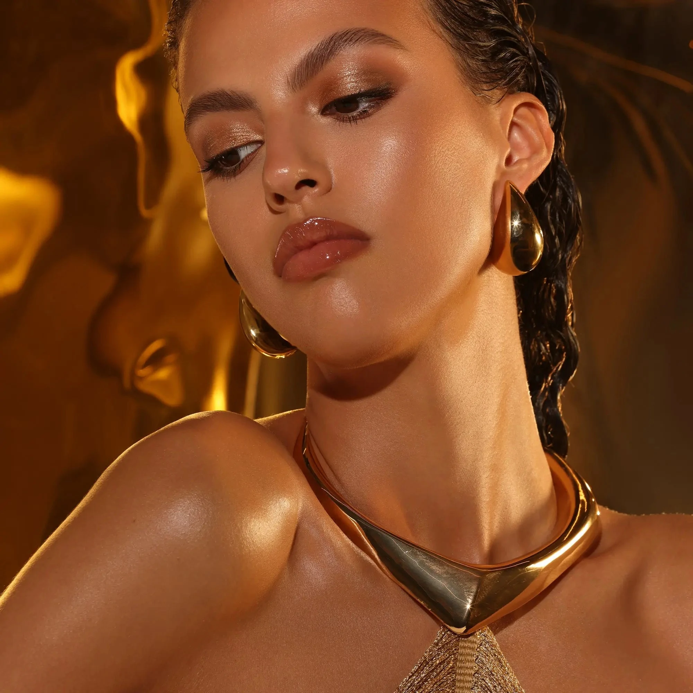

---

## 色号总览

| # | 色名 | 代码 | 质地 | 颜色描述 |
|---|------|------|------|----------|
| 1 | Mliko | 538CP | Cream Powder | 奶白色，奶粉哑光 |
| 2 | Nubia | 539SF | Sparkling Foiled | 金裸香槟色，箔光闪 |
| 3 | Pana | 540CP | Cream Powder | 米棕色，奶粉哑光 |
| 4 | Aria | 197CM | Creamy Matte | 浅中调尘沙色，奶油哑光 |
| 5 | Fizzy | 541SW | Sparkling Wet | 金裸色，湿光闪 |
| 6 | Varis | 203M | Metallic | 中调古铜黄铜色，金属感 |
| 7 | Aura | 544M | Metallic | 金象牙色，金属感 |
| 8 | Teak | 207CM | Creamy Matte | 中调尘焦糖棕，奶油哑光 |
| 9 | Cava | 198K | Sparkling | 香槟金色，多维闪光 |
| 10 | Sand Stone | 205CM | Creamy Matte | 中调赭黄色，奶油哑光 |
| 11 | Aurum | 208M | Metallic | 雾金色，金属感 |
| 12 | Log | 202CM | Creamy Matte | 深棕色，奶油哑光 |
| 13 | Oro | 201M | Metallic | 暖金色，金属感 |
| 14 | Flesh | 104CM | Creamy Matte | 浅暖裸色，奶油哑光 |
| 15 | Alchemist | 206M | Metallic | 黄铜色，金属感 |

---

## Shade 1: Mliko 538CP — Cream Powder Off White
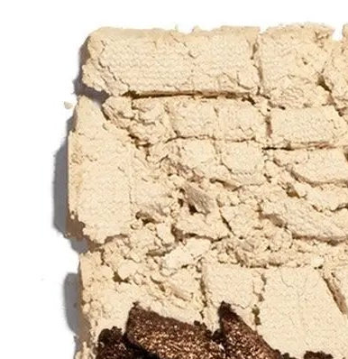

Use: Base and brow bone highlight. Transition shade for blending. Brightens the inner corner. Clean backdrop for layering deeper shades.

##### 色号 1：奶白哑光 (Mliko) —— 奶白色，奶粉哑光。
用途：用作底色和眉骨提亮；用于眼头提亮；作为晕染底色和过渡色；搭配深色可做层次感底衬。

---

## Shade 2: Nubia 539SF — Sparkling Foiled Gold Nude Champagne
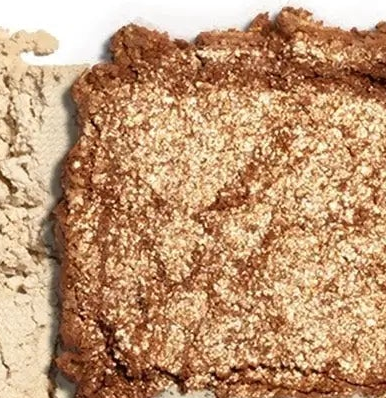

Use: All-over lid for a warm gold nude sparkle. Damp application for intense foiled finish. Inner corner and center lid highlight. Pairs with Teak in the crease.

##### 色号 2：金裸香槟箔 (Nubia) —— 金裸香槟色，箔光闪。
用途：可全眼铺色打造暖金裸光泽；湿刷获得最强箔光效果；用于眼头和眼皮中央提亮；与 `Teak` 搭配可做眼窝过渡。

---

## Shade 3: Pana 540CP — Cream Powder Beige
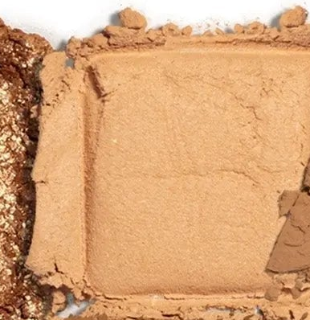

Use: Base for medium skin tones. Crease transition shade. All-over lid for a natural daytime look. Blend buffer between shades.

##### 色号 3：米棕哑光 (Pana) —— 米棕色，奶粉哑光。
用途：中肤色可用作底色；用于眼窝过渡晕染；可全眼铺色做自然日妆；用作色号间的晕染缓冲色。

---

## Shade 4: Aria 197CM — Creamy Matte Light Medium Dusty Sand
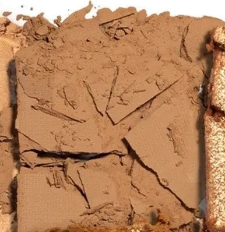

Use: Base and all-over lid for most skin tones. Crease transition. Brow bone highlight for medium skin. Pairs well with any metallic on the lid.

##### 色号 4：尘沙哑光 (Aria) —— 浅中调尘沙色，奶油哑光。
用途：适合大部分肤色作底色和全眼铺色；用于眼窝过渡；中肤色可用于眉骨提亮；搭配任意金属色效果极佳。

---

## Shade 5: Fizzy 541SW — Sparkling Wet Effect Golden Nude
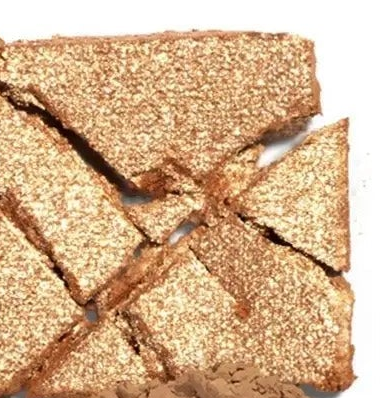

Use: All-over lid for a wet-look golden nude glow. Apply wet for maximum sparkling wet finish. Inner corner pop. Pairs with Teak for a warm eye.

##### 色号 5：金裸湿光 (Fizzy) —— 金裸色，湿光闪。
用途：可全眼铺色打造湿润金裸光泽；湿刷获得最强湿光效果；用于眼头提亮；与 `Teak` 搭配可做暖调眼妆。

---

## Shade 6: Varis 203M — Metallic Medium Antique Brass
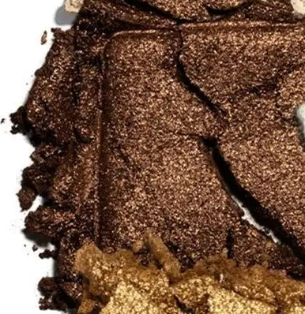

Use: All-over lid for a rich antique brass metallic. Outer corner for warm depth. Damp brush for maximum intensity. Pairs with Aura for a two-toned golden look.

##### 色号 6：古铜金属 (Varis) —— 中调古铜黄铜色，金属感。
用途：可全眼铺色打造浓郁古铜金属感；集中于眼尾加深暖调；湿刷加强光泽；与 `Aura` 搭配可做双色调金眼妆。

---

## Shade 7: Aura 544M — Metallic Golden Ivory
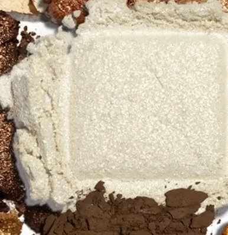

Use: All-over lid or inner corner for a luminous golden ivory glow. Center lid highlight. Damp for a mirror-like finish. Flatters all skin tones.

##### 色号 7：金象牙金属 (Aura) —— 金象牙色，金属感。
用途：可全眼铺色或用于眼头打造发光金象牙感；点于眼皮中央提亮；湿刷可获得镜面效果；适合所有肤色。

---

## Shade 8: Teak 207CM — Creamy Matte Medium Dusty Caramel
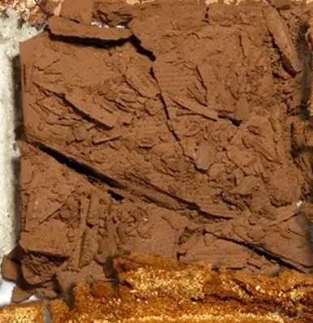

Use: Crease transition for warm depth. All-over lid for medium skin tones. Outer corner definition. Pairs with any gold metallic on the lid.

##### 色号 8：尘焦糖哑 (Teak) —— 中调尘焦糖棕，奶油哑光。
用途：用于眼窝过渡打造暖调深度；中肤色可全眼铺色；用于眼尾加深轮廓；搭配任意金色金属色效果极佳。

---

## Shade 9: Cava 198K — Sparkling Champagne Gold
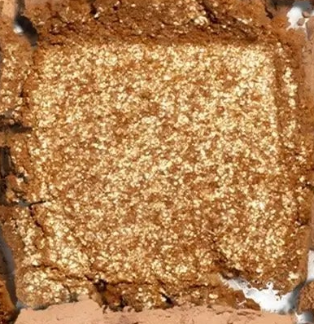

Use: All-over lid for a sparkling champagne gold. Apply wet for maximum intensity. Inner corner and center lid highlight. Pairs with Log for a classic smoky gold.

##### 色号 9：香槟金闪光 (Cava) —— 香槟金色，多维闪光。
用途：可全眼铺色打造闪耀香槟金感；湿刷加强光效；用于眼头和眼皮中央提亮；与 `Log` 搭配可做经典烟熏金眼妆。

---

## Shade 10: Sand Stone 205CM — Creamy Matte Medium Ochre
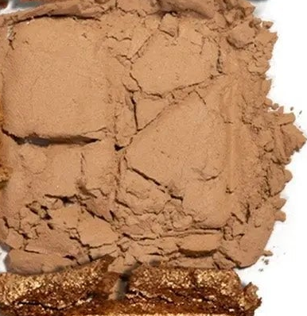

Use: Crease and outer corner for earthy warm depth. All-over lid for medium skin tones. Pairs with Varis for a warm tonal earth eye.

##### 色号 10：赭黄哑光 (Sand Stone) —— 中调赭黄色，奶油哑光。
用途：用于眼窝和眼尾打造大地暖调深度；中肤色可全眼铺色；与 `Varis` 搭配可做暖调同色系大地妆。

---

## Shade 11: Aurum 208M — Metallic Muted Gold
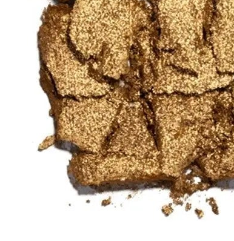

Use: All-over lid for a rich muted gold metallic. Center lid over mattes. Outer corner for warm depth. Damp brush intensifies the gold payoff.

##### 色号 11：雾金金属 (Aurum) —— 雾金色，金属感。
用途：可全眼铺色打造浓郁雾金金属感；叠于哑光底色之上点亮中央；集中于眼尾加深；湿刷加强黄金发色。

---

## Shade 12: Log 202CM — Creamy Matte Dark Brown
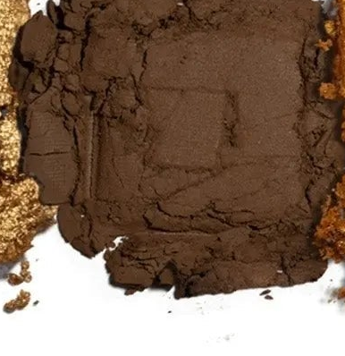

Use: Outer corner and crease for deep definition. Liner effect along lash lines. Pairs with any gold shade for a classic smoky gold look.

##### 色号 12：深棕哑光 (Log) —— 深棕色，奶油哑光。
用途：用于眼尾和眼窝加深轮廓；沿睫毛根部可做眼线效果；与任意金色搭配可做经典烟熏金眼妆。

---

## Shade 13: Oro 201M — Metallic Warm Gold
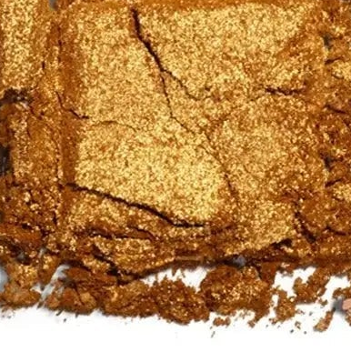

Use: All-over lid for a vibrant warm gold. Inner corner and center highlight. Apply damp for maximum metallic glow. The ultimate warm gold statement shade.

##### 色号 13：暖金金属 (Oro) —— 暖金色，金属感。
用途：可全眼铺色打造鲜亮暖金感；用于眼头和眼皮中央提亮；湿刷可获得最强金属光泽；盘内最耀眼暖金宣言色。

---

## Shade 14: Flesh 104CM — Creamy Matte Light Warm Nude
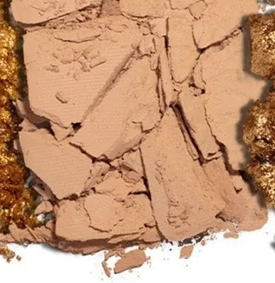

Use: Base for lighter skin tones. Brow bone highlight. Transition and blend-out shade. Pairs with Teak or Log for a clean eye.

##### 色号 14：暖裸哑光 (Flesh) —— 浅暖裸色，奶油哑光。
用途：浅肤色可用作底色；用于眉骨提亮；用作过渡和晕染柔化；与 `Teak` 或 `Log` 搭配可做干净自然妆。

---

## Shade 15: Alchemist 206M — Metallic Brass
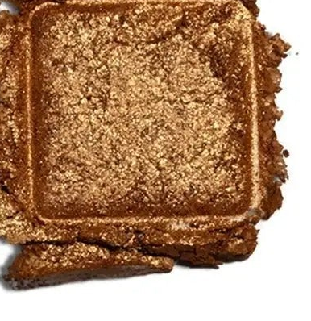

Use: Outer corner and lid for deep brass metallic drama. Damp brush for maximum intensity. Pairs with Aurum and Oro for a layered gold look. Statement deep gold shade.

##### 色号 15：黄铜金属 (Alchemist) —— 黄铜色，金属感。
用途：用于眼尾和眼皮打造深邃黄铜金属感；湿刷获得最强光泽；与 `Aurum` 和 `Oro` 搭配可做叠层黄金妆；盘内深色宣言金属色。
