# Natasha Denona 15色 裸粉哑光盘 I Need a Nude Eyeshadow Palette

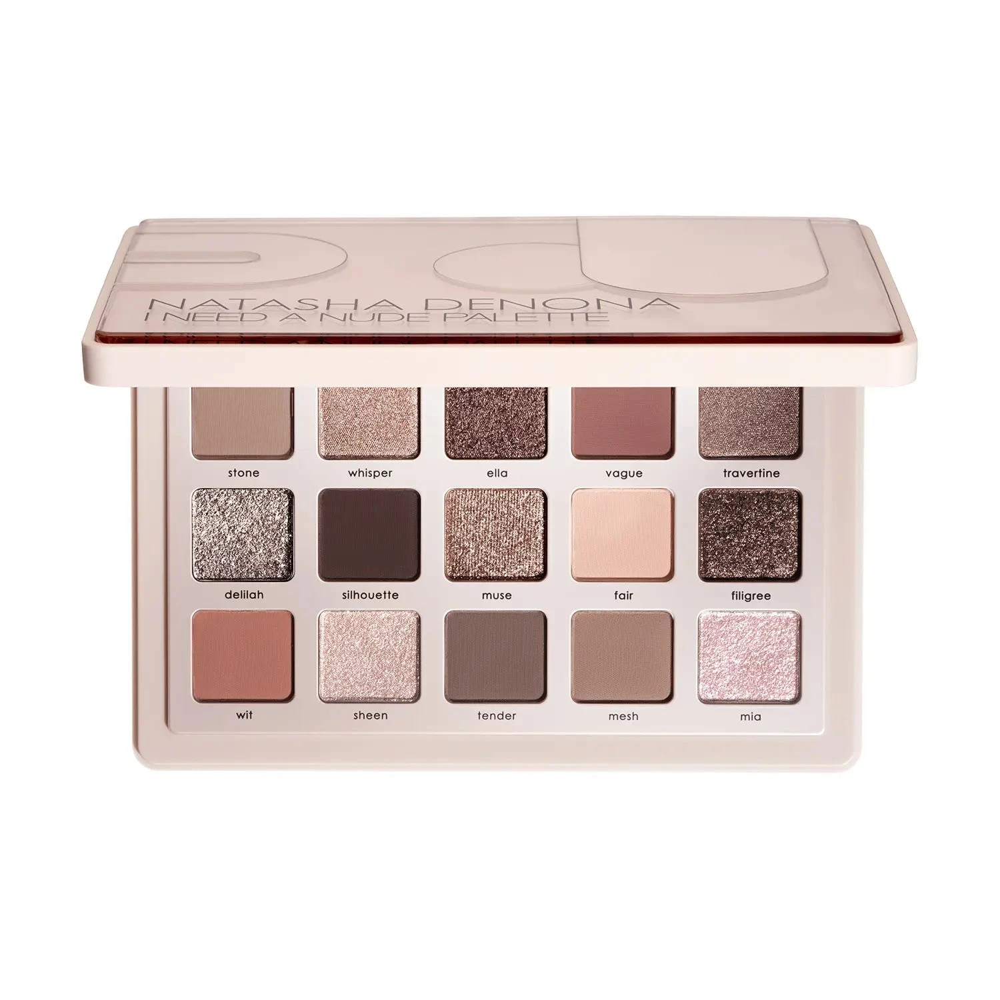

哑光裸粉中性色系，收录雾感玫瑰裸调、柔光闪与品牌全新 Wet Effect（湿光）配方，共 15 色。质地包含奶油哑光、金属感、箔光闪、Sparkling Wet 和 Glossy Wet。无论日妆还是晚妆，均可打造从柔和裸眼到迷人烟熏的多种妆效。

€77.44 · 16.7g / 0.589 oz · 产地意大利

**认证：** 无对羟基苯甲酸酯 · 无矿物油 · 无动物测试

---

## 质地说明

| 代码 | 质地 | 特点 |
|------|------|------|
| CM | Creamy Matte 奶油哑光 | 品牌经典配方，柔滑压粉哑光，发色饱满 |
| M | Metallic 金属感 | 细磨珍珠粉 + 色彩晶体，无缝高光泽 |
| SF | Sparkling Foiled 箔光闪 | 高折射箔光，纯粹色彩强度 |
| SW | Sparkling Wet 湿光闪 | 品牌全新配方，湿润多维闪光感 |
| GW | Glossy Wet 光泽湿润 | 品牌全新配方，高光泽如镜面 |

**哑光上色建议：** 用紧密刷头按压上色，再用蓬松刷晕染。
**金属/箔光/湿光上色建议：** 用湿刷或指腹涂抹，获得最强光泽。

---

## 手臂试色

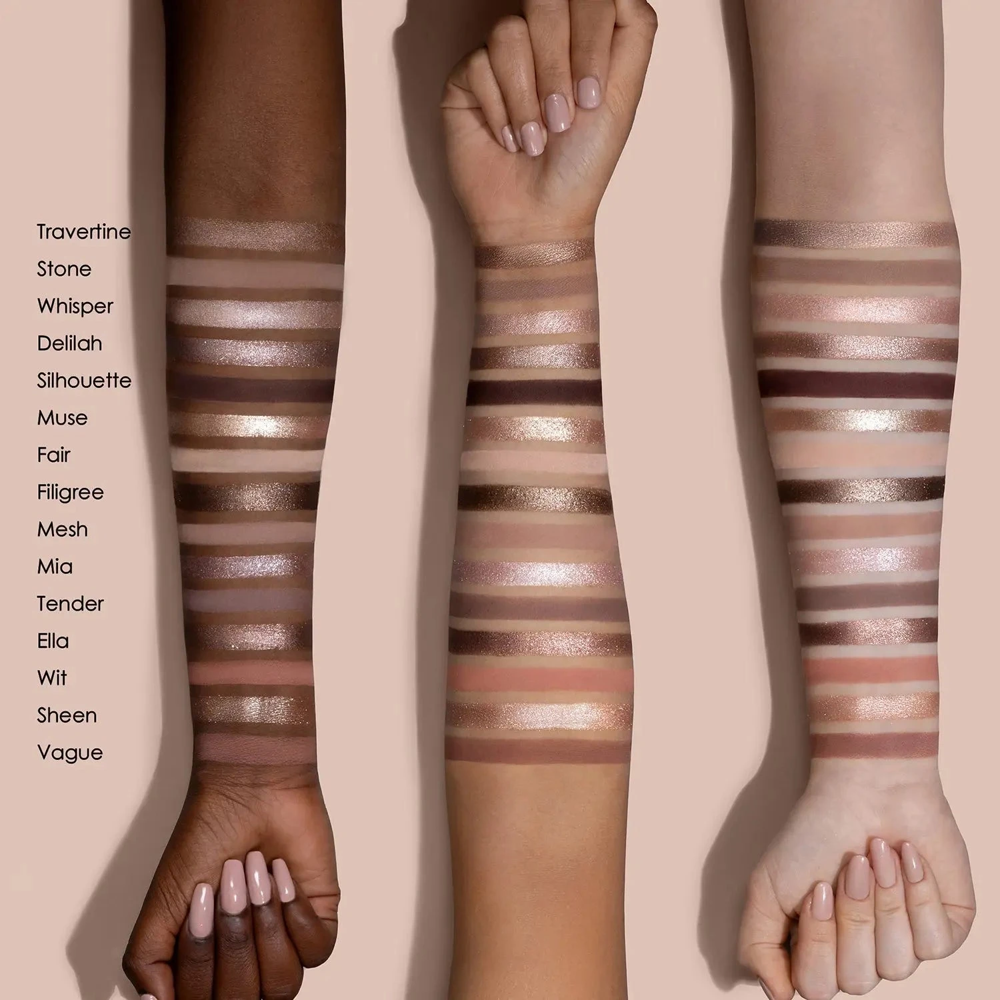

---

## 色号总览

| # | 色名 | 代码 | 质地 | 颜色描述 |
|---|------|------|------|----------|
| 1 | Stone | 493CM | Creamy Matte | 浅中调暖棕灰，奶油哑光 |
| 2 | Whisper | 494M | Metallic | 浅裸粉色，金属感 |
| 3 | Ella | 495SF | Sparkling Foiled | 暖驼色，箔光闪 |
| 4 | Vague | 496CM | Creamy Matte | 中调暖尘玫瑰，奶油哑光 |
| 5 | Travertine | 497M | Metallic | 柔琥珀色，金属感 |
| 6 | Delilah | 498SW | Sparkling Wet | 银棕色，湿光闪 |
| 7 | Silhouette | 499CM | Creamy Matte | 深咖啡豆棕，奶油哑光 |
| 8 | Muse | 500SF | Sparkling Foiled | 香槟色，箔光闪 |
| 9 | Fair | 501CM | Creamy Matte | 浅雾粉玫瑰，奶油哑光 |
| 10 | Filigree | 502SF | Sparkling Foiled | 中调中性棕，箔光闪 |
| 11 | Wit | 503CM | Creamy Matte | 浅暖玫瑰色，奶油哑光 |
| 12 | Sheen | 504GW | Glossy Wet | 暖香槟色，光泽湿润 |
| 13 | Tender | 505CM | Creamy Matte | 中调棕灰色，奶油哑光 |
| 14 | Mesh | 506CM | Creamy Matte | 浅尘玫瑰色，奶油哑光 |
| 15 | Mia | 507SW | Sparkling Wet | 冰粉色，湿光闪 |

---

## Shade 1: Stone 493CM — Creamy Matte Light Medium Warm Taupe

Use: All-over base for medium to deep skin tones. Transition shade in the crease for seamless blending. Pairs with deeper shades for dimension.

##### 色号 1：暖棕石哑 (Stone) —— 浅中调暖棕灰，奶油哑光。
用途：中至深肤色可用作全眼底色；用于眼窝过渡晕染；与深色搭配可增加层次。

---

## Shade 2: Whisper 494M — Metallic Light Nude Pink
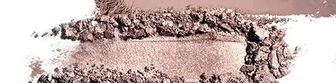

Use: All-over lid for a delicate nude pink metallic. Inner corner highlight. Pairs with Vague in the crease for a soft romantic look. Damp brush for maximum payoff.

##### 色号 2：裸粉金属 (Whisper) —— 浅裸粉色，金属感。
用途：可全眼铺色打造柔美裸粉金属感；用于眼头提亮；与 `Vague` 搭配可做柔和浪漫妆；湿刷加强光泽。

---

## Shade 3: Ella 495SF — Sparkling Foiled Warm Fawn
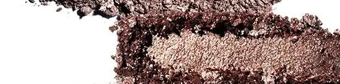

Use: All-over lid for a warm earthy sparkle. Outer corner accent. Pairs with Stone in the crease for a warm nude eye. Damp fingertip for intense foiled finish.

##### 色号 3：暖驼箔光 (Ella) —— 暖驼色，箔光闪。
用途：可全眼铺色打造暖调土色箔光；集中于眼尾点缀；与 `Stone` 搭配可做暖裸眼妆；指腹湿用发色最强。

---

## Shade 4: Vague 496CM — Creamy Matte Medium Warm Dusty Rose
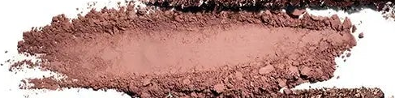

Use: Crease transition for a warm rosy depth. All-over lid for lighter skin tones. Pairs with Silhouette for a smoky rose eye.

##### 色号 4：尘玫瑰哑 (Vague) —— 中调暖尘玫瑰，奶油哑光。
用途：用于眼窝过渡打造暖玫瑰深度；浅肤色可全眼铺色；与 `Silhouette` 搭配可做烟熏玫瑰妆。

---

## Shade 5: Travertine 497M — Metallic Soft Amber
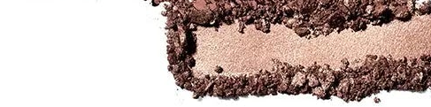

Use: All-over lid for a warm amber metallic. Center lid highlight over a matte base. Pairs with Silhouette in the outer corner. Damp brush intensifies the glow.

##### 色号 5：琥珀金属 (Travertine) —— 柔琥珀色，金属感。
用途：可全眼铺色打造暖琥珀金属感；叠于哑光底色点亮眼皮中央；与 `Silhouette` 搭配可做深邃眼妆；湿刷加强光泽。

---

## Shade 6: Delilah 498SW — Sparkling Wet Silver Brown
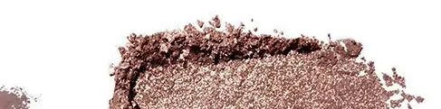

Use: All-over lid for a wet-effect silver brown sparkle. Apply wet for maximum multi-dimensional shine. Pairs with Silhouette or Stone in the crease for depth.

##### 色号 6：银棕湿光 (Delilah) —— 银棕色，湿光闪。
用途：可全眼铺色打造湿润银棕多维光泽；湿刷获得最强闪光效果；与 `Silhouette` 或 `Stone` 搭配可做有深度的眼妆。

---

## Shade 7: Silhouette 499CM — Creamy Matte Coffee Bean Brown
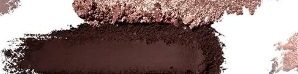

Use: Outer corner and crease for deep definition. Liner effect along lash lines. Pairs with any shimmer for a classic smoky look.

##### 色号 7：咖啡哑光 (Silhouette) —— 深咖啡豆棕，奶油哑光。
用途：用于眼尾和眼窝加深轮廓；沿睫毛根部可做眼线效果；与任意闪色搭配可做经典烟熏妆。

---

## Shade 8: Muse 500SF — Sparkling Foiled Champagne
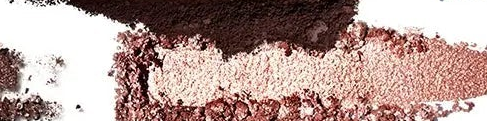

Use: Inner corner and center lid highlight. All-over lid for a luminous champagne look. Damp application for high-shine foiled finish. Flatters all skin tones.

##### 色号 8：香槟箔光 (Muse) —— 香槟色，箔光闪。
用途：用于眼头和眼皮中央提亮；可全眼铺色打造发光香槟感；湿刷获得高亮箔光效果；适合所有肤色。

---

## Shade 9: Fair 501CM — Creamy Matte Light Misty Rose
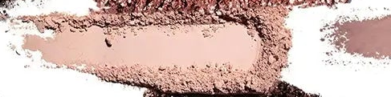

Use: Base for lighter skin tones. Brow bone highlight. Transition and blend-out shade. Subtle all-over lid for the most minimal look.

##### 色号 9：雾粉哑光 (Fair) —— 浅雾粉玫瑰，奶油哑光。
用途：浅肤色可用作底色；用于眉骨提亮；用作过渡和晕染柔化；可做最简约裸色全眼妆。

---

## Shade 10: Filigree 502SF — Sparkling Foiled Medium Neutral Brown
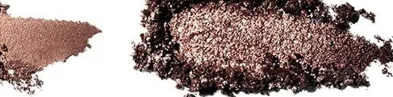

Use: All-over lid for a neutral warm sparkle. Outer corner highlight. Pairs with Vague or Stone in the crease. Damp brush for deeper foiled finish.

##### 色号 10：中性棕箔 (Filigree) —— 中调中性棕，箔光闪。
用途：可全眼铺色打造中性暖调闪光；集中于眼尾提亮；与 `Vague` 或 `Stone` 搭配可做眼窝过渡；湿刷加深箔光效果。

---

## Shade 11: Wit 503CM — Creamy Matte Light Warm Rose
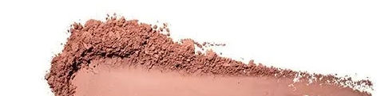

Use: All-over lid for lighter skin. Brow bone and transition shade. Pairs with Vague for a warm rosy wash. Soft everyday shade.

##### 色号 11：暖玫瑰哑 (Wit) —— 浅暖玫瑰色，奶油哑光。
用途：浅肤色可全眼铺色；用于眉骨和过渡晕染；与 `Vague` 搭配可做暖玫瑰底妆；柔和日常色。

---

## Shade 12: Sheen 504GW — Glossy Wet Warm Champagne
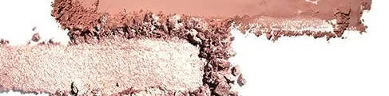

Use: Center lid for an ethereal wet-glow effect. Inner corner highlight. Apply with fingertip for maximum glossy shine. Best over a matte base.

##### 色号 12：暖香槟湿光 (Sheen) —— 暖香槟色，光泽湿润。
用途：点于眼皮中央打造空灵湿润光感；用于眼头提亮；指腹涂抹获得最大光泽感；叠于哑光底色上效果最佳。

---

## Shade 13: Tender 505CM — Creamy Matte Medium Taupe
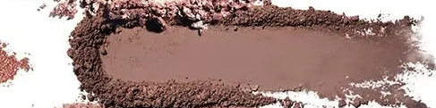

Use: All-over lid base for most skin tones. Transition and crease shade. Versatile neutral for building or softening depth.

##### 色号 13：棕灰哑光 (Tender) —— 中调棕灰色，奶油哑光。
用途：适合大部分肤色作全眼底色；用于眼窝过渡和晕染；百搭中性色，可加深或柔化层次。

---

## Shade 14: Mesh 506CM — Creamy Matte Light Dusty Rose
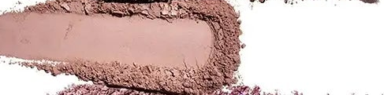

Use: Brow bone highlight and transition shade. All-over lid for a muted rosy look. Pairs with Silhouette in the outer corner for a soft smoky effect.

##### 色号 14：尘玫哑光 (Mesh) —— 浅尘玫瑰色，奶油哑光。
用途：用于眉骨提亮和过渡晕染；可全眼铺色打造柔和玫瑰妆；与 `Silhouette` 搭配可做柔化烟熏效果。

---

## Shade 15: Mia 507SW — Sparkling Wet Icy Pink
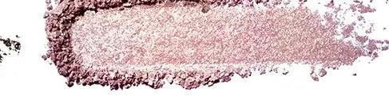

Use: Inner corner and center lid for icy sparkle. Apply wet for intense multi-dimensional pink shimmer. Pairs with Delilah for a cool duochrome effect.

##### 色号 15：冰粉湿光 (Mia) —— 冰粉色，湿光闪。
用途：用于眼头和眼皮中央打造冰粉闪光；湿刷可获得强烈多维粉色光泽；与 `Delilah` 搭配可做冷调双色变幻效果。
