# Natasha Denona 15色 复古魅影盘 Retro Glam Eyeshadow Palette

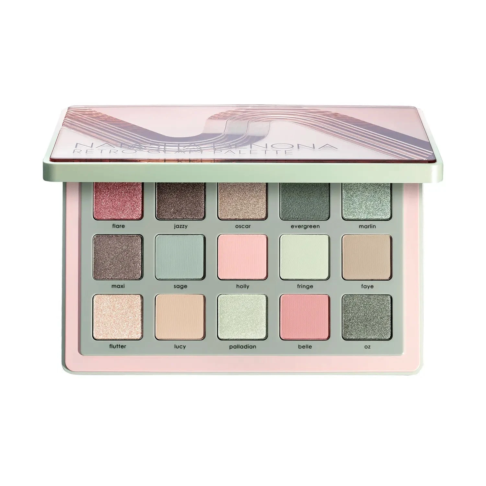

Retro 复古系与 Glam 魅影系的跨界联名延伸版，融合绿调、粉调与中性裸色，收录全新独家色号15色。浅鼠尾草绿、复古玫瑰、香槟裸与深墨棕和谐共存，质地涵盖闪光金属、Sparkling、奶油哑光和奶粉哑光，可单独成盘使用，亦可与 Retro 或 Glam 系其他调色盘搭配，创作更丰富的多色渐层妆效。

€77.44 · 19.25g / 0.67 oz · 产地意大利

**认证：** 无对羟基苯甲酸酯 · 无动物测试

---

## 质地说明

| 代码 | 质地 | 特点 |
|------|------|------|
| CM | Creamy Matte 奶油哑光 | 品牌经典配方，柔滑压粉哑光，发色饱满 |
| CP | Cream Powder 奶粉哑光 | 轻盈奶粉质地，柔焦自然 |
| M | Metallic 金属感 | 细磨珍珠粉 + 色彩晶体，无缝高光泽 |
| SM | Sparkling Metallic 闪光金属 | 金属基底加入多维闪光粒子 |
| K | Sparkling 闪光 | 多维细闪光感 |

**哑光上色建议：** 用紧密刷头按压上色，再用蓬松刷晕染。
**金属/闪光上色建议：** 用湿刷或指腹涂抹，获得最强光泽。

---

## 手臂试色

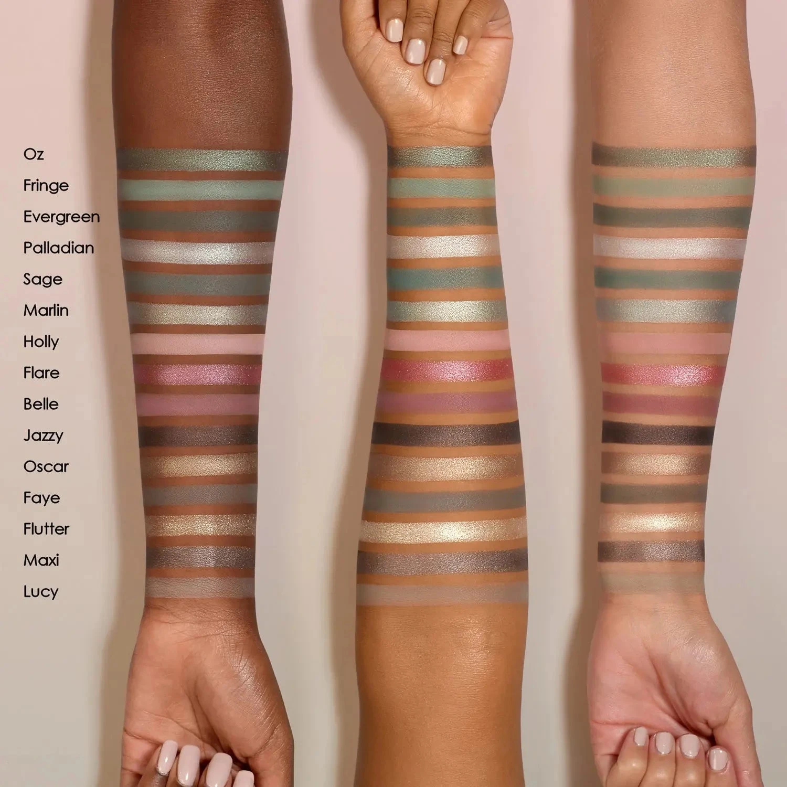

---

## 色号总览

| # | 色名 | 代码 | 质地 | 颜色描述 |
|---|------|------|------|----------|
| 1 | Flare | 453SM | Sparkling Metallic | 复古玫瑰带银色变幻，闪光金属 |
| 2 | Jazzy | 454M | Metallic | 深冷棕，金属感 |
| 3 | Oscar | 455M | Metallic | 浅中调复古香槟，金属感 |
| 4 | Evergreen | 456CP | Cream Powder | 中深鼠尾草绿，奶粉哑光 |
| 5 | Marlin | 457M | Metallic | 浅中调鼠尾草绿，金属感 |
| 6 | Maxi | 458M | Metallic | 中深暖驼棕，金属感 |
| 7 | Sage | 459CM | Creamy Matte | 中调鼠尾草绿，奶油哑光 |
| 8 | Holly | 460CM | Creamy Matte | 浅中性玫瑰，奶油哑光 |
| 9 | Fringe | 461CM | Creamy Matte | 柔和鼠尾草绿，奶油哑光 |
| 10 | Faye | 462CM | Creamy Matte | 中调浑浊黏土色，奶油哑光 |
| 11 | Flutter | 463K | Sparkling | 浅香槟粉色，多维细闪 |
| 12 | Lucy | 464CM | Creamy Matte | 浅石灰白色，奶油哑光 |
| 13 | Palladian | 465M | Metallic | 柔和鼠尾草绿，金属感 |
| 14 | Belle | 466CM | Creamy Matte | 中调尘玫瑰，奶油哑光 |
| 15 | Oz | 467M | Metallic | 中深浑浊森林绿，金属感 |

---

## Shade 1: Flare 453SM — Sparkling Metallic Vintage Rose with Silver Shift
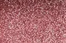

Use: All-over lid for a vintage rose sparkle. Inner corner or center lid highlight. Pairs with Maxi for a warm rose-taupe metallic eye. Damp brush for maximum sparkling metallic intensity.

##### 色号 1：复古玫银闪金属 (Flare) —— 复古玫瑰带银色变幻，闪光金属。
用途：可全眼铺色打造复古玫瑰多维闪光；用于眼头或眼皮中央提亮；与 `Maxi` 搭配可做暖调玫瑰驼棕金属妆；湿刷获得最强闪光金属效果。

---

## Shade 2: Jazzy 454M — Metallic Dark Cool Brown
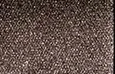

Use: Outer corner and deep crease for dark definition. Liner effect for precise depth. Pairs with any shimmer for a classic smoky metallic eye. The deepest anchor of the palette.

##### 色号 2：深冷棕金属 (Jazzy) —— 深冷棕，金属感。
用途：用于眼尾和深眼窝加深轮廓；可做精准眼线效果；与任意闪色搭配可做经典金属烟熏妆；全盘最深色定型锚点。

---

## Shade 3: Oscar 455M — Metallic Light Medium Vintage Champagne
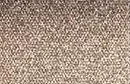

Use: All-over lid for a luminous vintage champagne glow. Inner corner and center lid highlight. Pairs with Evergreen for a green-gold contrast look. Flatters all skin tones.

##### 色号 3：复古香槟金属 (Oscar) —— 浅中调复古香槟，金属感。
用途：可全眼铺色打造发光复古香槟感；用于眼头和眼皮中央提亮；与 `Evergreen` 搭配可做绿金对比眼妆；适合所有肤色。

---

## Shade 4: Evergreen 456CP — Cream Powder Medium Dark Sage Green
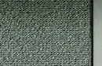

Use: Outer corner and crease for deep sage green definition. All-over lid for a bold green statement. Pairs with Oz for a layered forest green look.

##### 色号 4：中深鼠尾草绿奶粉 (Evergreen) —— 中深鼠尾草绿，奶粉哑光。
用途：用于眼尾和眼窝打造深邃鼠尾草绿轮廓；可全眼铺色打造大胆绿色宣言妆；与 `Oz` 搭配可做叠层森林绿眼妆。

---

## Shade 5: Marlin 457M — Metallic Light Medium Sage Green
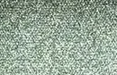

Use: All-over lid for a dreamy sage green metallic shimmer. Inner corner highlight. Pairs with Sage for a tonal green look. Damp brush for maximum metallic payoff.

##### 色号 5：浅鼠尾草绿金属 (Marlin) —— 浅中调鼠尾草绿，金属感。
用途：可全眼铺色打造梦幻鼠尾草绿金属光泽；用于眼头提亮；与 `Sage` 搭配可做同色调绿色妆；湿刷获得最强金属发色。

---

## Shade 6: Maxi 458M — Metallic Medium Dark Warm Taupe
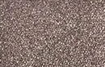

Use: Outer corner and crease for warm taupe metallic depth. All-over lid for warmer skin tones. Pairs with Jazzy for a deeper smoky look. The neutral metallic anchor.

##### 色号 6：暖驼棕金属 (Maxi) —— 中深暖驼棕，金属感。
用途：用于眼尾和眼窝打造暖调驼棕金属深度；暖肤色可全眼铺色；与 `Jazzy` 搭配可做更深邃的烟熏妆；全盘中性金属基础用色。

---

## Shade 7: Sage 459CM — Creamy Matte Medium Sage Green
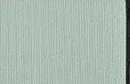

Use: All-over lid for a wearable sage green. Crease transition for earthy depth. Pairs with Evergreen for a deeper green gradient. Versatile everyday green shade.

##### 色号 7：中调鼠尾草绿哑 (Sage) —— 中调鼠尾草绿，奶油哑光。
用途：可全眼铺色打造日常鼠尾草绿妆；用于眼窝过渡打造大地深度；与 `Evergreen` 搭配可做深绿渐变；百搭日常绿色用色。

---

## Shade 8: Holly 460CM — Creamy Matte Light Neutral Rose
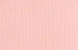

Use: Base and brow bone for most skin tones. Transition shade between deeper and lighter colors. Pairs with Belle for a soft rose gradient. Clean everyday shade.

##### 色号 8：浅中性玫哑 (Holly) —— 浅中性玫瑰，奶油哑光。
用途：适合大部分肤色作底色和眉骨；用作深浅色之间的过渡；与 `Belle` 搭配可做柔和玫瑰渐变；日常清爽用色。

---

## Shade 9: Fringe 461CM — Creamy Matte Pastel Sage Green
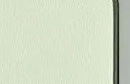

Use: Base and brow bone for lighter skin tones. Crease transition above deeper greens. Inner corner highlight for a subtle green tint. The lightest green in the palette.

##### 色号 9：柔和鼠尾草绿哑 (Fringe) —— 柔和鼠尾草绿，奶油哑光。
用途：浅肤色可用作底色和眉骨；用于眼窝深绿上缘过渡；用于眼头增添微妙绿调；盘内最浅绿色。

---

## Shade 10: Faye 462CM — Creamy Matte Medium Muted Clay

Use: Crease and outer corner for warm muted depth. Versatile neutral between the greens and roses. Transition shade for blending polish.

##### 色号 10：浑浊黏土哑 (Faye) —— 中调浑浊黏土色，奶油哑光。
用途：用于眼窝和眼尾打造暖调浑浊深度；绿色与玫瑰色之间的百搭中性色；用于晕染过渡增添精致感。

---

## Shade 11: Flutter 463K — Sparkling Light Champagne Pink
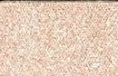

Use: Inner corner and center lid for a delicate champagne pink sparkle. Apply with fingertip for maximum multi-dimensional shimmer. Pairs with any rose shade for a romantic finish.

##### 色号 11：香槟粉细闪 (Flutter) —— 浅香槟粉色，多维细闪。
用途：用于眼头和眼皮中央打造细腻香槟粉闪光；以指腹涂抹获得最强多维光泽；与任意玫瑰色搭配可做浪漫收尾点缀。

---

## Shade 12: Lucy 464CM — Creamy Matte Light Limestone

Use: Brow bone highlight and all-over base. Transition shade for blending. The most neutral shade in the palette for maximum versatility.

##### 色号 12：石灰白哑 (Lucy) —— 浅石灰白色，奶油哑光。
用途：用于眉骨提亮和全眼铺底；用于过渡晕染；盘内最中性的百搭基础色。

---

## Shade 13: Palladian 465M — Metallic Pastel Sage Green
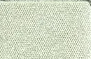

Use: All-over lid for a soft sage metallic glow. Inner corner for a subtle green shimmer. Pairs with Marlin for a tonal sage green metallic look.

##### 色号 13：柔和鼠尾草绿金属 (Palladian) —— 柔和鼠尾草绿，金属感。
用途：可全眼铺色打造柔和鼠尾草金属光泽；用于眼头增添微妙绿调光泽；与 `Marlin` 搭配可做同色调鼠尾草绿金属妆。

---

## Shade 14: Belle 466CM — Creamy Matte Medium Dusty Rose
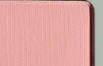

Use: All-over lid for a wearable dusty rose. Crease and outer corner for warm rosy definition. Pairs with Flare for a metallic rose-matte combination.

##### 色号 14：尘玫瑰哑 (Belle) —— 中调尘玫瑰，奶油哑光。
用途：可全眼铺色打造日常尘玫瑰妆；用于眼窝和眼尾打造暖玫瑰轮廓；与 `Flare` 搭配可做金属与哑光玫瑰组合妆。

---

## Shade 15: Oz 467M — Metallic Medium Dark Muted Forest Green
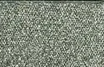

Use: Outer corner for deep forest green drama. All-over lid for a bold statement. Pairs with Jazzy for a deep green-brown smoky eye. The most dramatic green in the palette.

##### 色号 15：浑浊森林绿金属 (Oz) —— 中深浑浊森林绿，金属感。
用途：集中于眼尾打造深邃森林绿戏剧感；可全眼铺色做大胆宣言妆；与 `Jazzy` 搭配可做深邃绿棕烟熏妆；盘内最戏剧感的绿色。
