# Natasha Denona 15色 复古玫粉盘 Retro Eyeshadow Palette

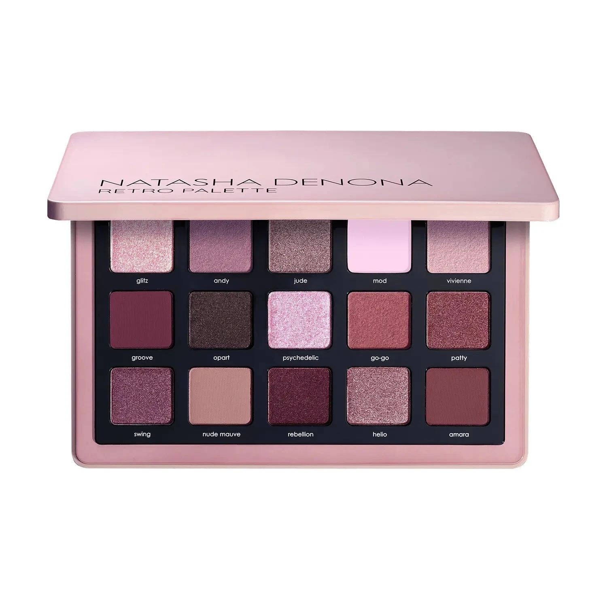

浪漫复古系，收录15色勃艮第红、赤陶玫、尘藕粉与复古玫瑰木，兼顾暖调与冷调选择。质地融合 Duo Chrome 双色变幻、Topper 提亮闪散、奶油哑光、奶粉哑光和金属感，轻松打造从空灵裸感日妆到深邃复古烟熏的多种妆效。

€77.44 · 19g / 0.67 oz · 产地意大利

**认证：** 无对羟基苯甲酸酯 · 无动物测试

---

## 质地说明

| 代码 | 质地 | 特点 |
|------|------|------|
| CM | Creamy Matte 奶油哑光 | 品牌经典配方，柔滑压粉哑光，发色饱满 |
| CP | Cream Powder 奶粉哑光 | 轻盈奶粉质地，柔焦自然 |
| M | Metallic 金属感 | 细磨珍珠粉 + 色彩晶体，无缝高光泽 |
| DC | Duo Chrome 双色变幻 | 随角度呈现双色光效 |
| K | Topper 提亮散粉 | 细闪提亮散粉质地，可叠加于任何色号之上 |

**哑光上色建议：** 用紧密刷头按压上色，再用蓬松刷晕染。
**金属/双色上色建议：** 用湿刷或指腹涂抹，获得最强光泽。
**Topper 使用建议：** 以指腹轻拍叠加于任意底色之上，增添多维闪光。

---

## 手臂试色

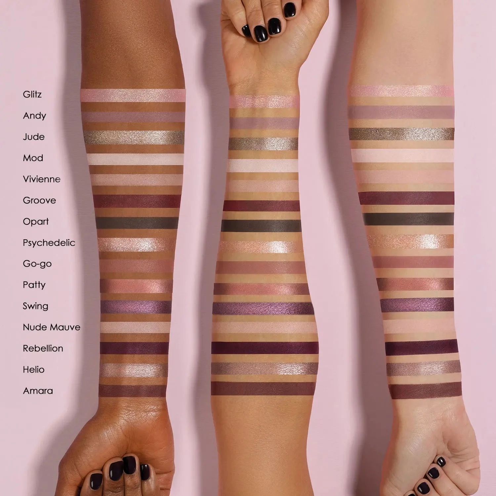

---

## 色号总览

| # | 色名 | 代码 | 质地 | 颜色描述 |
|---|------|------|------|----------|
| 1 | Glitz | 392DC | Duo Chrome | 婴儿粉带香槟双色变幻 |
| 2 | Andy | 393CP | Cream Powder | 藕灰紫色，奶粉哑光 |
| 3 | Jude | 394M | Metallic | 暖灰棕色，金属感 |
| 4 | Mod | 395CM | Creamy Matte | 粉调米白色，奶油哑光 |
| 5 | Vivienne | 396CP | Cream Powder | 浅粉裸色，奶粉哑光 |
| 6 | Groove | 397CM | Creamy Matte | 中深暖勃艮第红，奶油哑光 |
| 7 | Opart | 398CP | Cream Powder | 深灰棕色，奶粉哑光 |
| 8 | Psychedelic | 399K | Topper | 暖婴儿粉多色闪光提亮散粉 |
| 9 | Go-go | 400CP | Cream Powder | 中调暖玫瑰，奶粉哑光 |
| 10 | Patty | 401M | Metallic | 中调裸玫铜色，金属感 |
| 11 | Swing | 402M | Metallic | 中深冷勃艮第紫，金属感 |
| 12 | Nude Mauve | 144CM | Creamy Matte | 浅中调中性裸色，奶油哑光 |
| 13 | Rebellion | 403CP | Cream Powder | 中调勃艮第红，奶粉哑光 |
| 14 | Helio | 149M | Metallic | 藕棕裸色，金属感 |
| 15 | Amara | 137CM | Creamy Matte | 中调冷调复古玫瑰木，奶油哑光 |

---

## Shade 1: Glitz 392DC — Duo Chrome Baby Pink with Champagne Shift
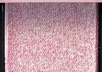

Use: Inner corner for a dreamy duo chrome pop. All-over lid for a romantic color-shifting look. Apply damp for maximum duo chrome intensity. Pairs with any mauve or maroon for a vintage eye.

##### 色号 1：粉香槟双变 (Glitz) —— 婴儿粉带香槟双色变幻。
用途：用于眼头打造梦幻双色变幻光；可全眼铺色展现浪漫变色效果；湿刷获得最强双色光效；与任意深藕色或勃艮第色搭配可做复古眼妆。

---

## Shade 2: Andy 393CP — Cream Powder Taupe Lilac
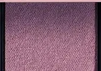

Use: Crease transition and all-over lid base. Pairs with Groove for a warm rose-maroon smoky eye. Versatile cool-toned neutral.

##### 色号 2：藕灰紫奶粉 (Andy) —— 藕灰紫色，奶粉哑光。
用途：用于眼窝过渡和全眼铺底；与 `Groove` 搭配可做暖玫瑰勃艮第烟熏妆；百搭冷调中性色。

---

## Shade 3: Jude 394M — Metallic Warm Taupe
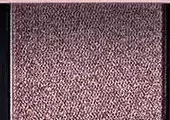

Use: All-over lid for a warm taupe metallic glow. Inner corner highlight. Pairs with Andy in the crease for a tonal look. Damp brush for maximum metallic payoff.

##### 色号 3：暖灰棕金属 (Jude) —— 暖灰棕色，金属感。
用途：可全眼铺色打造暖灰棕金属感；用于眼头提亮；与 `Andy` 搭配可做同色调眼妆；湿刷获得最强金属光泽。

---

## Shade 4: Mod 395CM — Creamy Matte Off White with Pink Undertone

Use: Brow bone highlight and base for lighter skin tones. Crease transition above matte depths. Pairs with deeper shades as a clean blend-out.

##### 色号 4：粉调米白哑 (Mod) —— 粉调米白色，奶油哑光。
用途：用于眉骨提亮或浅肤色作底色；用于眼窝深色上缘过渡；与深色搭配可做干净晕染。

---

## Shade 5: Vivienne 396CP — Cream Powder Light Pinky Nude
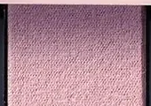

Use: Base for all skin tones. Brow bone and inner corner highlight. Crease transition. The most wearable everyday shade in the palette.

##### 色号 5：浅粉裸奶粉 (Vivienne) —— 浅粉裸色，奶粉哑光。
用途：适合所有肤色作底色；用于眉骨和眼头提亮；用于眼窝过渡；盘内最百搭的日常用色。

---

## Shade 6: Groove 397CM — Creamy Matte Medium Dark Warm Maroon
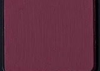

Use: Outer corner and deep crease for rich warm maroon drama. Liner effect along lash lines. Pairs with Swing for a cool-warm maroon contrast look.

##### 色号 6：暖勃艮第哑 (Groove) —— 中深暖勃艮第红，奶油哑光。
用途：用于眼尾和深眼窝打造浓郁暖勃艮第感；沿睫毛根部可做眼线效果；与 `Swing` 搭配可做冷暖勃艮第对比眼妆。

---

## Shade 7: Opart 398CP — Cream Powder Dark Taupe
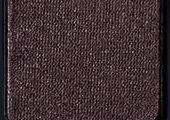

Use: Outer corner and crease for deep taupe definition. Transition shade between maroon and lighter shades. Pairs with Groove for a warm layered smoky eye.

##### 色号 7：深灰棕奶粉 (Opart) —— 深灰棕色，奶粉哑光。
用途：用于眼尾和眼窝打造深邃灰棕轮廓；用作勃艮第色与浅色之间的过渡；与 `Groove` 搭配可做暖调叠层烟熏妆。

---

## Shade 8: Psychedelic 399K — Topper Warm Baby Pink with Multi-Color Sparks
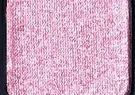

Use: Layer over any shade for a warm pink sparkle topper effect. Inner corner pop. Apply with fingertip for maximum multi-color sparkle impact. The most unique shade in the palette.

##### 色号 8：粉色星芒提亮 (Psychedelic) —— 暖婴儿粉多色闪光提亮散粉。
用途：叠加于任意底色之上增添暖粉闪光提亮效果；用于眼头增添变幻光；以指腹轻拍获得最强多色星点闪光；盘内最独特的宣言色。

---

## Shade 9: Go-go 400CP — Cream Powder Medium Warm Rose
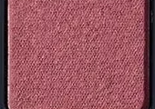

Use: All-over lid for a wearable warm rose. Crease and outer corner definition. Pairs with Rebellion for a deep rose-burgundy look.

##### 色号 9：暖玫瑰奶粉 (Go-go) —— 中调暖玫瑰，奶粉哑光。
用途：可全眼铺色打造日常暖玫瑰妆；用于眼窝和眼尾加深轮廓；与 `Rebellion` 搭配可做深玫瑰勃艮第眼妆。

---

## Shade 10: Patty 401M — Metallic Medium Nude Rose Copper
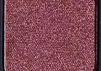

Use: All-over lid for a warm nude rose copper metallic. Center lid highlight. Pairs with Groove for a warm retro metallic look. Damp brush for maximum metallic glow.

##### 色号 10：裸玫铜金属 (Patty) —— 中调裸玫铜色，金属感。
用途：可全眼铺色打造暖裸玫瑰铜金属感；点于眼皮中央提亮；与 `Groove` 搭配可做暖调复古金属眼妆；湿刷加强金属光泽。

---

## Shade 11: Swing 402M — Metallic Medium Dark Cool Maroon
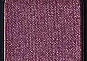

Use: All-over lid for a deep cool maroon metallic. Outer corner for dramatic definition. Damp brush for maximum metallic intensity. Pairs with Groove for a warm-cool maroon duo.

##### 色号 11：冷勃艮第金属 (Swing) —— 中深冷勃艮第紫，金属感。
用途：可全眼铺色打造深邃冷调勃艮第金属感；集中于眼尾加强戏剧感；湿刷获得最强金属光泽；与 `Groove` 搭配可做冷暖勃艮第双色眼妆。

---

## Shade 12: Nude Mauve 144CM — Creamy Matte Medium Light Neutral Nude
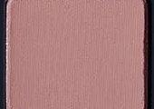

Use: Base and crease transition for all skin tones. Blend-out shade for softening edges. Everyday neutral for a clean canvas.

##### 色号 12：中性裸色哑 (Nude Mauve) —— 浅中调中性裸色，奶油哑光。
用途：适合所有肤色作底色和眼窝过渡；用作边缘晕染柔化；日常中性底色。

---

## Shade 13: Rebellion 403CP — Cream Powder Medium Burgundy
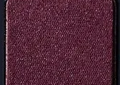

Use: All-over lid for a bold burgundy statement. Crease definition and outer corner. Pairs with Swing for a deep metallic-matte burgundy eye. Medium-depth statement color.

##### 色号 13：勃艮第红奶粉 (Rebellion) —— 中调勃艮第红，奶粉哑光。
用途：可全眼铺色打造大胆勃艮第宣言妆；用于眼窝定义和眼尾加深；与 `Swing` 搭配可做深邃金属勃艮第眼妆；中深宣言色。

---

## Shade 14: Helio 149M — Metallic Taupe Nude
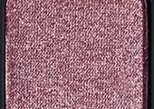

Use: All-over lid for a soft taupe nude metallic shimmer. Inner corner highlight. Pairs with Andy for a tonal cool grey-rose look. Damp brush for a subtle metallic glow.

##### 色号 14：藕棕裸金属 (Helio) —— 藕棕裸色，金属感。
用途：可全眼铺色打造柔和藕棕裸色金属光泽；用于眼头提亮；与 `Andy` 搭配可做同色调冷灰玫瑰妆；湿刷打造细腻金属光感。

---

## Shade 15: Amara 137CM — Creamy Matte Medium Cool Vintage Rosewood
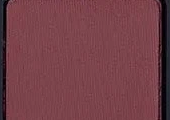

Use: Outer corner and crease for elegant vintage rosewood definition. All-over lid for medium skin tones. Pairs with Rebellion for a layered deep burgundy look. Classic retro anchor shade.

##### 色号 15：复古玫木哑 (Amara) —— 中调冷调复古玫瑰木，奶油哑光。
用途：用于眼尾和眼窝打造优雅复古玫瑰木轮廓；中肤色可全眼铺色；与 `Rebellion` 搭配可做叠层深勃艮第妆；经典复古定型色。
