# Natasha Denona 15色 紫罗兰梦幻盘 Roxa Eyeshadow Palette

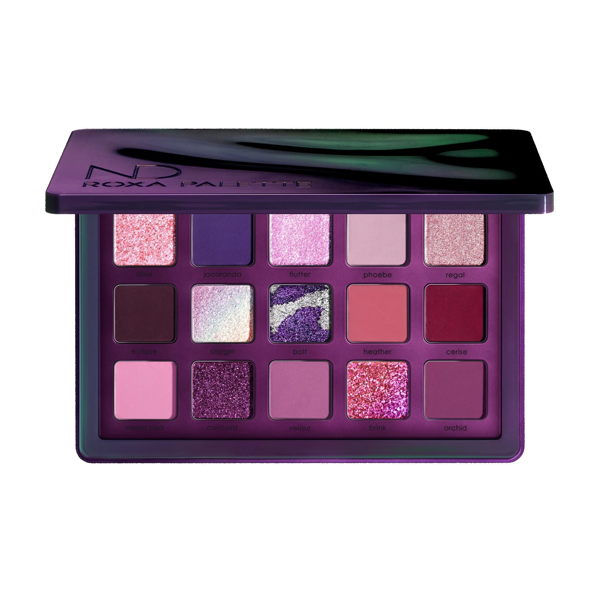

限量版紫粉烟熏系，以最浓郁大胆的紫罗兰和品红色调打造星座般的15色调色盘。首创 Silky Matte（丝滑哑光）配方亮相，质地超柔软、高度发色，配合 Sparkling Wet、Sparkling Foiled 和 Metallic，轻松构建从柔美薰衣草到深邃紫黑的多层次烟熏妆。

€77.44 · 17.15g / 0.60 oz · 产地意大利 · 限量版

**认证：** 无对羟基苯甲酸酯 · 无动物测试

---

## 质地说明

| 代码 | 质地 | 特点 |
|------|------|------|
| SKM | Silky Matte 丝滑哑光 | 全新配方，超柔软高发色，一笔不透明，无缝晕染 |
| KS | Crystal Sparkling 水晶闪 | 粉红带蓝紫星点，多维闪光 |
| SW | Sparkling Wet 湿光闪 | 湿润多维闪光感，镜面光泽 |
| SF | Sparkling Foiled 箔光闪 | 高折射箔光，纯粹色彩强度 |
| M | Metallic 金属感 | 细磨珍珠粉 + 色彩晶体，无缝高光泽 |

**哑光上色建议：** 用紧密刷头按压上色（Silky Matte 一笔即高发色），再用蓬松刷晕染。
**金属/箔光/湿光上色建议：** 用湿刷或指腹涂抹，获得最强光泽。

---

## 手臂试色

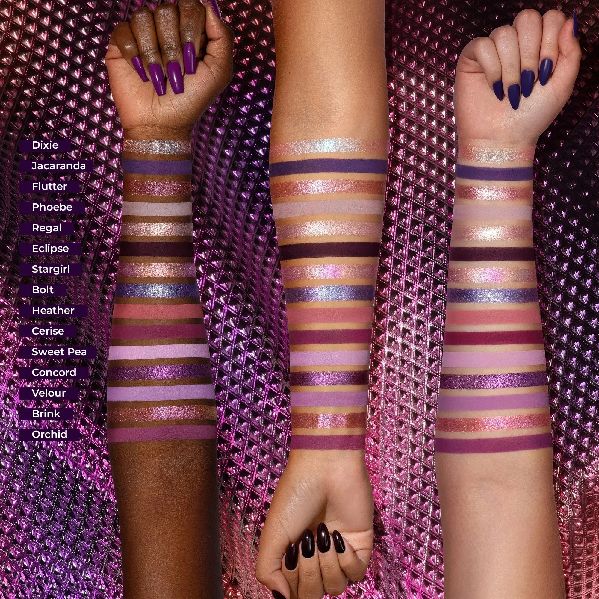

---

## 色号总览

| # | 色名 | 代码 | 质地 | 颜色描述 |
|---|------|------|------|----------|
| 1 | Dixie | 565KS | Crystal Sparkling | 暖粉带蓝紫星点，水晶闪 |
| 2 | Jacaranda | 566SKM | Silky Matte | 中深紫罗兰，丝滑哑光 |
| 3 | Flutter | 567SW | Sparkling Wet | 淡紫粉色，湿光闪 |
| 4 | Phoebe | 568SKM | Silky Matte | 浅淡紫色，丝滑哑光 |
| 5 | Regal | 569M | Metallic | 复古玫瑰色，金属感 |
| 6 | Eclipse | 570SKM | Silky Matte | 深紫黑色，丝滑哑光 |
| 7 | Stargirl | 571SF | Sparkling Foiled | 粉调双色变幻铜香槟，箔光闪 |
| 8 | Bolt | 572SF | Sparkling Foiled | 紫银双色变幻，箔光闪 |
| 9 | Heather | 573SKM | Silky Matte | 中调尘珊瑚玫瑰，丝滑哑光 |
| 10 | Cerise | 574SKM | Silky Matte | 中深哑粉品红，丝滑哑光 |
| 11 | Sweet Pea | 575SKM | Silky Matte | 浅中调暖薰衣草，丝滑哑光 |
| 12 | Concord | 576SF | Sparkling Foiled | 中调紫色，箔光闪 |
| 13 | Velour | 577SKM | Silky Matte | 中调薰衣草紫，丝滑哑光 |
| 14 | Brink | 578SF | Sparkling Foiled | 亮粉红色，箔光闪 |
| 15 | Orchid | 579SKM | Silky Matte | 中调紫色，丝滑哑光 |

---

## Shade 1: Dixie 565KS — Crystal Sparkling Warm Pink with Blue & Purple Specks
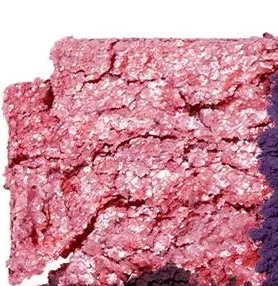

Use: All-over lid for a dreamy sparkle. Inner corner highlight. Apply damp for maximum crystal intensity. Pairs with Eclipse for a dark-to-light contrast look.

##### 色号 1：水晶粉蓝 (Dixie) —— 暖粉带蓝紫星点，水晶闪。
用途：可全眼铺色打造梦幻星点闪光；用于眼头提亮；湿刷可获得最强水晶光泽；与 `Eclipse` 搭配可做深浅对比眼妆。

---

## Shade 2: Jacaranda 566SKM — Silky Matte Medium Dark Violet
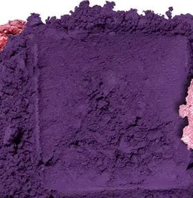

Use: Crease for deep violet definition. All-over lid for lighter skin tones. Pairs with Eclipse for a dramatic purple smoky eye. Outer corner depth.

##### 色号 2：蓝花楹紫哑 (Jacaranda) —— 中深紫罗兰，丝滑哑光。
用途：用于眼窝打造深邃紫调轮廓；浅肤色可全眼铺色；与 `Eclipse` 搭配可做强烈紫色烟熏妆；用于眼尾加深。

---

## Shade 3: Flutter 567SW — Sparkling Wet Lilac Pink
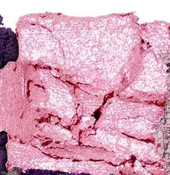

Use: All-over lid for a luminous lilac pink. Apply wet for maximum sparkling wet effect. Pairs with Phoebe for a soft dreamy look. Inner corner highlight.

##### 色号 3：淡紫粉湿光 (Flutter) —— 淡紫粉色，湿光闪。
用途：可全眼铺色打造亮泽淡紫粉感；湿刷获得最强湿光效果；与 `Phoebe` 搭配可做柔美梦幻妆；用于眼头提亮。

---

## Shade 4: Phoebe 568SKM — Silky Matte Light Lilac
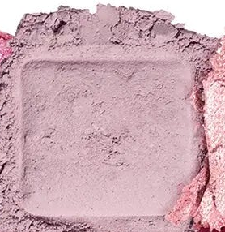

Use: Base and brow bone highlight. Transition shade for crease blending. All-over lid for a wearable everyday lavender. Pairs with Orchid for a tonal purple look.

##### 色号 4：浅淡紫哑 (Phoebe) —— 浅淡紫色，丝滑哑光。
用途：用作底色和眉骨提亮；用于眼窝过渡晕染；可全眼铺色做日常薰衣草妆；与 `Orchid` 搭配可做同色调紫色渐层。

---

## Shade 5: Regal 569M — Metallic Vintage Rose
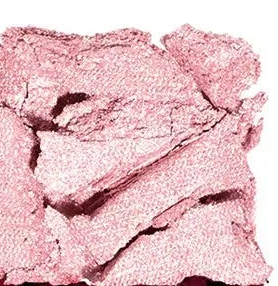

Use: All-over lid for a romantic vintage rose metallic. Center lid highlight. Pairs with Jacaranda in the crease for a classic metallic rose-purple look. Damp brush for maximum glow.

##### 色号 5：复古玫金属 (Regal) —— 复古玫瑰色，金属感。
用途：可全眼铺色打造浪漫复古玫瑰金属感；点于眼皮中央提亮；与 `Jacaranda` 搭配可做经典玫紫金属妆；湿刷加强光泽。

---

## Shade 6: Eclipse 570SKM — Silky Matte Deep Purple
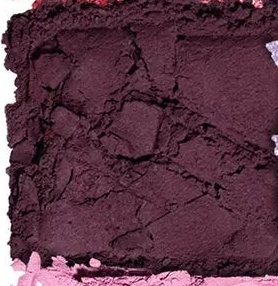

Use: Outer corner and deep crease for dramatic definition. Liner effect for a graphic look. Pairs with any shimmer for maximum contrast. Use sparingly on lighter skin tones.

##### 色号 6：深紫黑哑 (Eclipse) —— 深紫黑色，丝滑哑光。
用途：用于眼尾和深眼窝打造强烈轮廓；可做眼线效果；与任意闪色搭配可做极强对比；浅肤色适量使用。

---

## Shade 7: Stargirl 571SF — Sparkling Foiled Duochrome Pink with Bronze Champagne Shift
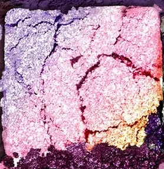

Use: All-over lid for a magical color-shifting sparkle. Apply damp for intense foiled duochrome. Inner corner pop. Pairs with Velour in the crease.

##### 色号 7：星女粉铜变幻 (Stargirl) —— 粉调双色变幻铜香槟，箔光闪。
用途：可全眼铺色展现神奇变色闪光；湿刷获得最强双色箔光效果；点于眼头增添变幻光；与 `Velour` 搭配可做眼窝过渡。

---

## Shade 8: Bolt 572SF — Sparkling Foiled Graphic Violet and Silver Duo Chrome
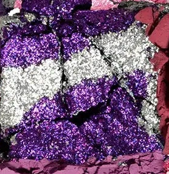

Use: All-over lid for a striking violet-silver duochrome. Apply damp for maximum graphic intensity. Statement look center lid. Pairs with Eclipse for dark drama.

##### 色号 8：紫银双色变幻 (Bolt) —— 紫银双色变幻，箔光闪。
用途：可全眼铺色展现强烈紫银双色变幻；湿刷获得最强视觉冲击效果；点于眼皮中央做视觉焦点；与 `Eclipse` 搭配可做深邃大胆眼妆。

---

## Shade 9: Heather 573SKM — Silky Matte Medium Dusty Coral Rose
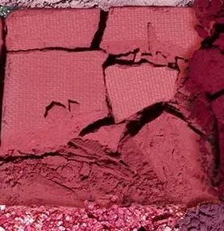

Use: Crease transition for a warm rosy definition. All-over lid for a wearable coral rose. Pairs with Cerise for a deep fuchsia look. Brow bone for medium skin tones.

##### 色号 9：尘珊瑚玫哑 (Heather) —— 中调尘珊瑚玫瑰，丝滑哑光。
用途：用于眼窝过渡打造暖玫瑰轮廓；可全眼铺色做日常珊瑚玫瑰妆；与 `Cerise` 搭配可做深品红眼妆；中肤色可用于眉骨。

---

## Shade 10: Cerise 574SKM — Silky Matte Medium Dark Muted Fuchsia
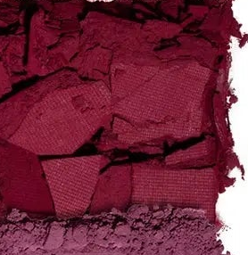

Use: Outer corner and crease for deep fuchsia drama. All-over lid for a bold statement. Pairs with Sweet Pea for a light-to-deep fuchsia gradient.

##### 色号 10：深哑品红 (Cerise) —— 中深哑粉品红，丝滑哑光。
用途：用于眼尾和眼窝打造深邃品红感；可全眼铺色做大胆宣言妆；与 `Sweet Pea` 搭配可做从浅到深的品红渐变眼妆。

---

## Shade 11: Sweet Pea 575SKM — Silky Matte Light Medium Warm Lilac
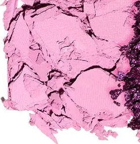

Use: Base and brow bone. Crease transition for soft blending. All-over lid for lighter skin tones. Warm everyday lavender shade.

##### 色号 11：暖薰衣草哑 (Sweet Pea) —— 浅中调暖薰衣草，丝滑哑光。
用途：用作底色和眉骨；用于眼窝过渡柔和晕染；浅肤色可全眼铺色；日常温暖薰衣草色。

---

## Shade 12: Concord 576SF — Sparkling Foiled Medium Violet
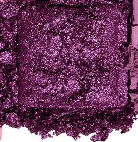

Use: All-over lid for a rich violet sparkle. Apply damp for maximum foiled payoff. Inner corner or center lid highlight. Pairs with Eclipse for depth.

##### 色号 12：紫葡萄箔光 (Concord) —— 中调紫色，箔光闪。
用途：可全眼铺色打造浓郁紫色箔光；湿刷获得最强发色；用于眼头或眼皮中央提亮；与 `Eclipse` 搭配可加深层次。

---

## Shade 13: Velour 577SKM — Silky Matte Medium Lilac
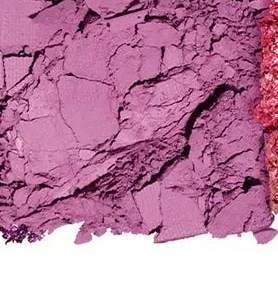

Use: All-over lid for a muted lilac. Crease transition and blend-out. Pairs with Concord for a tonal purple look. Versatile everyday shade.

##### 色号 13：薰衣草丝哑 (Velour) —— 中调薰衣草紫，丝滑哑光。
用途：可全眼铺色打造柔和薰衣草色；用于眼窝过渡和晕染；与 `Concord` 搭配可做同色调紫色妆；百搭日常用色。

---

## Shade 14: Brink 578SF — Sparkling Foiled Pink
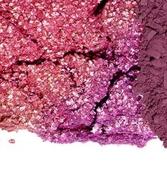

Use: All-over lid for a vivid pink sparkle. Inner corner highlight. Damp brush for intense foiled finish. Pairs with Orchid in the crease for a pink-purple look.

##### 色号 14：亮粉箔光 (Brink) —— 亮粉红色，箔光闪。
用途：可全眼铺色打造鲜艳粉红箔光；用于眼头提亮；湿刷获得最强箔光发色；与 `Orchid` 搭配可做粉紫渐变眼妆。

---

## Shade 15: Orchid 579SKM — Silky Matte Medium Purple
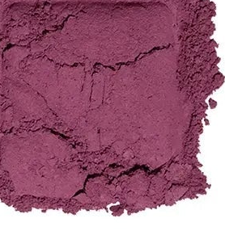

Use: Outer corner and crease for deep purple definition. All-over lid for a statement purple eye. Pairs with Brink on the lid for a purple-pink contrast look.

##### 色号 15：兰花紫哑 (Orchid) —— 中调紫色，丝滑哑光。
用途：用于眼尾和眼窝打造深邃紫调轮廓；可全眼铺色做大胆紫色眼妆；与 `Brink` 搭配可做紫粉对比眼妆。
