# Natasha Denona 15色 暖棕盘 Tan Eyeshadow Palette

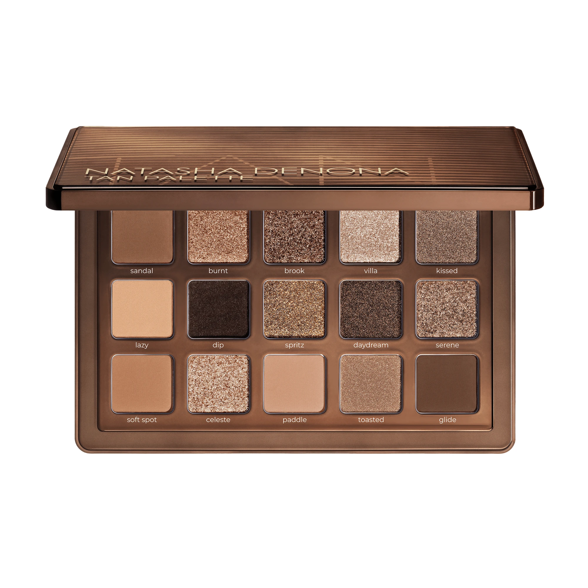

灵感源自圣特罗佩（Saint-Tropez）的阳光美学，延续品牌经典 Tan Cheek Palette 的暖棕色调，收录 14 款全新沙棕中性色 + 1 款品牌经典色，共 15 色。

€77.44 · 17.75g / 0.62 oz · 产地意大利

**认证：** 无滑石粉 · 无对羟基苯甲酸酯 · 无矿物油

---

## 质地说明

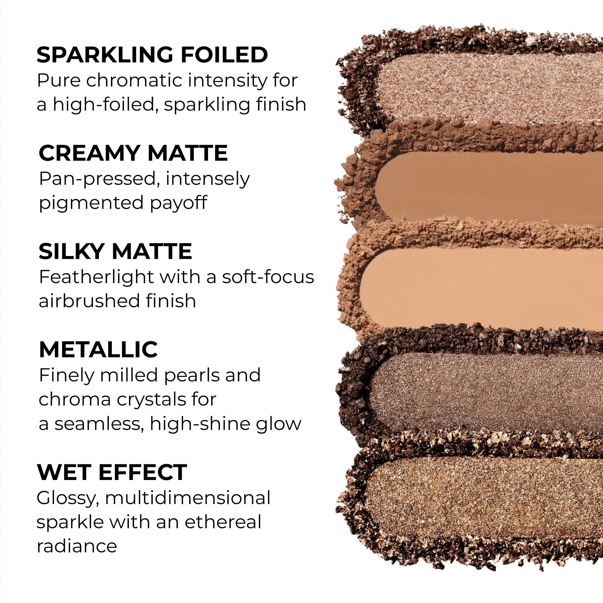

| 代码 | 质地 | 特点 |
|------|------|------|
| SC | Cream Matte 奶油哑光 | 盘面压制，浓郁发色，哑光收边 |
| SKM / CM | Silky Matte 丝滑哑光 | 质地轻盈，柔焦气雾感 |
| SF | Sparkling Foiled 箔光闪 | 高折射箔光，光泽度极强 |
| M | Metallic 金属感 | 珍珠颗粒 + 色彩晶体，高亮金属感，含品牌经典 Mia 背注射配方 |
| SW | Sparkling Wet 湿光闪 | 镜面光泽感，立体多维 |
| MG | Metal Gloss 金属光泽 | 光泽饱满，高亮如镜 |

**哑光上色建议：** 用紧密刷头按压上色，再用蓬松刷晕染；或用蓬松刷横扫上色，自然晕开。
**金属/闪光上色建议：** 用湿刷或指腹涂抹，可获得最强光泽和发色。

---

## 手臂试色

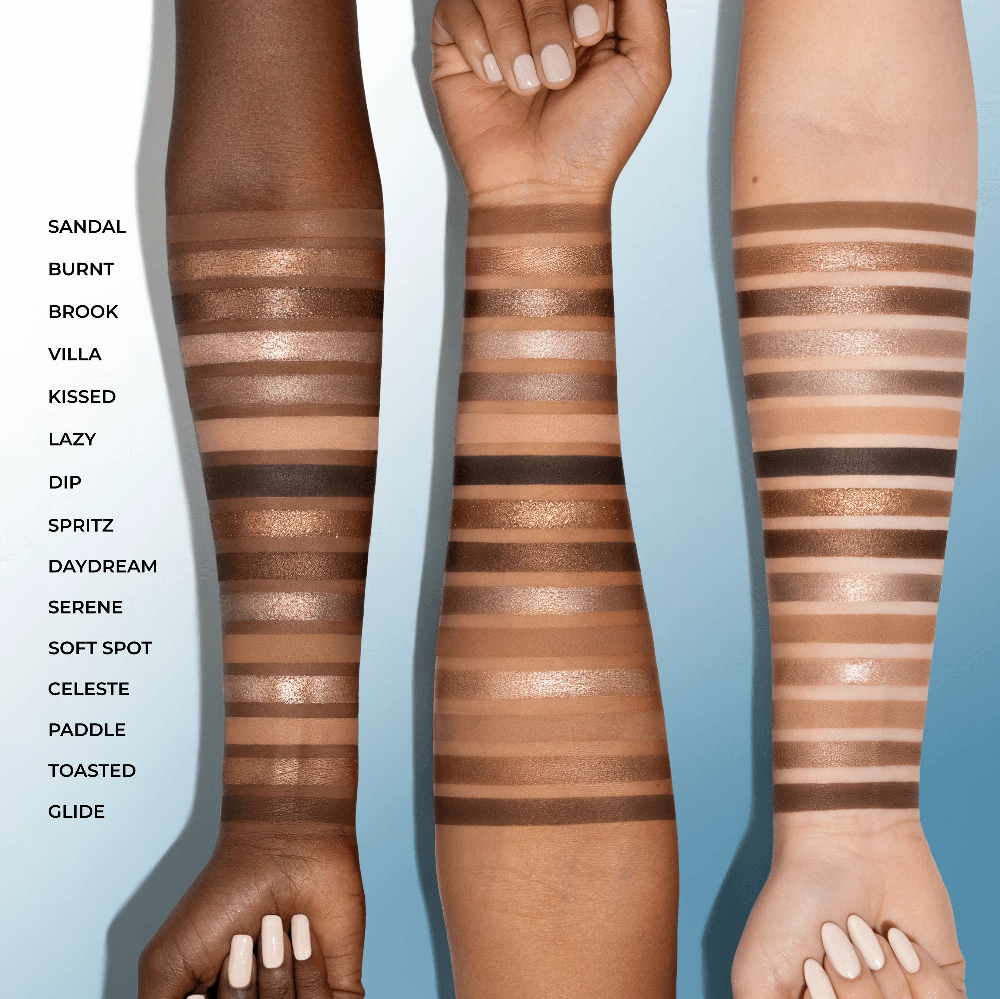

---

## 眼妆分区指南

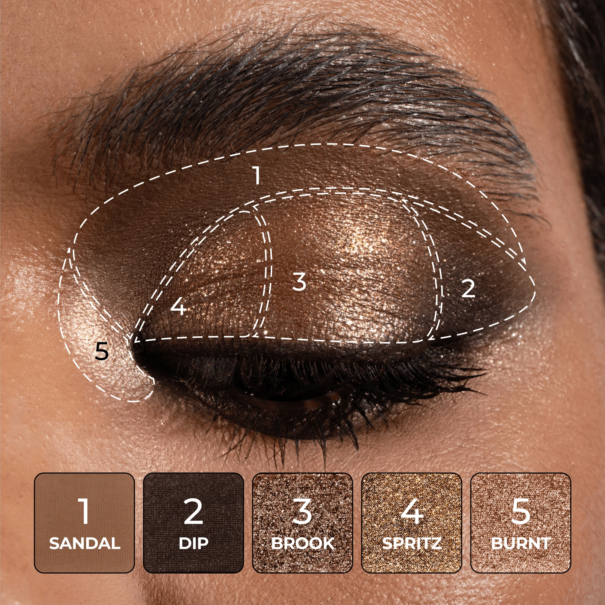

---

## 色号总览

| # | 色名 | 代码 | 质地 | 颜色描述 |
|---|------|------|------|----------|
| 1 | Sandal | 646SC | Cream Matte | 中调焦糖棕，哑光 |
| 2 | Burnt | 647SF | Sparkling Foiled | 浅中调淡铜色，箔光闪 |
| 3 | Brook | 648SF | Sparkling Foiled | 中调棕色，箔光闪 |
| 4 | Villa | 649M | Metallic | 浅暖冰裸色，金属感 |
| 5 | Kissed | 650M | Metallic Satin | 中调焦糖棕，缎光金属 |
| 6 | Lazy | 651SKM | Silky Matte | 浅中调沙裸色，丝滑哑光 |
| 7 | Dip | 652SC | Cream Matte | 深咖啡豆棕，哑光 |
| 8 | Spritz | 653SW | Sparkling Wet | 中调铜金色，湿光闪 |
| 9 | Daydream | 654M | Metallic Satin | 中深棕，缎光金属 |
| 10 | Serene | 655SF | Sparkling Foiled | 中调锈裸色，箔光闪 |
| 11 | Soft Spot | 550CM | Silky Matte | 中调沙棕，丝滑哑光 |
| 12 | Celeste | 656MG | Metal Gloss | 浅冰裸米，金属光泽 |
| 13 | Paddle | 657SKM | Silky Matte | 浅中调中性裸，丝滑哑光 |
| 14 | Toasted | 658M | Metallic | 中调烤棕色，金属感 |
| 15 | Glide | 659SC | Cream Matte | 中深烤棕，哑光 |

---

## Shade 1: Sandal 646SC — Cream Matte Medium Caramel
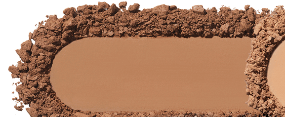

Use: All-over base or crease transition for medium to deep skin tones. Contour the crease to deepen and define. Pairs with Kissed on the lid for a warm caramel eye.

##### 色号 1：沙凉鞋棕 (Sandal) —— 中调焦糖棕，奶油哑光。
用途：适合中至深肤色作全眼底色或眼窝过渡色；加深眼窝轮廓；与 `Kissed` 叠搭可做暖焦糖眼妆。

---

## Shade 2: Burnt 647SF — Sparkling Foiled Light Medium Pale Copper
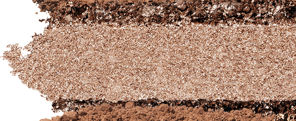

Use: All-over lid for a warm copper shimmer. Inner corner highlight. Damp fingertip for maximum foiled payoff. Pairs with Sandal in the crease for a warm day look.

##### 色号 2：焦铜箔光 (Burnt) —— 浅中调淡铜色，箔光闪。
用途：可全眼铺色打造暖铜光泽；用于眼头提亮；指腹湿用发色更强烈；与 `Sandal` 搭配可做日常暖调眼妆。

---

## Shade 3: Brook 648SF — Sparkling Foiled Medium Brown
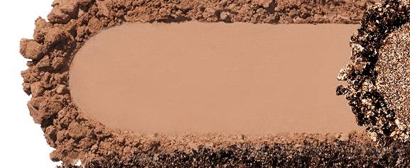

Use: All-over lid or outer corner for a rich brown sparkle. Damp brush for a deeper, more foiled finish. Pairs with Dip for a dark smoky eye.

##### 色号 3：溪棕箔光 (Brook) —— 中调棕色，箔光闪。
用途：可全眼铺色或集中于眼尾打造浓郁棕色光泽；湿刷可获得更深的箔光效果；与 `Dip` 搭配可做深棕烟熏妆。

---

## Shade 4: Villa 649M — Metallic Light Warm Icy Nude
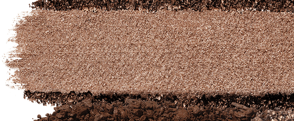

Use: All-over lid for an ethereal glow. Center of lid or inner corner highlight. Apply damp for a high-shine mirror finish. Flatters all skin tones.

##### 色号 4：别墅冰裸 (Villa) —— 浅暖冰裸色，金属感。
用途：可全眼铺色营造空灵光泽；用于眼皮中央或眼头提亮；湿刷可获得高光镜面效果；适合所有肤色。

---

## Shade 5: Kissed 650M — Metallic Satin Medium Caramel
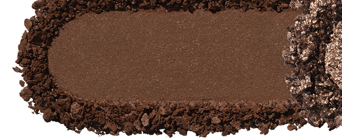

Use: All-over lid for a warm metallic caramel. Center lid highlight. Use damp for an intensified satin glow. Pairs with Sandal in the crease for depth.

##### 色号 5：焦糖缎光 (Kissed) —— 中调焦糖棕，缎光金属。
用途：可全眼铺色打造暖调金属焦糖感；点于眼皮中央提亮；湿刷可加强缎光光泽；与 `Sandal` 搭配可做有层次的焦糖妆。

---

## Shade 6: Lazy 651SKM — Silky Matte Light Medium Sandy Nude
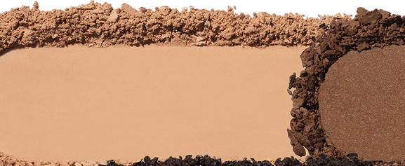

Use: Base shade or all-over lid for lighter skin tones. Transition shade in the crease for a seamless blend. Highlight brow bone for lighter skin. Works across all skin tones.

##### 色号 6：慵懒沙裸 (Lazy) —— 浅中调沙裸色，丝滑哑光。
用途：浅肤色可用作全眼底色或盖底；适合所有肤色作眼窝过渡晕染；浅肤色可用于眉骨提亮。

---

## Shade 7: Dip 652SC — Cream Matte Coffee Bean Brown
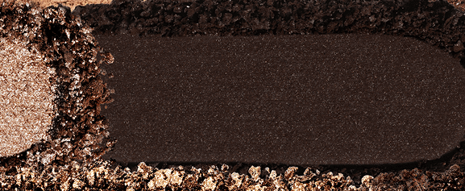

Use: Outer corner and crease for deep definition. Lower lash line for a graphic liner effect. Pairs with any metallic for a classic dark-lid look. Use sparingly for medium skin tones.

##### 色号 7：咖啡深沉 (Dip) —— 深咖啡豆棕，奶油哑光。
用途：用于眼尾和眼窝加深轮廓；沿下眼睑勾勒可做自然眼线效果；与任意金属色搭配可做经典深眼妆。

---

## Shade 8: Spritz 653SW — Sparkling Wet Medium Brass
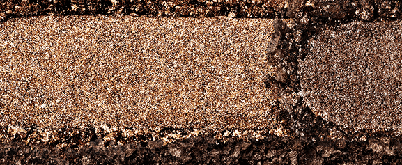

Use: All-over lid for a glossy multidimensional brass finish. Apply wet for maximum mirror-like sparkle. Pairs with Toasted in the outer corner for a warm layered metallic look.

##### 色号 8：铜金湿光 (Spritz) —— 中调铜金色，湿光闪。
用途：可全眼铺色打造立体铜金镜面感；湿刷发色最佳；与 `Toasted` 搭配可做暖调叠层金属眼妆。

---

## Shade 9: Daydream 654M — Metallic Satin Medium Dark Brown
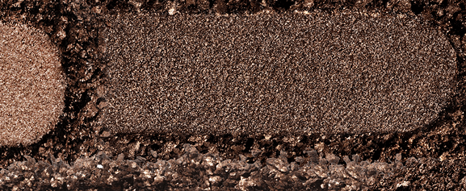

Use: Outer corner or all-over lid for a sultry deep metallic. Crease liner effect. Pairs with Villa for a light-to-dark metallic eye. Damp brush intensifies the satin payoff.

##### 色号 9：白日梦棕 (Daydream) —— 中深棕色，缎光金属。
用途：用于眼尾或全眼打造深邃金属感；可做眼窝轮廓；与 `Villa` 搭配可做深浅对比金属眼妆；湿刷加强缎光发色。

---

## Shade 10: Serene 655SF — Sparkling Foiled Medium Rusty Nude
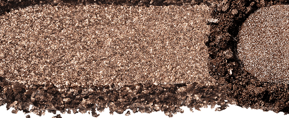

Use: All-over lid for a warm rusty sparkle. Pairs with Sandal in the crease for a warm nude eye. Inner corner and center lid highlight for a pop of dimension.

##### 色号 10：锈裸箔光 (Serene) —— 中调锈裸色，箔光闪。
用途：可全眼铺色打造暖锈箔光；与 `Sandal` 搭配可做暖裸眼妆；点于眼头和眼皮中央增加立体感。

---

## Shade 11: Soft Spot 550CM — Silky Matte Medium Sandy Brown
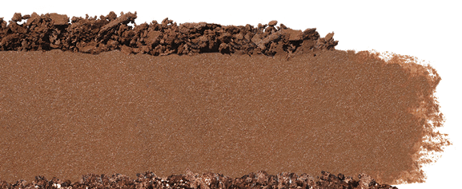

Use: Base and crease transition for medium to deep skin tones. All-over lid for lighter skin tones. Classic day-to-night crease shade for a soft defined look.

##### 色号 11：柔沙棕 (Soft Spot) —— 中调沙棕，丝滑哑光。
用途：中至深肤色可用作底色和眼窝过渡色；浅肤色可全眼铺色；经典日常眼窝用色，勾勒柔和轮廓。

---

## Shade 12: Celeste 656MG — Metal Gloss Light Icy Beige
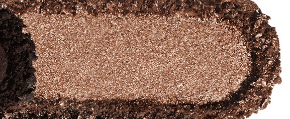

Use: Inner corner and center lid highlight for a luminous, lit-from-within glow. Brow bone highlight for all skin tones. Apply damp for maximum Metal Gloss shine.

##### 色号 12：天空冰裸光 (Celeste) —— 浅冰裸米，金属光泽。
用途：用于眼头和眼皮中央提亮，打造由内向外的发光感；适合所有肤色作眉骨提亮；湿刷可获得最强金属光泽。

---

## Shade 13: Paddle 657SKM — Silky Matte Light Medium Neutral Nude
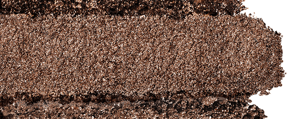

Use: Base for lighter skin tones. Crease and brow bone blend-out for medium skin. All-over lid for a clean wearable neutral. Ideal as a blending buffer.

##### 色号 13：中性裸哑 (Paddle) —— 浅中调中性裸色，丝滑哑光。
用途：浅肤色可用作底色；中肤色可用于眼窝过渡和眉骨柔化；可全眼打造干净日常中性妆；用作晕染过渡极佳。

---

## Shade 14: Toasted 658M — Metallic Medium Toasty Brown
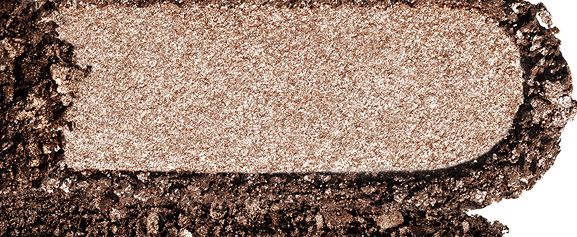

Use: All-over lid for a warm toasty metallic. Outer corner for depth. Pairs with Spritz for a layered warm bronze effect. Use damp for maximum payoff.

##### 色号 14：烤棕金属 (Toasted) —— 中调烤棕色，金属感。
用途：可全眼铺色打造暖烤棕金属感；集中于眼尾加深；与 `Spritz` 搭配可做暖调叠层铜棕金属妆；湿刷加强发色。

---

## Shade 15: Glide 659SC — Cream Matte Medium Dark Toasty Brown
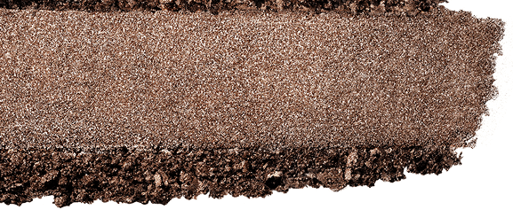

Use: Outer corner and crease for deep warm definition. Lower lash line for a warm smoky liner. Pairs with Toasted on the lid for a monochromatic toasty eye. Softer alternative to Dip.

##### 色号 15：深烤棕哑光 (Glide) —— 中深烤棕色，奶油哑光。
用途：用于眼尾和眼窝加深暖调轮廓；沿下眼睑可做暖调烟熏眼线；与 `Toasted` 搭配可做同色调烤棕单色妆；比 `Dip` 更柔和的深色选择。
