# Natasha Denona 15色 暖调哑光盘 I Need a Warm Eyeshadow Palette

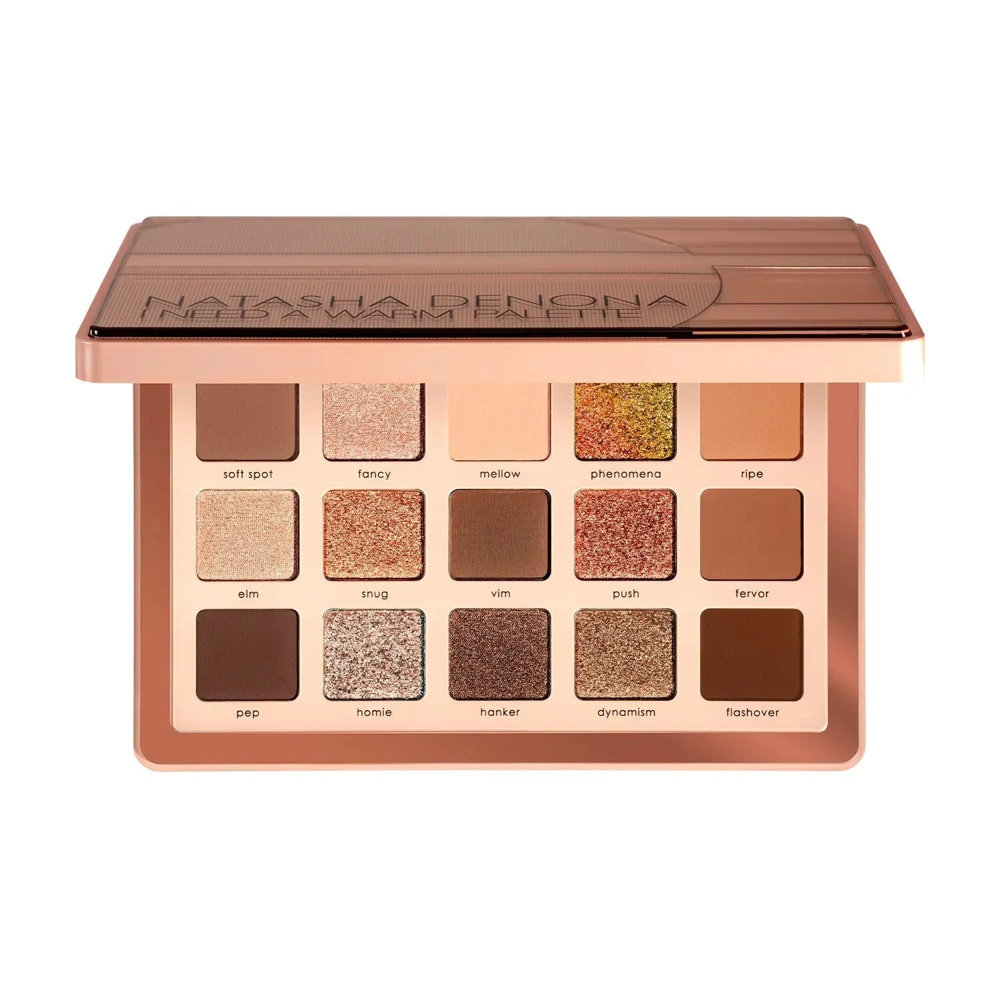

暖调哑光大地色系，定位为 I Need a Nude 的暖棕版，收录暖棕、驼色、焦糖等15色。首创 Slip Cream Matte（滑感奶油哑光）和 Metal Gloss（金属光泽）全新质地，同时加入 Multichrome 多变色和 Duo Chrome 双色变幻，轻松打造日常裸眼到复古烟熏妆。

€77.44 · 18.15g / 0.64 oz · 产地意大利

**认证：** 无动物测试 · 产地意大利

---

## 质地说明

| 代码 | 质地 | 特点 |
|------|------|------|
| CM | Creamy Matte 奶油哑光 | 品牌经典配方，柔滑压粉哑光 |
| SC | Slip Cream Matte 滑感奶油哑光 | 全新配方，无滑石粉，极顺滑，适合手指和刷头双用 |
| M | Metallic 金属感 | 细磨珍珠粉 + 色彩晶体，无缝高光泽 |
| MG | Metal Gloss 金属光泽 | 全新配方，液态镜面感反光 |
| SF | Sparkling Foiled 箔光闪 | 高折射箔光，纯粹色彩强度 |
| MC | Multichrome 多变色 | 随角度变换多色调反射 |
| DC | Duo Chrome 双色变幻 | 随角度呈现双色光效 |

**哑光上色建议：** 用紧密刷头按压上色，再用蓬松刷晕染；Slip Cream Matte 可直接用指腹涂抹。
**金属/箔光上色建议：** 用湿刷或指腹涂抹，获得最强光泽。

---

## 手臂试色

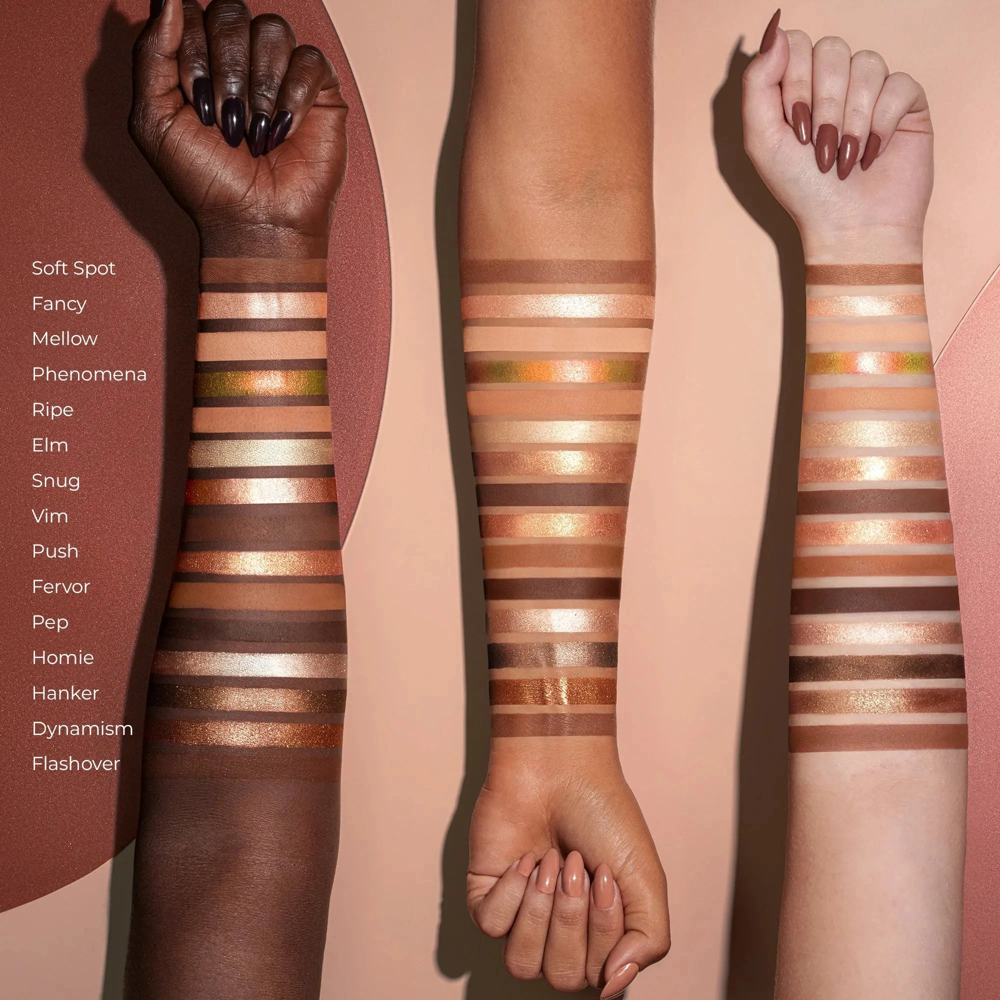

---

## 色号总览

| # | 色名 | 代码 | 质地 | 颜色描述 |
|---|------|------|------|----------|
| 1 | Soft Spot | 550CM | Creamy Matte | 中调大地棕，奶油哑光 |
| 2 | Fancy | 551M | Metallic | 香槟色，金属感 |
| 3 | Mellow | 552CM | Creamy Matte | 浅蜜桃裸色，奶油哑光 |
| 4 | Phenomena | 553MC | Multichrome | 蜜桃粉绿多变色 |
| 5 | Ripe | 554CM | Creamy Matte | 浅中调蜜桃棕，奶油哑光 |
| 6 | Elm | 555SF | Sparkling Foiled | 浅铜裸色，箔光闪 |
| 7 | Vim | 556CM | Creamy Matte | 深暖棕，奶油哑光 |
| 8 | Snug | 557MG | Metal Gloss | 柔铜青铜色，金属光泽 |
| 9 | Fervor | 558CM | Creamy Matte | 中调暖焦糖，奶油哑光 |
| 10 | Push | 559SF | Sparkling Foiled | 中调锈玫瑰金，箔光闪 |
| 11 | Pep | 560CM | Creamy Matte | 深暖棕，奶油哑光 |
| 12 | Homie | 561MG | Metal Gloss | 暖裸色，金属光泽 |
| 13 | Hanker | 562M | Metallic | 中深金棕色，金属感 |
| 14 | Dynamism | 563DC | Duo Chrome | 中棕带绿光双色变幻 |
| 15 | Flashover | 564SC | Slip Cream Matte | 中调黏土棕，滑感奶油哑光 |

---

## Shade 1: Soft Spot 550CM — Creamy Matte Medium Earthy Brown
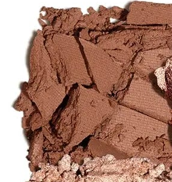

Use: All-over base or crease transition for medium to deep skin tones. Classic day-to-night crease shade for soft definition. Pairs with Elm for a warm bronze eye.

##### 色号 1：柔大地棕哑 (Soft Spot) —— 中调大地棕，奶油哑光。
用途：中至深肤色可用作全眼底色或眼窝过渡；经典日常眼窝用色；与 `Elm` 搭配可做暖铜眼妆。

---

## Shade 2: Fancy 551M — Metallic Champagne
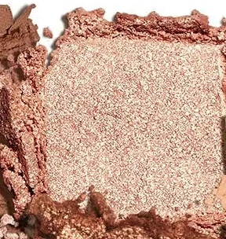

Use: Inner corner and center lid highlight. All-over lid for a luminous champagne look. Damp brush for maximum metallic glow. Flatters all skin tones.

##### 色号 2：香槟金属 (Fancy) —— 香槟色，金属感。
用途：用于眼头和眼皮中央提亮；可全眼铺色打造亮泽香槟感；湿刷加强金属光泽；适合所有肤色。

---

## Shade 3: Mellow 552CM — Creamy Matte Light Peachy Nude
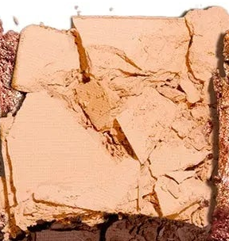

Use: Base for most skin tones. Brow bone highlight. Transition shade to blend out edges. Soft everyday all-over lid for a barely-there look.

##### 色号 3：蜜桃裸哑 (Mellow) —— 浅蜜桃裸色，奶油哑光。
用途：适合大部分肤色作底色；用于眉骨提亮；过渡晕染柔化边缘；可做极简裸色日妆。

---

## Shade 4: Phenomena 553MC — Multichrome Peach Pink Green
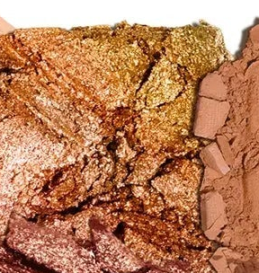

Use: All-over lid for a mesmerizing color-shifting effect. Apply wet for maximum multichrome intensity. Center lid accent over a matte base. Unique statement shade.

##### 色号 4：蜜桃粉绿变色 (Phenomena) —— 蜜桃粉绿多变色。
用途：可全眼铺色展现迷幻变色效果；湿刷可获得最强多色调光效；叠于哑光底色之上点亮眼皮中央；独特视觉亮点色。

---

## Shade 5: Ripe 554CM — Creamy Matte Light Medium Peach Brown
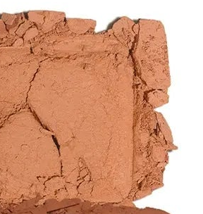

Use: All-over lid or crease transition for lighter skin tones. Warm base for building depth. Pairs with Fervor and Vim for a graduated warm eye.

##### 色号 5：蜜桃棕哑 (Ripe) —— 浅中调蜜桃棕，奶油哑光。
用途：浅肤色可全眼铺色或用作眼窝过渡；可用作暖调底色逐渐加深；与 `Fervor` 和 `Vim` 搭配可做渐层暖眼妆。

---

## Shade 6: Elm 555SF — Sparkling Foiled Light Bronzy Nude
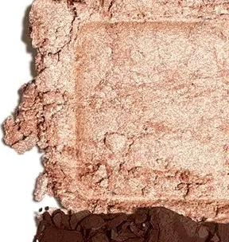

Use: All-over lid for a warm bronze sparkle. Inner corner highlight. Damp fingertip for intense foiled finish. Pairs with Soft Spot in the crease for a warm day look.

##### 色号 6：浅铜箔光 (Elm) —— 浅铜裸色，箔光闪。
用途：可全眼铺色打造暖铜光泽；用于眼头提亮；指腹湿用发色最强烈；与 `Soft Spot` 搭配可做日常暖调眼妆。

---

## Shade 7: Vim 556CM — Creamy Matte Deep Warm Brown
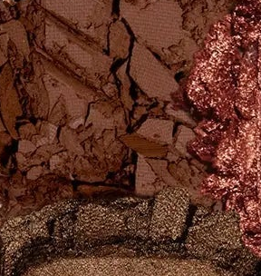

Use: Outer corner and crease for deep warm definition. Liner effect along lash lines. Pairs with any shimmer for a classic smoky eye.

##### 色号 7：深暖棕哑 (Vim) —— 深暖棕，奶油哑光。
用途：用于眼尾和眼窝加深暖调轮廓；沿睫毛根部可做眼线效果；与任意闪色搭配可做经典烟熏妆。

---

## Shade 8: Snug 557MG — Metal Gloss Soft Bronze
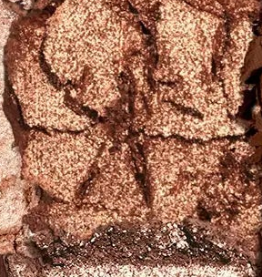

Use: All-over lid for a liquid-like bronze metallic finish. Apply with fingertip for mirror-glass effect. Pairs with Vim in the outer corner for a warm metallic look.

##### 色号 8：柔铜金属光 (Snug) —— 柔铜青铜色，金属光泽。
用途：可全眼铺色打造液态镜面铜色感；指腹涂抹获得最强镜面效果；与 `Vim` 搭配可做暖调金属眼妆。

---

## Shade 9: Fervor 558CM — Creamy Matte Medium Warm Caramel
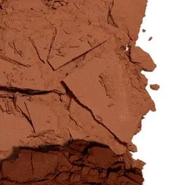

Use: Crease and outer corner transition for medium warm depth. All-over lid for medium skin tones. Pairs with Push on the lid for a warm rusty look.

##### 色号 9：暖焦糖哑 (Fervor) —— 中调暖焦糖，奶油哑光。
用途：用于眼窝和眼尾打造中等暖调深度；中肤色可全眼铺色；与 `Push` 搭配可做暖调锈棕眼妆。

---

## Shade 10: Push 559SF — Sparkling Foiled Medium Rusty Rose Gold
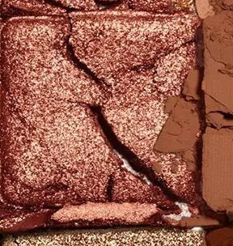

Use: All-over lid for a warm rusty rose gold sparkle. Outer corner accent for warmth. Damp brush for intense foiled finish. Pairs with Vim for depth.

##### 色号 10：锈玫金箔 (Push) —— 中调锈玫瑰金，箔光闪。
用途：可全眼铺色打造暖锈玫瑰金光泽；集中于眼尾增添暖意；湿刷获得最强箔光效果；与 `Vim` 搭配可加深立体感。

---

## Shade 11: Pep 560CM — Creamy Matte Deep Warm Brown
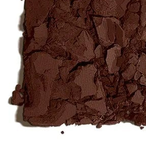

Use: Outer corner and lower lash line for dramatic depth. Liner precision for a bold eye. Smoky crease for deep definition. Use lightly for medium skin tones.

##### 色号 11：深棕烟熏哑 (Pep) —— 深暖棕，奶油哑光。
用途：用于眼尾和下眼睑打造强烈深度；可做精准眼线；用于眼窝打造深邃烟熏感；中肤色适量使用。

---

## Shade 12: Homie 561MG — Metal Gloss Warm Nude
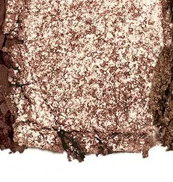

Use: Inner corner and center lid for a warm liquid-glass highlight. Apply with fingertip for maximum glossy effect. All-over lid for a minimal sheer glow.

##### 色号 12：暖裸金属光 (Homie) —— 暖裸色，金属光泽。
用途：用于眼头和眼皮中央打造暖裸液态玻璃高光；指腹涂抹获得最强光泽；可全眼铺色做轻薄透亮日妆。

---

## Shade 13: Hanker 562M — Metallic Medium Dark Golden Brown
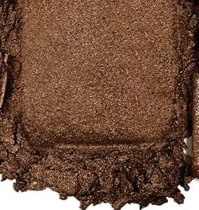

Use: All-over lid for a warm golden brown metallic. Outer corner for deep metallic drama. Damp brush for maximum payoff. Pairs with Snug for a tonal bronze look.

##### 色号 13：金棕金属 (Hanker) —— 中深金棕色，金属感。
用途：可全眼铺色打造暖调金棕金属感；集中于眼尾加深金属感；湿刷加强发色；与 `Snug` 搭配可做同色调铜棕妆。

---

## Shade 14: Dynamism 563DC — Duo Chrome Medium Brown with Green Specks
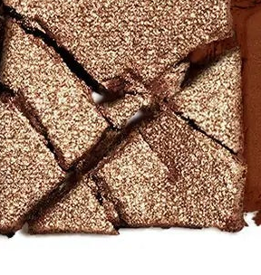

Use: All-over lid for a unique duochrome effect. Apply wet for maximum color-shift intensity. Center lid accent for a dimensional pop over mattes.

##### 色号 14：棕绿双色变幻 (Dynamism) —— 中棕带绿光双色变幻。
用途：可全眼铺色展现独特双色变幻效果；湿刷可获得最强变色强度；叠于哑光底色之上可增添立体维度。

---

## Shade 15: Flashover 564SC — Slip Cream Matte Medium Clay Brown
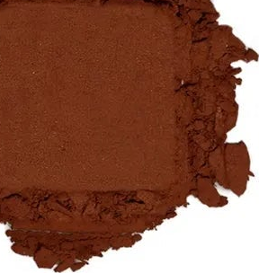

Use: Outer corner and crease for a soft warm definition. All-over lid for medium skin tones. Apply with fingertip or brush — Slip Cream Matte formula works both ways. Pairs with Pep for layered depth.

##### 色号 15：黏土棕滑感哑 (Flashover) —— 中调黏土棕，滑感奶油哑光。
用途：用于眼尾和眼窝打造柔和暖调轮廓；中肤色可全眼铺色；滑感奶油哑光配方手指和刷头均可用；与 `Pep` 搭配可做叠层深度烟熏妆。
