# Natasha Denona 15色 极光冰雪盘 Xenon Eyeshadow Palette

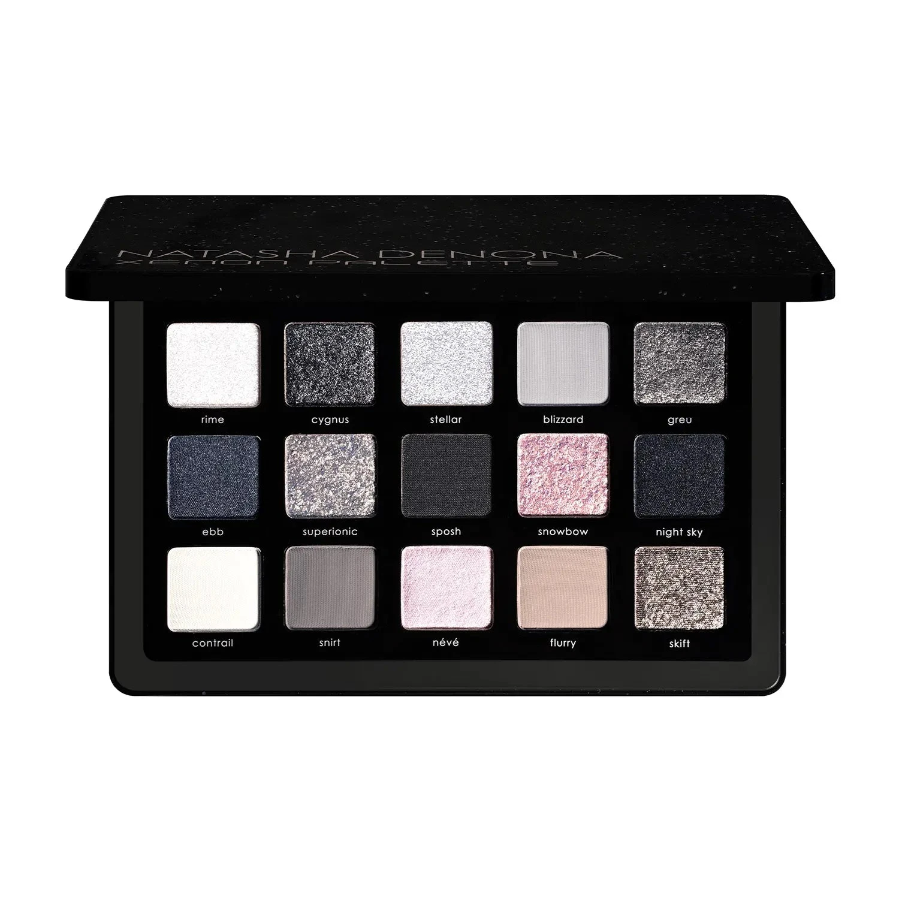

冷调星际限量版，以多维黑色、钢灰与冰粉为核心，探索从纯白哑光到午夜蓝金属、牡丹粉闪光的完整冷调光谱。首创 Sparkling Metallic（闪光金属）和 Crystal Sparkling（水晶闪）全新质地亮相，搭配 Sparkling Foiled、Sparkling Wet 和经典哑光，共15色打造从极简净白到强烈烟熏的全场景妆效。

€77.44 · 18.15g / 0.64 oz · 产地意大利 · 限量版

**认证：** 无对羟基苯甲酸酯 · 无矿物油 · 无动物测试

---

## 质地说明

| 代码 | 质地 | 特点 |
|------|------|------|
| CM | Creamy Matte 奶油哑光 | 品牌经典配方，柔滑压粉哑光，发色饱满 |
| CP | Cream Powder 奶粉哑光 | 轻盈奶粉质地，柔焦自然 |
| M | Metallic 金属感 | 细磨珍珠粉 + 色彩晶体，无缝高光泽 |
| SF | Sparkling Foiled 箔光闪 | 高折射箔光，纯粹色彩强度 |
| SW | Sparkling Wet 湿光闪 | 湿润多维闪光感 |
| SM | Sparkling Metallic 闪光金属 | 全新配方，金属基底加入多维闪光粒子 |
| KS | Crystal Sparkling 水晶闪 | 水晶感多维变幻闪光粒子 |

**哑光上色建议：** 用紧密刷头按压上色，再用蓬松刷晕染。
**金属/闪光上色建议：** 用湿刷或指腹涂抹，获得最强光泽和闪光效果。

---

## 色板展示

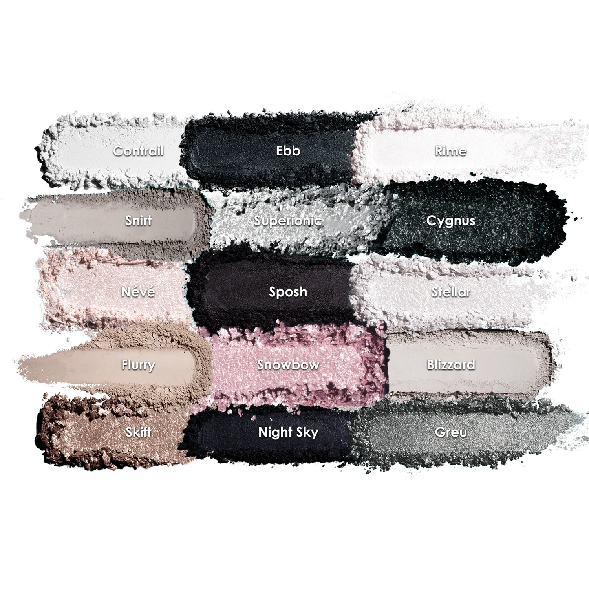

---

## 色号总览

| # | 色名 | 代码 | 质地 | 颜色描述 |
|---|------|------|------|----------|
| 1 | Rime | 514M | Metallic | 白色，金属感 |
| 2 | Cygnus | 515SF | Sparkling Foiled | 炭灰黑色，箔光闪 |
| 3 | Stellar | 516SW | Sparkling Wet | 白色，湿光闪 |
| 4 | Blizzard | 517CM | Creamy Matte | 浅灰色，奶油哑光 |
| 5 | Greu | 518SM | Sparkling Metallic | 铁灰色，闪光金属 |
| 6 | Ebb | 519M | Metallic | 午夜蓝色，金属感 |
| 7 | Superionic | 520SF | Sparkling Foiled | 银色带多色星点，箔光闪 |
| 8 | Sposh | 521CP | Cream Powder | 炭黑色，奶粉哑光 |
| 9 | Snowbow | 522KS | Crystal Sparkling | 粉色带多色星点，水晶闪 |
| 10 | Night Sky | 523M | Metallic | 黑色，金属感 |
| 11 | Contrail | 524CM | Creamy Matte | 白色，奶油哑光 |
| 12 | Snirt | 525CM | Creamy Matte | 中调灰色，奶油哑光 |
| 13 | Névé | 526SM | Sparkling Metallic | 牡丹粉色，闪光金属 |
| 14 | Flurry | 527CM | Creamy Matte | 蛋壳白，奶油哑光 |
| 15 | Skift | 528SF | Sparkling Foiled | 浅中调香槟色，箔光闪 |

---

## Shade 1: Rime 514M — Metallic White
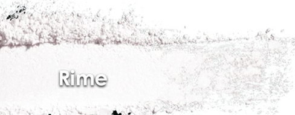

Use: Inner corner and center lid for a radiant white metallic highlight. All-over lid for an icy editorial look. Damp brush for maximum metallic intensity. Pairs with Night Sky for stark contrast.

##### 色号 1：极光白金属 (Rime) —— 白色，金属感。
用途：用于眼头和眼皮中央打造极亮白色金属高光；可全眼铺色做冰雪艺术妆；湿刷获得最强金属光泽；与 `Night Sky` 搭配可做极强黑白对比。

---

## Shade 2: Cygnus 515SF — Sparkling Foiled Anthracite
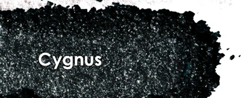

Use: Outer corner and crease for deep anthracite sparkle. All-over lid for a dramatic dark foiled look. Apply damp for maximum intensity. Pairs with Rime for a dark-to-light gradient.

##### 色号 2：炭灰箔光 (Cygnus) —— 炭灰黑色，箔光闪。
用途：用于眼尾和眼窝打造深邃炭灰箔光；可全眼铺色打造强烈暗色箔光妆；湿刷获得最强发色；与 `Rime` 搭配可做深浅渐变眼妆。

---

## Shade 3: Stellar 516SW — Sparkling Wet White
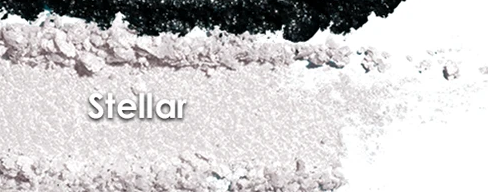

Use: Center lid for a blazing wet sparkle effect. Apply wet for maximum multi-dimensional shine. Inner corner highlight. Pairs with any dark shade for an icy center pop.

##### 色号 3：星光白湿光 (Stellar) —— 白色，湿光闪。
用途：点于眼皮中央打造炫目湿光效果；湿刷获得最强多维闪光；用于眼头提亮；与任意深色搭配可做冰雪中央高亮。

---

## Shade 4: Blizzard 517CM — Creamy Matte Light Grey
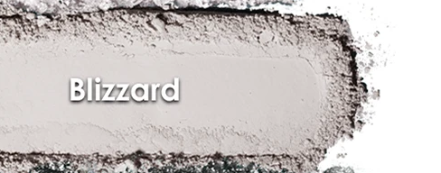

Use: All-over lid base for a cool grey wash. Crease transition and blend-out. Pairs with Cygnus for a grey smoky eye. Versatile cool neutral.

##### 色号 4：暴风雪灰哑 (Blizzard) —— 浅灰色，奶油哑光。
用途：可全眼铺色打造冷调灰色底色；用于眼窝过渡和晕染；与 `Cygnus` 搭配可做灰色烟熏妆；百搭冷中性色。

---

## Shade 5: Greu 518SM — Sparkling Metallic Iron Grey
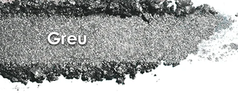

Use: All-over lid for a cool iron grey metallic sparkle. Outer corner accent. Damp brush for maximum sparkling metallic intensity. Pairs with Night Sky for deep steel eye.

##### 色号 5：铁灰闪光金属 (Greu) —— 铁灰色，闪光金属。
用途：可全眼铺色打造冷调铁灰金属光泽；集中于眼尾点缀；湿刷获得最强闪光金属效果；与 `Night Sky` 搭配可做深邃钢铁眼妆。

---

## Shade 6: Ebb 519M — Metallic Midnight Blue
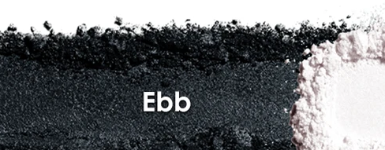

Use: All-over lid for a rich midnight blue metallic. Outer corner for deep blue drama. Damp brush for maximum metallic glow. The most dramatic color statement in the palette.

##### 色号 6：午夜蓝金属 (Ebb) —— 午夜蓝色，金属感。
用途：可全眼铺色打造浓郁午夜蓝金属感；集中于眼尾打造深邃蓝调戏剧感；湿刷获得最强金属光泽；盘内最有色彩冲击力的宣言色。

---

## Shade 7: Superionic 520SF — Sparkling Foiled Silver with Multicolor Specks
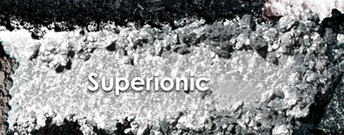

Use: All-over lid for a dazzling silver multi-spectral sparkle. Apply damp for maximum foiled intensity. Center lid over mattes. Inner corner for a celestial pop.

##### 色号 7：银色星芒箔光 (Superionic) —— 银色带多色星点，箔光闪。
用途：可全眼铺色展现炫目银色多光谱箔光；湿刷获得最强箔光发色；叠于哑光底色点亮眼皮中央；用于眼头打造星际光芒。

---

## Shade 8: Sposh 521CP — Cream Powder Charcoal
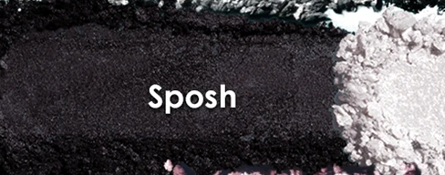

Use: Deep crease and outer corner for charcoal definition. Liner effect for precision. Pairs with any shimmer for a dark smoky eye. The deepest matte in the palette.

##### 色号 8：炭黑奶粉 (Sposh) —— 炭黑色，奶粉哑光。
用途：用于眼窝深处和眼尾打造炭黑轮廓；可做精准眼线效果；与任意闪色搭配可做深邃烟熏妆；盘内最深哑光色。

---

## Shade 9: Snowbow 522KS — Crystal Sparkling Pink with Multicolor Specks
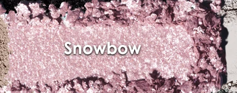

Use: Inner corner for a dreamy pink crystal highlight. All-over lid for a romantic sparkle. Apply damp for maximum crystal intensity. Pairs with Névé for a tonal pink look.

##### 色号 9：粉晶星芒 (Snowbow) —— 粉色带多色星点，水晶闪。
用途：用于眼头打造梦幻粉色水晶高光；可全眼铺色展现浪漫闪光；湿刷获得最强水晶光泽；与 `Névé` 搭配可做同色调粉色妆。

---

## Shade 10: Night Sky 523M — Metallic Black
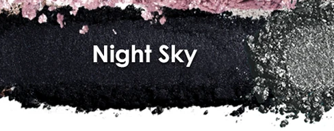

Use: Outer corner and deep crease for maximum black drama. Liner effect along lash lines. Pairs with any shimmer for the most dramatic smoky eye. The darkest anchor of the palette.

##### 色号 10：夜空黑金属 (Night Sky) —— 黑色，金属感。
用途：用于眼尾和深眼窝打造极致黑色戏剧感；沿睫毛根部可做眼线效果；与任意闪色搭配可做最强烟熏妆；全盘最深色定型锚点。

---

## Shade 11: Contrail 524CM — Creamy Matte White
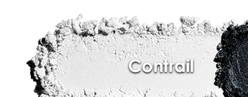

Use: Brow bone highlight and inner corner brightener. Base for dramatic contrast looks. Transition shade above the crease. Clean canvas for layering lighter shades.

##### 色号 11：凝霜白哑 (Contrail) —— 白色，奶油哑光。
用途：用于眉骨提亮和眼头增亮；用作强对比妆的底色；用于眼窝上缘过渡；叠加浅色的干净底衬。

---

## Shade 12: Snirt 525CM — Creamy Matte Medium Grey
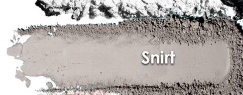

Use: Crease and transition for cool grey definition. All-over lid for a wearable everyday grey. Pairs with Cygnus for a monochromatic grey smoky eye.

##### 色号 12：中调灰哑 (Snirt) —— 中调灰色，奶油哑光。
用途：用于眼窝过渡打造冷灰轮廓；可全眼铺色做日常灰调妆；与 `Cygnus` 搭配可做同色调灰色烟熏妆。

---

## Shade 13: Névé 526SM — Sparkling Metallic Peony Pink
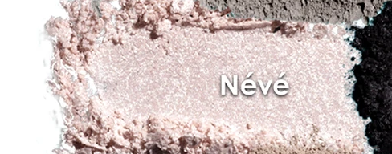

Use: All-over lid for a soft peony pink metallic sparkle. Inner corner highlight. Pairs with Snowbow for a dreamy pink eye. Damp brush for maximum sparkling metallic glow.

##### 色号 13：牡丹粉闪金属 (Névé) —— 牡丹粉色，闪光金属。
用途：可全眼铺色打造柔和牡丹粉金属闪光；用于眼头提亮；与 `Snowbow` 搭配可做梦幻粉色眼妆；湿刷获得最强闪光金属效果。

---

## Shade 14: Flurry 527CM — Creamy Matte Eggshell
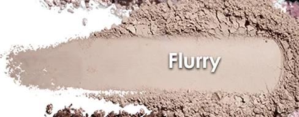

Use: Brow bone and inner corner highlight. Transition shade for blending edges. Base for lighter skin tones. Warm-white counterpart to the cooler Contrail.

##### 色号 14：蛋壳白哑 (Flurry) —— 蛋壳白，奶油哑光。
用途：用于眉骨和眼头提亮；用作晕染边缘的过渡；浅肤色可用作底色；比 `Contrail` 更暖调的白色。

---

## Shade 15: Skift 528SF — Sparkling Foiled Light Medium Champagne
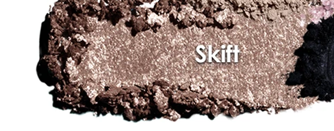

Use: Inner corner and center lid for a champagne sparkle. All-over lid for a wearable everyday shimmer. Damp brush for intense foiled finish. The most versatile shimmer in the palette.

##### 色号 15：香槟箔光 (Skift) —— 浅中调香槟色，箔光闪。
用途：用于眼头和眼皮中央打造香槟箔光；可全眼铺色做日常百搭闪光妆；湿刷获得最强箔光效果；盘内最百搭的闪色。
