# Natasha Denona 15色 丛林大地盘 Yucca Eyeshadow Palette

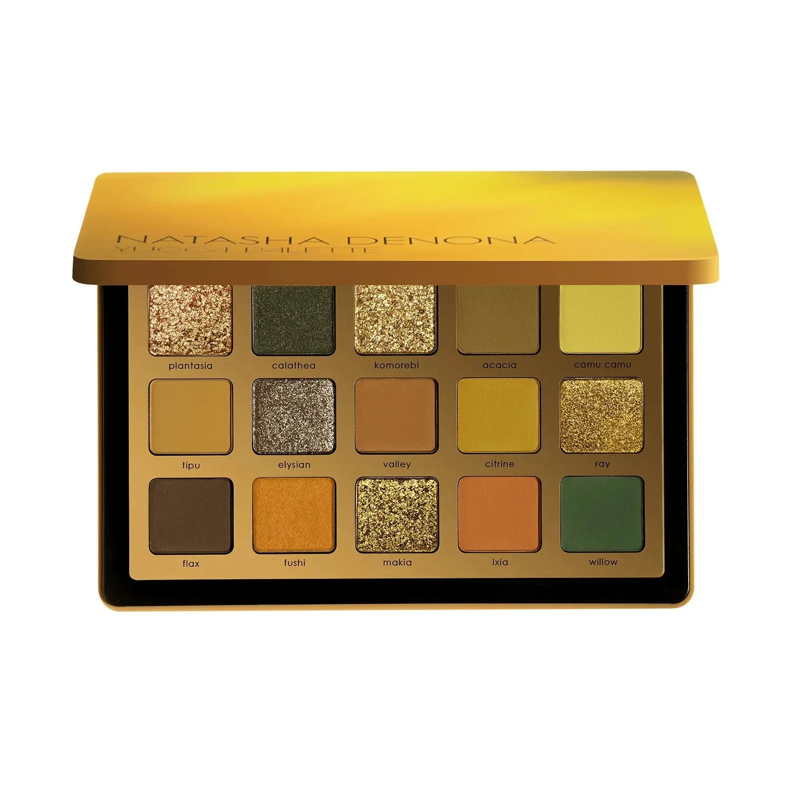

大地绿金系列，以热带植物命名，收录橄榄绿、芥末黄、苔藓绿、焦糖棕与鲜艳柠黄，质地涵盖奶油哑光、奶粉哑光、箔光闪和金属感，共15色。从柔和大地色到大胆显眼的植物色调，适合打造自然日妆、烟熏绿眸或节日夸张妆效。

€77.44 · 17.40g / 0.61 oz · 产地意大利

**认证：** 无对羟基苯甲酸酯 · 无动物测试

---

## 质地说明

| 代码 | 质地 | 特点 |
|------|------|------|
| CM | Creamy Matte 奶油哑光 | 品牌经典配方，柔滑压粉哑光，发色饱满 |
| CP | Cream Powder 奶粉哑光 | 轻盈奶粉质地，柔焦自然 |
| M | Metallic 金属感 | 细磨珍珠粉 + 色彩晶体，无缝高光泽 |
| SF | Sparkling Foiled 箔光闪 | 高折射箔光，纯粹色彩强度 |

**哑光上色建议：** 用紧密刷头按压上色，再用蓬松刷晕染。
**金属/箔光上色建议：** 用湿刷或指腹涂抹，获得最强光泽。

---

## 手臂试色

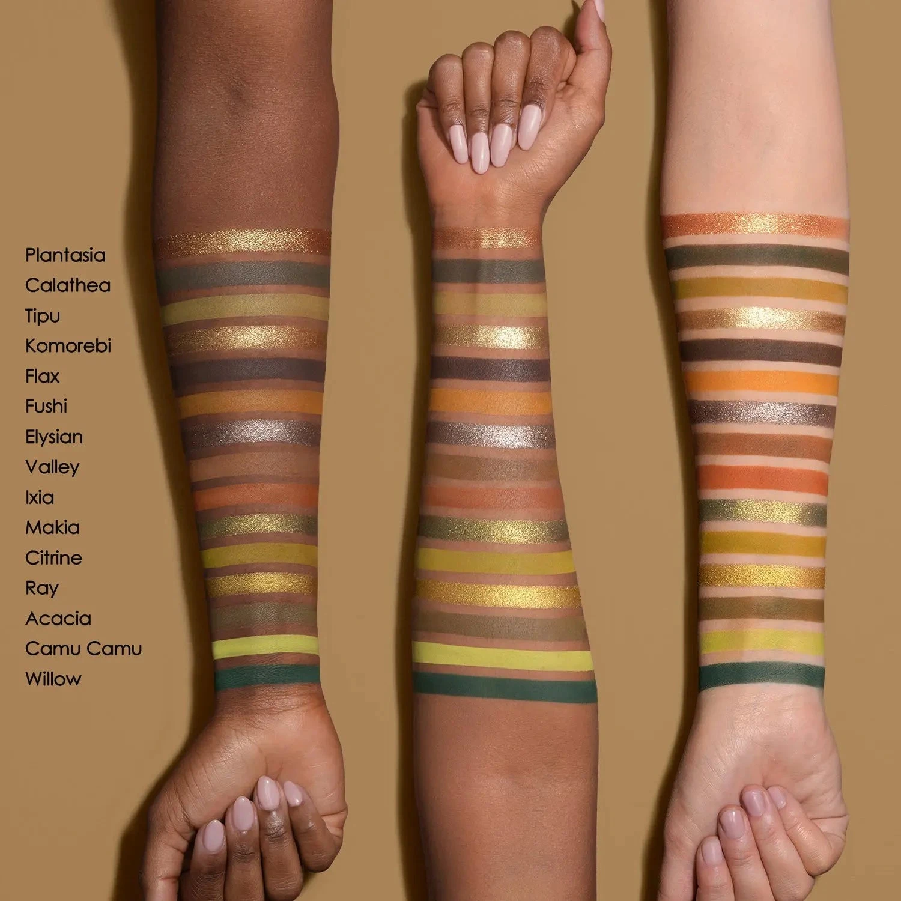

---

## 色号总览

| # | 色名 | 代码 | 质地 | 颜色描述 |
|---|------|------|------|----------|
| 1 | Plantasia | 478SF | Sparkling Foiled | 绿铜玫瑰木双色箔光 |
| 2 | Calathea | 479CP | Cream Powder | 中深橄榄绿，奶粉哑光 |
| 3 | Komorebi | 480SF | Sparkling Foiled | 芥末金色，箔光闪 |
| 4 | Acacia | 481CM | Creamy Matte | 金橄榄色，奶油哑光 |
| 5 | Camu Camu | 482CM | Creamy Matte | 鲜嫩柠绿，奶油哑光 |
| 6 | Tipu | 483CM | Creamy Matte | 尘芥末绿，奶油哑光 |
| 7 | Elysian | 484SF | Sparkling Foiled | 中调灰棕，箔光闪 |
| 8 | Valley | 485CM | Creamy Matte | 尘芥末棕，奶油哑光 |
| 9 | Citrine | 486CM | Creamy Matte | 中调芥末柠黄，奶油哑光 |
| 10 | Ray | 487M | Metallic | 绿金色，金属感 |
| 11 | Flax | 488CM | Creamy Matte | 深棕色，奶油哑光 |
| 12 | Fushi | 489CP | Cream Powder | 浅中调芥末黄，奶粉哑光 |
| 13 | Makia | 490SF | Sparkling Foiled | 中调金橄榄，箔光闪 |
| 14 | Ixia | 491CM | Creamy Matte | 焦糖棕红，奶油哑光 |
| 15 | Willow | 492CM | Creamy Matte | 中深鸭翠绿，奶油哑光 |

---

## Shade 1: Plantasia 478SF — Sparkling Foiled Green Bronze Rosewood Duo Chrome
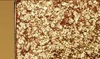

Use: All-over lid for a dazzling duo chrome sparkle. Apply damp for maximum foiled intensity. Inner corner for a warm bronze pop. Pairs with Calathea for a green-bronze contrast eye.

##### 色号 1：绿铜玫木变幻 (Plantasia) —— 绿铜玫瑰木双色箔光。
用途：可全眼铺色展现炫目双色变幻箔光；湿刷获得最强发色；用于眼头打造暖铜亮点；与 `Calathea` 搭配可做绿铜对比眼妆。

---

## Shade 2: Calathea 479CP — Cream Powder Medium Dark Olive Green
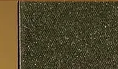

Use: Outer corner and crease for deep olive green definition. All-over lid for medium skin tones. Pairs with Willow for a cool green smoky eye. Deep earthy green anchor.

##### 色号 2：深橄榄绿哑 (Calathea) —— 中深橄榄绿，奶粉哑光。
用途：用于眼尾和眼窝打造深邃橄榄绿轮廓；中肤色可全眼铺色；与 `Willow` 搭配可做冷调绿色烟熏；深沉大地绿定型色。

---

## Shade 3: Komorebi 480SF — Sparkling Foiled Mustard Gold
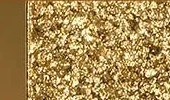

Use: All-over lid for a vibrant gold sparkle. Center lid highlight over any matte. Apply damp for intense foiled finish. Pairs with Flax in the crease for a warm gold look.

##### 色号 3：芥末金箔 (Komorebi) —— 芥末金色，箔光闪。
用途：可全眼铺色打造鲜亮金色箔光；叠于任意哑光底色点亮眼皮中央；湿刷获得最强箔光发色；与 `Flax` 搭配可做暖调金色眼妆。

---

## Shade 4: Acacia 481CM — Creamy Matte Golden Olive
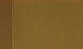

Use: All-over lid base for warm skin tones. Transition shade for the crease. Pairs with Komorebi on the lid for a layered gold-olive look.

##### 色号 4：金橄榄哑 (Acacia) —— 金橄榄色，奶油哑光。
用途：暖肤色可全眼铺底；用于眼窝过渡晕染；与 `Komorebi` 搭配可做叠层金橄榄眼妆。

---

## Shade 5: Camu Camu 482CM — Creamy Matte Vibrant Lime

Use: Bold graphic liner or lid pop for artistic looks. Brow bone for a statement bright accent. Pairs with Willow or Calathea for a vivid green contrast. Use sparingly for editorial impact.

##### 色号 5：鲜嫩柠绿哑 (Camu Camu) —— 鲜嫩柠绿，奶油哑光。
用途：用于大胆图形眼线或眼皮点缀做艺术妆；用于眉骨作鲜亮宣言；与 `Willow` 或 `Calathea` 搭配可做鲜艳绿色对比妆；少量使用即可打造编辑级夸张效果。

---

## Shade 6: Tipu 483CM — Creamy Matte Dusty Mustard Green

Use: All-over lid for a muted warm green base. Crease transition for earthy depth. Pairs with Flax in the outer corner for a warm tonal look.

##### 色号 6：尘芥末绿哑 (Tipu) —— 尘芥末绿，奶油哑光。
用途：可全眼铺色打造柔和暖绿底色；用于眼窝过渡打造大地深度；与 `Flax` 搭配可做暖调同色系眼妆。

---

## Shade 7: Elysian 484SF — Sparkling Foiled Medium Taupe
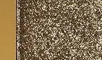

Use: All-over lid for a neutral taupe sparkle. Inner corner highlight. Pairs with Valley or Flax in the crease for a warm everyday eye. Versatile everyday shimmer.

##### 色号 7：中性棕箔 (Elysian) —— 中调灰棕，箔光闪。
用途：可全眼铺色打造中性棕箔光；用于眼头提亮；与 `Valley` 或 `Flax` 搭配可做日常暖调眼妆；百搭日常箔光色。

---

## Shade 8: Valley 485CM — Creamy Matte Dusty Mustard Brown
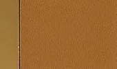

Use: Crease and outer corner for warm earthy definition. Transition shade between deep and light shades. All-over lid for deeper skin tones. Classic warm neutral.

##### 色号 8：尘芥末棕哑 (Valley) —— 尘芥末棕，奶油哑光。
用途：用于眼窝和眼尾打造暖调大地轮廓；用作深色与浅色之间的过渡；深肤色可全眼铺色；经典暖中性色。

---

## Shade 9: Citrine 486CM — Creamy Matte Medium Mustard Citrine
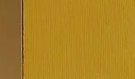

Use: Bold all-over lid for a vivid mustard statement. Pairs with Flax in the crease for depth. Editorial crease accent on lighter skin. Bright warm highlight for artistic looks.

##### 色号 9：芥末柠黄哑 (Citrine) —— 中调芥末柠黄，奶油哑光。
用途：可全眼铺色打造鲜亮芥末宣言妆；与 `Flax` 搭配可做有深度的眼妆；浅肤色可用于眼窝做艺术感点缀；明亮暖调提亮色。

---

## Shade 10: Ray 487M — Metallic Green Gold
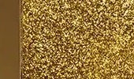

Use: All-over lid for a radiant green-gold metallic. Center lid pop over mattes. Damp brush for maximum metallic glow. Pairs with Calathea for a green-gold eye.

##### 色号 10：绿金金属 (Ray) —— 绿金色，金属感。
用途：可全眼铺色打造亮泽绿金金属感；叠于哑光底色点亮眼皮中央；湿刷获得最强金属光泽；与 `Calathea` 搭配可做绿金眼妆。

---

## Shade 11: Flax 488CM — Creamy Matte Dark Brown

Use: Outer corner and deep crease for dark definition. Liner effect along lash lines. Grounding anchor shade for blending depth. Pairs with any shimmer for a classic smoky look.

##### 色号 11：深棕哑光 (Flax) —— 深棕色，奶油哑光。
用途：用于眼尾和深眼窝加深轮廓；沿睫毛根部可做眼线效果；全盘深色定型锚点；与任意闪色搭配可做经典烟熏妆。

---

## Shade 12: Fushi 489CP — Cream Powder Light Medium Mustard Yellow
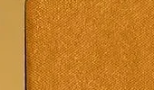

Use: Inner corner and brow bone for a warm yellow highlight. All-over lid for a playful sunny look. Transition shade for lighter skin tones. Pairs with Ray for a gold-green eye.

##### 色号 12：芥末黄奶粉 (Fushi) —— 浅中调芥末黄，奶粉哑光。
用途：用于眼头和眉骨打造暖黄提亮；可全眼铺色做俏皮阳光妆；浅肤色可用作过渡；与 `Ray` 搭配可做金绿眼妆。

---

## Shade 13: Makia 490SF — Sparkling Foiled Medium Golden Olive
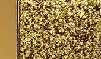

Use: All-over lid for a rich golden olive sparkle. Center lid highlight over green mattes. Damp brush for maximum foiled payoff. The warmest sparkle in the palette.

##### 色号 13：金橄榄箔光 (Makia) —— 中调金橄榄，箔光闪。
用途：可全眼铺色打造浓郁金橄榄箔光；叠于绿色哑光底色点亮中央；湿刷获得最强箔光发色；盘内最暖调箔光色。

---

## Shade 14: Ixia 491CM — Creamy Matte Burnt Caramel
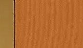

Use: Outer corner and crease for warm burnt caramel depth. Pairs with Flax for a dark earthy eye. Lower lash line for warm definition. Adds warmth and contrast against the greens.

##### 色号 14：焦糖棕红哑 (Ixia) —— 焦糖棕红，奶油哑光。
用途：用于眼尾和眼窝打造暖调焦糖棕深度；与 `Flax` 搭配可做深邃大地眼妆；用于下眼睑增添暖调轮廓；在绿色调中增添暖意和对比。

---

## Shade 15: Willow 492CM — Creamy Matte Medium Dark Teal Green
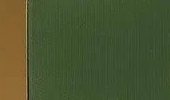

Use: Outer corner for deep teal drama. Liner effect for a graphic teal eye. Pairs with Calathea for a layered green smoky look. Bold statement shade.

##### 色号 15：鸭翠绿哑 (Willow) —— 中深鸭翠绿，奶油哑光。
用途：集中于眼尾打造深邃鸭翠绿戏剧感；可做图形眼线打造鲜明绿眼；与 `Calathea` 搭配可做叠层绿色烟熏妆；大胆宣言色。
