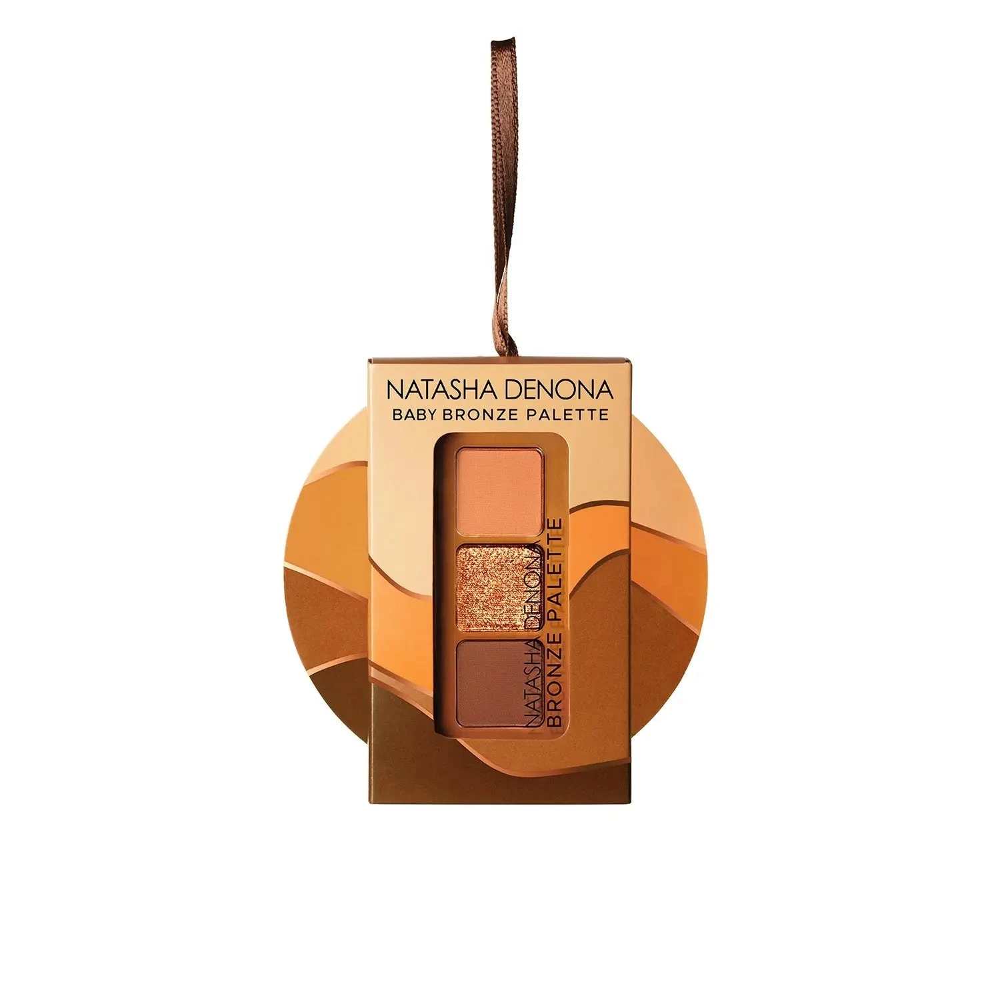
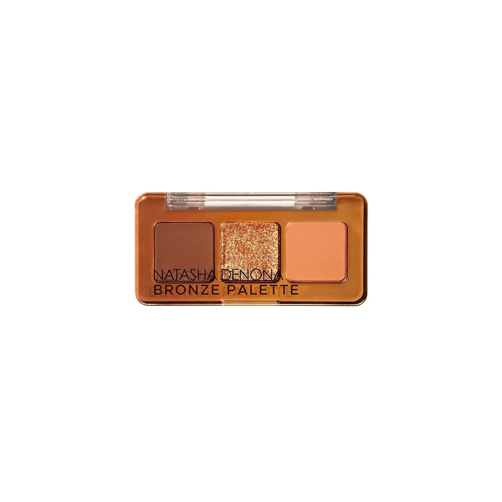
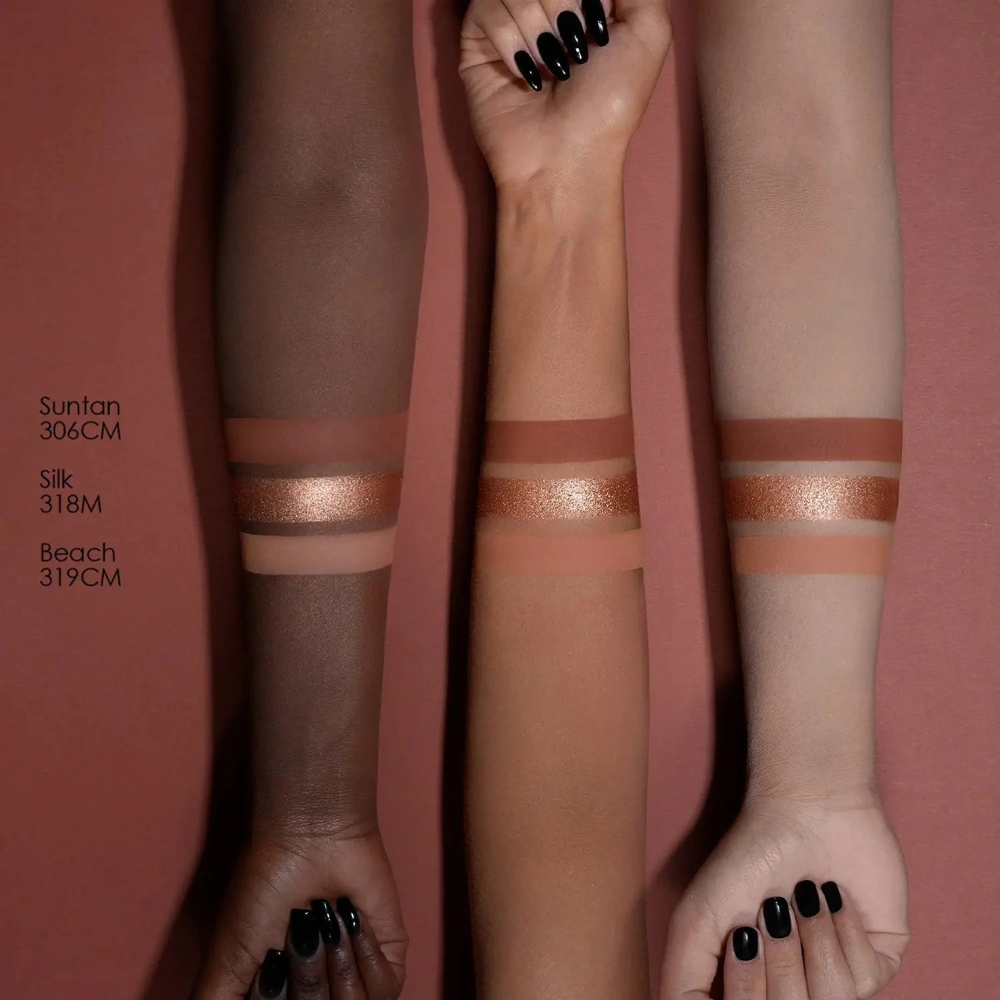
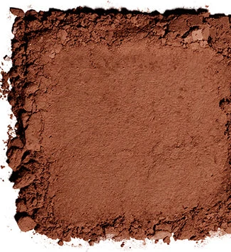
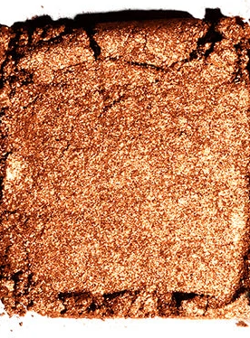
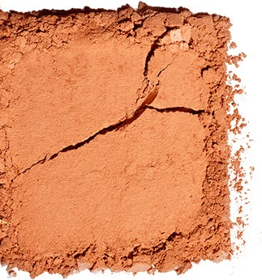

# Natasha Denona 3色 Baby 古铜盘 Baby Bronze Eyeshadow Palette

经典 Bronze 15色盘的节日迷你礼盒版，精选三个标志性铜调色号：暖裸哑光 Beach、浓郁暖金香槟金属 Silk 与中调暖棕哑光 Suntan，封入青铜便携小盘，嵌入可作圣诞挂饰的礼品盒中，单颗 0.8g，一盘完成从日常到节日铜光眼妆。

€18.15 · 单颗 0.8g × 3色 · 产地意大利 · 限量版 · 无对羟基苯甲酸酯 · 无矿物油 · 无动物测试

---

## 开盘图

---

## 质地说明

| 代码 | 质地 | 特点 |
|------|------|------|
| CM | Creamy Matte 奶油哑光 | 品牌经典配方，柔滑压粉哑光，发色饱满 |
| M | Metallic 金属感 | 细磨珍珠粉 + 色彩晶体，无缝高光泽 |

**哑光上色建议：** 用紧密刷头按压上色，再用蓬松刷晕染。
**金属上色建议：** 用湿刷或指腹涂抹，获得最强金属感与光泽；湿刷可达到箔金效果。

---

## 手臂试色

---

## 色号总览

| # | 色名 | 代码 | 质地 | 颜色描述 |
|---|------|------|------|----------|
| 1 | Suntan | 306CM | Creamy Matte | 中调暖棕哑光 |
| 2 | Silk | 318M | Metallic | 浓郁暖金香槟金属 |
| 3 | Beach | 319CM | Creamy Matte | 暖裸米橙哑光 |

---

## Shade 1: Suntan 306CM — Creamy Matte Warm Medium Brown

Use: Outer corner and crease for a warm bronze depth. All-over lid for a rich warm brown matte base. Pairs with Silk for a classic metallic-and-matte combo. The palette's defining shade — anchors the bronze look with depth.

##### 色号 1：中调暖棕哑光 (Suntan) —— 中调暖棕，奶油哑光。
用途：用于眼尾和眼窝打造暖棕深度；可全眼铺色做浓郁暖棕哑光底妆；与 `Silk` 搭配做经典铜金遇哑光组合；盘内定型锚点色，负责轮廓塑形。

---

## Shade 2: Silk 318M — Metallic Foiled Rich Warm Champagne Gold

Use: All-over lid for an intense warm champagne-gold metallic look. Center lid highlight for maximum foiled intensity. Apply damp or with fingertip for a foiled metallic finish. The palette's star shade — pairs with Suntan at the outer corner and Beach on brow bone.

##### 色号 2：浓郁暖金香槟金属 (Silk) —— 浓郁暖香槟金，金属感。
用途：可全眼铺色打造强烈暖金香槟金属宣言妆；叠加于眼皮中央做箔金高光提亮；湿刷获得最强金属箔感发色；盘内主角色，搭配眼尾 `Suntan` 和眉骨 `Beach` 构成完整铜调眼妆。

---

## Shade 3: Beach 319CM — Creamy Matte Warm Nude Peach

Use: All-over lid as a warm nude-peach base. Inner corner and brow bone highlight. Blending and transitioning to soften the edges of Silk and Suntan. The palette's most versatile neutral — creates a warm sun-kissed daytime look when applied solo.

##### 色号 3：暖裸米橙哑光 (Beach) —— 暖裸米橙色，奶油哑光。
用途：可全眼铺色做暖裸橙米底妆；用于眼头和眉骨提亮；用于晕染 `Silk` 与 `Suntan` 的边缘做柔和过渡；盘内最百搭中性色，单独使用可打造柔和暖调日常眼妆。
