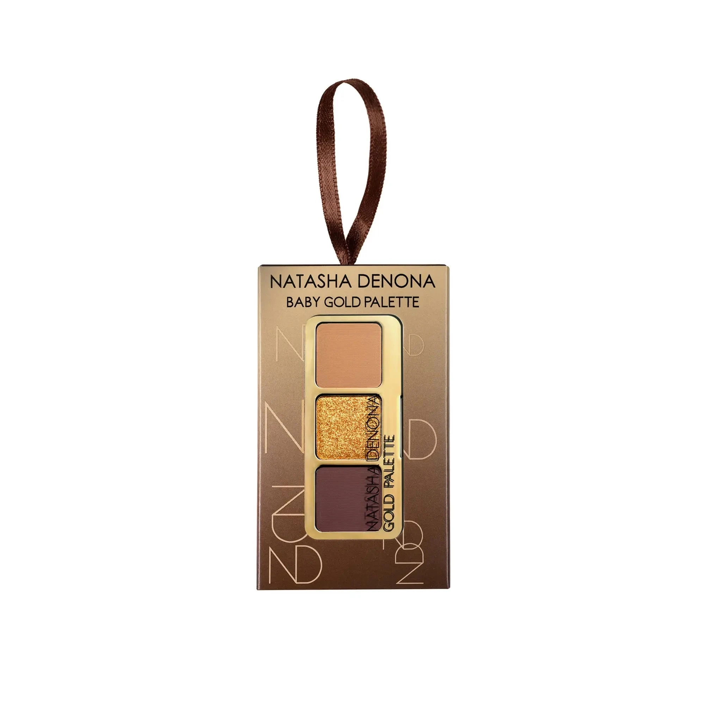
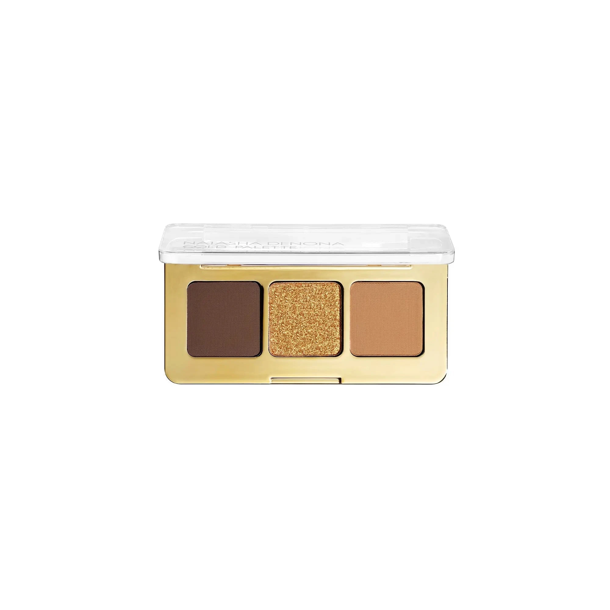
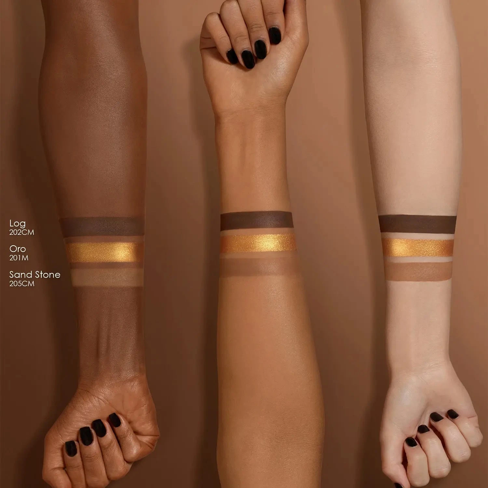
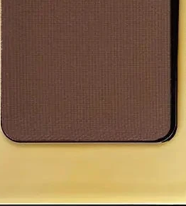
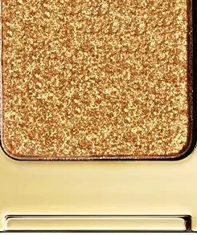
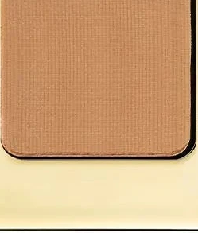

# Natasha Denona 3色 Baby 黄金盘 Baby Gold Eyeshadow Palette

经典 Golden 15色盘的节日迷你礼盒版，精选三个标志性金调色号：冷黄米哑光 Sandstone、浓郁暖金金属 Oro 与深暖棕哑光 Log，封入金色便携小盘，嵌入可作圣诞挂饰的礼品盒中，单颗 0.8g，一盘完成从日常到节日闪耀的完整金棕眼妆。

€18.15 · 单颗 0.8g × 3色 · 产地意大利 · 限量版 · 无对羟基苯甲酸酯 · 无矿物油 · 无动物测试

---

## 开盘图

---

## 质地说明

| 代码 | 质地 | 特点 |
|------|------|------|
| CM | Creamy Matte 奶油哑光 | 品牌经典配方，柔滑压粉哑光，发色饱满 |
| M | Metallic 金属感 | 细磨珍珠粉 + 色彩晶体，无缝高光泽 |

**哑光上色建议：** 用紧密刷头按压上色，再用蓬松刷晕染。
**金属上色建议：** 用湿刷或指腹涂抹，获得最强金属感与光泽。

---

## 手臂试色

---

## 色号总览

| # | 色名 | 代码 | 质地 | 颜色描述 |
|---|------|------|------|----------|
| 1 | Log | 202CM | Creamy Matte | 深暖棕哑光 |
| 2 | Oro | 201M | Metallic | 浓郁暖金金属 |
| 3 | Sandstone | 205CM | Creamy Matte | 冷黄米哑光 |

---

## Shade 1: Log 202CM — Creamy Matte Deep Warm Brown

Use: Outer corner and crease for defining depth. All-over lid for a rich warm brown base. Pairs with Oro for a classic metallic-and-matte combo. The palette's darkest shade — sculpts and anchors the gold look.

##### 色号 1：深暖棕哑光 (Log) —— 深暖棕，奶油哑光。
用途：用于眼尾和眼窝打造深沉暖棕定型；可全眼铺色做浓郁暖棕底妆；与 `Oro` 搭配做经典金属遇哑光组合；盘内最深色号，负责塑形和轮廓锚定。

---

## Shade 2: Oro 201M — Metallic Rich Warm Gold

Use: All-over lid for an intense warm gold metallic statement. Center lid highlight for a sun-kissed glow. Apply damp for maximum metallic intensity and foiled payoff. The palette's star shade — pairs with Log at the outer corner and Sandstone on the brow bone.

##### 色号 2：浓郁暖金金属 (Oro) —— 浓郁暖金，金属感。
用途：可全眼铺色打造强烈暖金金属宣言妆；叠加于眼皮中央做阳光感高光提亮；湿刷获得最强金属箔感发色；盘内主角色，搭配眼尾 `Log` 和眉骨 `Sandstone` 构成完整黄金眼妆。

---

## Shade 3: Sandstone 205CM — Creamy Matte Cool Yellow Beige

Use: All-over lid as a neutral warm-beige base. Inner corner and brow bone highlight. Blending and transitioning to soften edges of Oro and Log. The palette's most versatile neutral — creates a softer daytime gold look when applied solo.

##### 色号 3：冷黄米哑光 (Sandstone) —— 冷黄米色，奶油哑光。
用途：可全眼铺色做中性暖米哑光底妆；用于眼头和眉骨提亮；用于晕染 `Oro` 与 `Log` 的边缘做柔和过渡；盘内最百搭中性色，单独使用可打造柔和日常金调眼妆。
