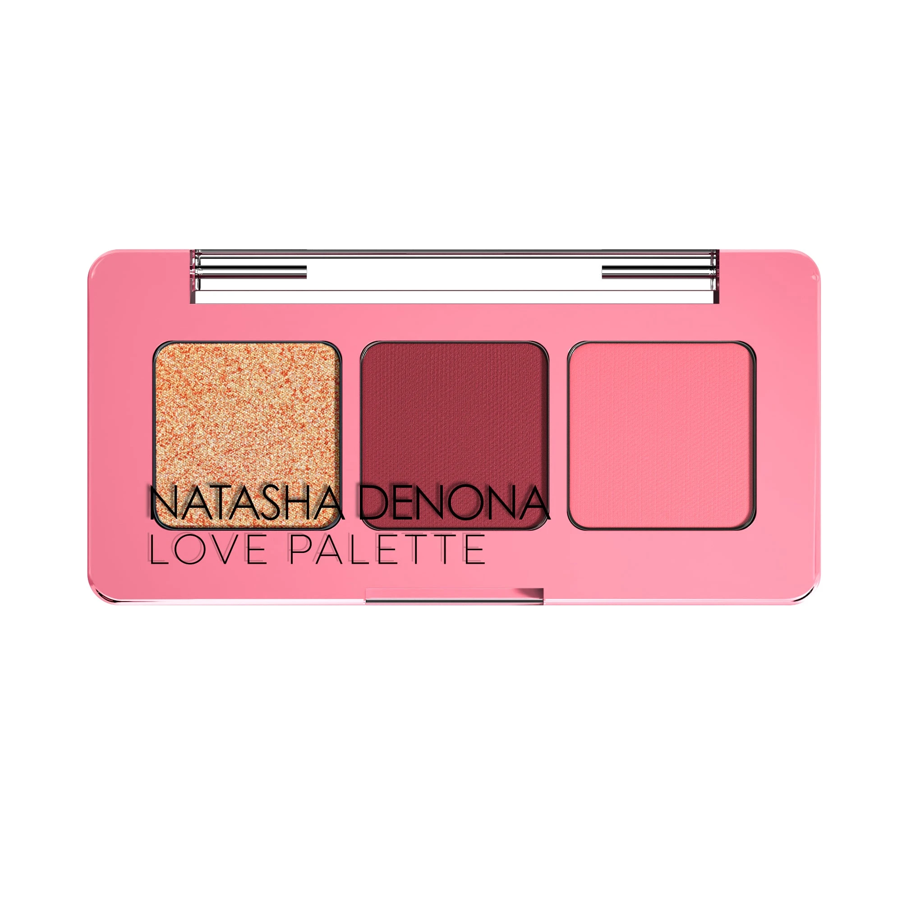
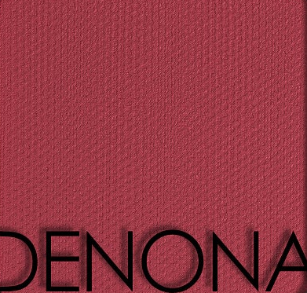

# Natasha Denona 3色 Baby 爱意盘 Baby Love Eyeshadow Palette

经典 Love Face Palette 的节日迷你版，精选三个标志性玫粉色号：暖珊瑚铜闪光 Affinity、深莓玫红哑光 Aiko 与柔嫩粉哑光 Juliette，封入玫粉便携小盘，单颗 0.8g，一盘打造从柔和日常到浓郁节日玫粉眼妆。

€18.15 · 单颗 0.8g × 3色 · 产地意大利 · 限量版 · 无对羟基苯甲酸酯 · 无矿物油

---

## 质地说明

| 代码 | 质地 | 特点 |
|------|------|------|
| SF | Sparkling Foiled 闪光箔感 | 多维闪光粒子 + 暖铜底，压实可呈箔感光泽 |
| CM | Creamy Matte 奶油哑光 | 品牌经典配方，柔滑压粉哑光，发色饱满 |

**闪光箔感上色建议：** 用指腹或湿刷压色，最大化闪光粒子密度与箔感。
**哑光上色建议：** 用紧密刷头按压上色，再用蓬松刷晕染。

---

## 色号总览

| # | 色名 | 代码 | 质地 | 颜色描述 |
|---|------|------|------|----------|
| 1 | Affinity | 476SF | Sparkling Foiled | 暖珊瑚铜多维闪光 |
| 2 | Aiko | 475CM | Creamy Matte | 深莓玫红哑光 |
| 3 | Juliette | 474CM | Creamy Matte | 柔嫩玫粉哑光 |

---

## Shade 1: Affinity 476SF — Sparkling Foiled Warm Copper Rose

Use: All-over lid for a warm copper-rose sparkling statement. Center lid for a multidimensional shimmer highlight. Apply with fingertip or damp brush for maximum foiled metallic intensity. The palette's statement shade — pairs with Aiko for a bold metallic-meets-matte contrast.

##### 色号 1：暖珊瑚铜闪光 (Affinity) —— 暖珊瑚铜，多维闪光箔感。
用途：可全眼铺色打造暖珊瑚铜多维闪光宣言妆；叠加于眼皮中央做多维闪光提亮；用指腹或湿刷压色获得最强箔感发色；盘内主角色，与 `Aiko` 搭配做金属遇哑光对比妆容。

---

## Shade 2: Aiko 475CM — Creamy Matte Deep Berry Rose

Use: Outer corner and crease for a deep berry-plum depth. All-over lid for a bold rose-wine statement look. Pairs with Affinity at the center lid for a dramatic contrast. The palette's deepest shade — defines and sculpts the eye.

##### 色号 2：深莓玫红哑光 (Aiko) —— 深莓玫红，奶油哑光。
用途：用于眼尾和眼窝打造深沉莓玫红深度；可全眼铺色做大胆玫瑰酒红宣言妆；与中央 `Affinity` 搭配打造戏剧性对比；盘内最深色号，负责眼型塑形定型。

---

## Shade 3: Juliette 474CM — Creamy Matte Soft Baby Pink

Use: All-over lid as a soft baby pink matte base. Inner corner and brow bone highlight. Blending and transitioning to soften edges of Aiko and Affinity. The palette's most wearable shade — creates a fresh, feminine daytime pink look when applied solo.

##### 色号 3：柔嫩玫粉哑光 (Juliette) —— 柔嫩玫粉，奶油哑光。
用途：可全眼铺色做柔嫩玫粉哑光底妆；用于眼头和眉骨提亮；用于晕染 `Aiko` 与 `Affinity` 的边缘做柔和过渡；盘内最百搭裸感色，单独使用可打造清新女性化日常粉调眼妆。
