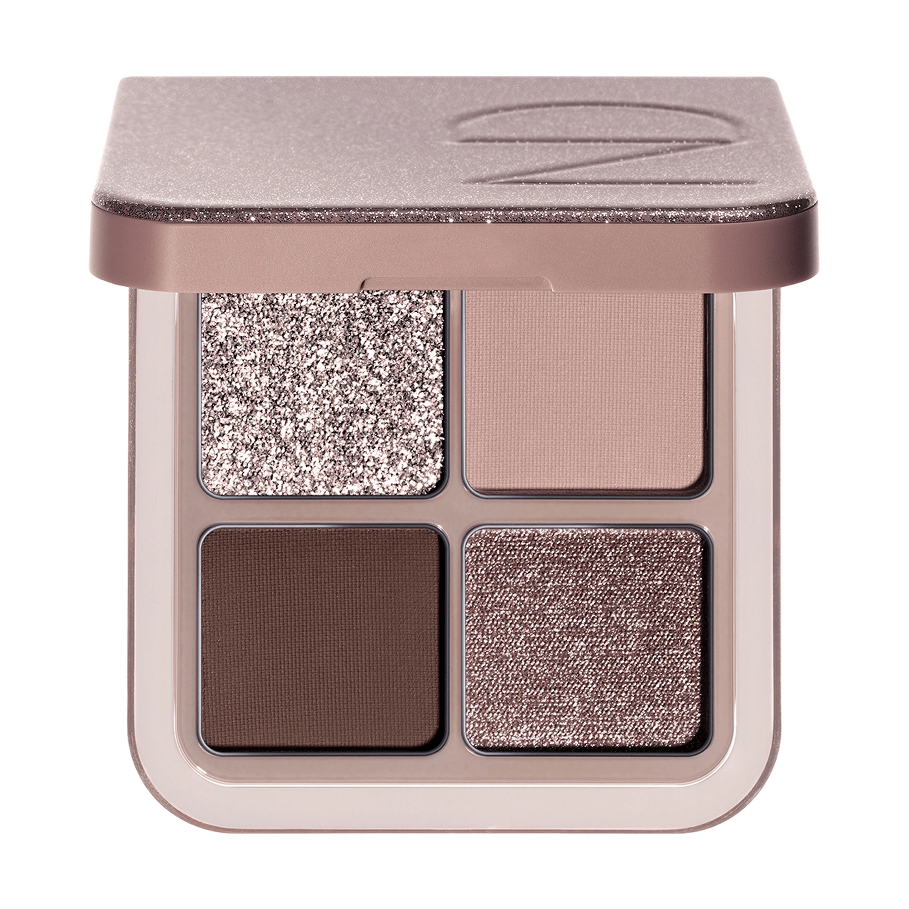
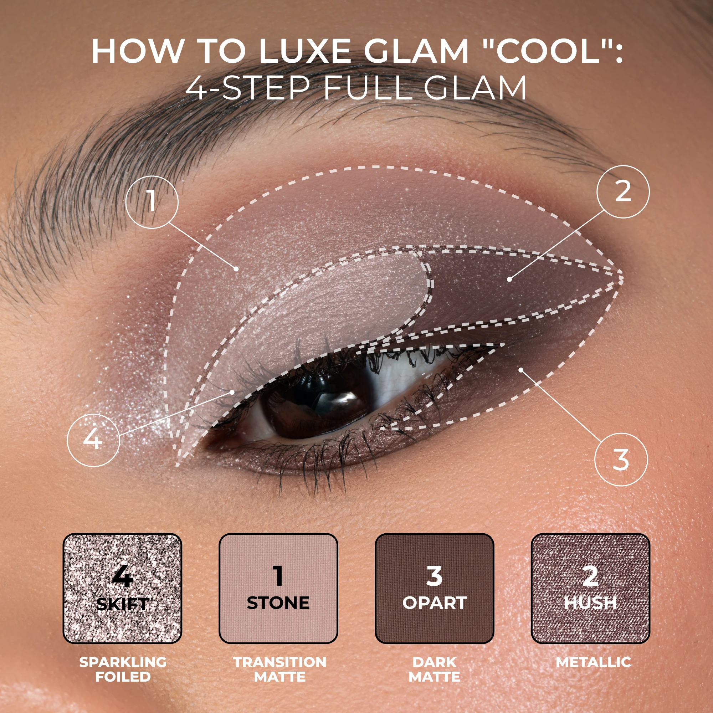
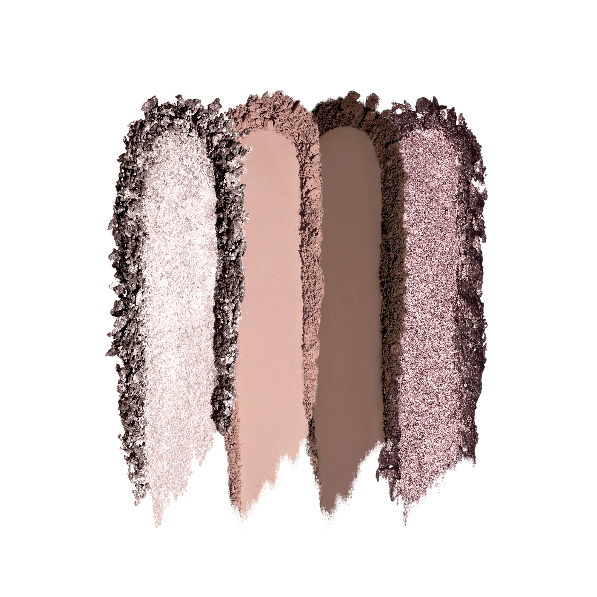
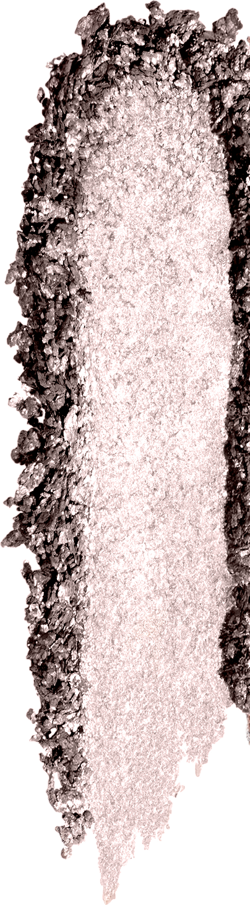
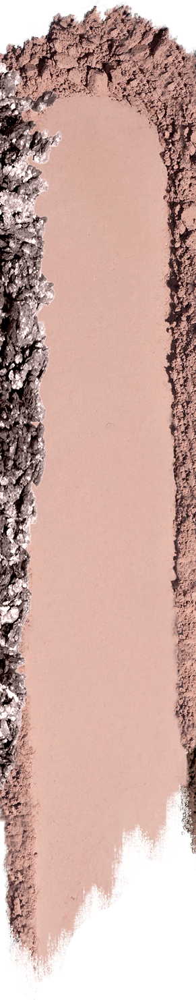
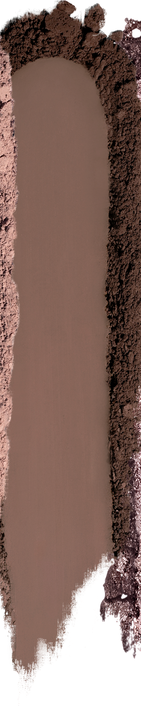
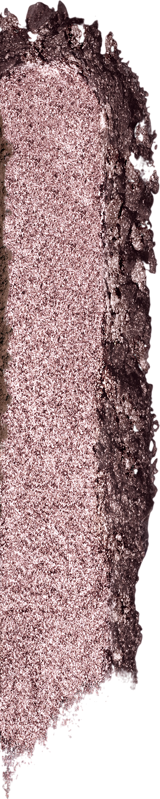

# Natasha Denona 4色 Luxe Glam Compact 冷调盘 Cool

Natasha 奢华四色眼影盘冷调版，以"大专业色盘"规格封装四个冷调核心色：冰银灰闪光箔感 Skift、冷调浅裸粉哑光 Stone、中深冷棕灰哑光 Opart、暖玫瑰棕金属感 Hush，配方涵盖哑光、金属与闪光箔感三种质地，打造从日常到浓郁魅妆的冷调完整眼妆。

€53.24 · 净重 7.8g · 4色 · 产地意大利 · 无对羟基苯甲酸酯 · 无矿物油

---

## 四步教程

---

## 质地说明

| 代码 | 质地 | 特点 |
|------|------|------|
| SF | Sparkling Foiled 闪光箔感 | 纯色高箔感光泽，多维闪光粒子，压实可呈箔金效果 |
| CM | Creamy Matte 奶油哑光 | 顺滑压粉，高强度发色，哑光饱满无缝晕染 |
| M | Metallic 金属感 | 纯色高箔感光泽，细腻无缝金属光泽 |

**闪光箔感/金属感上色建议：** 用指腹或湿刷压色，最大化箔感与金属光泽。
**哑光上色建议：** 用紧密刷头按压上色，再用蓬松刷晕染。

---

## 色板

---

## 色号总览

| # | 色名 | 代码 | 质地 | 颜色描述 |
|---|------|------|------|----------|
| 1 | Skift | SF | Sparkling Foiled | 冰银灰闪光箔感 |
| 2 | Stone | CM | Creamy Matte | 冷调浅裸粉奶油哑光 |
| 3 | Opart | CM | Creamy Matte | 中深冷棕灰奶油哑光 |
| 4 | Hush | M | Metallic | 暖玫瑰棕金属感 |

---

## Shade 1: Skift SF — Sparkling Foiled Icy Silver Charcoal

Use: Inner corner and center lid for an icy silver sparkling highlight. All-over lid for a dramatic glittery silver statement. Lower lash line for a shimmery cool liner effect. Apply with fingertip for maximum foiled intensity. The palette's showstopper — the icy silver contrasts dramatically with Opart at the outer corner.

##### 色号 1：冰银灰闪光箔感 (Skift) —— 冰银灰，闪光箔感，四周炭灰碎粉镶边。
用途：用于眼头和眼皮中央打造冰冷银色闪光提亮；可全眼铺色做夸张闪光银色宣言妆；用于下睫毛线做冷调闪光眼线效果；指腹压色获得最强箔感；与眼尾 `Opart` 形成冰银遇深棕戏剧性对比。

---

## Shade 2: Stone CM — Creamy Matte Light Cool Mauve

Use: All-over lid as a cool-toned nude matte base. Crease transition shade — seamlessly blends between Skift and Opart. Brow bone softer highlight. The palette's neutral connector — a light cool mauve that unifies the icy sparkle and dark taupe.

##### 色号 2：冷调浅裸粉奶油哑光 (Stone) —— 冷调浅裸粉，奶油哑光。
用途：可全眼铺色做冷调浅裸哑光底色；用于眼窝做 `Skift` 和 `Opart` 之间的无缝过渡；眉骨柔和提亮；盘内冷调中性联结色，统一闪光与深棕的妆感。

---

## Shade 3: Opart CM — Creamy Matte Medium-Deep Cool Taupe

Use: Outer corner and crease for cool taupe-brown depth. Lower lash line definition. All-over lid for a cool neutral smoky matte base. The palette's contour shade — defines and sculpts the eye with a deep cool brown-taupe.

##### 色号 3：中深冷棕灰奶油哑光 (Opart) —— 中深冷棕灰，奶油哑光。
用途：用于眼尾和眼窝打造冷调棕灰深度；用于下睫毛线定型；可全眼铺色做冷中性烟熏底妆；盘内轮廓定型色，以冷调深棕灰塑造眼型。

---

## Shade 4: Hush M — Metallic Warm Rose Brown

Use: All-over lid for a warm rose-brown metallic statement. Center lid for a rich metallic dimension. Apply damp or with fingertip for maximum metallic payoff. The palette's warm accent against the cool tones — adds a warm rose-brown glow that complements the cool palette's icy and taupe shades.

##### 色号 4：暖玫瑰棕金属感 (Hush) —— 暖玫瑰棕，金属感。
用途：可全眼铺色打造暖玫瑰棕金属宣言妆；叠加于眼皮中央做浓郁金属感提亮；湿刷或指腹压色获得最强金属光泽；冷调盘内的暖色亮点，玫瑰棕暖光与冰银和冷棕灰形成温冷对比。
