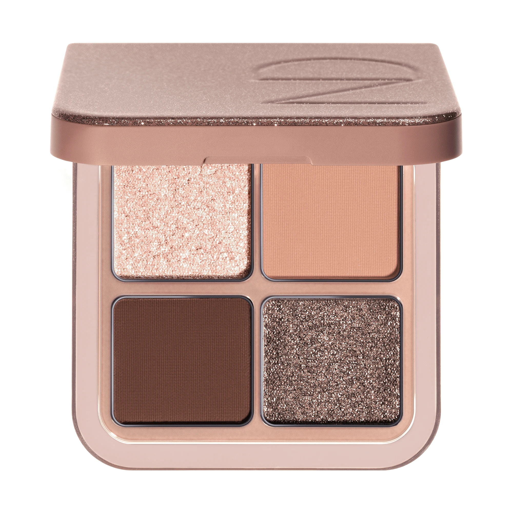
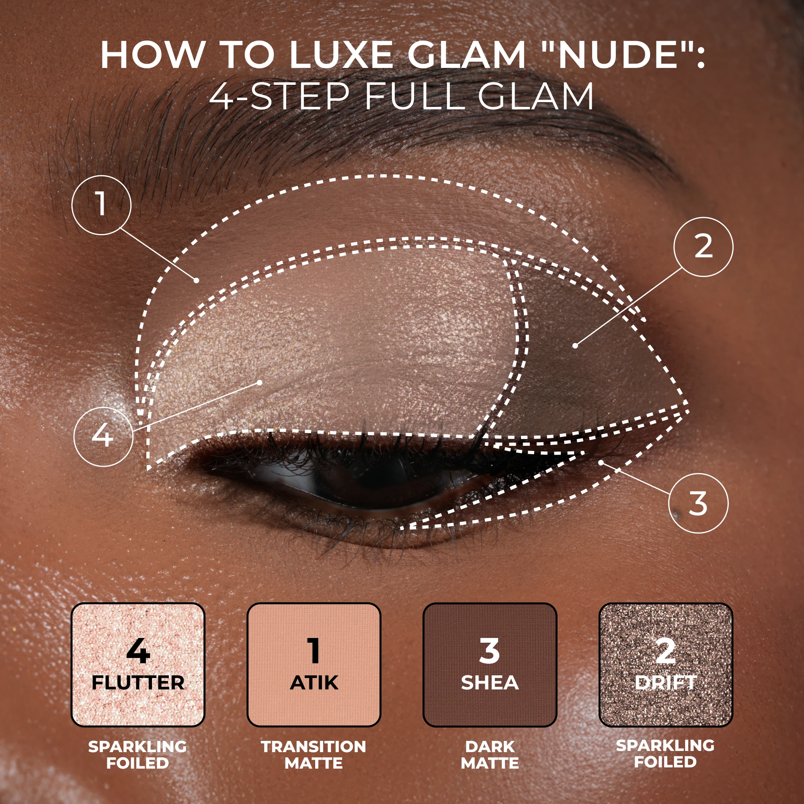
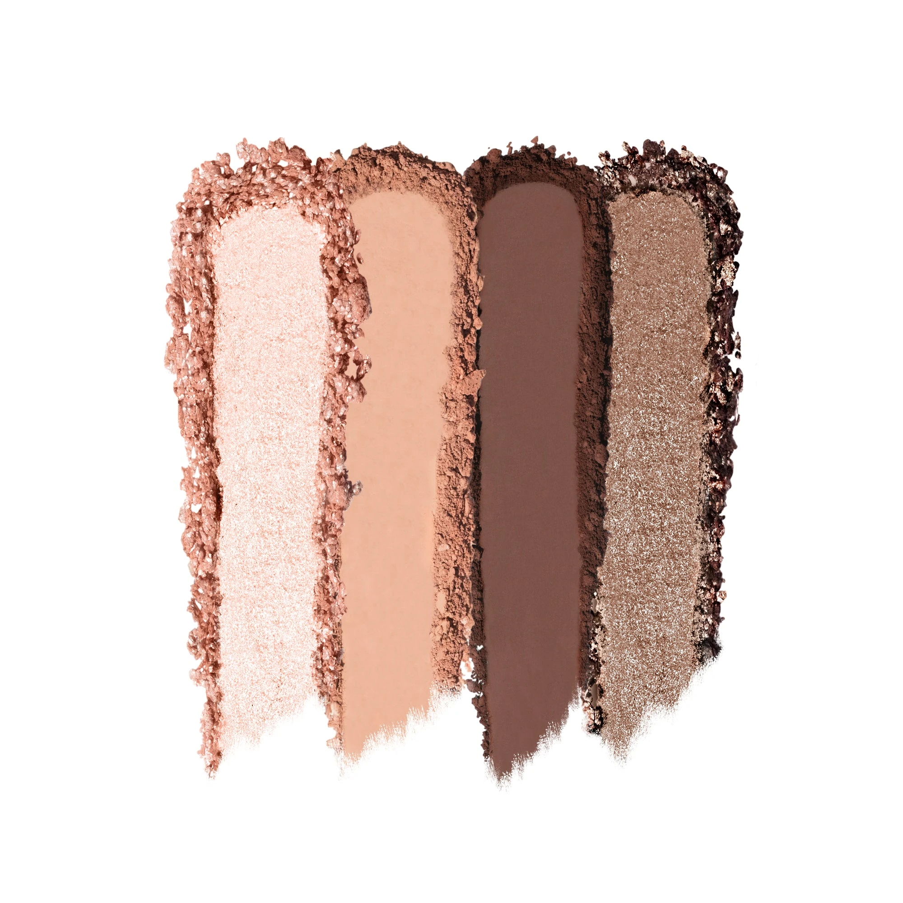
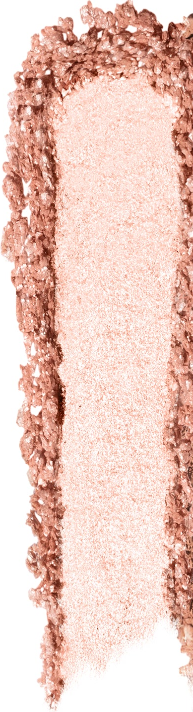
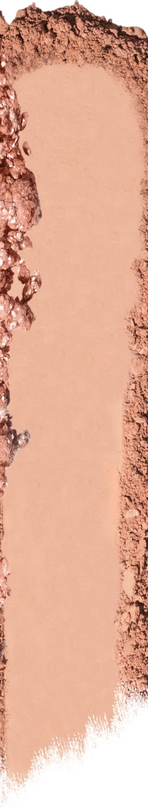
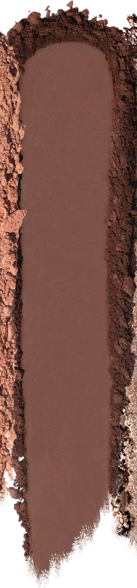
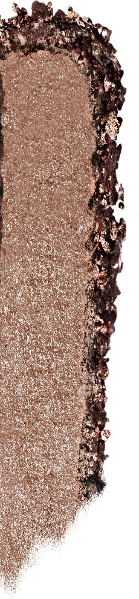

# Natasha Denona 4色 Luxe Glam Compact 裸调盘 Nude

Natasha 奢华四色眼影盘，以"大专业色盘"规格封装裸调核心四色：柔光香槟粉闪光箔感 Flutter、暖裸米肤哑光 Atik、深暖棕哑光 Shea、暖铜棕闪光箔感 Drift，配方涵盖哑光、金属与闪光箔感三种质地，日常与魅妆通用，可用刷头或指腹叠涂。

€53.24 · 净重 7.8g · 4色 · 产地意大利 · 无对羟基苯甲酸酯 · 无矿物油

---

## 四步教程

---

## 质地说明

| 代码 | 质地 | 特点 |
|------|------|------|
| SF | Sparkling Foiled 闪光箔感 | 纯色高箔感光泽，多维闪光粒子，压实可呈箔金效果 |
| CM | Creamy Matte 奶油哑光 | 顺滑压粉，高强度发色，哑光饱满无缝晕染 |

**闪光箔感上色建议：** 用指腹或湿刷压色，最大化闪光粒子密度与箔感。
**哑光上色建议：** 用紧密刷头按压上色，再用蓬松刷晕染。

---

## 色板

---

## 色号总览

| # | 色名 | 代码 | 质地 | 颜色描述 |
|---|------|------|------|----------|
| 1 | Flutter | 641SF | Sparkling Foiled | 柔光香槟粉闪光箔感 |
| 2 | Atik | 117CM | Creamy Matte | 暖裸米肤奶油哑光 |
| 3 | Shea | 183CM | Creamy Matte | 深暖棕奶油哑光 |
| 4 | Drift | 642SF | Sparkling Foiled | 暖铜棕闪光箔感 |

---

## Shade 1: Flutter 641SF — Sparkling Foiled Light Champagne Pink

Use: Inner corner and brow bone highlight for a sparkling champagne lift. All-over lid for a light glam base. Center lid over Atik to intensify the foiled dimension. Apply with fingertip or damp brush for maximum foiled payoff. The palette's brightening accent — pairs with Shea at outer corner for a classic glam contrast.

##### 色号 1：柔光香槟粉闪光箔感 (Flutter) —— 淡香槟粉，闪光箔感。
用途：用于眼头和眉骨叠涂打造闪光提亮；可全眼铺色做轻盈闪光底妆；叠加于 `Atik` 之上强化多维箔感；用指腹或湿刷压色获得最强箔感发色；与眼尾 `Shea` 搭配做经典魅光对比妆容。

---

## Shade 2: Atik 117CM — Creamy Matte Warm Nude Beige

Use: All-over lid as a soft warm nude matte base. Crease for a seamless transition. Blend under Flutter and over Shea to soften edges. The palette's neutral anchor — works as the foundational matte that harmonizes the two sparkle shades.

##### 色号 2：暖裸米肤奶油哑光 (Atik) —— 暖裸米肤，奶油哑光。
用途：可全眼铺色做柔和暖裸哑光底妆；用于眼窝做无缝过渡晕染；用于衔接 `Flutter` 和 `Shea`，柔化两端边界；盘内中性底色，统一两个闪光色号的妆感。

---

## Shade 3: Shea 183CM — Creamy Matte Deep Warm Brown

Use: Outer corner and crease for deep warm brown definition. Lower lash line for liner-like intensity. All-over lid for a bold warm smoky matte base. The palette's defining shade — anchors the eye contour and deepens the look.

##### 色号 3：深暖棕奶油哑光 (Shea) —— 深暖棕，奶油哑光。
用途：用于眼尾和眼窝打造深暖棕轮廓塑形；用于下睫毛线做眼线感加深；可全眼铺色做浓郁暖棕烟熏底妆；盘内最深色号，负责眼型定型和深邃感。

---

## Shade 4: Drift 642SF — Sparkling Foiled Warm Brass Brown

Use: All-over lid for an intense warm brass metallic statement. Center lid highlight over Atik for a foiled dimension. Apply damp for maximum foiled brass payoff. Lower lash line for a shimmery bronze liner effect. The palette's bronze star — pairs with Shea at the outer corner for a sculpted metallic look.

##### 色号 4：暖铜棕闪光箔感 (Drift) —— 暖铜棕，闪光箔感。
用途：可全眼铺色打造浓郁暖铜棕金属宣言妆；叠加于 `Atik` 中央做多维铜棕箔感提亮；湿刷获得最强铜棕箔感发色；用于下睫毛线做仿铜棕眼线效果；与眼尾 `Shea` 搭配做雕刻感金属妆容。
