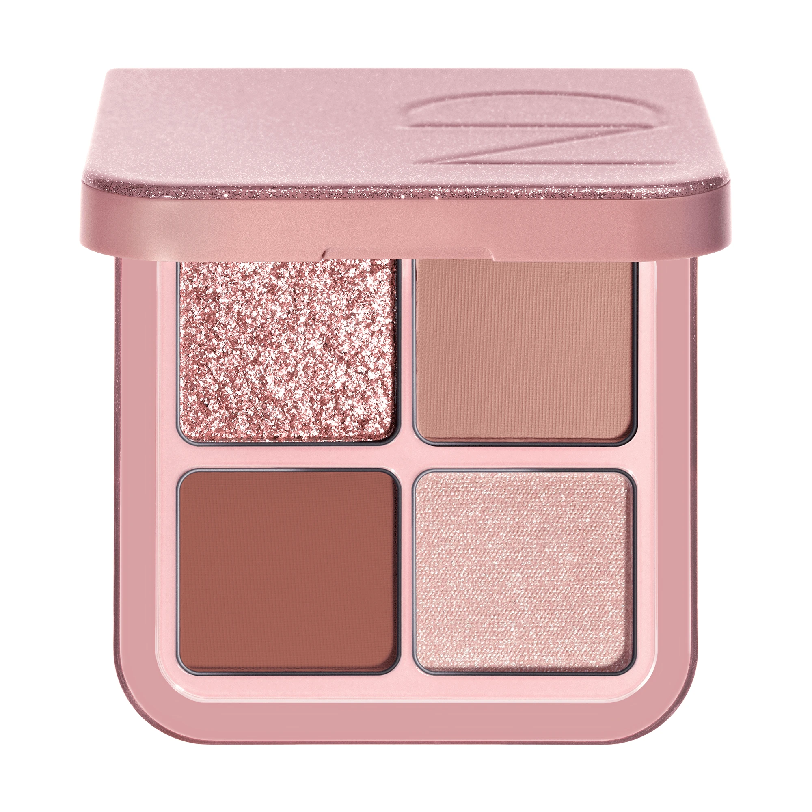
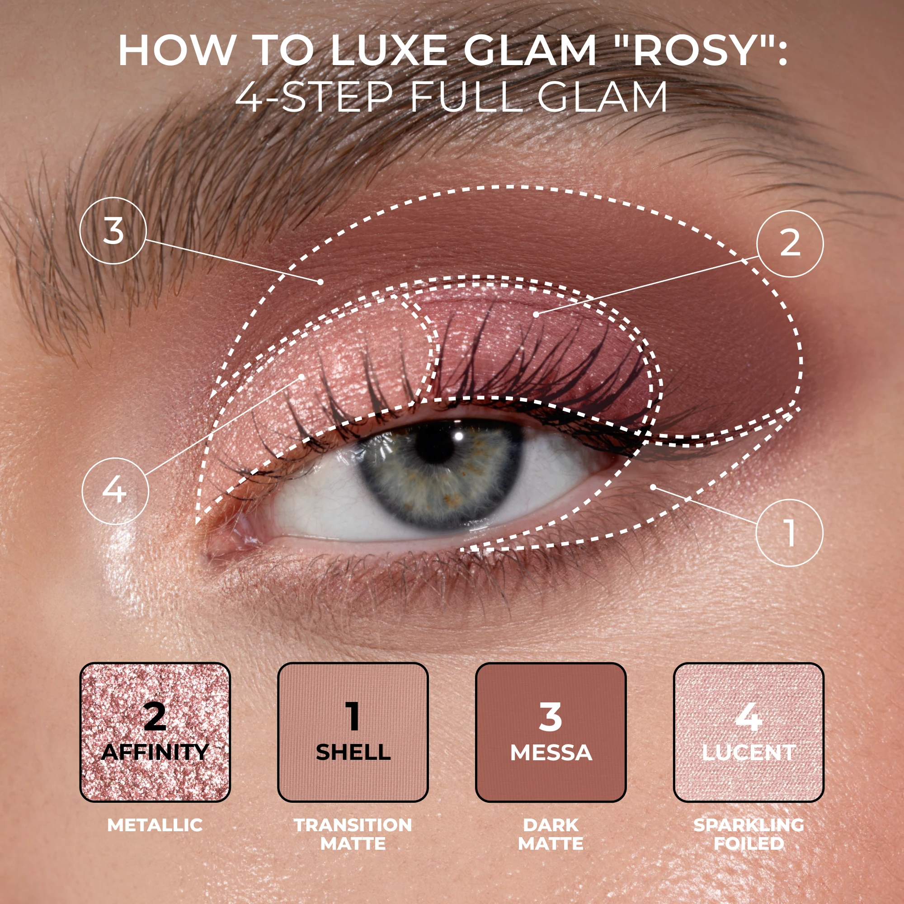
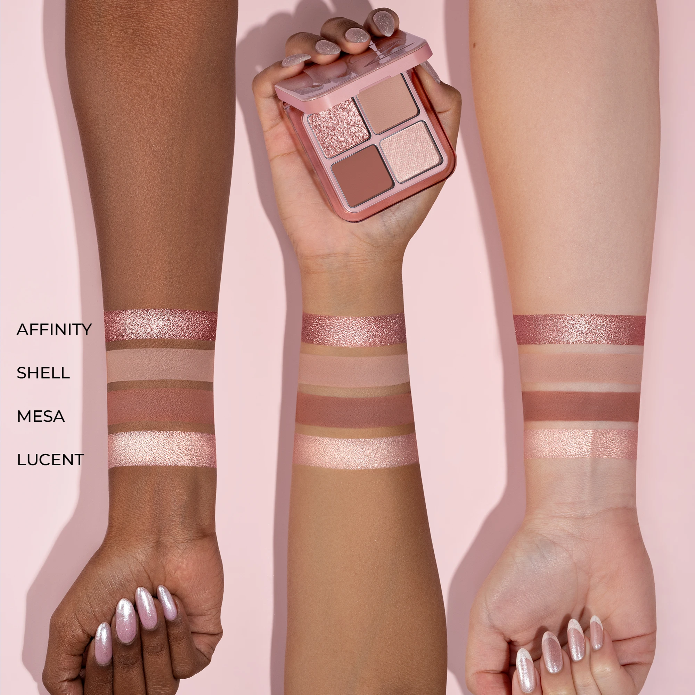
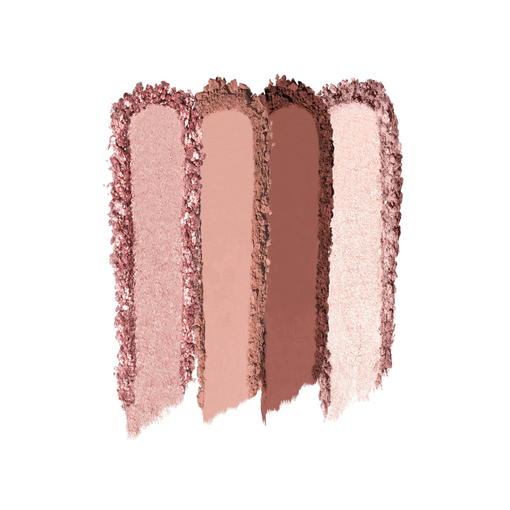
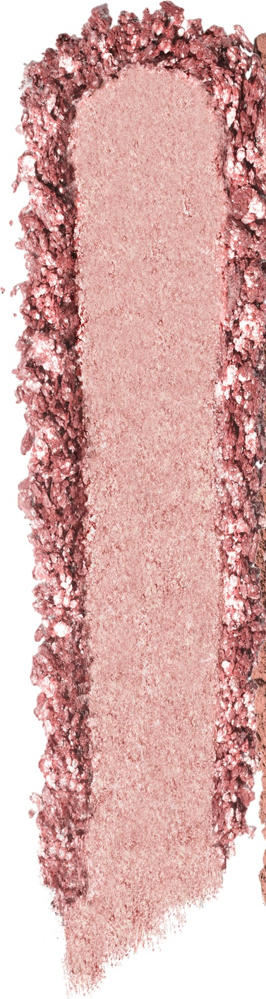
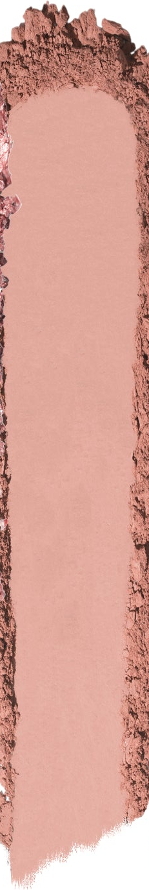
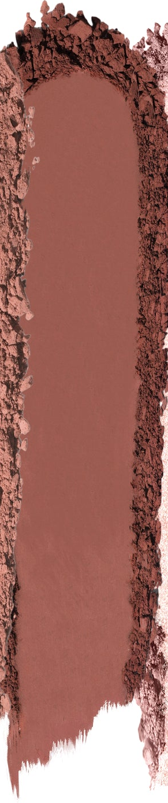
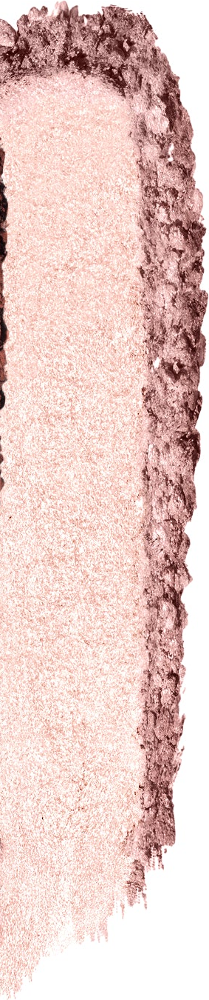

# Natasha Denona 4色 Luxe Glam Compact 玫粉盘 Rosy

Natasha 奢华四色眼影盘玫粉版，以"大专业色盘"规格封装四个玫粉核心色：暖玫粉金属感 Affinity、暖裸橙哑光 Shell、中调玫瑰棕哑光 Messa、柔光香槟粉闪光箔感 Lucent，配方涵盖哑光、金属与闪光箔感三种质地，从日常裸粉到浓郁玫粉魅妆一盘搞定。

€53.24 · 净重 7.8g · 4色 · 产地意大利 · 无对羟基苯甲酸酯 · 无矿物油

---

## 四步教程

---

## 手臂试色

---

## 质地说明

| 代码 | 质地 | 特点 |
|------|------|------|
| SF | Sparkling Foiled 闪光箔感 | 纯色高箔感光泽，多维闪光粒子，压实可呈箔金效果 |
| CM | Creamy Matte 奶油哑光 | 顺滑压粉，高强度发色，哑光饱满无缝晕染 |
| M | Metallic 金属感 | 纯色高箔感光泽，细腻无缝金属光泽 |

**闪光箔感/金属感上色建议：** 用指腹或湿刷压色，最大化箔感与金属光泽。
**哑光上色建议：** 用紧密刷头按压上色，再用蓬松刷晕染。

---

## 色板

---

## 色号总览

| # | 色名 | 代码 | 质地 | 颜色描述 |
|---|------|------|------|----------|
| 1 | Affinity | M | Metallic | 暖玫粉金属感 |
| 2 | Shell | CM | Creamy Matte | 暖裸橙奶油哑光 |
| 3 | Messa | CM | Creamy Matte | 中调玫瑰棕奶油哑光 |
| 4 | Lucent | SF | Sparkling Foiled | 柔光香槟粉闪光箔感 |

---

## Shade 1: Affinity M — Metallic Warm Rose Pink

Use: All-over lid for a warm rose-pink metallic statement. Center lid for a glowing metallic dimension. Apply damp or with fingertip for maximum metallic payoff. Pairs with Messa at the outer corner for a pink-toned sculpted metallic look. The palette's star metallic — delivers the most saturated warm pink glow.

##### 色号 1：暖玫粉金属感 (Affinity) —— 暖玫粉，金属感。
用途：可全眼铺色打造浓郁暖玫粉金属宣言妆；叠加于眼皮中央做闪耀金属光泽提亮；湿刷或指腹压色获得最强金属饱和度；与眼尾 `Messa` 搭配做玫粉感雕刻金属妆容；盘内主角金属色，带来最饱和的暖玫粉光感。

---

## Shade 2: Shell CM — Creamy Matte Warm Nude Peach

Use: All-over lid as a warm nude-peach matte base. Crease transition between Affinity and Messa. Brow bone softer highlight. The palette's neutral anchor — a warm peachy nude that bridges the pink metallic and rose-brown matte shades.

##### 色号 2：暖裸橙奶油哑光 (Shell) —— 暖裸橙肤，奶油哑光。
用途：可全眼铺色做暖裸橙哑光底妆；用于眼窝衔接 `Affinity` 和 `Messa` 做无缝过渡；眉骨柔和提亮；盘内暖裸中性底色，联结粉调金属色与玫瑰棕哑光色。

---

## Shade 3: Messa CM — Creamy Matte Medium Rose Brown

Use: Outer corner and crease for medium rose-brown depth. Lower lash line definition. All-over lid for a warm rose-brown matte statement. The palette's contour shade — adds definition and warmth to the outer eye.

##### 色号 3：中调玫瑰棕奶油哑光 (Messa) —— 中调玫瑰棕，奶油哑光。
用途：用于眼尾和眼窝打造中调玫瑰棕深度轮廓；用于下睫毛线做线感定型；可全眼铺色做暖玫瑰棕哑光宣言妆；盘内轮廓定型色，为眼外侧增添温暖深度。

---

## Shade 4: Lucent SF — Sparkling Foiled Light Champagne Pink

Use: Inner corner and brow bone for a sparkling champagne-pink brightening highlight. All-over lid for a light glam glitter base. Center lid over Shell to add foiled dimension. Apply with fingertip for maximum foiled payoff. The palette's brightening accent — a light champagne-pink sparkle that contrasts with the warmer rose tones.

##### 色号 4：柔光香槟粉闪光箔感 (Lucent) —— 淡香槟粉，闪光箔感。
用途：用于眼头和眉骨打造香槟粉闪光提亮；可全眼铺色做轻盈闪光底妆；叠加于 `Shell` 中央增添箔感维度；指腹压色获得最强箔感发色；盘内提亮强调色，以淡香槟粉与偏暖玫粉调形成轻盈反差。
