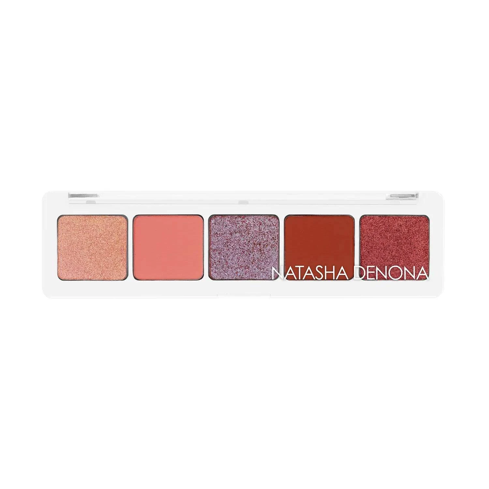
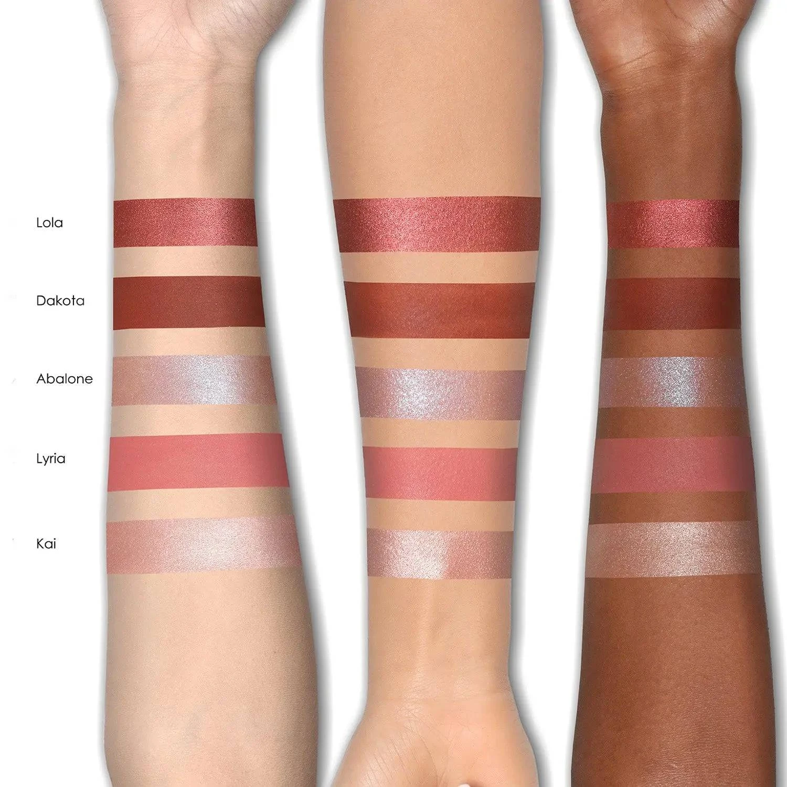
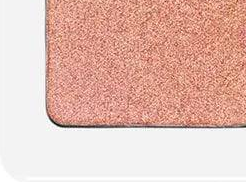
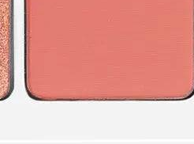
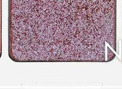
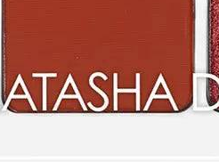
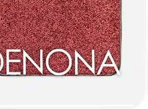

# Natasha Denona 5色 迷你珊瑚盘 Coral Mini Eyeshadow Palette

品牌秋季主打盘，以五个百搭珊瑚暖调收入白色外壳：浅玫金属、柔珊瑚哑光、银紫双色变幻、深赤陶哑光与暖赤铜金属，单颗 0.8g，质地涵盖金属、奶油哑光与 Duo Chrome，从轻盈珊瑚裸妆到深邃秋日烟熏眼妆一盘搞定。

$29.00 · 单颗 0.8g × 5色 · 产地意大利

---

## 质地说明

| 代码 | 质地 | 特点 |
|------|------|------|
| M | Metallic 金属感 | 细磨珍珠粉 + 色彩晶体，无缝高光泽 |
| CM | Creamy Matte 奶油哑光 | 品牌经典配方，柔滑压粉哑光，发色饱满 |
| DC | Duo Chrome 双色变幻 | 随角度呈现双色光效，色彩流动感极强 |

**金属上色建议：** 用湿刷或指腹涂抹，获得最强光泽效果。
**哑光上色建议：** 用紧密刷头按压上色，再用蓬松刷晕染。
**Duo Chrome 上色建议：** 用湿刷或指腹涂抹，获得最强双色变幻效果。

---

## 手臂试色

---

## 色号总览

| # | 色名 | 质地 | 颜色描述 |
|---|------|------|----------|
| 1 | Kai | Metallic | 浅玫瑰金属 |
| 2 | Lyria | Creamy Matte | 柔珊瑚粉哑光 |
| 3 | Abalone | Duo Chrome | 银紫双色变幻 |
| 4 | Dakota | Creamy Matte | 深赤陶哑光 |
| 5 | Lola | Metallic | 暖赤铜金属 |

---

## Shade 1: Kai M — Metallic Light Rose Gold

Use: Inner corner and center lid for a soft rose gold highlight. All-over lid for a delicate shimmery wash. Pairs with Lyria for a warm coral-and-shimmer day look. The palette's lightest, most wearable metallic.

##### 色号 1：浅玫瑰金属 (Kai) —— 浅玫瑰金，金属感。
用途：用于眼头和眼皮中央做柔和玫瑰金提亮；可全眼铺色做精致光感底妆；与 `Lyria` 搭配做暖珊瑚+光泽感日常眼妆；盘内最浅最日常的金属色号。

---

## Shade 2: Lyria CM — Creamy Matte Soft Coral Pink

Use: All-over lid for a flattering coral-pink matte. Crease blending for a soft warm transition. Pairs with Kai for an effortless everyday look. The palette's most universally flattering matte.

##### 色号 2：柔珊瑚粉哑光 (Lyria) —— 柔和珊瑚粉，奶油哑光。
用途：可全眼铺色做百搭珊瑚粉哑光；用于眼窝做柔和暖调过渡；与 `Kai` 搭配做轻松日常眼妆；盘内最百搭、最易驾驭的哑光色号。

---

## Shade 3: Abalone DC — Duo Chrome Silver Lavender

Use: Center lid and inner corner for an otherworldly silver-to-lavender shift. All-over lid for a cool contrast to the warm palette. Apply damp for maximum duo chrome shift. The palette's wild card — adds an unexpected dimension.

##### 色号 3：银紫双色变幻 (Abalone) —— 银紫双色变幻，Duo Chrome。
用途：用于眼皮中央和眼头，随角度呈现银与薰衣草的变幻效果；可全眼铺色做与暖调盘的冷调对比；湿刷获得最强双色变幻发色；盘内最惊喜的色号，增添意外维度。

---

## Shade 4: Dakota CM — Creamy Matte Deep Terracotta

Use: Outer corner and crease for a deep terracotta depth. All-over lid for a bold earthy statement. Pairs with Lola for a warm metallic-on-matte fall look. The palette's deepest shade for sculpting and defining.

##### 色号 4：深赤陶哑光 (Dakota) —— 深赤陶红，奶油哑光。
用途：用于眼尾和眼窝打造深沉赤陶深度；可全眼铺色做大胆大地宣言妆；与 `Lola` 搭配做暖调秋日金属遇哑光组合；盘内最深哑光，适合塑形定型。

---

## Shade 5: Lola M — Metallic Warm Copper Terracotta

Use: All-over lid for a rich warm copper-terracotta metallic. Outer corner for a vivid metallic depth. Apply damp for maximum metallic payoff. Pairs with Dakota for a monochromatic warm fall look.

##### 色号 5：暖赤铜金属 (Lola) —— 暖赤铜棕，金属感。
用途：可全眼铺色打造浓郁暖赤铜金属感；集中于眼尾做鲜明金属深度；湿刷获得最强金属发色；与 `Dakota` 搭配做同色调秋日暖棕组合。
