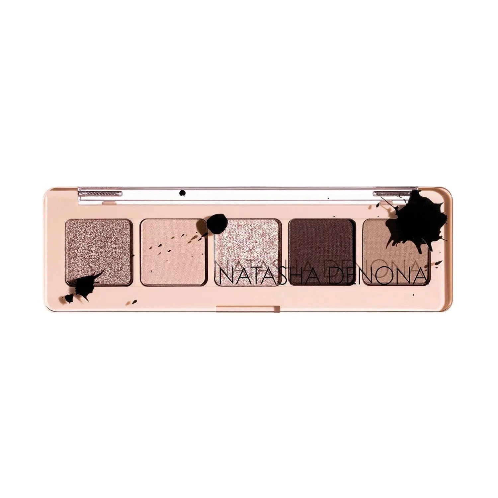
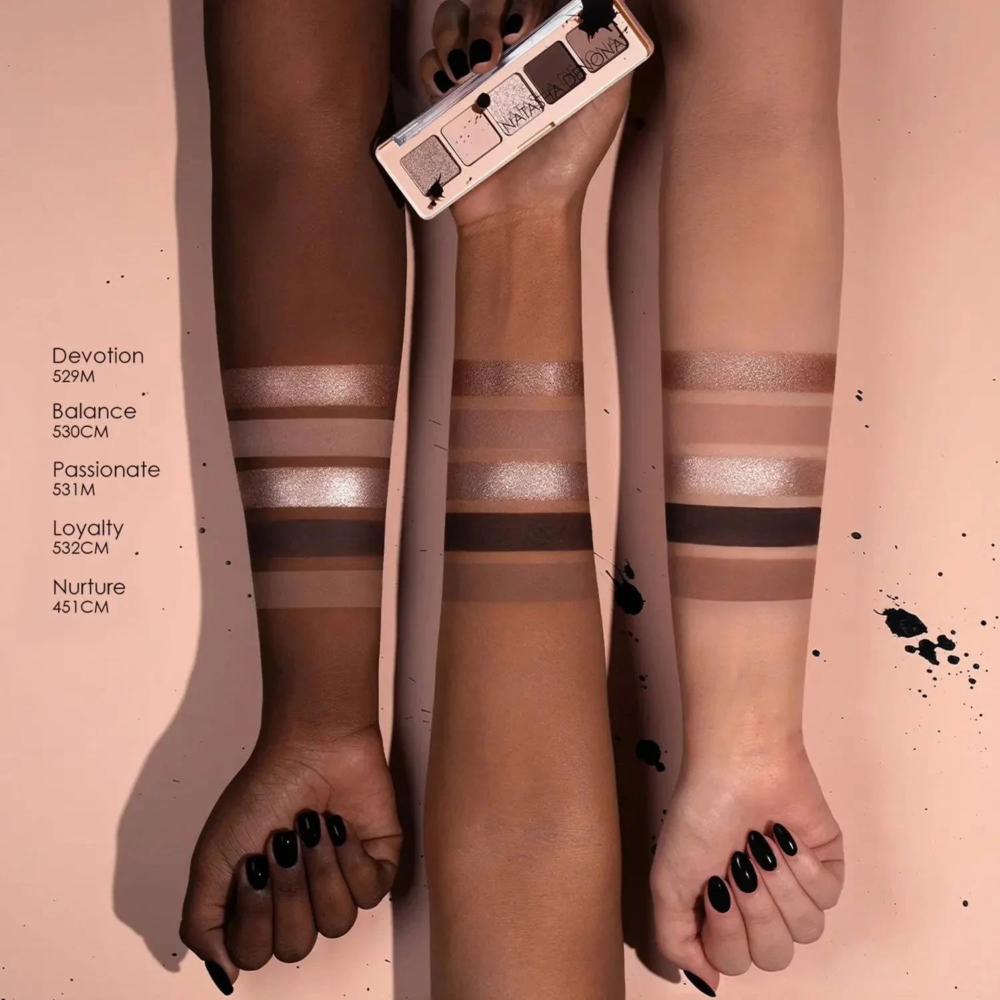
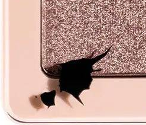
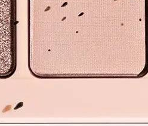
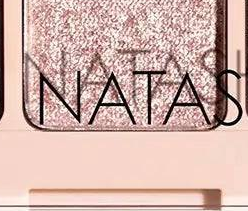
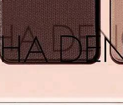
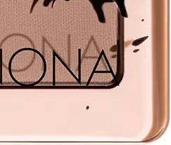

# Natasha Denona 5色 迷你梦幻盘 My Mini Dream Eyeshadow Palette

以 Natasha 最爱色号 Nurture 为灵感核心，搭配 4 个全新冷调摩卡金属与哑光，将中调裸金属 Devotion、浅裸哑光 Balance、浅玫瑰棕金属 Passionate、深勃艮第哑光 Loyalty 与中调冷裸哑光 Nurture 收入玫瑰金水墨泼彩外壳，单颗 0.8g，打造从日常高雅到深邃烟熏的百变冷裸眼妆。

€30.25 · 单颗 0.8g × 5色 · 产地意大利 · 无对羟基苯甲酸酯 · 无矿物油 · 无酒精

---

## 质地说明

| 代码 | 质地 | 特点 |
|------|------|------|
| M | Metallic 金属感 | 细磨珍珠粉 + 色彩晶体，无缝高光泽 |
| CM | Creamy Matte 奶油哑光 | 品牌经典配方，柔滑压粉哑光，发色饱满 |

**哑光上色建议：** 用紧密刷头按压上色，再用蓬松刷晕染。
**金属上色建议：** 用湿刷或指腹涂抹，获得最强光泽效果。

---

## 手臂试色

---

## 色号总览

| # | 色名 | 代码 | 质地 | 颜色描述 |
|---|------|------|------|----------|
| 1 | Devotion | 529M | Metallic | 中调冷裸金属 |
| 2 | Balance | 530CM | Creamy Matte | 浅裸肤哑光 |
| 3 | Passionate | 531M | Metallic | 浅玫瑰摩卡金属 |
| 4 | Loyalty | 532CM | Creamy Matte | 深勃艮第棕哑光 |
| 5 | Nurture | 451CM | Creamy Matte | 中调冷裸哑光 |

---

## Shade 1: Devotion 529M — Metallic Medium Cool Nude

Use: All-over lid for a wearable metallic cool nude. Inner corner and center lid for a sophisticated highlight. Pairs with Loyalty for a deep contrast metallic look. Damp brush for maximum metallic payoff.

##### 色号 1：中调冷裸金属 (Devotion) —— 中调冷裸色，金属感。
用途：可全眼铺色做高级裸色金属底妆；用于眼头和眼皮中央做精致高光；与 `Loyalty` 搭配做深浅对比金属眼妆；湿刷获得最强金属发色。

---

## Shade 2: Balance 530CM — Creamy Matte Light Nude

Use: All-over lid as a brightening neutral base. Inner corner brightening and brow bone. Blending and transitioning between darker shades. The palette's most versatile, sheer base.

##### 色号 2：浅裸肤哑光 (Balance) —— 浅裸肤色，奶油哑光。
用途：可全眼铺色做提亮中性底妆；用于眼头和眉骨提亮；作为深色号之间的晕染过渡色；盘内最透明百搭的基底色。

---

## Shade 3: Passionate 531M — Metallic Light Rose Taupe

Use: All-over lid for a dreamy rose taupe metallic. Center lid highlight over matte base. Pairs with Devotion for a tonal cool metallic gradient. Damp brush for maximum metallic intensity.

##### 色号 3：浅玫瑰摩卡金属 (Passionate) —— 浅玫瑰摩卡，金属感。
用途：可全眼铺色打造梦幻玫瑰摩卡金属光感；叠加于哑光底色中央提亮；与 `Devotion` 搭配做同色调冷金属渐变；湿刷获得最强金属效果。

---

## Shade 4: Loyalty 532CM — Creamy Matte Deep Burgundy Brown

Use: Outer corner and crease for a deep burgundy-brown smoky depth. Lower lash line for intensity. Pairs with Devotion for a metallic-meets-matte drama. The palette's most intense contour shade.

##### 色号 4：深勃艮第棕哑光 (Loyalty) —— 深勃艮第棕，奶油哑光。
用途：用于眼尾和眼窝打造深邃勃艮第烟熏深度；用于下睫毛线增强眼神强度；与 `Devotion` 搭配做金属遇哑光戏剧对比；盘内最强雕刻轮廓色。

---

## Shade 5: Nurture 451CM — Creamy Matte Medium Cool Nude

Use: All-over lid for a classic cool nude daytime look. Crease blending as a soft mid-tone. Natasha's personal favorite shadow — the foundation of the entire Dream collection. Pairs beautifully with every other shade in this palette.

##### 色号 5：中调冷裸哑光 (Nurture) —— 中调冷裸色，奶油哑光。
用途：可全眼铺色做经典冷裸日常眼妆；用于眼窝做柔和中调晕染；Natasha 本人最爱色号，整个 Dream 系列的核心；与盘内所有其他色号均可完美搭配。
