# Natasha Denona 5色 迷你塑眼盘 Mini Eye Sculpt Palette

专为眼妆塑形设计，提供 Neutral（中性）与 Cool（冷调）两款配色，各含 5 个由浅至深全哑光色号，从极浅高光至极深黑色，覆盖所有肤色的打底、眼窝过渡和眼尾定型。结合轻盈 Silky Matte（亮肤浅色）与经典 Creamy Matte（中深色）双配方，哑光发色饱满，无缝晕染，单颗 0.8g。

€30.25 · 单颗 0.8g × 5色 · 产地意大利 · 无对羟基苯甲酸酯 · 无矿物油 · 无酒精

---

## 质地说明

| 代码 | 质地 | 特点 |
|------|------|------|
| SKM | Silky Matte 丝质哑光 | 轻薄丝滑，高透发色，适合浅色高光与提亮 |
| CM | Creamy Matte 奶油哑光 | 品牌经典配方，柔滑压粉哑光，发色饱满深邃 |

**上色建议：** 用紧密刷头按压上色后，用蓬松刷晕染。浅色作全眼底妆，深色集中于眼窝和眼尾塑形。

---

## Neutral 中性版

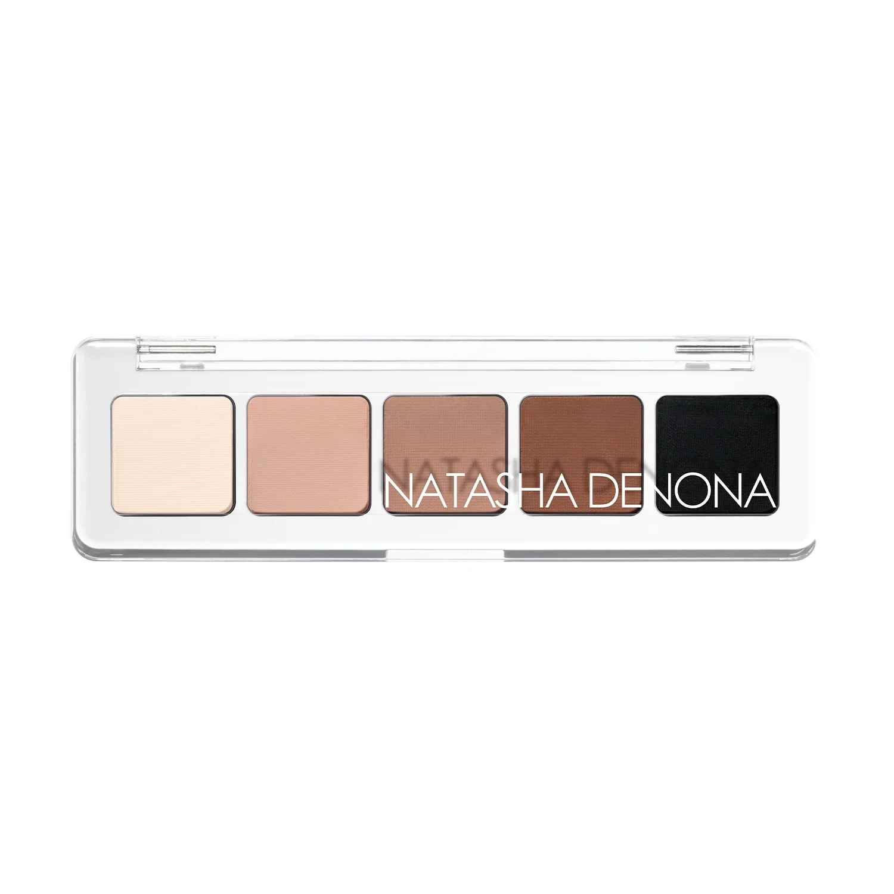

适合中性偏暖肤调，从象牙白至深中性棕再到浓黑，5 色构成完整的深浅渐进组合。

| # | 色名 | 代码 | 质地 | 颜色描述 |
|---|------|------|------|----------|
| 1 | Fair | 580SKM | Silky Matte | 丝质哑光象牙白 |
| 2 | Light | 581SKM | Silky Matte | 丝质哑光浅驼裸 |
| 3 | Medium | 451CM | Creamy Matte | 奶油哑光中调冷裸 |
| 4 | Deep | 216CM | Creamy Matte | 奶油哑光中深中性棕 |
| 5 | Black | 439CM | Creamy Matte | 奶油哑光浓黑 |

### Neutral Shade 1: Fair 580SKM
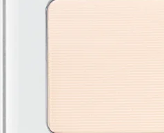

Use: All-over lid as a brightening white-ivory base. Brow bone highlight. Inner corner brightening. The palettes lightest shade for blending and lifting.

##### 色号 1（Neutral）：象牙白丝质哑光 (Fair) — 用于全眼提亮底色、眉骨高光、眼头提亮。

---

### Neutral Shade 2: Light 581SKM
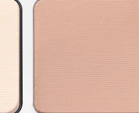

Use: All-over lid for a soft taupe-nude base. Inner lid and brow bone highlight. Blend with Medium for a seamless light-to-mid transition.

##### 色号 2（Neutral）：浅驼裸丝质哑光 (Light) — 用于全眼铺底做柔和驼裸基调；与 `Medium` 搭配做浅中无缝过渡。

---

### Neutral Shade 3: Medium 451CM
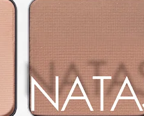

Use: Crease and transition shade. All-over lid for a medium-depth look. The palette's pivotal mid-tone — pairs with both Fair/Light above and Deep below.

##### 色号 3（Neutral）：中调冷裸奶油哑光 (Medium) — 用于眼窝晕染过渡；盘内枢纽色，可与浅色和深色双向搭配。

---

### Neutral Shade 4: Deep 216CM
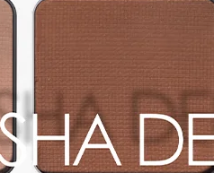

Use: Outer corner and crease for deep sculpting. Lower lash line definition. Blend over Medium for a deeper crease contour.

##### 色号 4（Neutral）：中深中性棕奶油哑光 (Deep) — 用于眼尾和眼窝深度雕刻；用于下睫毛线定型。

---

### Neutral Shade 5: Black 439CM
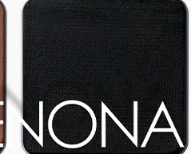

Use: Outer V and lower lash line for intense black smoky. All-over lid for a graphic black look. The ultimate sculpting anchor shade.

##### 色号 5（Neutral）：浓黑奶油哑光 (Black) — 集中于外眼角 V 区和下睫毛线做黑色烟熏；极深轮廓塑形锚点色。

---

## Cool 冷调版

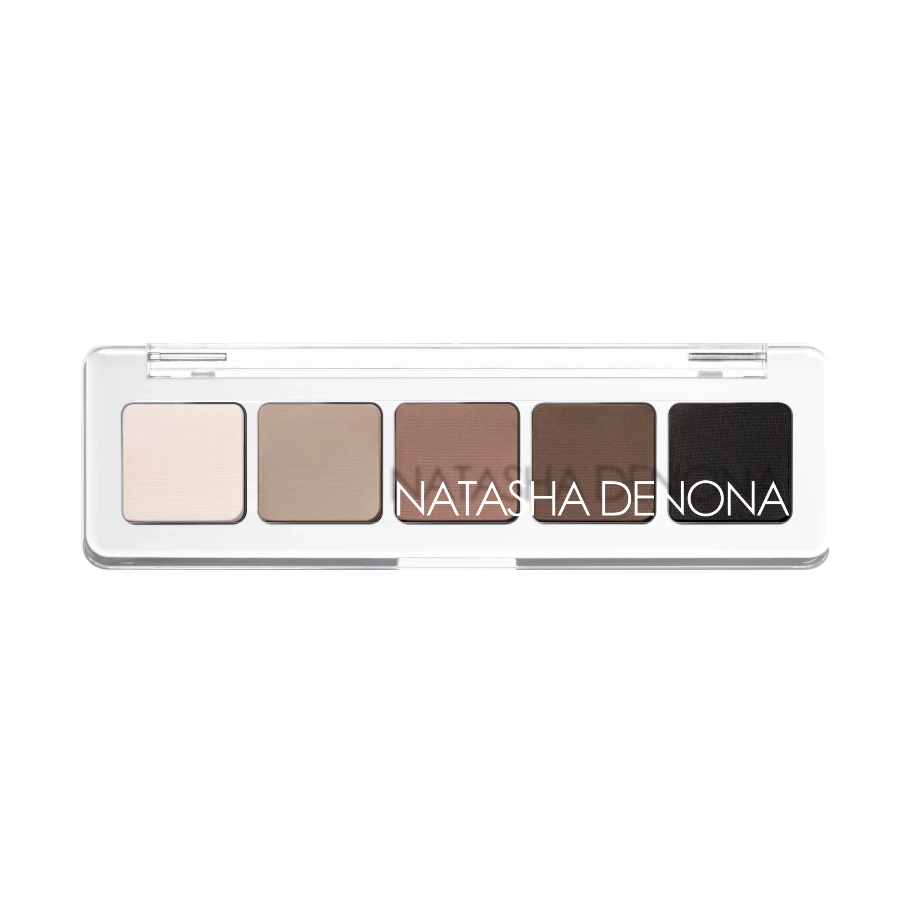

适合冷调肤色，从冷调极浅至深冷棕再到极深冷黑，5 色形成完整的冷调深浅渐进组合。

| # | 色名 | 代码 | 质地 | 颜色描述 |
|---|------|------|------|----------|
| 1 | Fair Cool | 635SKM | Silky Matte | 丝质哑光冷调极浅 |
| 2 | Light Cool | 636SKM | Silky Matte | 丝质哑光冷浅驼 |
| 3 | Medium Cool | 637CM | Creamy Matte | 奶油哑光冷调中裸 |
| 4 | Medium-Dark Cool | 638CM | Creamy Matte | 奶油哑光冷调中深棕 |
| 5 | Deep Cool | 639CM | Creamy Matte | 奶油哑光极深冷棕黑 |

### Cool Shade 1: Fair Cool 635SKM
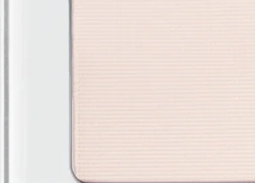

Use: All-over lid as a brightening cool-toned white base. Brow bone highlight. The palettes lightest cool shade.

##### 色号 1（Cool）：冷调极浅丝质哑光 (Fair Cool) — 全眼铺底提亮冷调白底；眉骨高光。

---

### Cool Shade 2: Light Cool 636SKM
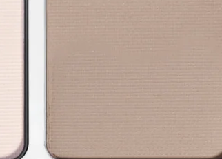

Use: All-over lid for a soft cool taupe base. Blend seamlessly with Medium Cool for a light transition.

##### 色号 2（Cool）：冷浅驼丝质哑光 (Light Cool) — 全眼铺色做冷调浅底；与 `Medium Cool` 无缝过渡。

---

### Cool Shade 3: Medium Cool 637CM
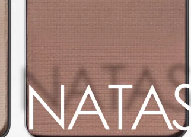

Use: Crease blending as the key transition shade. All-over lid for medium cool depth.

##### 色号 3（Cool）：冷调中裸奶油哑光 (Medium Cool) — 用于眼窝晕染过渡；盘内冷调枢纽色。

---

### Cool Shade 4: Medium-Dark Cool 638CM
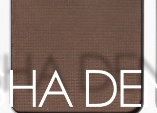

Use: Outer corner and crease for cool brown depth. Lower lash line definition.

##### 色号 4（Cool）：冷调中深棕奶油哑光 (Medium-Dark Cool) — 用于眼尾和眼窝做冷调深度；下睫毛线定型。

---

### Cool Shade 5: Deep Cool 639CM
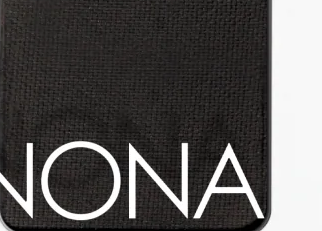

Use: Outer V and lower lash line for intense cool dark definition. All-over lid for a dramatic cool smoky.

##### 色号 5（Cool）：极深冷棕黑奶油哑光 (Deep Cool) — 外眼角和下睫毛线做冷调极深定型；打造冷调深邃烟熏眼妆。
