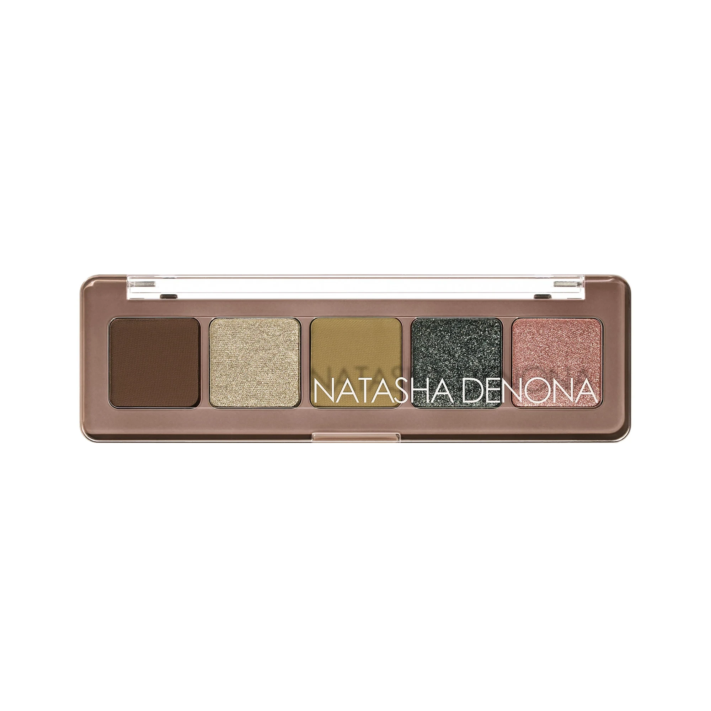
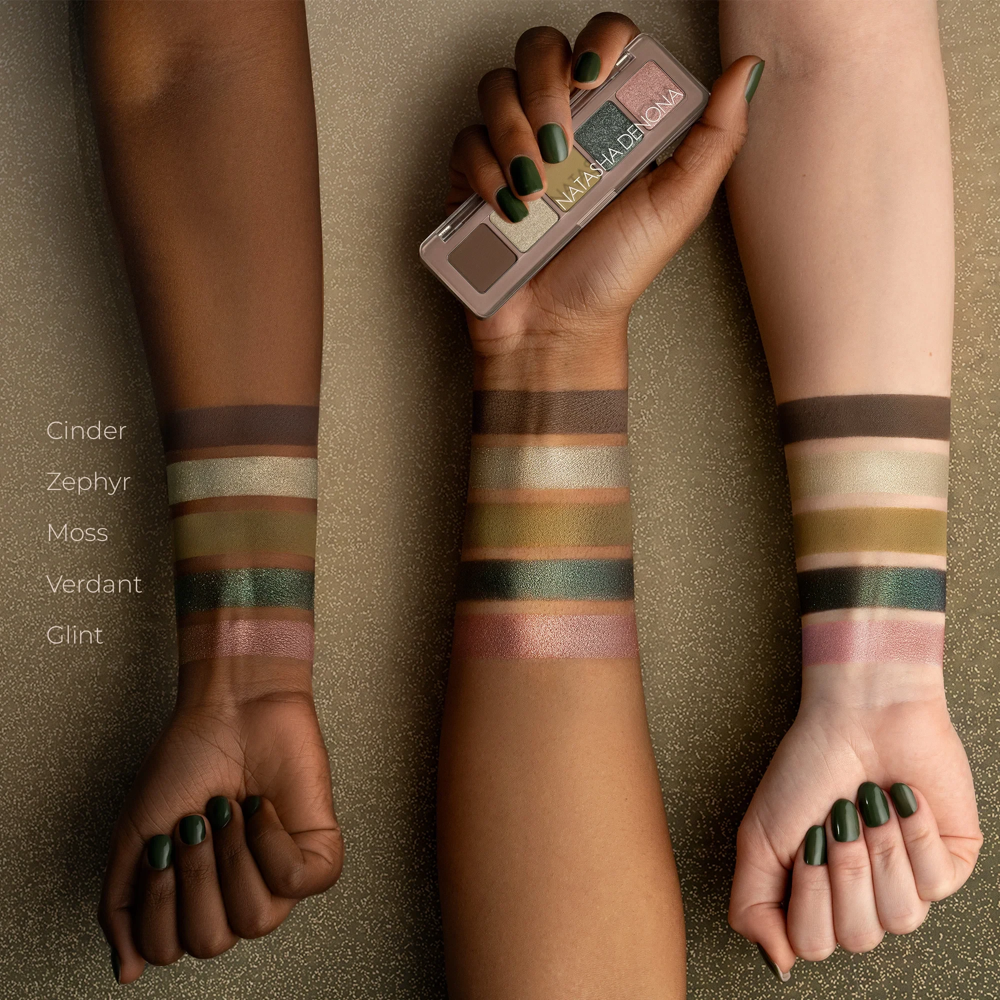
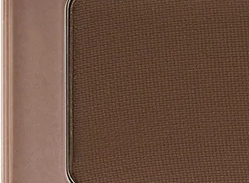
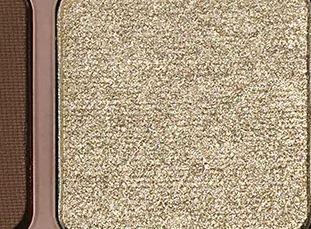
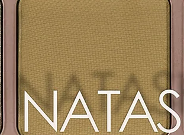
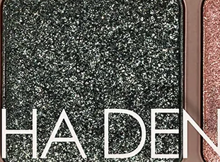
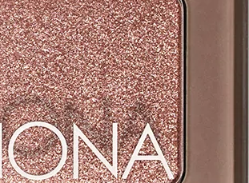

# Natasha Denona 5色 迷你暗调橄榄盘 Mini Gloom Eyeshadow Palette

以暗调橄榄与大地色为主轴，将烟熏橄榄哑光、香槟金属、苔绿哑光、暗石油绿闪光金属与裸粉玫瑰金属五色集于摩卡棕外壳，质地涵盖奶油哑光与金属，单颗 0.8g，可单独打造冷酷烟熏眼妆，亦可叠搭出层次丰富的暗调绿金眼妆。

€30.25 · 单颗 0.8g × 5色 · 产地意大利 · 无对羟基苯甲酸酯 · 无矿物油 · 无酒精

---

## 质地说明

| 代码 | 质地 | 特点 |
|------|------|------|
| CM | Creamy Matte 奶油哑光 | 品牌经典配方，柔滑压粉哑光，发色饱满 |
| M | Metallic 金属感 | 细磨珍珠粉 + 色彩晶体，无缝高光泽 |

**哑光上色建议：** 用紧密刷头按压上色，再用蓬松刷晕染。
**金属上色建议：** 用湿刷或指腹涂抹，获得最强光泽效果。

---

## 手臂试色

---

## 色号总览

| # | 色名 | 代码 | 质地 | 颜色描述 |
|---|------|------|------|----------|
| 1 | Cinder | 630CM | Creamy Matte | 深暗橄榄棕哑光 |
| 2 | Zephyr | 631M | Metallic | 浅香槟驼色金属 |
| 3 | Moss | 632CM | Creamy Matte | 中调静默橄榄绿哑光 |
| 4 | Verdant | 633M | Metallic | 深沉石油绿金属（闪光质感） |
| 5 | Glint | 634M | Metallic | 浅中调灰玫瑰金属 |

---

## Shade 1: Cinder 630CM — Creamy Matte Dark Dusty Olive Taupe

Use: All-over lid base or crease for a deep earthy foundation. Outer corner for a smoky olive intensity. Brow bone blending for a diffused grounding shadow. Pairs with Verdant for a dramatic olive-toned smoky eye.

##### 色号 1：深暗橄榄棕哑光 (Cinder) —— 深暗橄榄棕，奶油哑光。
用途：可全眼铺底或用于眼窝打造深沉大地色基调；集中于眼尾做烟熏橄榄感；用于眉弓晕染营造自然深沉层次；与 `Verdant` 搭配可打造浓郁橄榄烟熏眼妆。

---

## Shade 2: Zephyr 631M — Metallic Light Taupe Champagne

Use: Inner corner and center lid for a brightening metallic highlight. Under brow bone as a luminous highlight. Pairs with Cinder and Moss to balance the palette's depth with a sheer champagne lift.

##### 色号 2：浅香槟驼色金属 (Zephyr) —— 浅驼色香槟，金属感。
用途：用于眼头和眼皮中央提亮，添加金属光泽；用于眉骨下方作发光高光；与 `Cinder`、`Moss` 搭配，以香槟光感平衡深色调。

---

## Shade 3: Moss 632CM — Creamy Matte Medium Muted Olive

Use: All-over lid for a statement muted olive look. Crease blending for a diffused mid-tone base. Pairs with Cinder for a deeper olive blend. The palette's versatile transition shade.

##### 色号 3：中调静默橄榄绿哑光 (Moss) —— 中调静默橄榄绿，奶油哑光。
用途：可全眼铺色做大地橄榄宣言妆；用于眼窝做自然晕染过渡；与 `Cinder` 叠搭加深橄榄层次；盘内最百搭的过渡色。

---

## Shade 4: Verdant 633M — Metallic Dusty Petroleum Green

Use: Outer corner for a dramatic deep forest green metallic accent. All-over lid for a daring dark green look. Apply damp for intensified metallic payoff with a distinctive sparkle quality. The palette's most impactful shade.

##### 色号 4：深沉石油绿金属 (Verdant) —— 暗沉石油绿，金属（含闪光质感）。
用途：集中于眼尾做深沉森绿金属戏剧感点睛；可全眼铺色打造大胆深绿宣言妆；用湿刷提升金属感和闪光强度；盘内最具冲击力的主角色。

---

## Shade 5: Glint 634M — Metallic Light-Medium Dusty Rose

Use: Inner corner and center lid for a warm rose metallic contrast to the greens. Tear duct highlight for a soft color pop. Pairs with Moss for a green-rose complementary look. Adds unexpected warmth to an otherwise cool-toned palette.

##### 色号 5：浅中调灰玫瑰金属 (Glint) —— 浅中调烟灰玫瑰，金属感。
用途：用于眼头和眼皮中央，以暖玫瑰金属光与绿色调形成对比；用于泪沟点光；与 `Moss` 搭配做绿玫瑰互补色眼妆；为整体冷调盘增添意外暖意。
