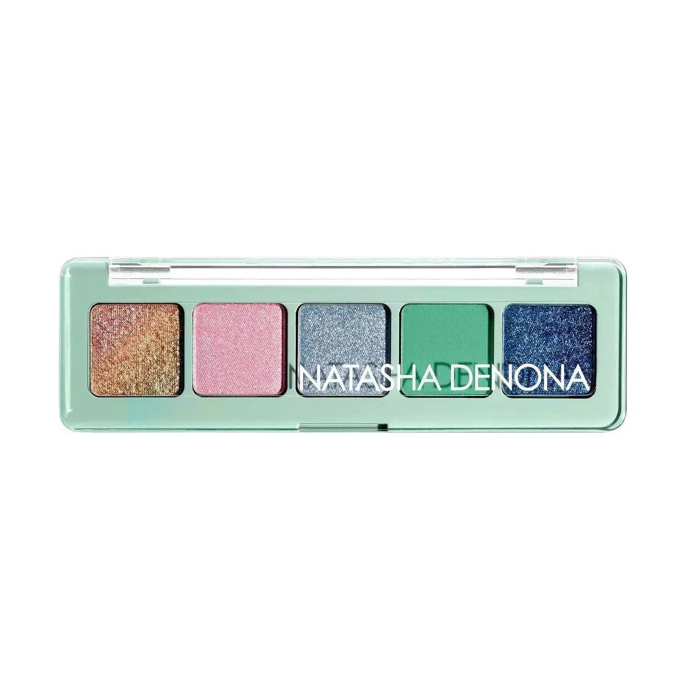
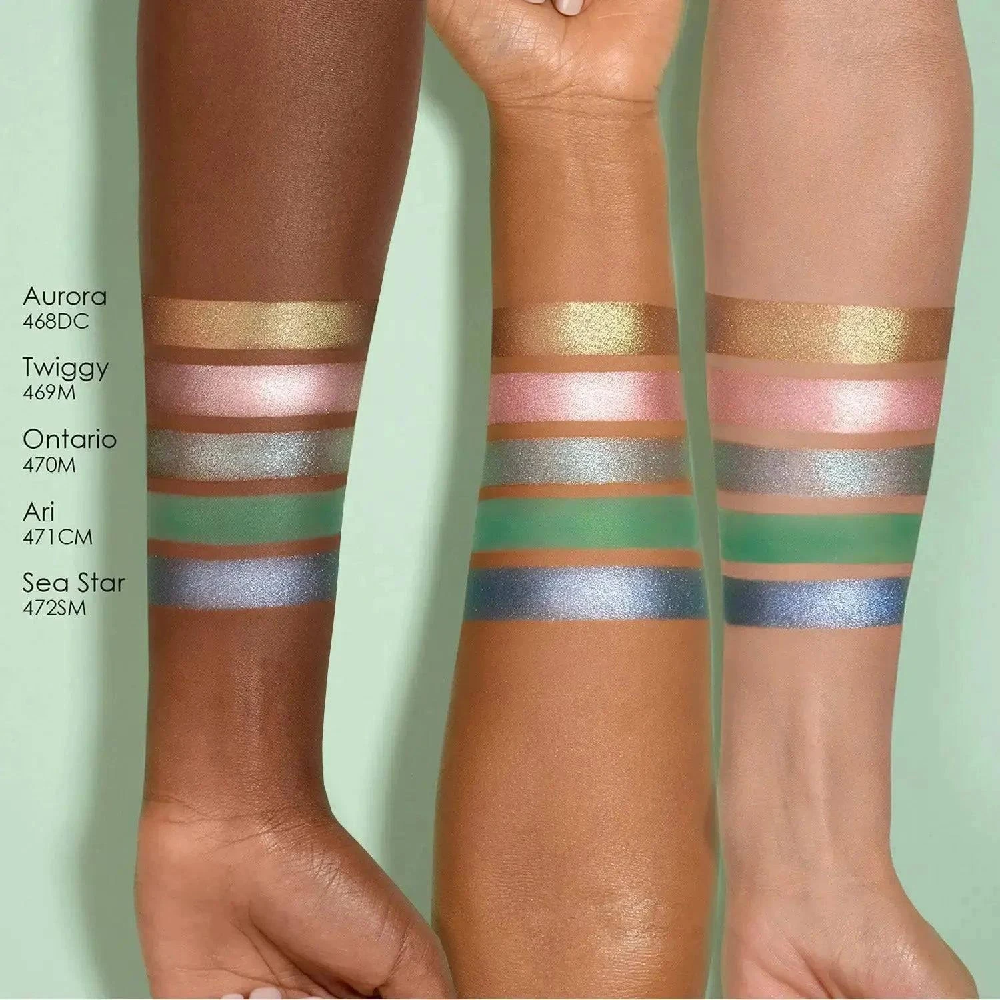
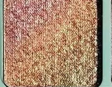
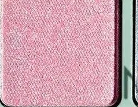
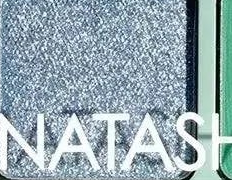
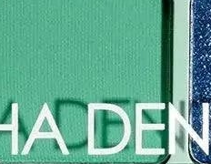
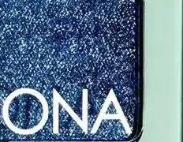

# Natasha Denona 5色 糖果彩虹盘 Mini Pastel Eyeshadow Palette

Pastel 系列 2022 年限量大盘的旅行迷你版，精选 5 个限定全新色号，以薄荷绿外壳盛载冰粉、极光铜、冰蓝、薄荷绿与钴蓝，质地涵盖 Duo Chrome 双色变幻、金属感、哑光与闪光金属，可单独成妆，亦可与 Pastel 系列叠搭打造光彩夺目的彩虹渐层眼妆。

€30.25 · 0.8g × 5 · 产地意大利 · 限量版

**认证：** 无对羟基苯甲酸酯 · 无动物测试

---

## 质地说明

| 代码 | 质地 | 特点 |
|------|------|------|
| DC | Duo Chrome 双色变幻 | 随角度呈现双色光效，色彩流动感极强 |
| M | Metallic 金属感 | 细磨珍珠粉 + 色彩晶体，无缝高光泽 |
| CM | Creamy Matte 奶油哑光 | 品牌经典配方，柔滑压粉哑光，发色饱满 |
| SM | Sparkling Metallic 闪光金属 | 金属基底加入多维闪光粒子 |

**哑光上色建议：** 用紧密刷头按压上色，再用蓬松刷晕染。
**金属/双色上色建议：** 用湿刷或指腹涂抹，获得最强光泽和变幻效果。
**闪光金属上色建议：** 用湿刷或指腹压色，最大化多维闪光强度。

---

## 手臂试色

---

## 色号总览

| # | 色名 | 代码 | 质地 | 颜色描述 |
|---|------|------|------|----------|
| 1 | Aurora | 468DC | Duo Chrome | 薄荷金铜双色变幻 |
| 2 | Twiggy | 469M | Metallic | 冰粉色，金属感 |
| 3 | Ontario | 470M | Metallic | 冰蓝色，金属感 |
| 4 | Ari | 471CM | Creamy Matte | 薄荷绿，奶油哑光 |
| 5 | Sea Star | 472SM | Sparkling Metallic | 雾感钴蓝，闪光金属 |

---

## Shade 1: Aurora 468DC — Duo Chrome Mint with Gold & Pink Shifts

Use: All-over lid for a multidimensional warm gold glow that shifts to mint and pink. Inner corner for a dazzling color-shift pop. Apply damp for maximum duo chrome intensity. The statement shade of the palette — pairs with Ari in the crease for a warm-meets-cool contrast.

##### 色号 1：薄荷金铜双变 (Aurora) —— 薄荷底调加金色与粉色变幻，Duo Chrome。
用途：可全眼铺色展现随视角变幻的暖金与薄荷粉多维光效；用于眼头打造炫彩变色光点；湿刷获得最强双色变幻发色；与 `Ari` 搭配可做暖冷对比彩色眼妆。

---

## Shade 2: Twiggy 469M — Metallic Icy Baby Pink

Use: All-over lid for a dreamy icy pink metallic wash. Inner corner and center lid highlight. Pairs with Aurora on the lid for a warm-cool pink duo. Damp brush for maximum metallic payoff.

##### 色号 2：冰粉金属 (Twiggy) —— 冰粉色，金属感。
用途：可全眼铺色打造梦幻冰粉金属光泽；用于眼头和眼皮中央提亮；与 `Aurora` 搭配可做暖冷粉色双金属眼妆；湿刷获得最强金属发色。

---

## Shade 3: Ontario 470M — Metallic Icy Sky Blue

Use: All-over lid for a soft icy blue metallic. Inner corner highlight for a cool shimmer. Pairs with Sea Star in the outer corner for a layered blue metallic look. Flattering on all skin tones.

##### 色号 3：冰蓝金属 (Ontario) —— 冰蓝色，金属感。
用途：可全眼铺色打造柔和冰蓝金属光感；用于眼头打造冷调点光；与 `Sea Star` 搭配可做叠层蓝色金属眼妆；适合所有肤色。

---

## Shade 4: Ari 471CM — Creamy Matte Aqua Green

Use: Crease and outer corner for a vibrant aqua green accent. All-over lid for a bold pastel green statement. Pairs with Aurora on the lid for a tropical warm-cool color contrast. The only matte in the palette — use as a base or blending shade.

##### 色号 4：薄荷绿哑光 (Ari) —— 薄荷绿，奶油哑光。
用途：用于眼窝和眼尾打造鲜亮薄荷绿点睛；可全眼铺色做大胆浅绿宣言妆；与 `Aurora` 搭配可做热带暖冷对比色彩眼妆；盘内唯一哑光，可用作基底或晕染过渡色。

---

## Shade 5: Sea Star 472SM — Sparkling Metallic Muted Cobalt

Use: Outer corner for a deep cobalt sparkling metallic drama. All-over lid for a daring blue statement. Apply damp or with fingertip for maximum sparkling metallic intensity. Pairs with Ontario for a tonal blue metallic gradient.

##### 色号 5：雾感钴蓝闪金属 (Sea Star) —— 雾感钴蓝，闪光金属。
用途：集中于眼尾打造深邃钴蓝闪光金属戏剧感；可全眼铺色做大胆深蓝宣言妆；用湿刷或指腹压色获得最强闪光金属效果；与 `Ontario` 搭配可做同色调蓝色金属渐变眼妆。
