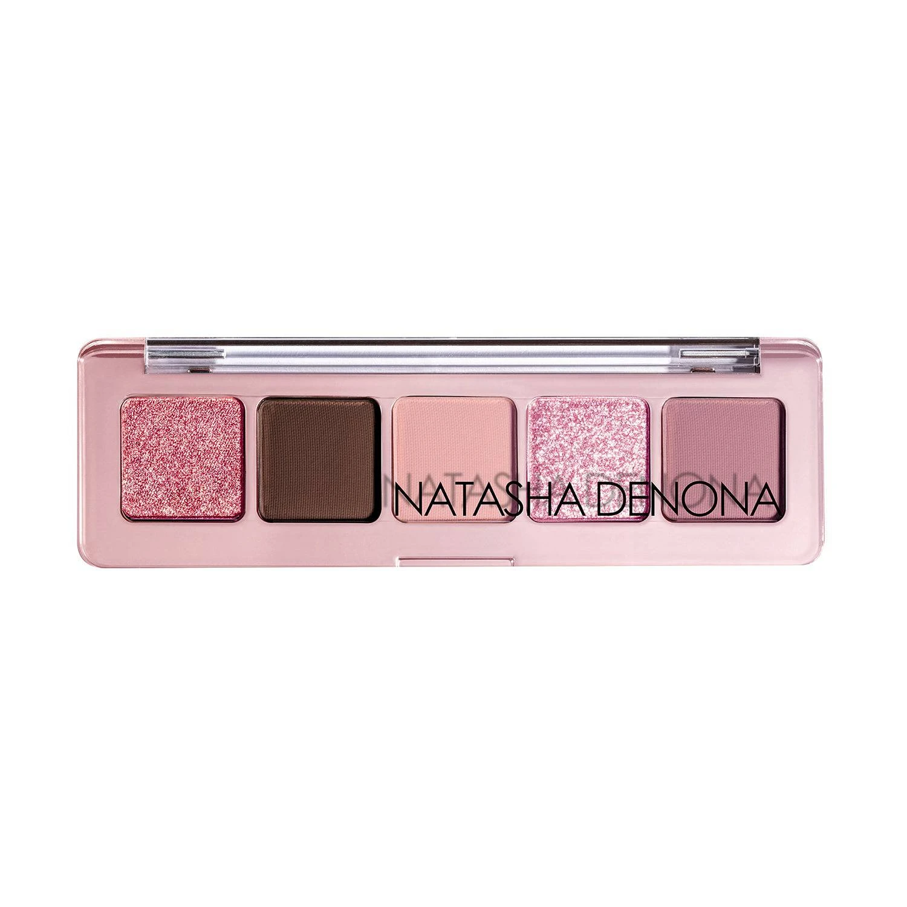
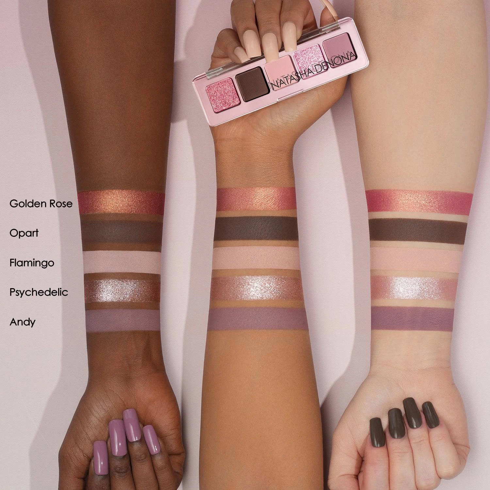
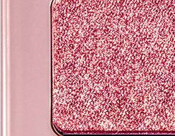
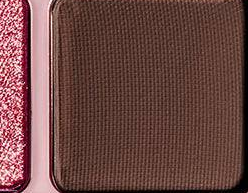
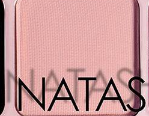
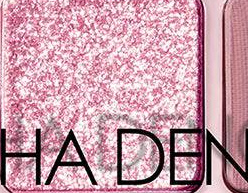
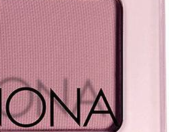

# Natasha Denona 5色 迷你玫粉盘 Mini Rose Eyeshadow Palette

以玫瑰粉调为核心，将薔薇金双色变幻、深暖棕哑光、浅软粉哑光、婴儿粉闪光与中调丁香紫哑光五色收入粉金外壳，质地涵盖 Duo Chrome、奶油哑光与闪光粒子，单颗 0.8g，适合从轻盈裸妆到抢眼玫瑰金眼妆的日夜变幻。

€30.25 · 单颗 0.8g × 5色 · 产地意大利 · 无对羟基苯甲酸酯 · 无矿物油 · 无酒精

---

## 质地说明

| 代码 | 质地 | 特点 |
|------|------|------|
| DC | Duo Chrome 双色变幻 | 随角度呈现双色光效，色彩流动感极强 |
| CM | Creamy Matte 奶油哑光 | 品牌经典配方，柔滑压粉哑光，发色饱满 |
| K | Sparkling Topper 闪光粒子 | 多维彩色闪光粒子，叠加于其他色号之上增添星钻感 |

**哑光上色建议：** 用紧密刷头按压上色，再用蓬松刷晕染。
**Duo Chrome 上色建议：** 用湿刷或指腹涂抹，获得最强双色变幻效果。
**闪光上色建议：** 用手指或专用刷按压叠加于底色上，获得最强多维闪光。

---

## 手臂试色

---

## 色号总览

| # | 色名 | 代码 | 质地 | 颜色描述 |
|---|------|------|------|----------|
| 1 | Golden Rose | 545DC | Duo Chrome | 玫瑰底调加金色变幻 |
| 2 | Opart | 546CM | Creamy Matte | 深暖棕哑光 |
| 3 | Flamingo | 547CM | Creamy Matte | 浅柔粉哑光 |
| 4 | Psychedelic | 548K | Sparkling Topper | 婴儿粉多彩闪光 |
| 5 | Andy | 549CM | Creamy Matte | 中调丁香紫哑光 |

---

## Shade 1: Golden Rose 545DC — Duo Chrome Rose with Gold Shift

Use: All-over lid for a multidimensional rose-gold duo chrome statement. Inner corner for a shifting color pop. Apply damp for maximum duo chrome intensity. The palette's most dynamic shade — pairs with Flamingo for a tonal pink layered look.

##### 色号 1：玫瑰金双色变幻 (Golden Rose) —— 玫瑰底调加金色变幻，Duo Chrome。
用途：可全眼铺色展现随角度变幻的玫瑰与金色多维光效；用于眼头打造炫彩变色光点；湿刷获得最强双色变幻发色；与 `Flamingo` 搭配做同色调粉色叠层眼妆。

---

## Shade 2: Opart 546CM — Creamy Matte Dark Warm Taupe

Use: Crease and outer corner for a defining warm taupe depth. All-over lid for a sophisticated dark matte base. Pairs with Flamingo for a classic depth-and-highlight contrast. The palette's deepest matte for sculpting.

##### 色号 2：深暖棕哑光 (Opart) —— 深暖棕，奶油哑光。
用途：用于眼窝和眼尾做定型暖棕深色层次；可全眼铺色做深沉哑光底妆；与 `Flamingo` 搭配做经典深浅对比眼妆；盘内最深哑光，适合塑形雕刻。

---

## Shade 3: Flamingo 547CM — Creamy Matte Light Soft Pink

Use: All-over lid for a soft romantic pink matte wash. Inner corner brightening. Crease blending with Opart for a classic look. Pairs with Golden Rose for a pink-forward day look.

##### 色号 3：浅柔粉哑光 (Flamingo) —— 浅柔软粉，奶油哑光。
用途：可全眼铺色做柔和浪漫粉色哑光底妆；用于眼头提亮；与 `Opart` 搭配做眼窝晕染；与 `Golden Rose` 组合做以粉色为主的日常眼妆。

---

## Shade 4: Psychedelic 548K — Sparkling Topper Baby Pink Multi-Color Sparks

Use: Press over Golden Rose or Flamingo base for a galaxy-effect multi-color sparkle topper. Inner corner and center lid for maximum impact. Apply with fingertip for intense chroma crystal payoff.

##### 色号 4：婴儿粉多彩闪光 (Psychedelic) —— 婴儿粉底，多彩闪光粒子，Sparkling Topper。
用途：按压叠加于 `Golden Rose` 或 `Flamingo` 底色上，营造星河多彩闪光效果；用于眼头和眼皮中央获得最强冲击力；用手指按压以获得最强彩色闪光发色。

---

## Shade 5: Andy 549CM — Creamy Matte Medium Lilac

Use: All-over lid for a chic lavender matte statement. Outer corner for a cool-toned depth accent. Pairs with Psychedelic topper for a sparkly lilac look. Adds a sophisticated cool contrast to the warmer pinks.

##### 色号 5：中调丁香紫哑光 (Andy) —— 中调丁香紫，奶油哑光。
用途：可全眼铺色做时髦薰衣草哑光宣言妆；集中于眼尾做冷调深度点睛；与 `Psychedelic` 叠搭做星光丁香眼妆；为偏暖粉色调增添冷调高雅对比。
