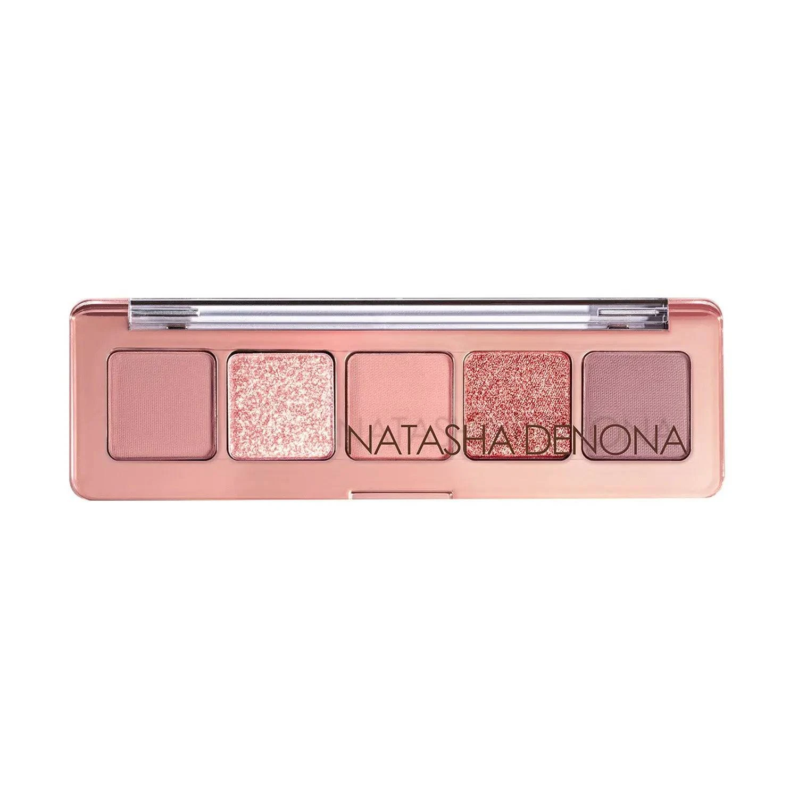
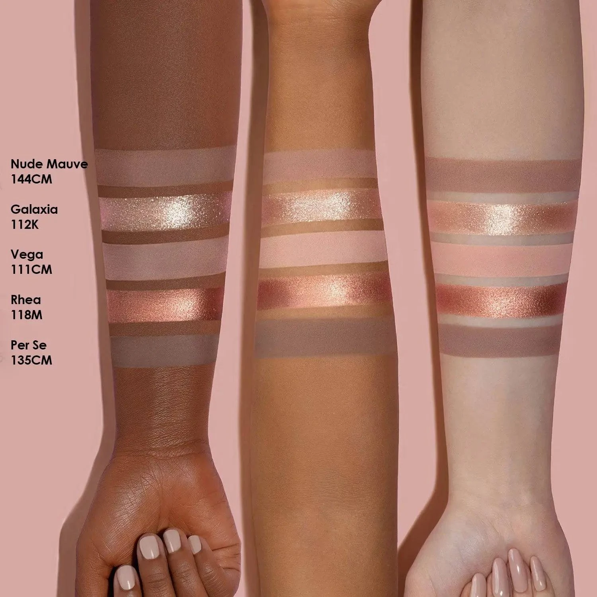
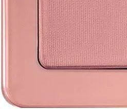
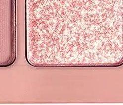
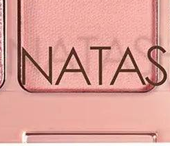
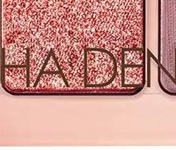
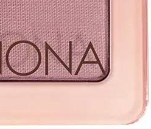

# Natasha Denona 5色 迷你星光盘 Mini Starlette Eyeshadow Palette

以裸调玫粉为主轴，精选品牌经典 Starlette 系列中的裸玫瑰哑光、冰晶香槟闪光、柔软粉哑光、玫铜金属与暖摩卡哑光五色，汇入玫瑰金外壳，单颗 0.8g，质地涵盖奶油哑光与闪光粒子、金属，打造从日常柔美到节日闪耀的复古玫粉眼妆。

$29.00 · 单颗 0.8g × 5色 · 产地意大利

---

## 质地说明

| 代码 | 质地 | 特点 |
|------|------|------|
| CM | Creamy Matte 奶油哑光 | 品牌经典配方，柔滑压粉哑光，发色饱满 |
| K | Sparkling Topper 闪光粒子 | 多维彩色闪光粒子，叠加于其他色号之上增添星钻感 |
| M | Metallic 金属感 | 细磨珍珠粉 + 色彩晶体，无缝高光泽 |

**哑光上色建议：** 用紧密刷头按压上色，再用蓬松刷晕染。
**闪光上色建议：** 用手指或专用刷按压叠加于底色，获得最强多维闪光。
**金属上色建议：** 用湿刷或指腹涂抹，获得最强光泽效果。

---

## 手臂试色

---

## 色号总览

| # | 色名 | 代码 | 质地 | 颜色描述 |
|---|------|------|------|----------|
| 1 | Nude Mauve | 144CM | Creamy Matte | 中调裸玫瑰哑光 |
| 2 | Galaxia | 112K | Sparkling Topper | 冰晶香槟多彩闪光 |
| 3 | Vega | 111CM | Creamy Matte | 柔软浅粉哑光 |
| 4 | Rhea | 118M | Metallic | 鲜明玫瑰铜金属 |
| 5 | Per Se | 135CM | Creamy Matte | 中调暖摩卡哑光 |

---

## Shade 1: Nude Mauve 144CM — Creamy Matte Medium Nude Rose

Use: All-over lid for a sophisticated rosy-nude matte base. Crease definition for soft depth. Pairs with Rhea for a warm nude-metallic pairing. The palette's anchor neutral.

##### 色号 1：中调裸玫瑰哑光 (Nude Mauve) —— 中调裸玫瑰色，奶油哑光。
用途：可全眼铺色做高级裸玫瑰哑光底妆；用于眼窝做柔和定型深度；与 `Rhea` 搭配做暖裸金属组合；盘内核心中性色。

---

## Shade 2: Galaxia 112K — Sparkling Topper Icy Champagne

Use: Press over any base for an ethereal icy champagne galaxy sparkle. Inner corner highlight for a star-like gleam. Apply with fingertip over Vega or Nude Mauve for maximum sparkle impact.

##### 色号 2：冰晶香槟闪光 (Galaxia) —— 冰晶香槟，多彩闪光粒子，Sparkling Topper。
用途：按压叠加于任意底色上打造冰晶香槟星河感；用于眼头做星光点睛；用手指按压叠加于 `Vega` 或 `Nude Mauve` 之上获得最强闪光效果。

---

## Shade 3: Vega 111CM — Creamy Matte Light Soft Pink

Use: All-over lid for a soft romantic pink wash. Inner corner and brow bone brightening. Excellent blending base for Galaxia topper. Pairs with Nude Mauve for a tonal nude-pink look.

##### 色号 3：柔软浅粉哑光 (Vega) —— 柔软浅粉，奶油哑光。
用途：可全眼铺色做柔和浪漫浅粉底妆；用于眼头和眉骨提亮；作为叠加 `Galaxia` 闪光的理想底色；与 `Nude Mauve` 搭配做同色调裸粉眼妆。

---

## Shade 4: Rhea 118M — Metallic Vivid Rose Copper

Use: All-over lid for a vivid metallic rose-copper statement. Inner corner and center lid highlight. Apply damp for maximum metallic payoff. The palette's most impactful warm metallic.

##### 色号 4：鲜明玫瑰铜金属 (Rhea) —— 鲜明玫铜色，金属感。
用途：可全眼铺色做鲜明玫铜金属宣言妆；用于眼头和眼皮中央提亮；湿刷获得最强金属发色；盘内最强冲击力的暖金属主角色。

---

## Shade 5: Per Se 135CM — Creamy Matte Medium Warm Taupe Rose

Use: Crease and outer corner for warm definition and depth. All-over lid for a deeper rosy-taupe matte. Pairs with Rhea for metallic-meets-matte contrast. The palette's deepest neutral for sculpting.

##### 色号 5：中调暖摩卡哑光 (Per Se) —— 中调暖摩卡玫瑰，奶油哑光。
用途：用于眼窝和眼尾做暖色定型深度；可全眼铺色做较深裸玫摩卡哑光底妆；与 `Rhea` 搭配做金属遇哑光对比；盘内最深哑光，适合塑形。
