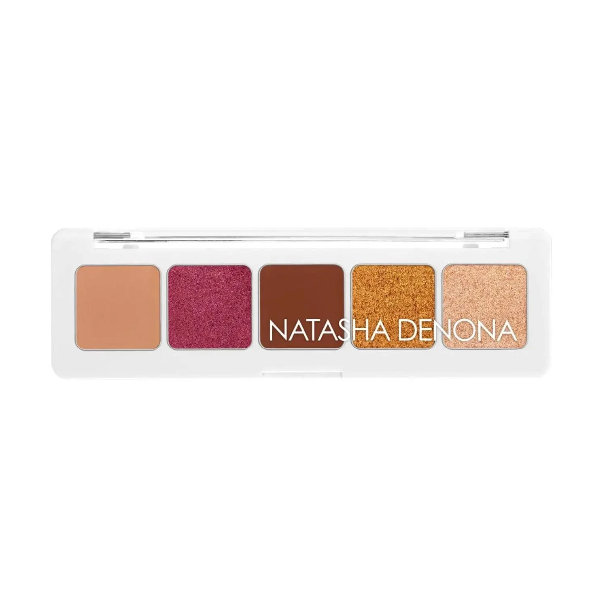
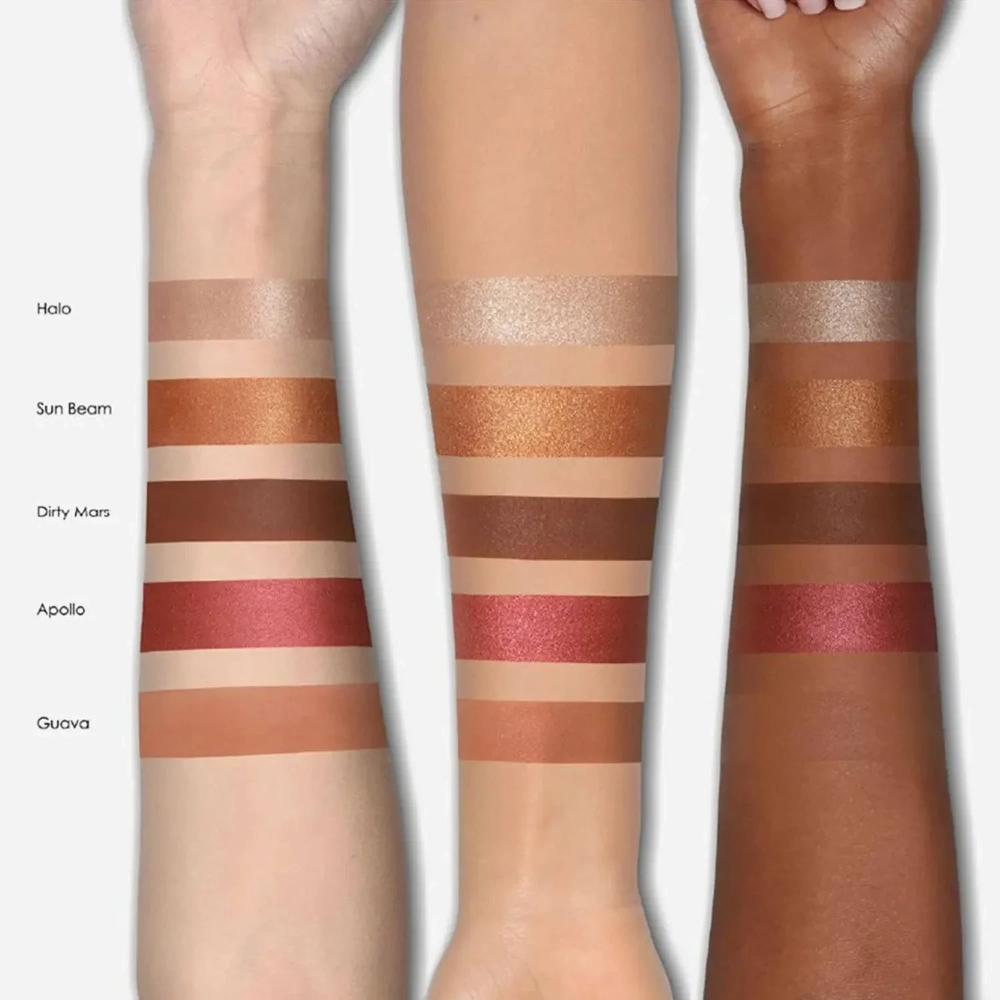
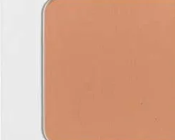
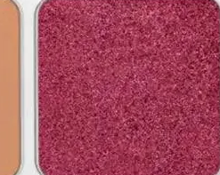
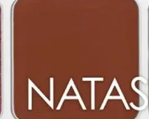
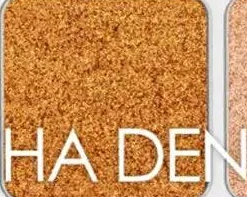
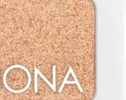

# Natasha Denona 5色 迷你日落盘 Mini Sunset Eyeshadow Palette

荣获多项大奖的 Sunset 15色大盘的迷你旅行版，精选日落主题五色：深哑光蜜桃、砖红金属、奶油棕哑光、浓郁青铜金属与香槟裸金属，汇入白色外壳，单颗 0.8g，质地涵盖奶油哑光与金属，重现暖调夕阳烟熏眼妆的精髓。

$29.00 · 单颗 0.8g × 5色 · 产地意大利

---

## 质地说明

| 代码 | 质地 | 特点 |
|------|------|------|
| CM | Creamy Matte 奶油哑光 | 品牌经典配方，柔滑压粉哑光，发色饱满 |
| M | Metallic 金属感 | 细磨珍珠粉 + 色彩晶体，无缝高光泽 |

**哑光上色建议：** 用紧密刷头按压上色，再用蓬松刷晕染。
**金属上色建议：** 用湿刷或指腹涂抹，获得最强光泽效果。

---

## 手臂试色

---

## 色号总览

| # | 色名 | 质地 | 颜色描述 |
|---|------|------|----------|
| 1 | Guava | Creamy Matte | 深哑光蜜桃橘 |
| 2 | Apollo | Metallic | 明亮砖红金属 |
| 3 | Dirty Mars | Creamy Matte | 奶油棕哑光 |
| 4 | Sun Beam | Metallic | 浓郁青铜金属 |
| 5 | Halo | Metallic | 香槟裸金属 |

---

## Shade 1: Guava — Creamy Matte Deep Matte Peach

Use: All-over lid for a warm peachy matte base. Crease softening for a diffused sunset warmth. Transition shade between the darker Dirty Mars and lighter shades. Adds a warm peachy depth to the outer corner.

##### 色号 1：深哑光蜜桃橘 (Guava) —— 深暖蜜桃橘，奶油哑光。
用途：可全眼铺色做暖蜜桃哑光底妆；用于眼窝做弥散日落暖意；作为深棕与浅色之间的过渡色；集中于眼尾增添暖蜜桃深度。

---

## Shade 2: Apollo — Metallic Bright Brick Red

Use: All-over lid for a bold brick-red metallic statement. Outer corner for an intense warm focal point. Apply damp for maximum metallic payoff. The palette's most dramatic shade — pairs with Dirty Mars for a deep sunset smoky.

##### 色号 2：明亮砖红金属 (Apollo) —— 明亮砖红，金属感。
用途：可全眼铺色做大胆砖红金属宣言妆；集中于眼尾做强烈暖调焦点；湿刷获得最强金属发色；盘内最戏剧化色号，与 `Dirty Mars` 搭配做深沉日落烟熏。

---

## Shade 3: Dirty Mars — Creamy Matte Creamy Brown

Use: All-over lid for a classic warm brown matte base. Crease definition and blending for depth. Transition between the vivid Apollo and lighter metallics. The palette's workhorse neutral brown.

##### 色号 3：奶油棕哑光 (Dirty Mars) —— 奶油温棕，奶油哑光。
用途：可全眼铺色做经典暖棕哑光底妆；用于眼窝定型和晕染做深度层次；作为鲜艳 `Apollo` 与浅色金属之间的过渡；盘内最百搭的中性棕色。

---

## Shade 4: Sun Beam — Metallic Rich Bronze

Use: All-over lid for a warm rich bronze metallic glow. Center lid highlight over matte base for a sun-kissed radiance. Pairs with Apollo for a warm metallic-on-metallic sunset look. Apply damp for full-intensity bronze.

##### 色号 4：浓郁青铜金属 (Sun Beam) —— 浓郁暖青铜，金属感。
用途：可全眼铺色打造浓郁暖青铜金属光感；叠加于哑光底色中央做阳光吻肤提亮；与 `Apollo` 搭配做暖调金属叠层日落妆；湿刷获得最强青铜发色。

---

## Shade 5: Halo — Metallic Champagne Nude

Use: Inner corner and center lid for a brightening champagne highlight. Brow bone highlight. Pairs with Dirty Mars for a versatile daytime warm neutral look. The palette's lightest shade — perfect for blending and softening edges.

##### 色号 5：香槟裸金属 (Halo) —— 香槟裸色，金属感。
用途：用于眼头和眼皮中央做提亮香槟高光；用于眉骨高光；与 `Dirty Mars` 搭配做百搭日常暖裸眼妆；盘内最浅色号，适合晕染和柔化边缘。
