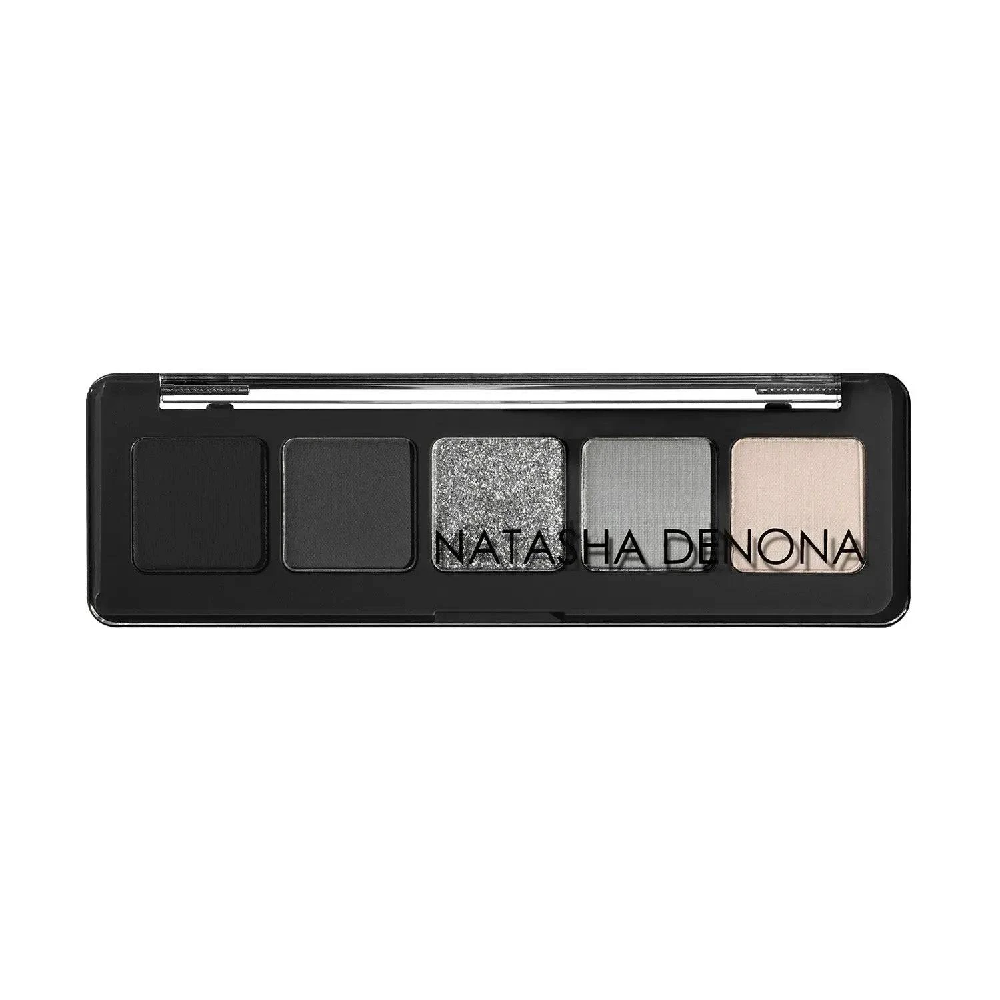
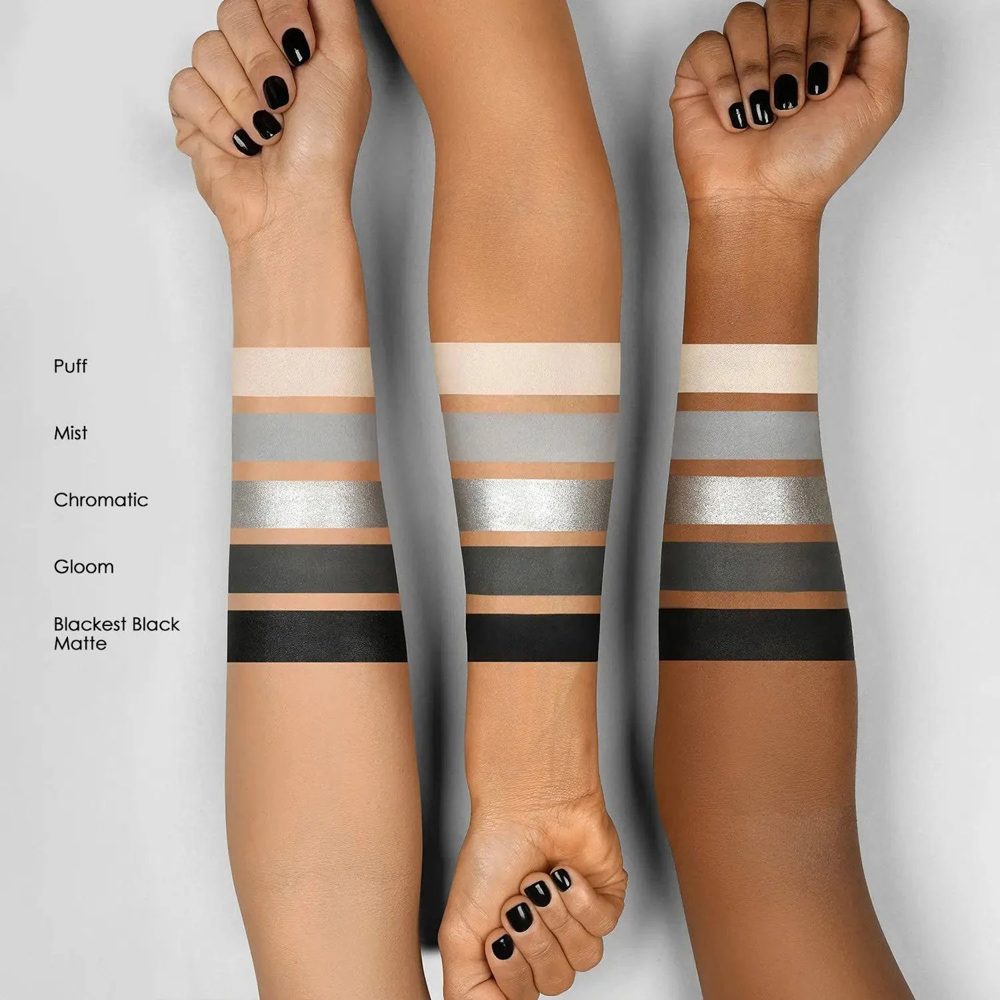
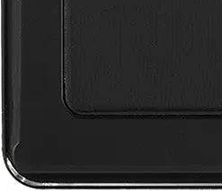
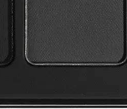
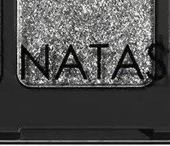
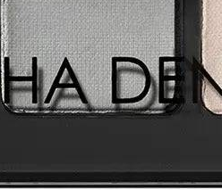
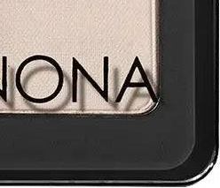

# Natasha Denona 5色 迷你极光冰雪盘 Mini Xenon Eyeshadow Palette

灵感源自 Natasha 标志性拉长猫眼烟熏妆，以哑光纯黑、深炭灰、铂银金属、冷调灰蓝与裸米白五色汇集于黑色外壳，全系奶油哑光与金属质地，单颗 0.8g，可复刻经典拉长烟熏猫眼，亦可日常裸色叠搭。

€30.25 · 单颗 0.8g × 5色 · 产地意大利 · 无对羟基苯甲酸酯 · 无矿物油 · 无酒精

---

## 质地说明

| 代码 | 质地 | 特点 |
|------|------|------|
| CM | Creamy Matte 奶油哑光 | 品牌经典配方，柔滑压粉哑光，发色饱满 |
| M | Metallic 金属感 | 细磨珍珠粉 + 色彩晶体，无缝高光泽 |

**哑光上色建议：** 用紧密刷头按压上色，再用蓬松刷晕染。
**金属上色建议：** 用湿刷或指腹涂抹，获得最强金属感效果。

---

## 手臂试色

---

## 色号总览

| # | 色名 | 代码 | 质地 | 颜色描述 |
|---|------|------|------|----------|
| 1 | Blackest Black | CM | Creamy Matte | 纯正哑光极黑 |
| 2 | Gloom | 280CM | Creamy Matte | 深炭灰哑光 |
| 3 | Chromatic | 04M | Metallic | 铂金银箔金属（高亮） |
| 4 | Mist | 281CM | Creamy Matte | 冷调灰蓝哑光 |
| 5 | Puff | 282CM | Creamy Matte | 浅裸米哑光 |

---

## Shade 1: Blackest Black CM — Creamy Matte Pure Black

Use: Outer corner and lower lash line for a deep black smoky anchor. All-over lid for a bold graphic black look. The palette's darkest shade — Natasha's very first product, her signature black.

##### 色号 1：纯正哑光极黑 (Blackest Black) —— 纯正极黑，奶油哑光。
用途：集中于眼尾和下睫毛线打造深邃黑色烟熏锚点；可全眼铺色做大胆纯黑宣言妆；Natasha 品牌第一款产品，其标志性极黑色号。

---

## Shade 2: Gloom 280CM — Creamy Matte Deep Charcoal

Use: All-over lid for a deep charcoal wash. Crease and outer V for smoky blending. Transition between Blackest Black and lighter shades. Pairs with Chromatic for a classic smoky metallic eye.

##### 色号 2：深炭灰哑光 (Gloom) —— 深炭灰，奶油哑光。
用途：可全眼铺色做深沉炭灰底妆；用于眼窝和外眼角 V 区做烟熏晕染；作为极黑与浅色之间的过渡色；与 `Chromatic` 搭配做经典烟熏金属眼妆。

---

## Shade 3: Chromatic 04M — Metallic Platinum Silver

Use: Inner corner and center lid for a dramatic platinum silver pop. All-over lid for a full silver metallic statement. Apply damp for maximum foiled metallic intensity. The palette's hero highlight shade.

##### 色号 3：铂金银箔金属 (Chromatic) —— 铂金银，金属感高亮。
用途：用于眼头和眼皮中央打造戏剧性铂银光点；可全眼铺色做全银金属宣言妆；用湿刷获得最强箔感金属发色；盘内主角高光色号。

---

## Shade 4: Mist 281CM — Creamy Matte Cool Grey-Blue

Use: All-over lid for a soft cool grey wash. Crease transition between Gloom and Puff. Pairs with Blackest Black for a monochrome grey smoky. Creates a cool ethereal daytime look with Puff.

##### 色号 4：冷调灰蓝哑光 (Mist) —— 冷调灰蓝，奶油哑光。
用途：可全眼铺色做柔和冷灰底妆；用于眼窝作深灰与裸米之间的过渡色；与 `Blackest Black` 搭配打造单色调灰色烟熏；与 `Puff` 搭配做冷调空灵日常眼妆。

---

## Shade 5: Puff 282CM — Creamy Matte Nude Beige

Use: All-over lid as a sheer neutral base. Inner corner and brow bone for brightening. Blending and diffusing other shades. The palette's versatile base shade for day-to-night transitions.

##### 色号 5：浅裸米哑光 (Puff) —— 浅裸米色，奶油哑光。
用途：可全眼铺底做透明裸色基底；用于眼头和眉骨提亮；用于晕染和扩散其他色号；盘内最百搭的日夜转换基底色。
