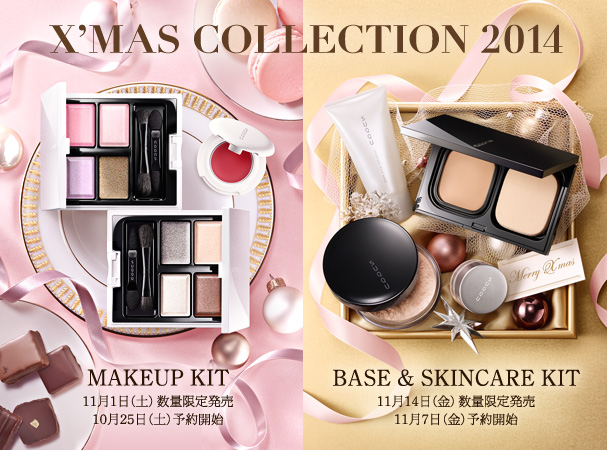

# SUQQU 4色 四色盘 雪莓 Blend Color Eyeshadow EX-22 Yukiichigo
*发布：2014 · 限定色*

> 雪莓，如皑皑白雪上落下的一颗清冷红莓。这是一盘极其高冷、空灵，充满日系仙气与少女感的冷调盘——清透薰衣草紫如覆于眼皮的一层月光过滤，嫩粉红如冻出的绯红晕，深邃勃艮第梅子酒红眼线膏内藏金橄榄碎闪，将空灵与深邃融为一体。

> *SNOW BERRY — like a lone red berry fallen on pristine snow. A palette of ethereal, cool-toned femininity: translucent lavender like moonlight filtering over the lid, soft pink like frost-kissed colour, and a deep plummy-burgundy cream liner glittering with golden-olive-bronze shimmer — pure, serene, and quietly captivating.*

---

## 色号 A（左上）：打底光泽色 — 清透浅薰衣草紫

使用：Apply across the lid as a translucent, pale lavender satin base that instantly clears sallowness and creates a cool, luminous canvas.

##### 色号 A（左上）——【清透浅薰衣草紫】Pale Lavender Satin。揉进极细微的粉色、蓝色与丁香紫碎光。抹上眼皮几乎无厚重粉感，如一层清冷月光，修饰眼眶暗沉，令眼眶极净极透。

---

## 色号 B（右上）：主题提色 — 柔和中性嫩粉色

使用：Blend into the crease and upper lid as a soft, warm-pink accent with peachy-gold shimmer that adds gentle warmth without puffiness.

##### 色号 B（右上）——【柔和中性嫩粉色】Soft Warm Pink，心机加入蜜桃金微闪。虽为冷粉色，因带一丝蜜桃暖调折射，上眼不显眼肿，叠于双眼皮褶皱处如雪地冻出红晕，楚楚清纯。

---

## 色号 C（左下）：过渡融合色 — 柔米白粉缎

使用：Sweep around the edges to blend and soften the lavender and pink, creating a diffused, snow-like finish.

##### 色号 C（左下）——【柔米白粉色】Pale White-Pink Satin，发色低调温柔。大面积晕染眼影边缘，让高冷紫色与嫩粉色极自然融入肤色，营造出雪地般柔焦感，博主称之为"消肿调和格"。

---

## 色号 D（右下）：眼线膏色 — 深邃梅子勃艮第酒红

使用：Line the lash roots with this creamy plum-burgundy, letting the golden-bronze shimmer float up to create a mysterious, smoky finish.

##### 色号 D（右下）——【深邃梅子勃艮第酒红膏】Plummy-Burgundy Cream，糅合金橄榄与青铜色极细碎闪。用刷子在睫毛根部化开，金青铜碎闪浮起，不仅压住粉色轻浮，更打造出既神秘又成熟的"微醺阴影线"。

---

*2014 SUQQU X'MAS COLLECTION / ブレンドカラーアイシャドウ EX-22 / 2014年11月1日 数量限定発売*
