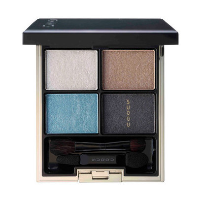
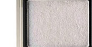
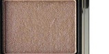
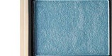
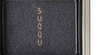

# SUQQU 4色 四色盘 翡翠光 Designing Color Eyes 07 Hisuikou
*发布：2017*

> 翡翠光，以真玉的透明深邃为灵感——象牙白珠光如玉石表面的凝脂光泽，温暖的金棕如玉中的土地肌理，清透的翡翠蓝绿如玉石在光下透出的生命之色，深沉的靛蓝如玉心深处的静谧暗影。四色相生，如同一块上等翡翠原石在阳光下展现出的光彩万象，质朴而珍贵。

> *Hisuikou — inspired by the translucent depth of genuine jade. Ivory pearl shimmer like the lustrous surface of polished jade, warm golden tan like the earthy matrix within the stone, clear jade blue-green like the life-colour of jade in light, and deep indigo-charcoal like the quiet shadow at the jade's heart. Four colours in harmony, like a fine piece of jade revealing all its facets in sunlight — humble and precious.*

---

## 色号 1 （左上） — 象牙白珠光

使用：Apply to the inner corner and brow bone as a pure ivory-white shimmer highlight that reflects and opens the eye.

##### 色号 1（左上） —— 纯净的象牙白调珠光，质地细腻轻薄，如玉石表面磨光后透出的凝脂光泽，素雅而温润。
用途：点涂眼头及泪沟提亮，或精扫眉骨作为高光；亦可叠于眼睑中央提升整体的清透感。

---

## 色号 2 （右上） — 暖金棕

使用：Sweep across the lid as a warm, earthy golden-tan that creates a natural, universally flattering base.

##### 色号 2（右上） —— 温暖的金棕调，介于焦糖与摩卡之间，含细腻光泽感，质感自然温润，如玉石中富含铁质的暖色纹理。
用途：均匀铺满眼窝作为基底，以暖金棕打造温柔自然的大地底色；与翡翠蓝绿搭配时形成暖冷的经典对比。

---

## 色号 3 （左下） — 翡翠蓝绿

使用：Blend across the lid for a clear, vivid jade blue-green that is the heart of this palette's colour story.

##### 色号 3（左下） —— 清透鲜活的翡翠蓝绿调，色彩明净而有深度，如正品翡翠在阳光下透出的那种生动翠色，是本盘的视觉焦点。
用途：铺于眼窝中心演绎翡翠主色，叠于金棕底色之上可强化宝石质感；与象牙白搭配可演绎清凉夏日妆效。

---

## 色号 4 （右下） — 深靛蓝灰

使用：Apply along the lash roots to add a deep, smoky indigo-charcoal that gives the jade palette its grounding depth.

##### 色号 4（右下） —— 深沉的靛蓝灰调，近乎炭黑，含轻微的蓝调底色，如翡翠深处的暗影，沉静而有分量。
用途：沿睫毛线晕染加深轮廓，演绎深邃烟熏效果；叠于翡翠绿的外侧眼尾，加深色彩层次，令宝石感更为立体。
