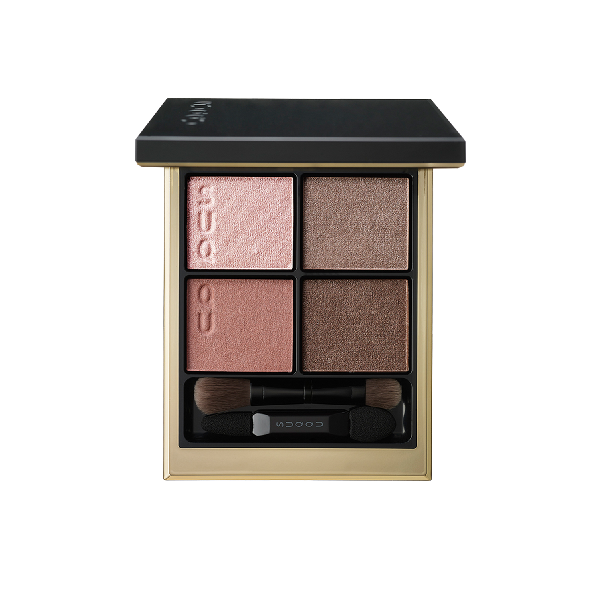
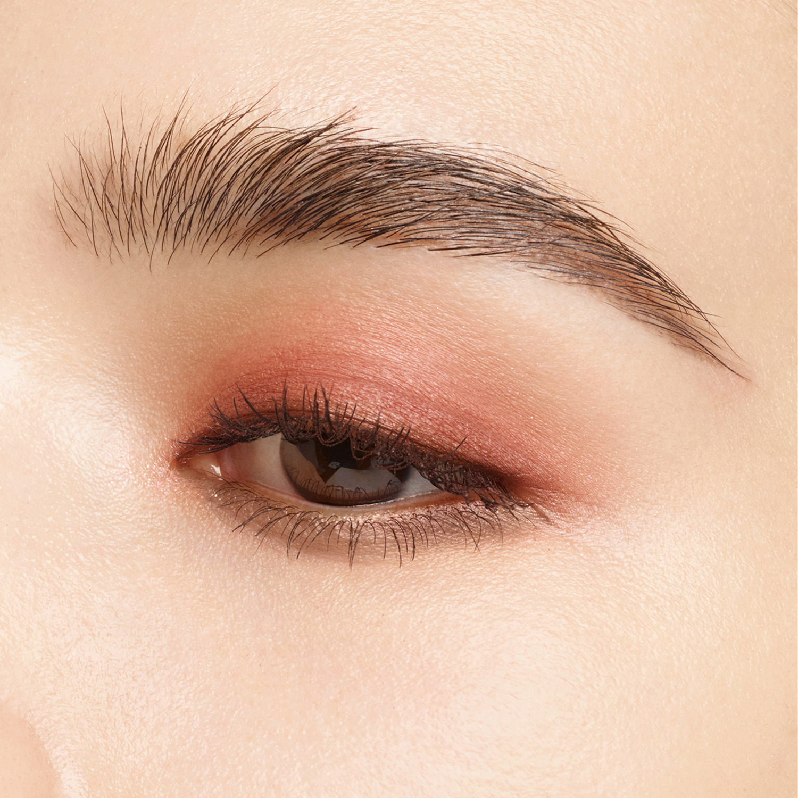
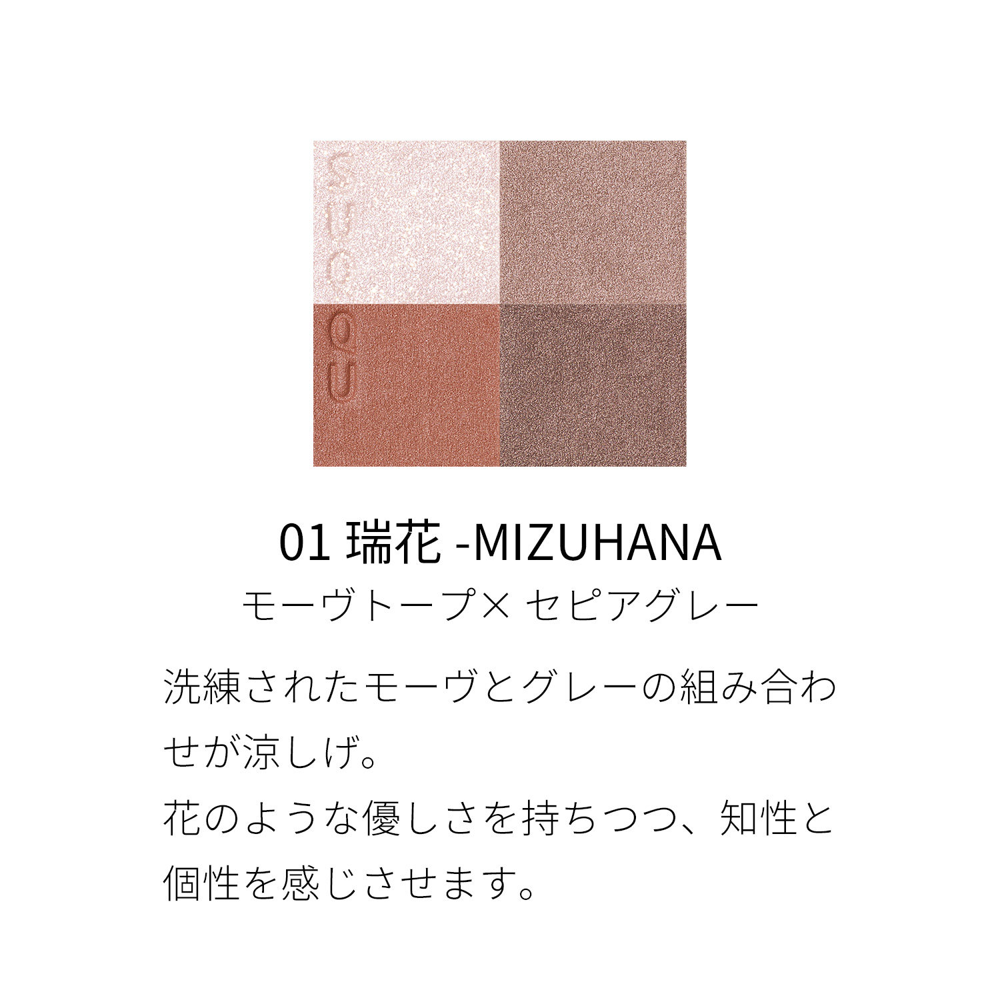
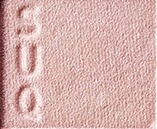
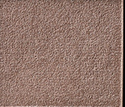
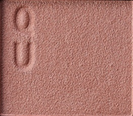
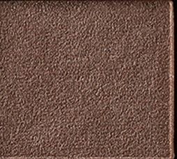

# SUQQU 4色 四色盘 瑞花 Signature Color Eyes 01 Mizuhana
*发布：2024*

> 精炼的玫灰与丝绒灰色交织，沉稳中透出花朵般的柔美。如早晨薄雾中含苞待放的花，以知性与个性共融的色调，为眼眸赋予优雅的清醒感。

> *Sophisticated mauve and grey intertwine in calm elegance — like a flower unfurling through morning mist, with a refined palette that speaks of both intellect and personality.*

---

### 使用方法 How To Use

| 方法一 | 方法二 |
|--------|--------|
|  |  |

**方法一（B→D→C→A）：** ①B铺眼窝，②D晕睫毛线三分之二处，③C铺眼窝并与D融合晕开，④A从眼头叠加提亮。

**方法二（D→B→A→C）：** ①D沿睫毛根部晕染，②B扫下眼睑，③A精准点涂眼头（不向外扩散），④C铺满眼窝。

---

## 色号 A：覆光色 Coat Color — 珠光淡粉白

使用：精准点涂眼头，柔和提亮内眼角与眉骨。

##### 色号 A：覆光色 (Coat Color) —— 淡粉白细腻珠光，轻盈透亮。
用途：点于眼头提亮，或叠于其他色号上增加整体光泽；亦可单独轻扫眉骨。

---

## 色号 B：底色 Base Color — 冷调摩卡玫灰

使用：铺满眼窝作为基调打底。

##### 色号 B：底色 (Base Color) —— 玫灰色系，带浅淡珠光，冷调雅致。
用途：铺满眼窝，塑造低调高级的底色氛围；亦可单独晕开打造简约单色妆。

---

## 色号 C：主色 Main Color — 暖铜棕粉珠光

使用：铺于眼窝增加色彩主体，叠于底色上。

##### 色号 C：主色 (Main Color) —— 暖调铜棕粉珠光，光感丰盈。
用途：铺眼窝作为主体色，与B色叠加打造有层次的玫棕渐变；亦可晕于下眼睑增添温暖感。

---

## 色号 D：深色 Deep Color — 深灰棕乌木调

使用：沿睫毛根部晕染，加深眼神轮廓。

##### 色号 D：深色 (Deep Color) —— 深灰棕，细腻低调，赋予眼妆立体深度。
用途：晕染睫毛线，强化眼神轮廓；与C色叠加可加深眼窝层次，打造深邃不刻板的气质眼妆。
