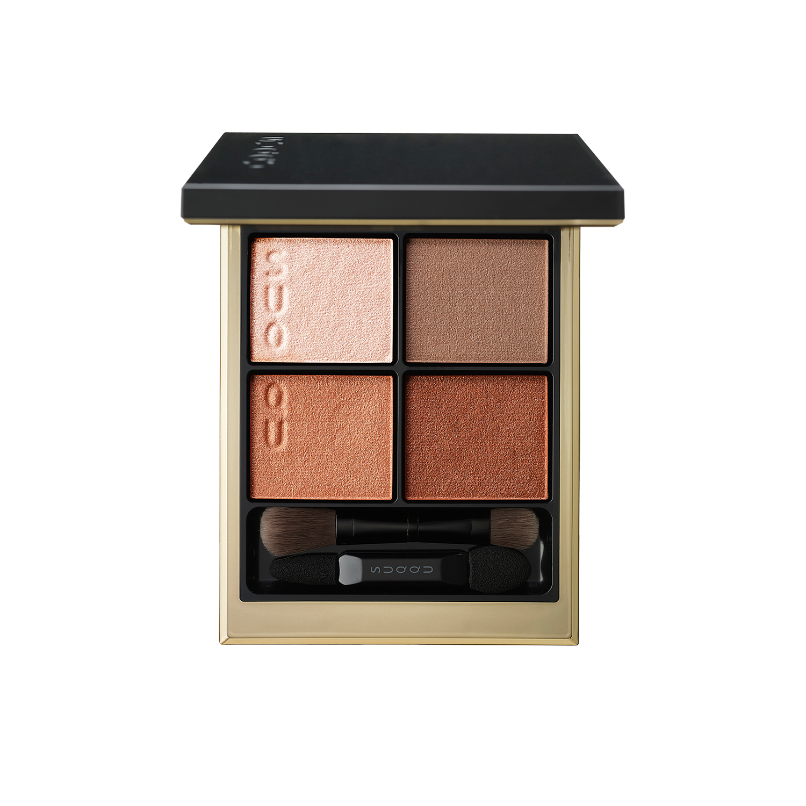
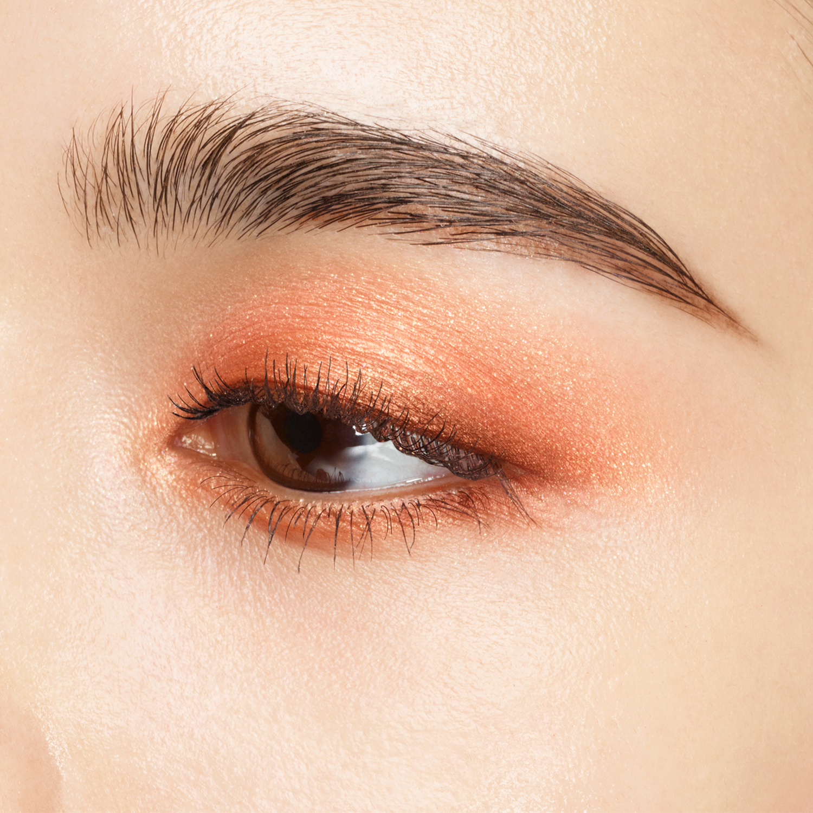
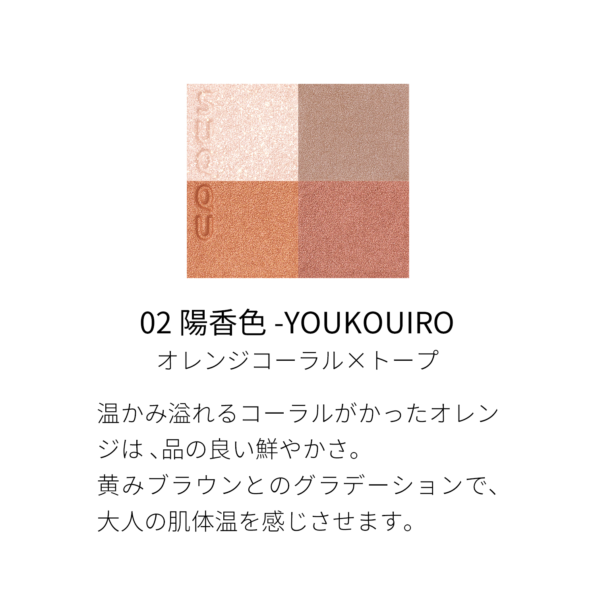
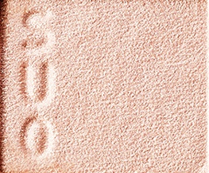
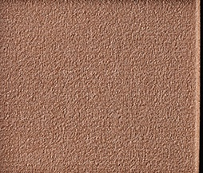
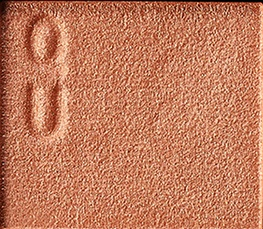
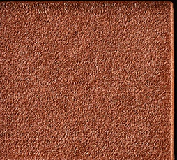

# SUQQU 4色 四色盘 陽香色 Signature Color Eyes 02 Youkouiro
*发布：2024*

> 充满暖意的珊瑚橙，以明艳而不失高雅的姿态显色。与黄调棕色的渐变相叠，如肌肤自然散发的温度，演绎成熟女性的光彩。

> *A warm coral-orange blooms with refined vibrancy. Layered against yellow-brown gradients, it evokes the natural warmth of the skin — a mature radiance.*

---

### 使用方法 How To Use

| 方法一 | 方法二 |
|--------|--------|
|  |  |

**方法一（B→D→C→A）：** ①B铺眼窝，②D晕睫毛线三分之二处，③C铺眼窝并与D融合晕开，④A从眼头叠加提亮。

**方法二（D→B→A→C）：** ①D沿睫毛根部晕染，②B扫下眼睑，③A精准点涂眼头（不向外扩散），④C铺满眼窝。

---

## 色号 A：覆光色 Coat Color — 米白珠光

使用：点于眼头及眉骨，轻盈提亮。

##### 色号 A：覆光色 (Coat Color) —— 香槟米白珠光，透亮轻柔。
用途：点涂眼头，提亮内眼角；亦可轻扫眉骨或叠于其他色号增加整体光泽。

---

## 色号 B：底色 Base Color — 暖棕金

使用：铺满眼窝打底，奠定暖调基础。

##### 色号 B：底色 (Base Color) —— 暖调棕金珠光，肌肤融合感极佳。
用途：铺满眼窝作为底色，塑造暖棕基调；与C色叠加可强化珊瑚橙的显色层次。

---

## 色号 C：主色 Main Color — 橙珊瑚珠光

使用：铺于眼窝作为主体颜色，与底色叠加。

##### 色号 C：主色 (Main Color) —— 明艳橙珊瑚珠光，充满活力与温度。
用途：铺于眼窝打造色彩重心，与B色自然融合展现暖棕渐变；亦可晕于下眼睑营造水光感。

---

## 色号 D：深色 Deep Color — 深红棕

使用：沿睫毛根部晕染，收紧眼形轮廓。

##### 色号 D：深色 (Deep Color) —— 深红棕，色调浓郁，赋予眼神成熟魅力。
用途：晕染睫毛线，勾勒眼廓；与C色叠加可加深眼窝层次，打造橙棕烟熏渐变。
