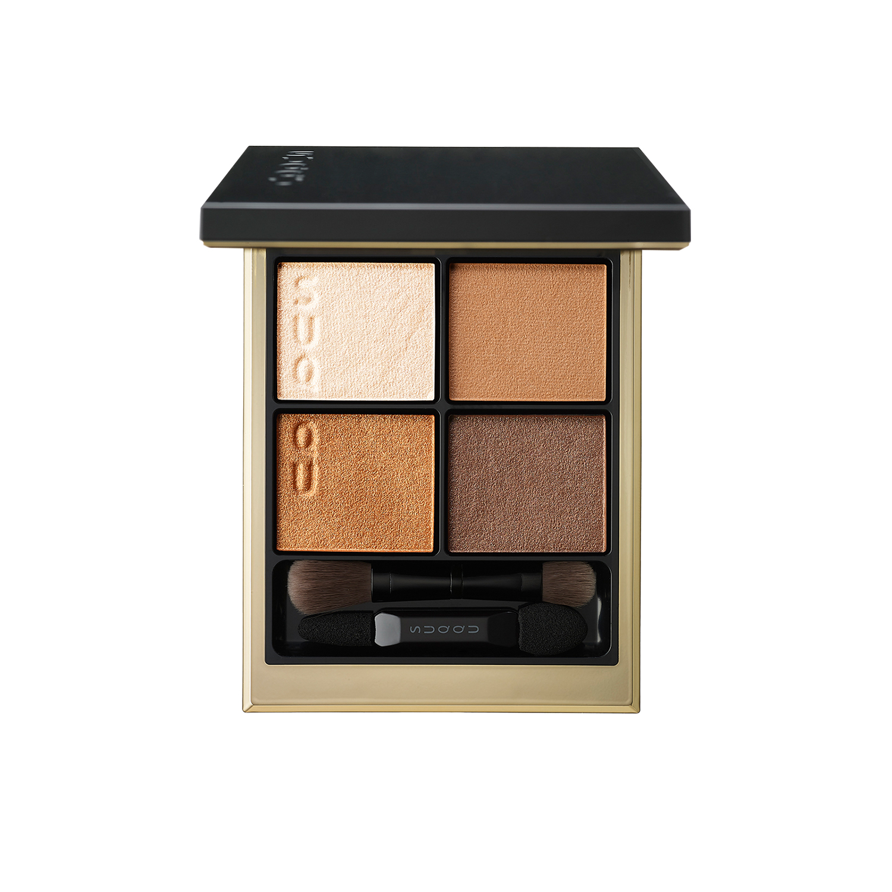
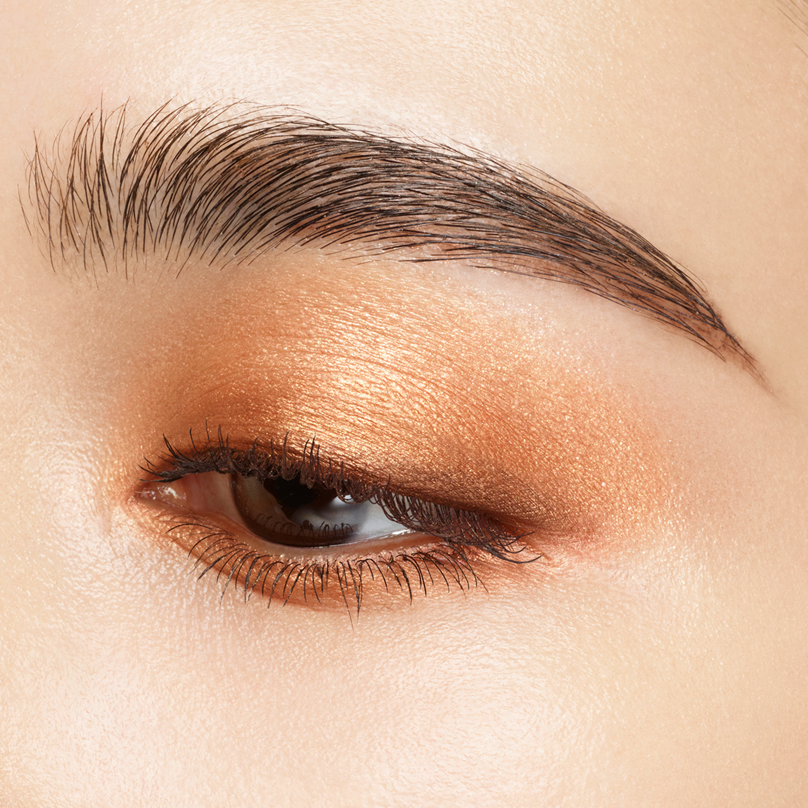
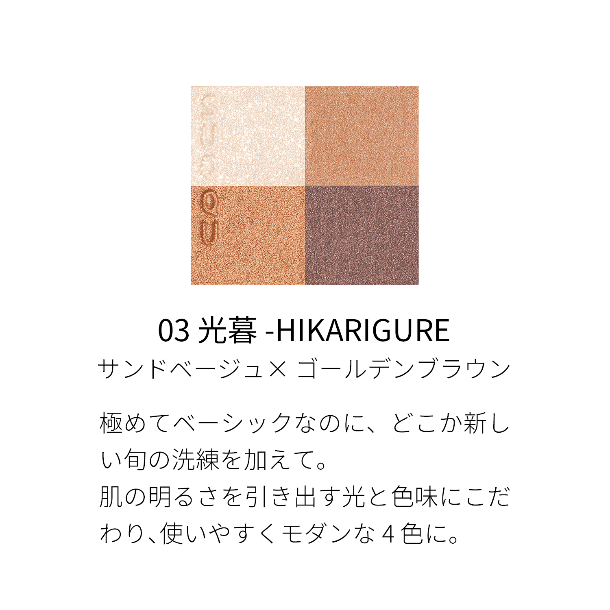
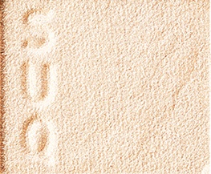
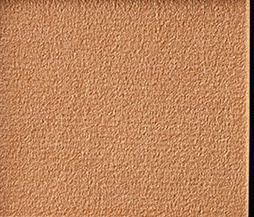
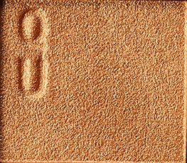
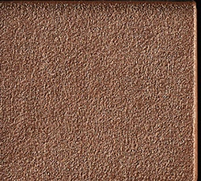

# SUQQU 4色 四色盘 光暮 Signature Color Eyes 03 Hikarigure
*发布：2024*

> 极致基础，却带着时令的全新洗练感。以引出肌肤明亮度的光色与色调精心构成，打造四色皆可独立使用、现代而百搭的眼妆盘。

> *Intensely wearable yet quietly refreshed with a seasonal refinement — four shades curated for luminosity and versatility, built for modern everyday wear.*

---

### 使用方法 How To Use

| 方法一 | 方法二 |
|--------|--------|
|  |  |

**方法一（B→D→C→A）：** ①B铺眼窝，②D晕睫毛线三分之二处，③C铺眼窝并与D融合晕开，④A从眼头叠加提亮。

**方法二（D→B→A→C）：** ①D沿睫毛根部晕染，②B扫下眼睑，③A精准点涂眼头（不向外扩散），④C铺满眼窝。

---

## 色号 A：覆光色 Coat Color — 珠光米白

使用：点于眼头，轻柔提亮内眼角。

##### 色号 A：覆光色 (Coat Color) —— 细腻珠光米白，柔和发光。
用途：点涂眼头，提亮眼神；亦可叠于其他色号上增加整体光感。

---

## 色号 B：底色 Base Color — 暖金棕

使用：铺满眼窝，奠定暖棕基调。

##### 色号 B：底色 (Base Color) —— 暖金棕珠光，肌肤融合感极佳。
用途：铺满眼窝作为底色，赋予眼妆温暖的沙金基调；与C色叠加可丰富层次感。

---

## 色号 C：主色 Main Color — 橙铜棕珠光

使用：铺于眼窝作为主体色，叠于底色之上。

##### 色号 C：主色 (Main Color) —— 暖橙铜棕珠光，饱满显色。
用途：铺眼窝打造色彩重心；与B色自然融合展现暖棕渐变，亦可单独使用呈现日系暖棕妆。

---

## 色号 D：深色 Deep Color — 深灰棕

使用：沿睫毛根部晕染，赋予眼神深邃感。

##### 色号 D：深色 (Deep Color) —— 深灰棕，哑光质感，强化眼妆轮廓。
用途：晕染睫毛线，加深眼形；与C色叠加可打造深邃自然的棕调烟熏眼。
