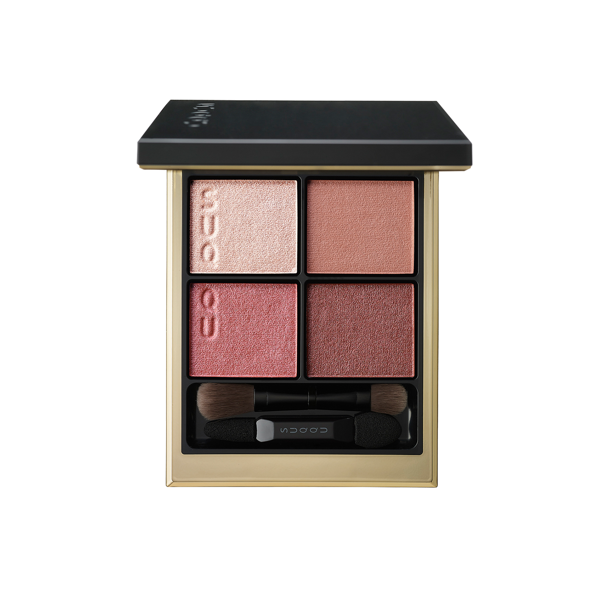
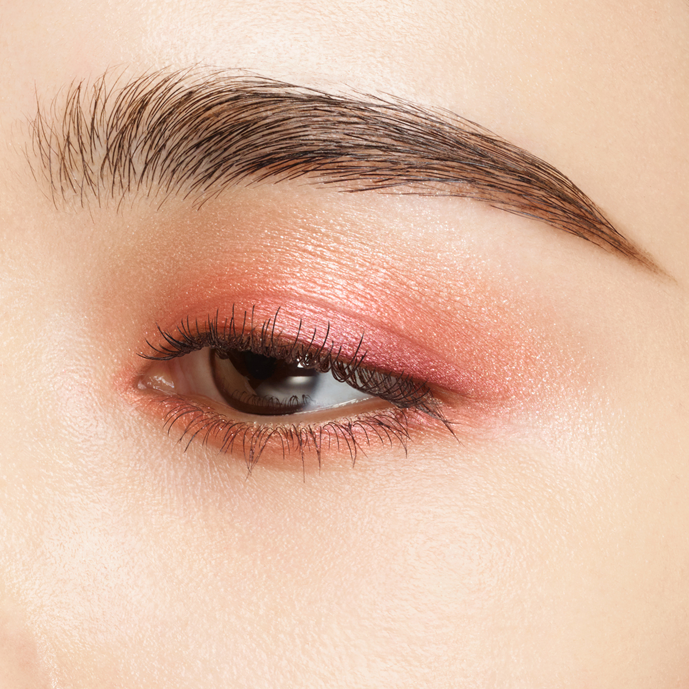
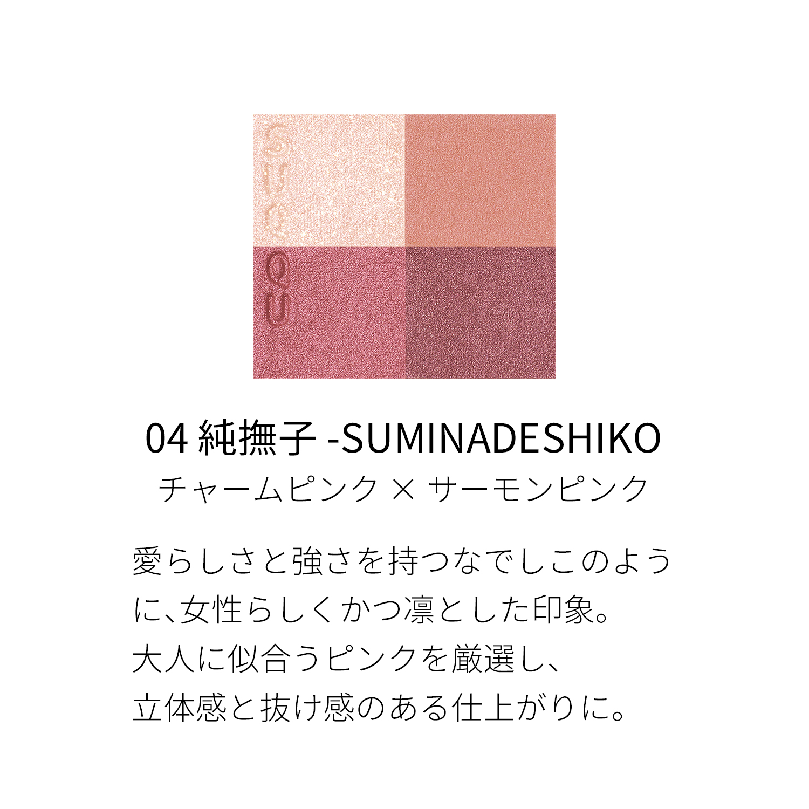
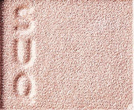
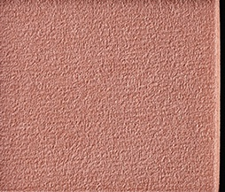
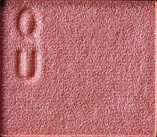
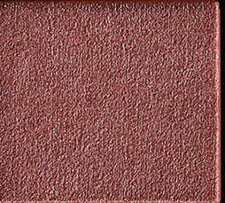

# SUQQU 4色 四色盘 純撫子 Signature Color Eyes 04 Suminadeshiko
*发布：2024*

> 如石竹花般兼具娇柔与坚韧，以女性美与凛然气质并存的印象呈现。严选成熟女性专属的粉色调，打造兼具立体感与透亮感的妆效。

> *Like the dianthus flower — delicate yet resilient — this palette embodies feminine beauty and composed strength. Carefully chosen pinks for a dimensional, sophisticated look.*

---

### 使用方法 How To Use

| 方法一 | 方法二 |
|--------|--------|
|  |  |

**方法一（B→D→C→A）：** ①B铺眼窝，②D晕睫毛线三分之二处，③C铺眼窝并与D融合晕开，④A从眼头叠加提亮。

**方法二（D→B→A→C）：** ①D沿睫毛根部晕染，②B扫下眼睑，③A精准点涂眼头（不向外扩散），④C铺满眼窝。

---

## 色号 A：覆光色 Coat Color — 淡粉珠光

使用：点于眼头提亮，亦可扫于眉骨。

##### 色号 A：覆光色 (Coat Color) —— 细腻淡粉珠光，纯净透亮。
用途：点涂眼头，柔和提亮；或轻扫眉骨，为全脸增添微微光感。

---

## 色号 B：底色 Base Color — 珊瑚裸粉

使用：铺满眼窝，奠定温柔粉调基础。

##### 色号 B：底色 (Base Color) —— 珊瑚裸粉，细腻珠光，肌肤亲和度高。
用途：作为底色铺满眼窝，营造温柔粉调的妆感底盘；与C色叠加可加深粉调层次。

---

## 色号 C：主色 Main Color — 玫粉珠光

使用：铺于眼窝作为主体色，叠于底色之上。

##### 色号 C：主色 (Main Color) —— 玫瑰粉珠光，鲜亮而不失高雅。
用途：铺于眼窝打造粉调重心，与B色融合展现饱满渐变；亦可单独晕开打造清透单色粉妆。

---

## 色号 D：深色 Deep Color — 深莓棕紫

使用：沿睫毛根部晕染，加深轮廓。

##### 色号 D：深色 (Deep Color) —— 深莓棕带紫调，赋予粉色眼妆成熟深度。
用途：晕染睫毛线，收紧眼形；与C色叠加可营造深邃玫粉渐变，打造凛然妆感。
