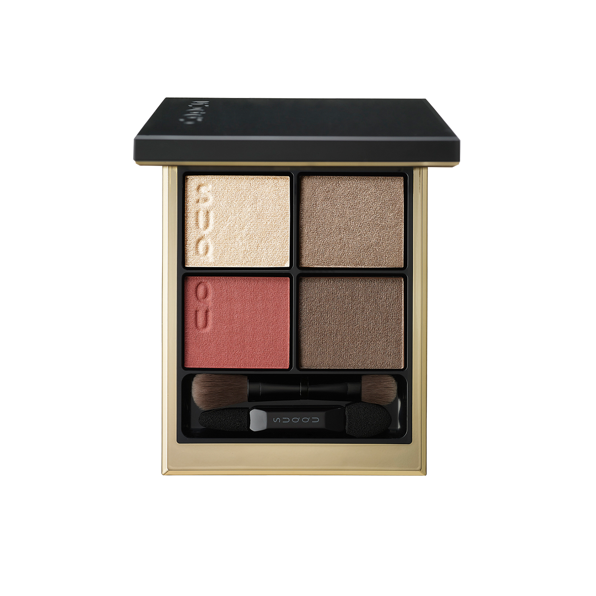
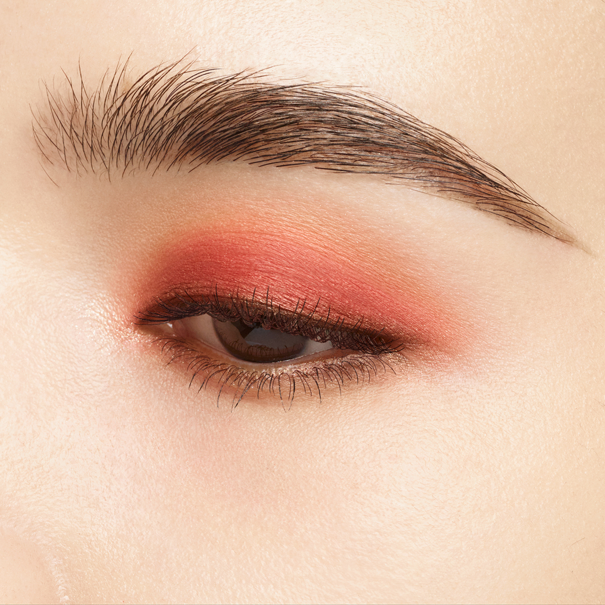
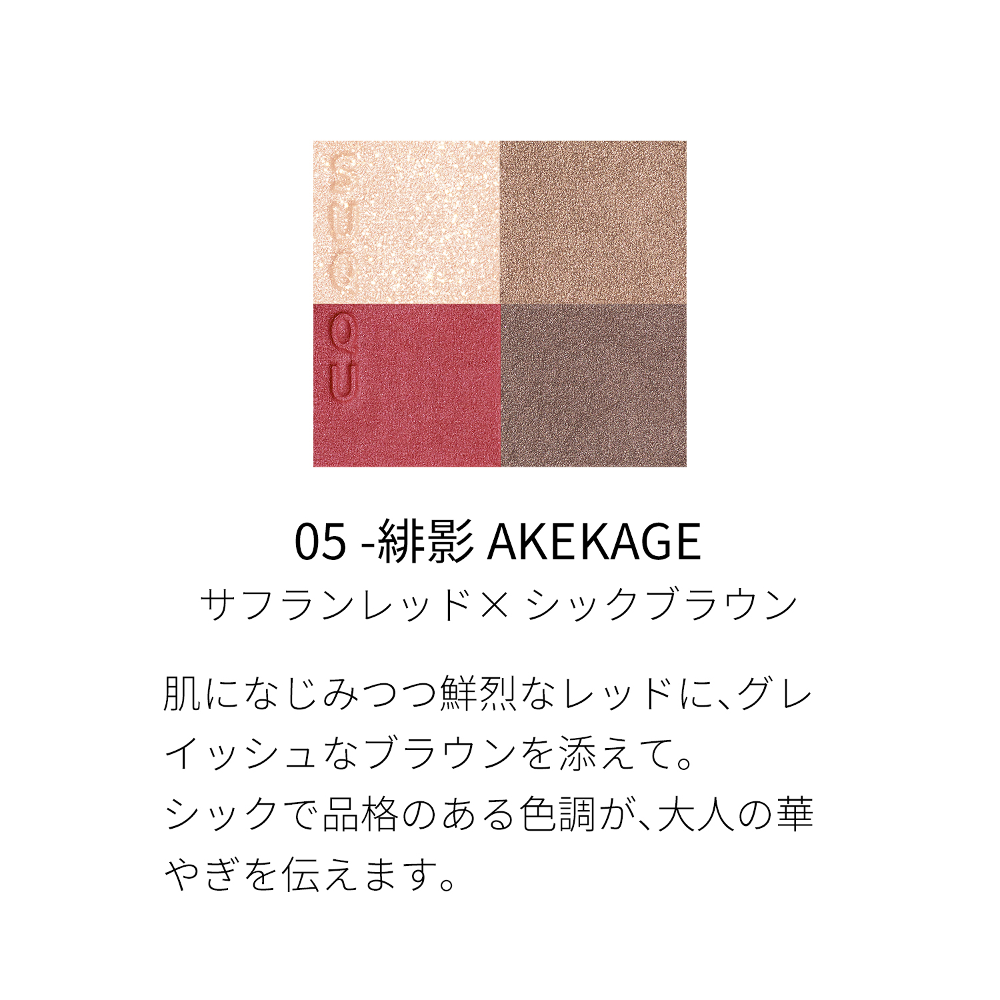
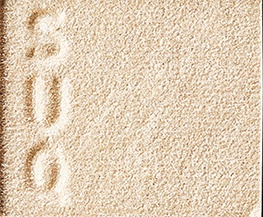
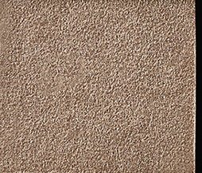
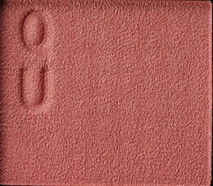
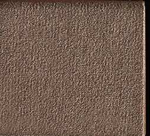

# SUQQU 4色 四色盘 緋影 Signature Color Eyes 05 Akekage
*发布：2024*

> 融入肌肤的同时，以鲜烈的绯红为主调，辅以灰调棕色衬托。沉静而品格兼具的色调，传递成熟女性的华丽风采。

> *A vivid saffron red that melts into the skin, paired with grey-infused browns — a chic, dignified palette that conveys the radiance of mature femininity.*

---

### 使用方法 How To Use

| 方法一 | 方法二 |
|--------|--------|
|  |  |

**方法一（B→D→C→A）：** ①B铺眼窝，②D晕睫毛线三分之二处，③C铺眼窝并与D融合晕开，④A从眼头叠加提亮。

**方法二（D→B→A→C）：** ①D沿睫毛根部晕染，②B扫下眼睑，③A精准点涂眼头（不向外扩散），④C铺满眼窝。

---

## 色号 A：覆光色 Coat Color — 香槟金珠光

使用：点于眼头，精准提亮。

##### 色号 A：覆光色 (Coat Color) —— 细闪香槟金珠光，为眼神注入流光感。
用途：点涂眼头，提亮内眼角；亦可叠于其他色号上增加光感，或扫于眉骨。

---

## 色号 B：底色 Base Color — 暖棕

使用：铺满眼窝，塑造中性暖棕底色。

##### 色号 B：底色 (Base Color) —— 自然暖棕，细腻哑光，肌肤融合感强。
用途：铺满眼窝作为底色，为绯红系主色提供温和衬托；亦可单独晕开作日常棕调眼妆。

---

## 色号 C：主色 Main Color — 绯红珠光

使用：铺于眼窝作为主体色，叠于底色之上。

##### 色号 C：主色 (Main Color) —— 鲜烈绯红珠光，光彩动人。
用途：铺于眼窝打造绯红妆感重心，与B色融合自然过渡；亦可单独晕开打造简约红调单色妆。

---

## 色号 D：深色 Deep Color — 深灰棕

使用：沿睫毛根部晕染，为眼妆收线定形。

##### 色号 D：深色 (Deep Color) —— 深冷灰棕，沉稳中性，令眼妆更具品格感。
用途：晕染睫毛线，赋予眼妆深度；与C色叠加打造绯红烟熏渐变，深邃而有力度。
