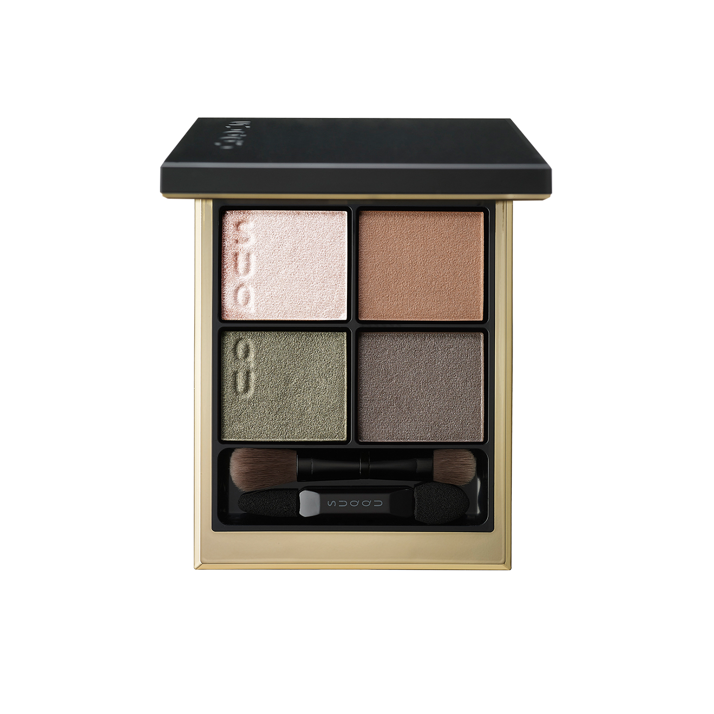
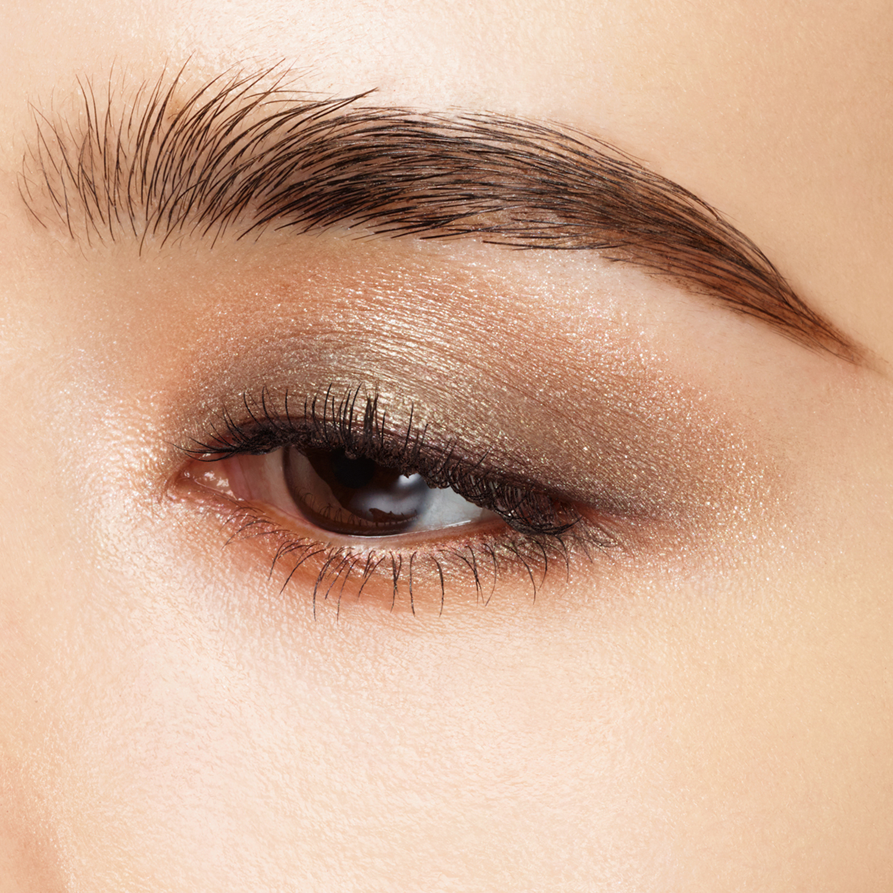
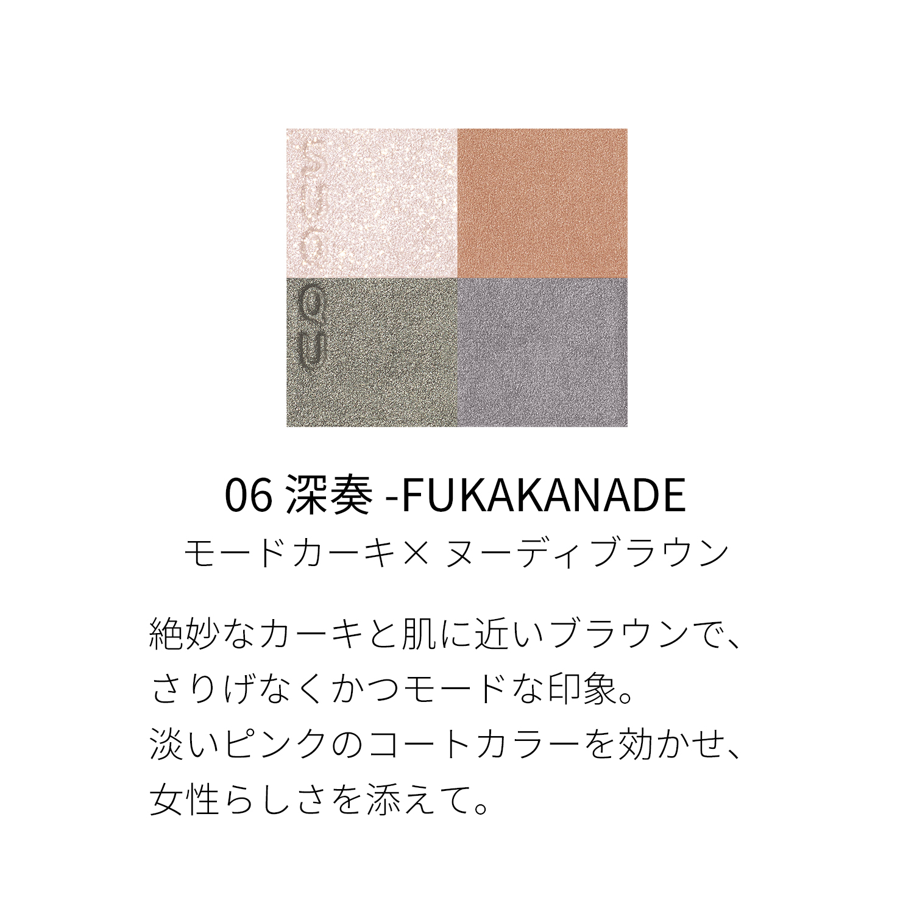
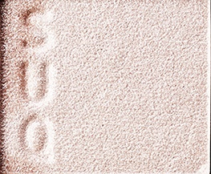
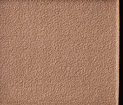
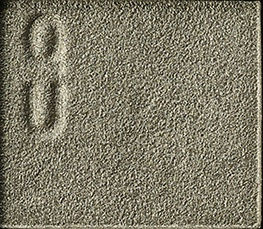
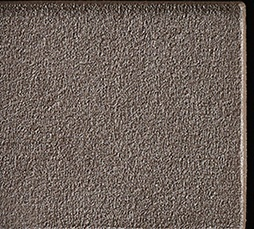

# SUQQU 4色 四色盘 深奏 Signature Color Eyes 06 Fukakanade
*发布：2024*

> 以绝妙的卡其色与贴肤棕调，打造低调而不失时髦的摩登印象。淡雅的粉调覆光色为整体增添一抹女性柔情，于沉稳之中流露出别致的优雅。

> *An impeccably modern palette where subtle khaki and skin-close browns create understated sophistication. A pale pink coat colour softens the palette with a distinctly feminine grace.*

---

### 使用方法 How To Use

| 方法一 | 方法二 |
|--------|--------|
|  |  |

**方法一（B→D→C→A）：** ①B铺眼窝，②D晕睫毛线三分之二处，③C铺眼窝并与D融合晕开，④A从眼头叠加提亮。

**方法二（D→B→A→C）：** ①D沿睫毛根部晕染，②B扫下眼睑，③A精准点涂眼头（不向外扩散），④C铺满眼窝。

---

## 色号 A：覆光色 Coat Color — 淡玫粉珠光

使用：点于眼头，柔和提亮，为整体增添一抹粉润感。

##### 色号 A：覆光色 (Coat Color) —— 淡雅玫粉珠光，透净轻柔。
用途：点涂眼头提亮，或轻扫眉骨；叠于其他色号上，令整体妆感更柔和。

---

## 色号 B：底色 Base Color — 裸棕铜

使用：铺满眼窝，打造贴肤裸棕底色。

##### 色号 B：底色 (Base Color) —— 温暖裸棕铜调，细腻珠光，肌肤融合感极强。
用途：铺满眼窝作为底色，为卡其绿主色营造自然过渡；亦可单独晕染呈现日常裸妆。

---

## 色号 C：主色 Main Color — 苔藓卡其

使用：铺于眼窝作为主体色，叠于底色之上。

##### 色号 C：主色 (Main Color) —— 苔藓卡其哑光，色调低调时髦。
用途：铺眼窝打造摩登卡其妆感重心，与B色融合实现自然棕绿渐变；亦可单独轻扫打造极简单色妆。

---

## 色号 D：深色 Deep Color — 蓝灰

使用：沿睫毛根部晕染，赋予眼妆深邃冷调质感。

##### 色号 D：深色 (Deep Color) —— 深蓝灰，冷峻中性，令眼妆更具摩登感。
用途：晕染睫毛线，收紧眼形；与C色叠加打造深邃的卡其烟熏，冷感而有格调。
