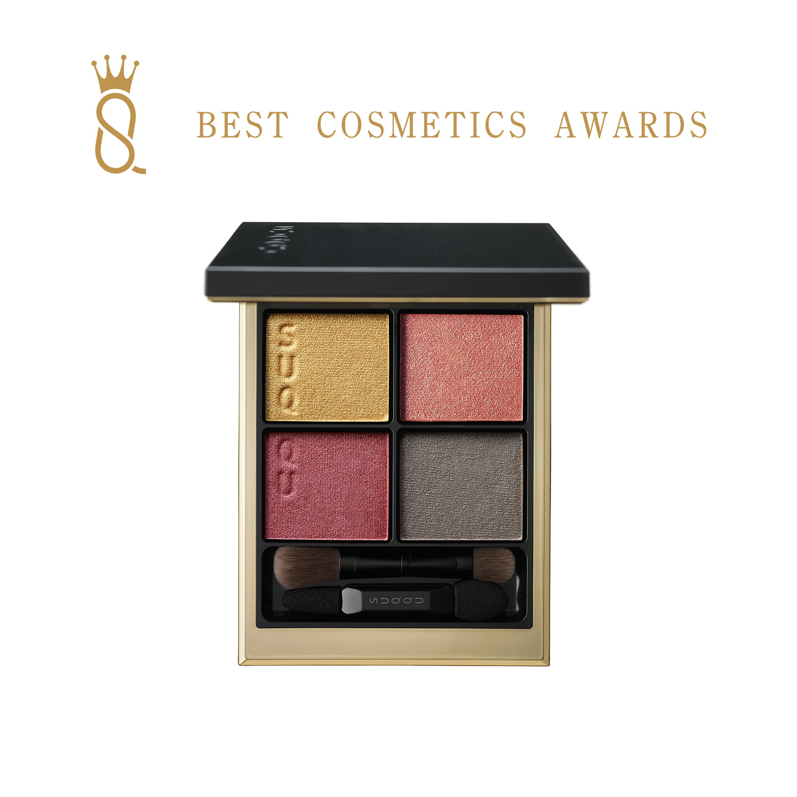
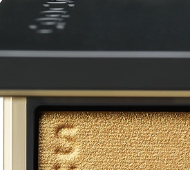
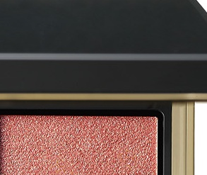
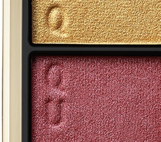
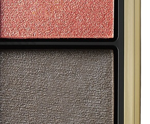

# SUQQU 4色 四色盘 紅咲 Signature Color Eyes 07 Benisaki
*发布：2023*

> 以玫红为主色调，搭配暖黄金与珊瑚粉，演绎如花盛放般的艳丽眼妆。温暖的暖灰棕为整体收尾，在华丽中保有一份稳重的品格。

> *Rose red blooms at the centre of this palette, warmed by golden highlights and coral pink undertones. A soft grey-brown grounds the look with quiet composure.*

---

### 使用方法 How To Use

| 方法一 | 方法二 |
|--------|--------|
|  |  |

**方法一（B→D→C→A）：** ①B铺眼窝，②D晕睫毛线三分之二处，③C铺眼窝并与D融合晕开，④A从眼头叠加提亮。

**方法二（D→B→A→C）：** ①D沿睫毛根部晕染，②B扫下眼睑，③A精准点涂眼头（不向外扩散），④C铺满眼窝。

---

## 色号 A：覆光色 Coat Color — 暖黄金

使用：点于眼头，为眼神注入暖金光感。

##### 色号 A：覆光色 (Coat Color) —— 暖黄金珠光，亮泽流动。
用途：点涂眼头提亮，或叠于珊瑚粉、玫红之上增加金光层次；亦可轻扫眉骨。

---

## 色号 B：底色 Base Color — 暖粉珊瑚

使用：铺满眼窝，以温柔珊瑚粉奠定底色。

##### 色号 B：底色 (Base Color) —— 暖粉珊瑚珠光，肌肤亲和度高。
用途：铺满眼窝打底，与玫红主色融合展现暖调渐变；亦可单独晕染打造轻盈日系粉妆。

---

## 色号 C：主色 Main Color — 深玫红

使用：铺于眼窝作为妆感重心，打造艳丽花盛感。

##### 色号 C：主色 (Main Color) —— 深玫红，饱和鲜艳，具有存在感。
用途：铺于眼窝打造玫红主体色，与B色层叠展现珊瑚→玫红渐变；亦可晕于下眼睑营造水雾感。

---

## 色号 D：深色 Deep Color — 暖灰棕

使用：沿睫毛根部晕染，收束眼妆轮廓。

##### 色号 D：深色 (Deep Color) —— 暖灰棕，中性哑光，令玫红眼妆不失稳重。
用途：晕染睫毛线，为华丽的玫红妆感提供沉稳收尾；与C色叠加可加深眼尾营造立体感。
