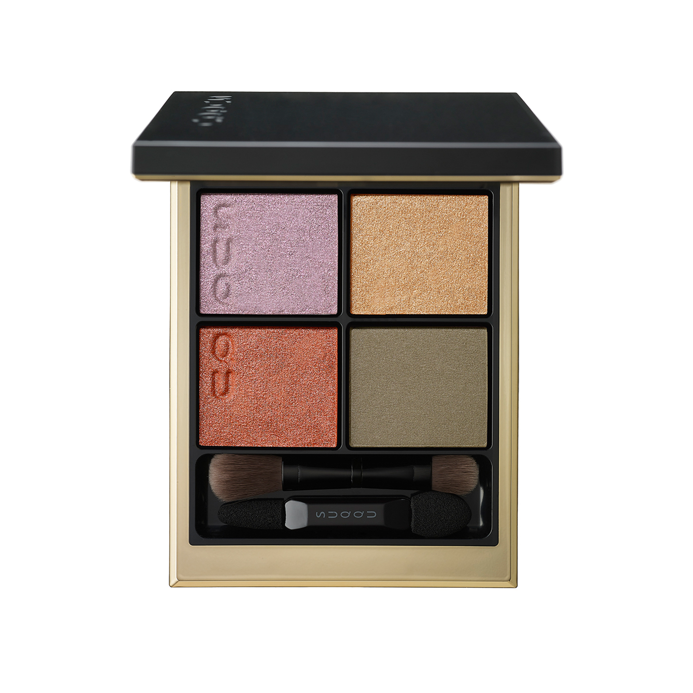
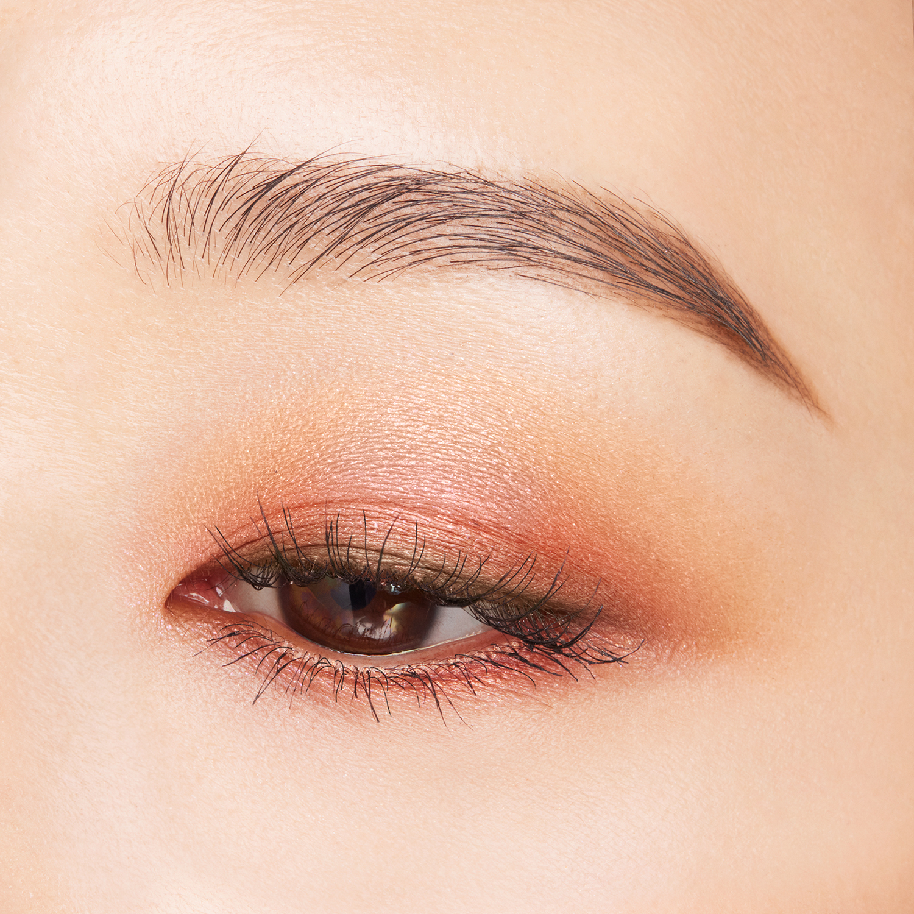
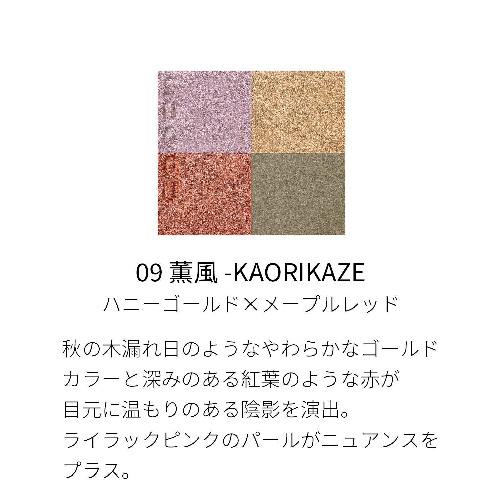
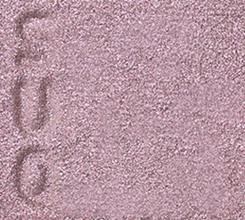
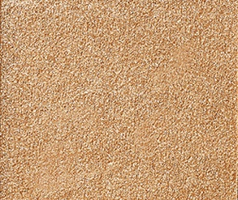
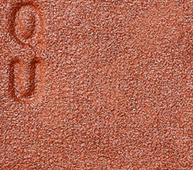
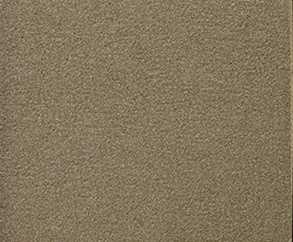

# SUQQU 4色 四色盘 薰風 Signature Color Eyes 09 Kaorikaze
*发布：2023*

> 如秋日林间洒落的柔和金光，以蜂蜜金与枫叶般的深红为目边营造温暖的明暗层次。薰衣草粉珠光轻盈点缀，为秋意眼妆增添一抹细腻的色彩韵味。

> *Like soft autumn sunlight filtering through the trees — warm honey gold and maple-red create tender depth and shadow. A touch of lilac pink pearl adds a subtle nuance to this season-touched palette.*

---

### 使用方法 How To Use

| 方法一 | 方法二 |
|--------|--------|
|  |  |

**方法一（B→D→C→A）：** ①B铺眼窝，②D晕睫毛线三分之二处，③C铺眼窝并与D融合晕开，④A从眼头叠加提亮。

**方法二（D→B→A→C）：** ①D沿睫毛根部晕染，②B扫下眼睑，③A精准点涂眼头（不向外扩散），④C铺满眼窝。

---

## 色号 A：覆光色 Coat Color — 薰衣草粉珠光

使用：点于眼头，以淡紫粉珠光轻盈提亮。

##### 色号 A：覆光色 (Coat Color) —— 薰衣草淡粉珠光，细腻微闪，为秋调眼妆增添一份清新。
用途：点涂眼头提亮，或与橙红主色叠加打造独特的暖紫色调层次。

---

## 色号 B：底色 Base Color — 蜜金

使用：铺满眼窝，以暖蜜金色打造温暖底色。

##### 色号 B：底色 (Base Color) —— 蜂蜜金珠光，温暖饱满，如秋日阳光洒于肌肤。
用途：铺满眼窝作为底色，与枫红主色融合营造秋日暖色渐变；亦可单独使用呈现金调单色妆。

---

## 色号 C：主色 Main Color — 枫红橙

使用：铺于眼窝作为主体色，演绎枫叶般的温暖红调。

##### 色号 C：主色 (Main Color) —— 枫红橙，暖调饱满，如深秋红叶般鲜艳而不刺激。
用途：铺眼窝打造秋日暖橙红主体色，与B色融合展现金→橙红自然渐变。

---

## 色号 D：深色 Deep Color — 橄榄卡其

使用：沿睫毛根部晕染，以橄榄卡其深色收紧眼形。

##### 色号 D：深色 (Deep Color) —— 橄榄卡其，大地调暗色，为秋日暖妆提供沉稳收尾。
用途：晕染睫毛线，为暖橙眼妆提供深度；与C色叠加营造秋日大地色烟熏渐变。
