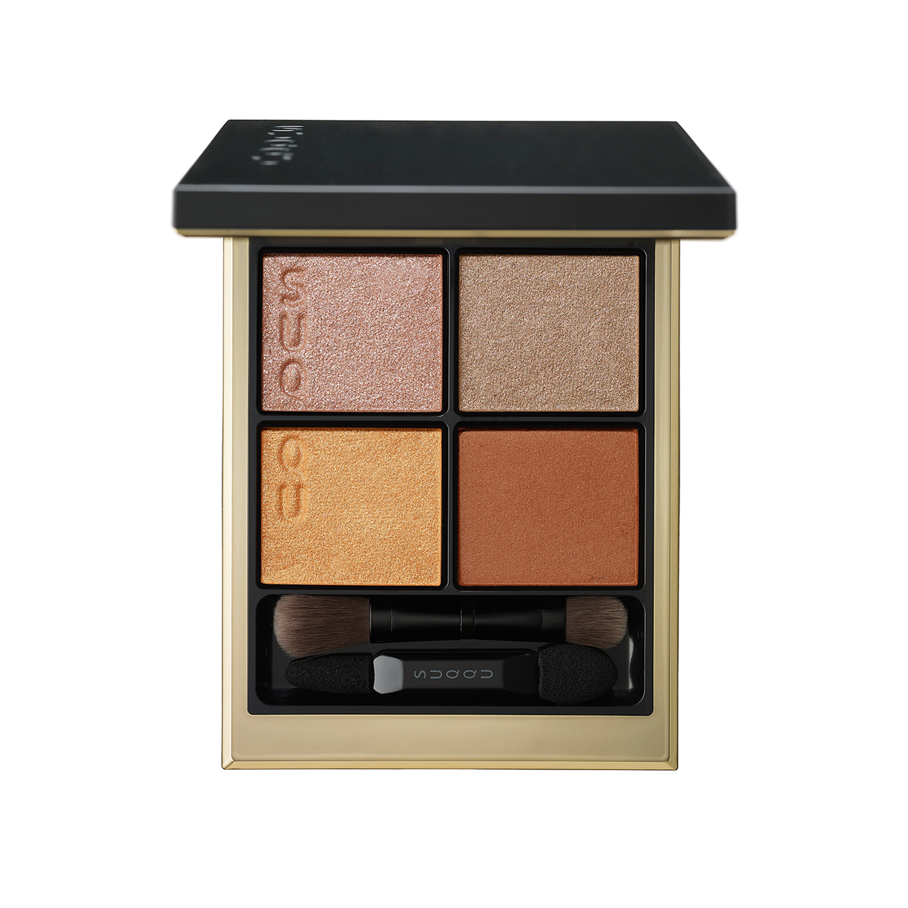
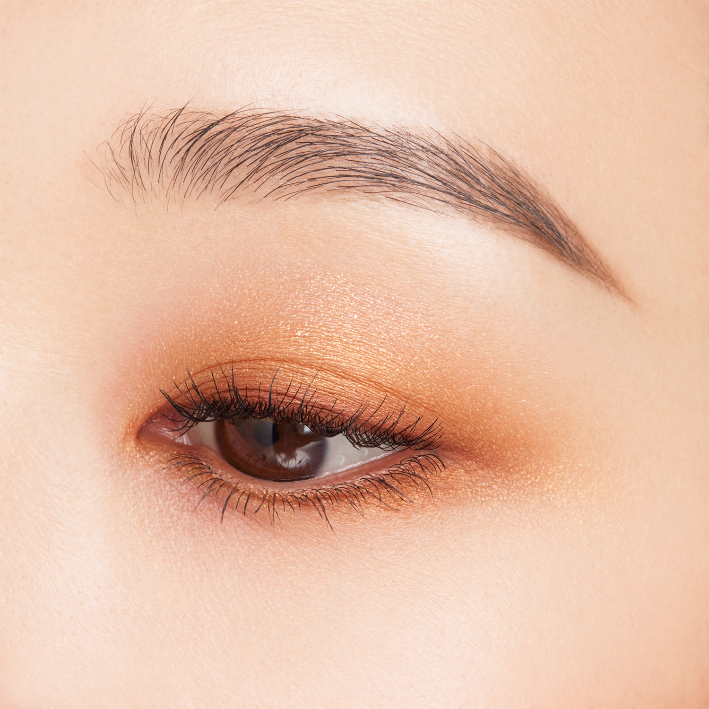
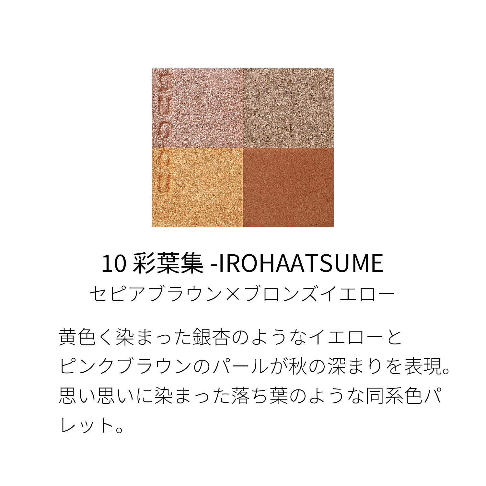
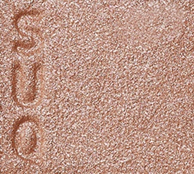
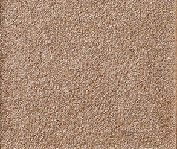
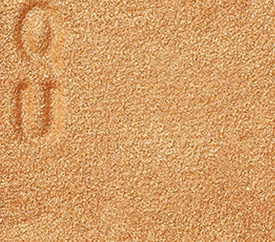
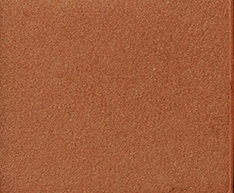

# SUQQU 4色 四色盘 彩葉集 Signature Color Eyes 10 Irohaatsume
*发布：2023*

> 如银杏叶染成金黄的色调，与粉棕珠光交织，呈现秋意渐深的层次。如同各自染上不同色彩的落叶，同色调的四色组合令眼妆丰盈而和谐。

> *Ginkgo-yellow warmth mingled with pink-brown pearls captures the deepening of autumn. Like fallen leaves tinted in their own hues — a tonal palette built for harmonious, layered depth.*

---

### 使用方法 How To Use

| 方法一 | 方法二 |
|--------|--------|
|  |  |

**方法一（B→D→C→A）：** ①B铺眼窝，②D晕睫毛线三分之二处，③C铺眼窝并与D融合晕开，④A从眼头叠加提亮。

**方法二（D→B→A→C）：** ①D沿睫毛根部晕染，②B扫下眼睑，③A精准点涂眼头（不向外扩散），④C铺满眼窝。

---

## 色号 A：覆光色 Coat Color — 粉棕珠光

使用：点于眼头提亮，为暖棕眼妆增添柔和光感。

##### 色号 A：覆光色 (Coat Color) —— 粉调棕珠光，温暖细腻，与整体秋色盘和谐融合。
用途：点涂眼头提亮；亦可叠于其他色号上增加整体光泽层次。

---

## 色号 B：底色 Base Color — 暖金沙

使用：铺满眼窝，以银杏金色奠定温暖底色。

##### 色号 B：底色 (Base Color) —— 暖金沙珠光，如银杏叶染成的黄金色，饱满温柔。
用途：铺满眼窝作为底色，与古铜黄主色融合展现自然金棕渐变；亦可单独用于日常暖金眼妆。

---

## 色号 C：主色 Main Color — 古铜黄

使用：铺于眼窝作为主体色，打造成熟的古铜大地调。

##### 色号 C：主色 (Main Color) —— 古铜黄，同色调棕黄系，低调而有质感。
用途：铺眼窝打造主体暖色调，与B色融合展现丰富的金→铜棕层次渐变。

---

## 色号 D：深色 Deep Color — 深棕

使用：沿睫毛根部晕染，以深棕收紧眼形。

##### 色号 D：深色 (Deep Color) —— 深棕哑光，浓郁沉稳，令秋日暖色眼妆立体有深度。
用途：晕染睫毛线，为整体暖棕眼妆提供深邃轮廓；与C色叠加可强化层次，打造日系棕调烟熏。
