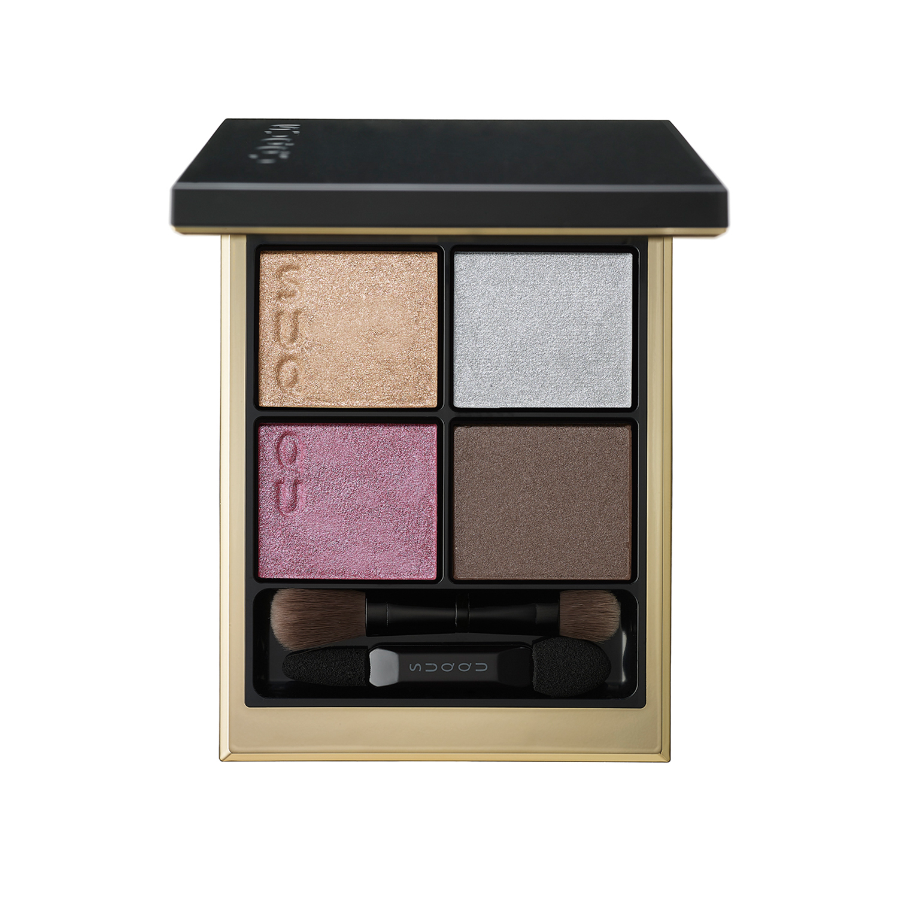
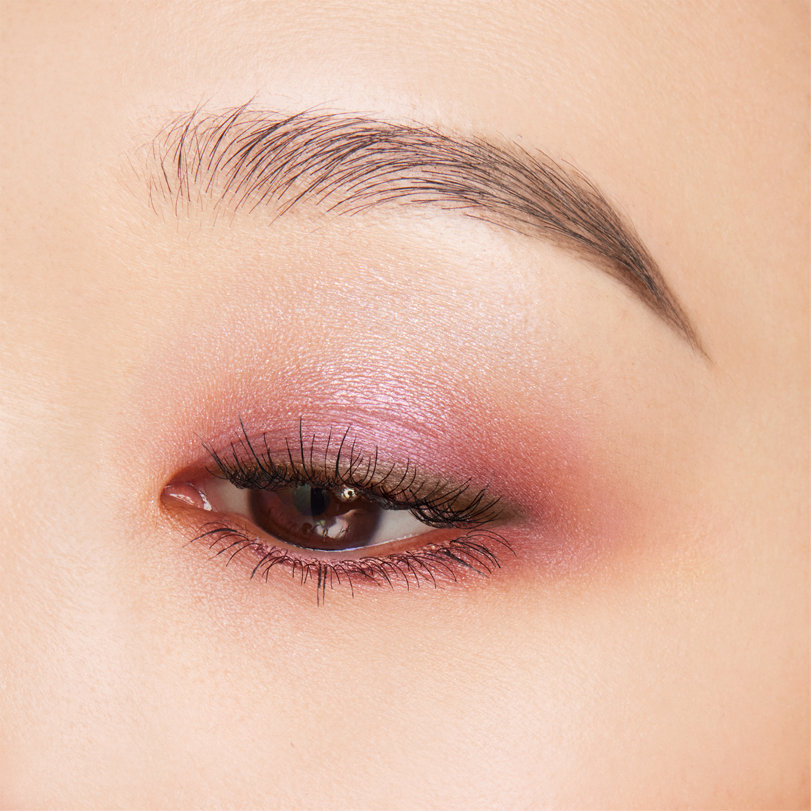
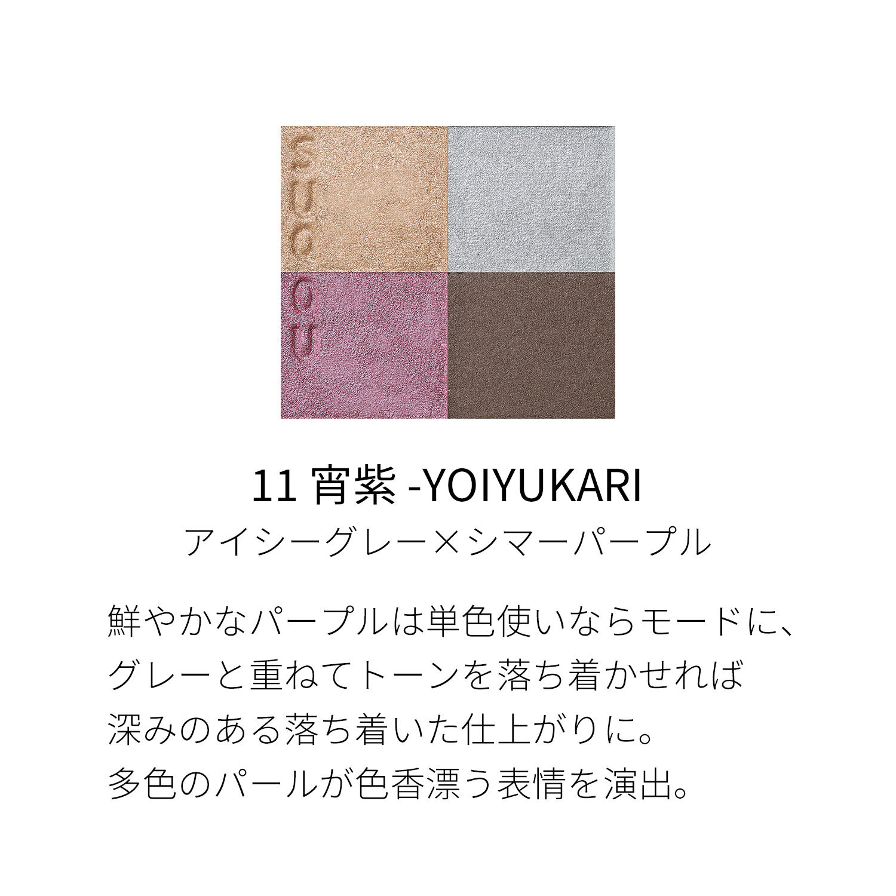
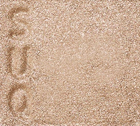
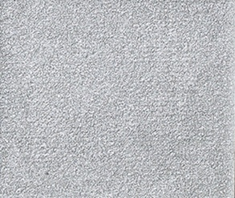
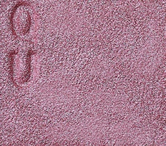
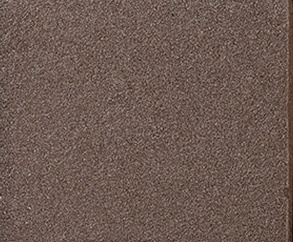

# SUQQU 4色 四色盘 宵紫 Signature Color Eyes 11 Yoiyukari
*发布：2023*

> 鲜艳的紫色单独使用时呈现摩登姿态，与冰灰叠加则沉淀为深邃低调的魅惑。多色珠光的交织，令眼妆散发出如夜晚般幽深的色彩魅力。

> *Vivid purple used alone delivers a bold, mode statement; layered with icy grey, it deepens into quiet, smouldering allure. Multi-toned pearls weave a subtly enchanting shimmer across the lids.*

---

### 使用方法 How To Use

| 方法一 | 方法二 |
|--------|--------|
|  |  |

**方法一（B→D→C→A）：** ①B铺眼窝，②D晕睫毛线三分之二处，③C铺眼窝并与D融合晕开，④A从眼头叠加提亮。

**方法二（D→B→A→C）：** ①D沿睫毛根部晕染，②B扫下眼睑，③A精准点涂眼头（不向外扩散），④C铺满眼窝。

---

## 色号 A：覆光色 Coat Color — 暖金珠光

使用：点于眼头，以暖金光感提亮内眼角。

##### 色号 A：覆光色 (Coat Color) —— 暖金珠光，明亮轻盈，为紫调眼妆注入一抹暖意。
用途：点涂眼头提亮，与紫色形成温暖对比；叠于紫色之上可增加独特的金紫层次感。

---

## 色号 B：底色 Base Color — 冰灰蓝

使用：铺满眼窝，以冰灰蓝打造沉静底色。

##### 色号 B：底色 (Base Color) —— 冰灰蓝，冷调克制，令紫色眼妆更具深邃层次。
用途：铺满眼窝作为底色，与紫色叠加时可降低色调饱和度，呈现更内敛成熟的效果。

---

## 色号 C：主色 Main Color — 雾紫粉珠光

使用：铺于眼窝作为主体色，演绎宵夜般的紫调魅力。

##### 色号 C：主色 (Main Color) —— 雾紫粉珠光，鲜艳而流光，可摩登可柔媚。
用途：单独铺满眼窝呈现大胆摩登紫调妆；与B色叠加令紫色沉淀，打造深邃低调的夜幕感眼妆。

---

## 色号 D：深色 Deep Color — 暖灰棕

使用：沿睫毛根部晕染，以暖灰棕为紫调眼妆收线。

##### 色号 D：深色 (Deep Color) —— 暖灰棕，中性包容，与紫色和冰灰皆可融合。
用途：晕染睫毛线，为整体妆感提供稳定的深色轮廓；与C色叠加可打造深邃紫棕烟熏渐变。
