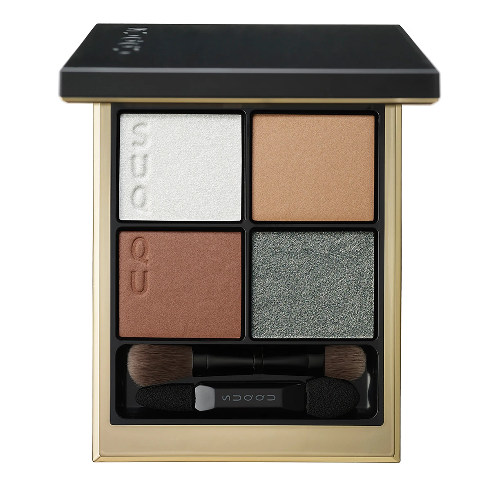
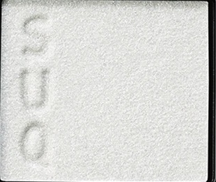
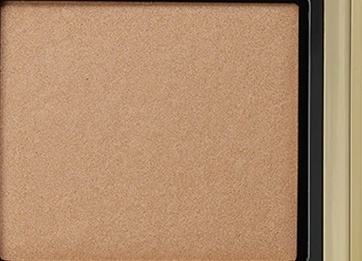
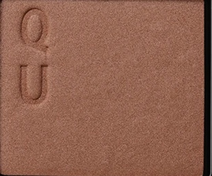
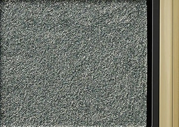

# SUQQU 4色 四色盘 胡桃染 Signature Color Eyes 12 Kurumizome
*发布：2023*

> 胡桃染，以核桃壳染就的温润深棕，历经岁月沉淀而成。纯净的银白如初春残雪，温暖的榛果棕似早春阳光下的焦糖色泽，厚重的中棕如泥土回暖，冷调的灰蓝则如春寒料峭时分、晴空中的一抹冷冽银光——四色在对比中寻得和谐，演绎初春柔润而又清醒的眼神。

> *Kurumizome — colour steeped from walnut husks, rich and patient with time. Pure silver-white like the last snowfall of early spring, warm hazelnut shimmer like caramel melting in spring sun, deep walnut brown as earth thawing, and a cool blue-grey like the crisp glint of clear skies in late winter. Four shades find harmony in contrast, evoking the tender yet lucid gaze of early spring.*

---

**方法一（D→B→A→C）：** ①D沿睫毛根部晕染，②B扫下眼睑，③A精准点涂眼头，④C铺满眼窝。

**方法二（B→D→C→A）：** ①B铺满眼窝打底，②D晕染睫毛线三分之二处，③C铺于眼窝并与D融合晕开，④A从眼头叠加提亮。

---

## 色号 A：覆光色 Coat Color — 纯白细闪

使用：Apply to the inner corner and centre lid to add a pure, snow-white shimmer that brightens and opens up the eye.

##### 色号 A：覆光色 (Coat Color) —— 纯净雪白，含超细微珠光粒子，质地轻盈透亮，如初春残雪在阳光下绽放的纯粹光辉。
用途：精准点涂眼头及泪沟提亮，或叠压于底色上方增强全局光感；用于眼头可打造清透开阔的春日眼神。

---

## 色号 B：底色 Base Color — 榛果焦糖珠光

使用：Sweep across the lid as a warm, honeyed caramel base that flatters medium to warm skin tones beautifully.

##### 色号 B：底色 (Base Color) —— 温暖的榛果焦糖棕，含丰盈珠光，暖调蜜润，如阳光斜照在胡桃木上折射出的温柔光泽。
用途：均匀铺满眼窝作为基底，以温润暖调奠定整体妆感；与A色的冷调白光形成温柔的冷暖层次。

---

## 色号 C：主色 Main Color — 暖胡桃棕哑光

使用：Blend across the lid to build warm, walnut-brown depth that gives the eyes earthy richness and definition.

##### 色号 C：主色 (Main Color) —— 暖调胡桃棕哑光，色彩饱满内敛，质感如细腻绒面，兼具大地的沉稳与秋日的温度。
用途：铺于眼窝中心叠于B色之上，向眼尾渐深与D色融合，以暖棕大地色烘托出整体的秋意温润。

---

## 色号 D：深色 Deep Color — 冷灰蓝细闪

使用：Line the lash roots with this cool blue-grey shimmer to add a contrasting, frost-kissed depth and dimension.

##### 色号 D：深色 (Deep Color) —— 冷调蓝灰细闪，含密集银调闪粉，冷冽而通透，如春寒料峭时晴空的一线冰蓝光泽。
用途：沿睫毛线晕染形成冷调轮廓，以冷色对比衬托B/C的暖意；细密闪粉在灯光下折射出清醒迷人的冷光。
