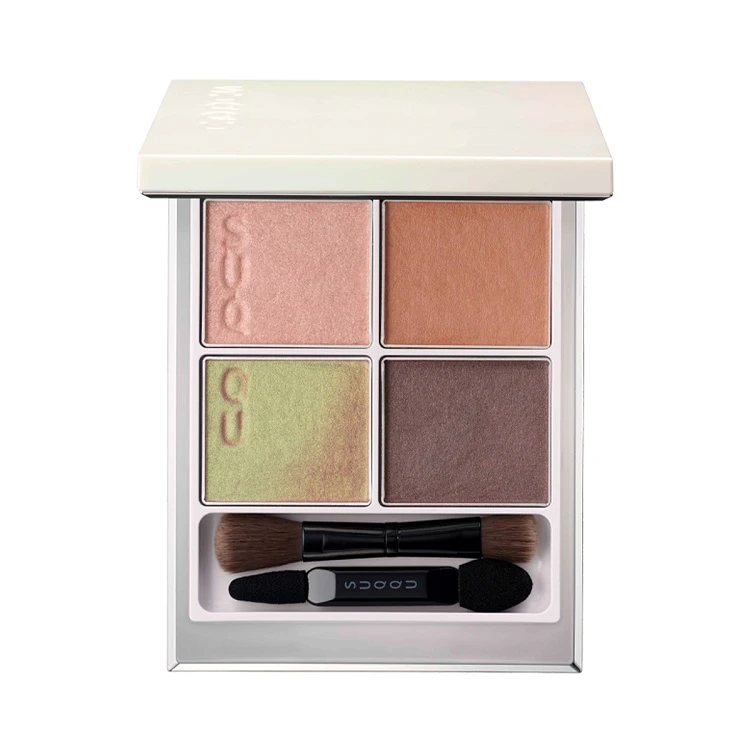
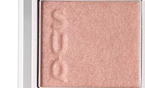
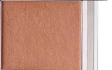
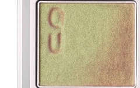
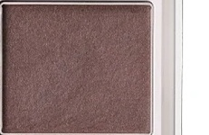

# SUQQU 4色 四色盘 光舞 Signature Color Eyes 125 Hikarimai
*发布：2023*

> 夏日的光从水面跃起，化为漫天飞舞的金点与绿影。暖蜜桃的珠光如晨光中的第一道余晖，珊瑚橙的温柔铺展似映在水中的夕阳，橄榄绿与暖金的双色幻彩如光在树影间流转变换，深温棕则如大地的安稳将这舞动的光收归沉静——光舞，是夏日最自由的诗篇。

> *Summer light leaps from the water's surface, scattering into dancing gold and green. Warm peach shimmer like the first ray at dawn, soft terracotta warmth like sunset reflected on rippling water, an olive-to-gold duochrome shifting like light playing through summer leaves, and a deep warm brown to still the dance. Hikarimai — the freest poem of summer.*

---

**方法一（D→B→A→C）：** ①D沿睫毛根部晕染，②B扫下眼睑，③A精准点涂眼头，④C铺满眼窝。

**方法二（B→D→C→A）：** ①B铺满眼窝打底，②D晕染睫毛线三分之二处，③C铺于眼窝并与D融合晕开，④A从眼头叠加提亮。

---

## 色号 A：覆光色 Coat Color — 暖蜜桃铜珠光

使用：Apply to the inner corner and brow bone to add a warm, rosy-peach shimmer that lifts the eye with a sun-kissed glow.

##### 色号 A：覆光色 (Coat Color) —— 暖蜜桃铜调珠光，含玫瑰金色细闪，温润柔亮，如夏日晨光在肌肤上轻轻描下的第一笔暖晕。
用途：点涂眼头与眉骨提亮，或叠于底色中央强化光感；与B色同为暖调，但A色的铜珠光质感更加灵动透亮。

---

## 色号 B：底色 Base Color — 暖珊瑚橙珠光

使用：Sweep across the lid as a warm terracotta-coral base that gives the eyes a sun-warmed, earthy luminosity.

##### 色号 B：底色 (Base Color) —— 暖珊瑚橙调珠光，偏深于A色，带有微微的大地橙调，如夏日午后阳光在泥土上投下的温暖印记。
用途：均匀铺满眼窝作为基底，以丰富的暖调橙珠光奠定整体夏日气息；可单独用于眼窝打造简约暖色妆效。

---

## 色号 C：主色 Main Color — 橄榄绿金双色幻彩

使用：Blend across the lid for a stunning olive-to-gold duochrome that shifts between cool green and warm gold in different lights.

##### 色号 C：主色 (Main Color) —— 橄榄绿与暖金的双色幻彩，在光线角度变化中游走于绿与金之间，含珠光细闪，质感通透而梦幻，是本盘的点睛之笔。
用途：铺于眼窝中心打造夏日独特的绿金系妆容；叠加B色时可于眼窝中央呈现对比与层次；单独使用亦可演绎清新夏日风情。

---

## 色号 D：深色 Deep Color — 深暖玫瑰棕哑光

使用：Apply to the lash line to add a warm, deep rose-brown matte depth that anchors the shimmery shades above.

##### 色号 D：深色 (Deep Color) —— 深暖玫瑰棕调哑光，色泽饱满沉稳，质感细腻，为舞动的光与幻彩提供稳定的深邃支撑。
用途：沿睫毛线晕染加深眼形，以暖棕哑光为眼妆提供轮廓感；叠于眼尾与C色融合，收敛幻彩的活泼使整体更有张力。
