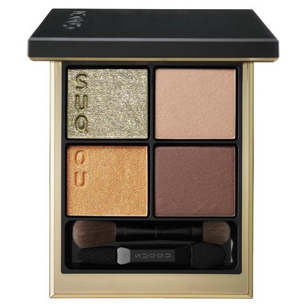
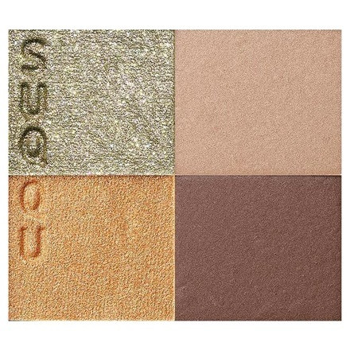
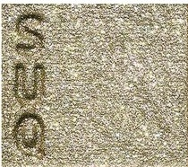
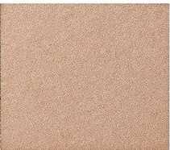
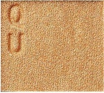
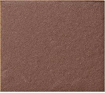

# SUQQU 4色 四色盘 紅彩 Signature Color Eyes 128 Kousa
*发布：2023*

> 夏日余晖中，光的彩虹在水面与叶隙间流转——金绿的微光如翡翠折射阳光，温裸的珊瑚如暑热中的肌肤暖调，琥珀的金光如午后的光晕在睫边流淌，最终沉入深沉的玫瑰棕如夕阳燃尽后的余焰。紅彩，是夏末最后的流光溢彩。

> *In the last warmth of summer, light's spectrum plays across water and leaves — iridescent gold-green like jade catching the sun, nude terracotta like warm skin in the heat, amber shimmer flowing along the lash line like afternoon glow, settling finally into deep rosewood like the last embers of sunset. Kousa — the final radiant flourish of late summer.*

---

**方法一（D→B→A→C）：** ①D沿睫毛根部晕染，②B扫下眼睑，③A精准点涂眼头，④C铺满眼窝。

**方法二（B→D→C→A）：** ①B铺满眼窝打底，②D晕染睫毛线三分之二处，③C铺于眼窝并与D融合晕开，④A从眼头叠加提亮。

---

## 色号 A：覆光色 Coat Color — 金绿细闪

使用：Press to the inner corner and lid centre to add a fine, iridescent gold-green shimmer with a jewel-like quality.

##### 色号 A：覆光色 (Coat Color) —— 金绿幻彩细闪，含极细密的金调与绿调双色珠光粒子，折光效果似翡翠在阳光下的灵动光辉。
用途：点涂眼头及眼睑中央叠压提亮，以细腻的金绿光泽为整体妆容增添宝石般的精致感。

---

## 色号 B：底色 Base Color — 暖裸珊瑚

使用：Sweep across the eyelid as a warm, flattering nude-coral base that suits all skin tones.

##### 色号 B：底色 (Base Color) —— 暖裸珊瑚调，质地细腻，微带光泽感，色调介于粉与橙之间，如健康暖调肤色的自然延伸。
用途：均匀铺满眼窝作为基底，以暖裸调为整体妆感营造从容雅致的大地系底色。

---

## 色号 C：主色 Main Color — 暖琥珀金珠光

使用：Blend across the lid for a warm, golden-amber shimmer that adds radiant, sun-soaked luminosity.

##### 色号 C：主色 (Main Color) —— 暖琥珀金调珠光，色彩饱满温润，光感丰盈，如午后光晕在琥珀宝石上折射出的流动金光。
用途：铺于眼窝中心叠于B色之上，以丰盈的琥珀金光烘托整体华光妆感；向眼尾过渡与D色融合。

---

## 色号 D：深色 Deep Color — 深玫瑰棕哑光

使用：Apply to the lash roots to add a deep rosewood matte that defines the eyes with warm, velvety depth.

##### 色号 D：深色 (Deep Color) —— 深玫瑰棕调哑光，色彩沉稳而有温度，如夕阳燃尽后留在天边的最后一抹暖红余焰。
用途：沿睫毛线晕染加深轮廓，叠于眼尾演绎深邃暖调眼神；以绒面哑光质感为金调妆容增添低调奢华感。
