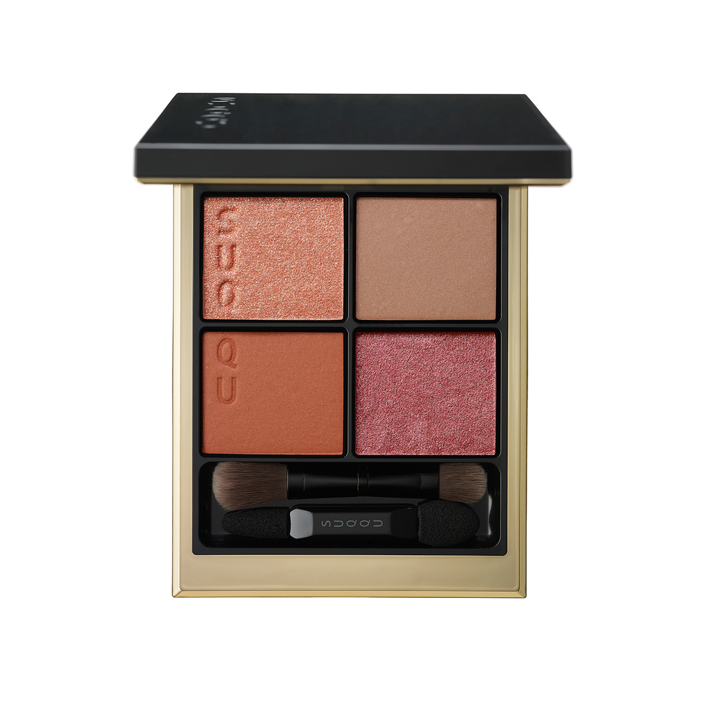
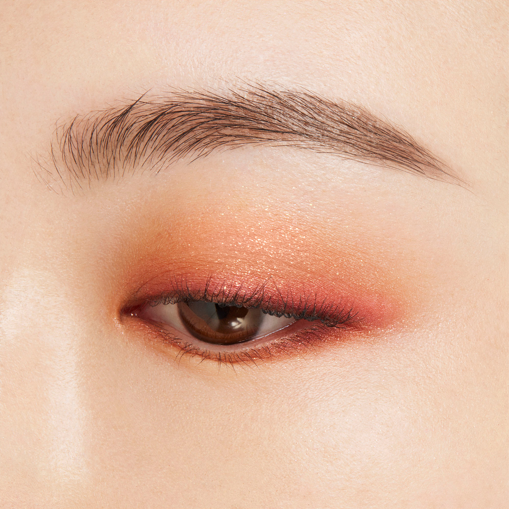
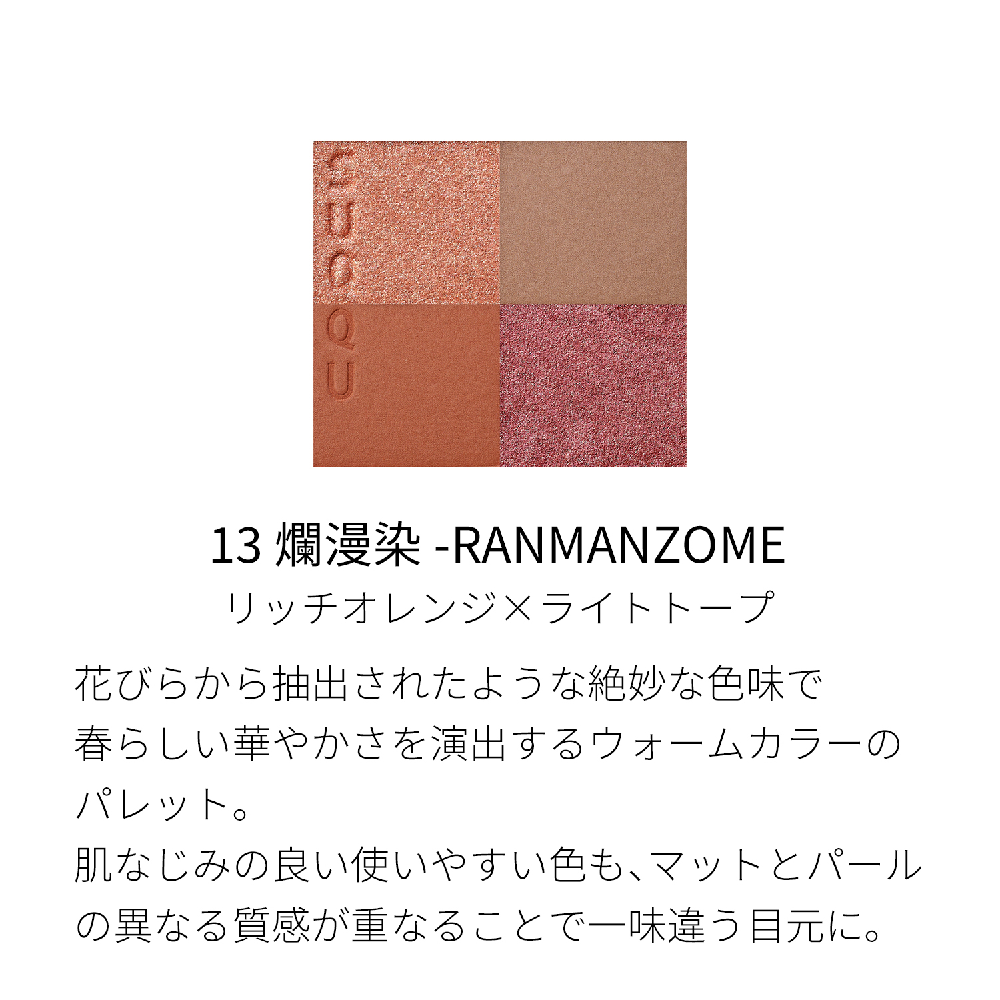
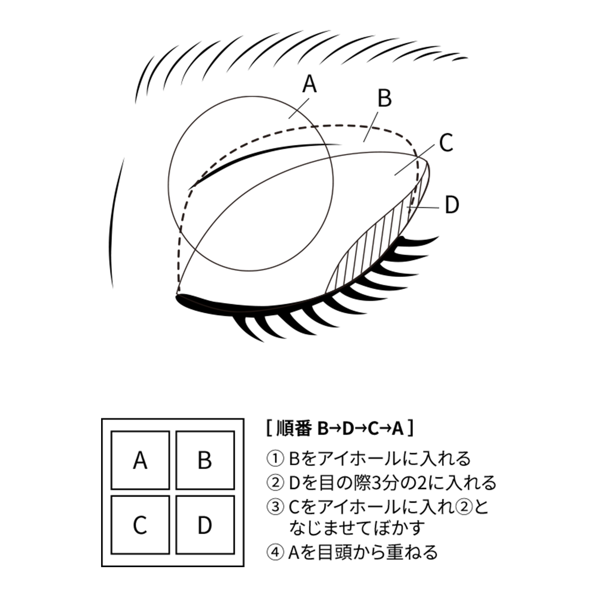
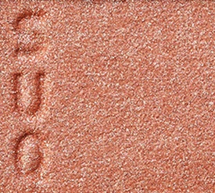
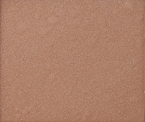
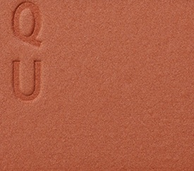
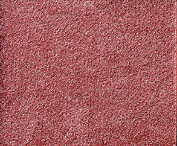

# SUQQU 4色 四色盘 爛漫染 Signature Color Eyes 13 Ranmanzome
*发布：2024*

> 如从花瓣中萃取而来的绝妙色调，演绎春日般华丽的暖色眼妆。哑光与珠光的不同质感交叠，令每一个贴肤的色调都焕发出别样的动人光彩。

> *Colours extracted from petals — warm and lively as spring in full bloom. The interplay of matte and pearl textures gives each skin-harmonious hue a distinctive, luminous dimension.*

---

### 使用方法 How To Use

| 方法一 | 方法二 |
|--------|--------|
|  |  |

**方法一（B→D→C→A）：** ①B铺眼窝，②D晕睫毛线三分之二处，③C铺眼窝并与D融合晕开，④A从眼头叠加提亮。

**方法二（D→B→A→C）：** ①D沿睫毛根部晕染，②B扫下眼睑，③A精准点涂眼头（不向外扩散），④C铺满眼窝。

---

## 色号 A：覆光色 Coat Color — 玫瑰金珠光

使用：点于眼头，以玫瑰金珠光提亮眼神。

##### 色号 A：覆光色 (Coat Color) —— 玫瑰金珠光，温暖流光，与整体暖色盘完美呼应。
用途：点涂眼头提亮，或叠于其他色号增加金粉光泽；亦可轻扫眉骨。

---

## 色号 B：底色 Base Color — 浅棕

使用：铺满眼窝，以贴肤浅棕奠定自然底色。

##### 色号 B：底色 (Base Color) —— 浅棕哑光，肌肤亲和感极强，百搭实用。
用途：铺满眼窝作为打底色，为砖橙与玫粉提供自然衔接；亦可单独使用打造极简日常棕妆。

---

## 色号 C：主色 Main Color — 砖橙哑光

使用：铺于眼窝作为主体色，演绎春日暖橙调。

##### 色号 C：主色 (Main Color) —— 砖橙哑光，温暖饱满，如暖阳般充满活力。
用途：铺眼窝打造春日暖橙主体妆感，与B色融合展现棕→橙自然渐变；哑光质感令整体妆面更有力度。

---

## 色号 D：深色 Deep Color — 玫粉珠光

使用：沿睫毛根部晕染或点涂下眼睑，以玫粉珠光增添浪漫感。

##### 色号 D：深色 (Deep Color) —— 玫粉珠光，华丽轻盈，令暖橙眼妆增添春日花意。
用途：晕染睫毛线或涂于下眼睑，为橙调眼妆注入粉润的层次；与C色叠加可营造橙粉烟熏渐变。
