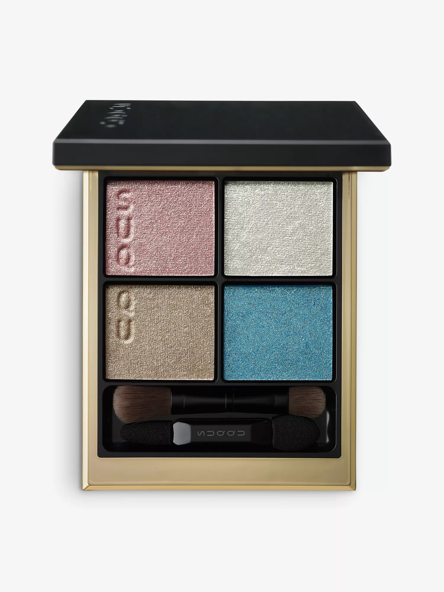
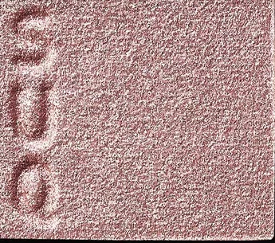
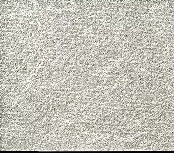
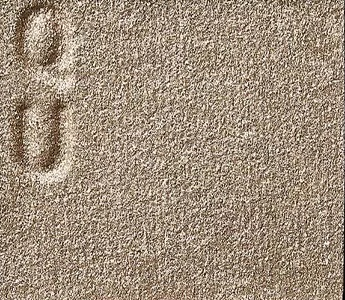
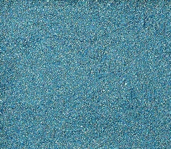

# SUQQU 4色 四色盘 六花 Signature Color Eyes 131 Rikka
*发布：2023*

> 六花，是日语中雪花的雅称——六瓣对称，晶莹剔透，在寂静中翩翩起舞。覆光色的温暖尘粉珠光如初雪落下的柔情，底色的绒光纯银如雪面的明净空灵，主色的高贵灰带着灰米色亮粉，沉静中暗藏深邃，深色的鲜亮绿松石蓝如冬日晴空中那一道清冽之光。四色相融，将静谧冬景中银花飞舞的瞬间，凝结为眼睑上的永恒诗意。

> *Rikka — the Japanese word for snowflake, meaning "six flowers", each crystal a perfect six-petaled bloom. Warm dusty pink pearl shimmer like the tender glow of winter light on fresh snow, fluffy silver white like the pure blankness of a pristine snowfield, noble grey woven with ash-beige shimmer that holds quiet depth, and a vivid turquoise that breaks through like winter sky glimpsed between falling crystals. Four shades that crystallise the silent dance of silver snowflakes.*

---

**使用方法（官方推荐）：** 先将B铺满眼窝全体及上眼睑目头至黑眼珠上方（二度叠涂），再以C晕染双眼皮内收处及眼头内眼线，然后在下眼睑全体扫上A，最后将D点于眼头内侧边缘。

**Suggested Application:** Apply B across the entire eye socket (double layer from inner corner to above iris), use C on the narrow double-lid crease and as inner corner liner, sweep A across the full lower lid, then dot D at the innermost corner of the eye.

---

## 色号 A：覆光色 Coat Color — 温暖尘粉珠光

使用：Sweep across the entire lower lid — the warm dusty pink pearl shimmer opens and brightens the eye with a gentle, glamorous glow. Can also be used alone as a single-shade look thanks to its universally flattering tone.

##### 色号 A：覆光色 (Coat Color) —— 细腻珠母光泽与温暖尘粉色的融合，亮片颗粒丰盈，提升透明感与立体感，营造出恰到好处的甜美华丽眼神。与各肤色和谐相融，亦可单独使用。
用途：铺扫下眼睑全体，以温暖尘粉珠光点亮眼神；亦可单独叠于眼窝演绎甜美清透感。

---

## 色号 B：底色 Base Color — 绒光纯银

使用：Sweep across the entire eye socket, applying a double layer from inner corner to above the iris on the upper lid. This fluffy silver shade works as both base and finishing touch, delivering gloss and shimmer with snow-like delicacy and clarity.

##### 色号 B：底色 (Base Color) —— 纯净轻盈的绒光银白，无浑浊感，如初雪覆盖后雪面那般明净空灵。既可单独铺底，又可叠于其他色号之上作最终提亮，演绎雪花般脆弱易逝的眼神。
用途：铺满眼窝全体打底；上眼睑自眼头至黑眼珠上方区域二度叠涂，强化银白光感层次。

---

## 色号 C：主色 Main Color — 高贵灰含灰米亮粉

使用：Apply with precision to the narrow double-lid crease area and draw along the inner corner as a liner. This noble grey with ash-beige shimmer adds a layer of mature, cool-toned sophistication that transforms the look.

##### 色号 C：主色 (Main Color) —— 含灰米色调亮粉的高贵灰，柔软中透着清冷，是绝妙的双重质感——白日光线下显现暖灰调，近看又有细腻的金米亮粉流光。薄薄叠涂，顿时呈现成熟优雅的印象。
用途：晕染于双眼皮内收处，强调眼型深邃；用作眼头内眼线，以一笔冷灰提升整体妆效的精致感。

---

## 色号 D：深色 Deep Color — 鲜亮绿松石蓝

使用：Dot precisely at the innermost corner of the eye as a vivid accent. This turquoise blue adds an instant flash of chic, wearable colour. Also effective drawn as a fine liner for a graphic winter-sky edge.

##### 色号 D：深色 (Deep Color) —— 清冽精干的鲜亮绿松石蓝，色彩明净饱满，无混浊，如冬日晴空中透过雪花晶体折射出的那一道蓝。蓝调入眼，妆感瞬间跃升时髦格调。
用途：点于眼头内侧边缘作为点睛之笔；亦可用作眼线，以绿松石蓝勾勒冬日清冽的图形感轮廓。
