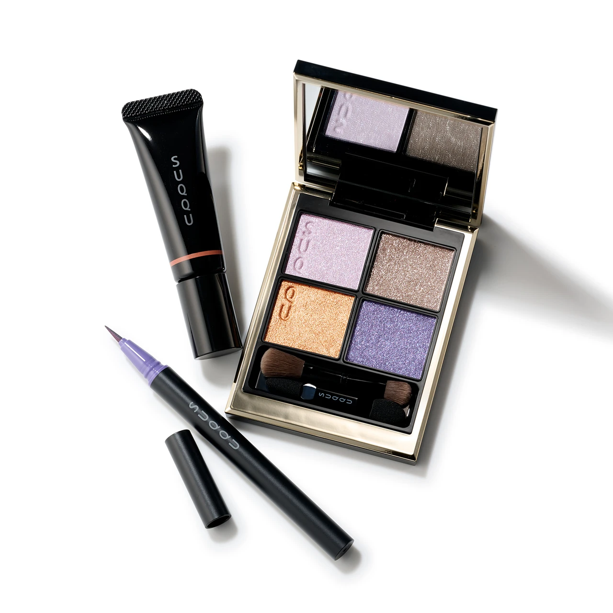
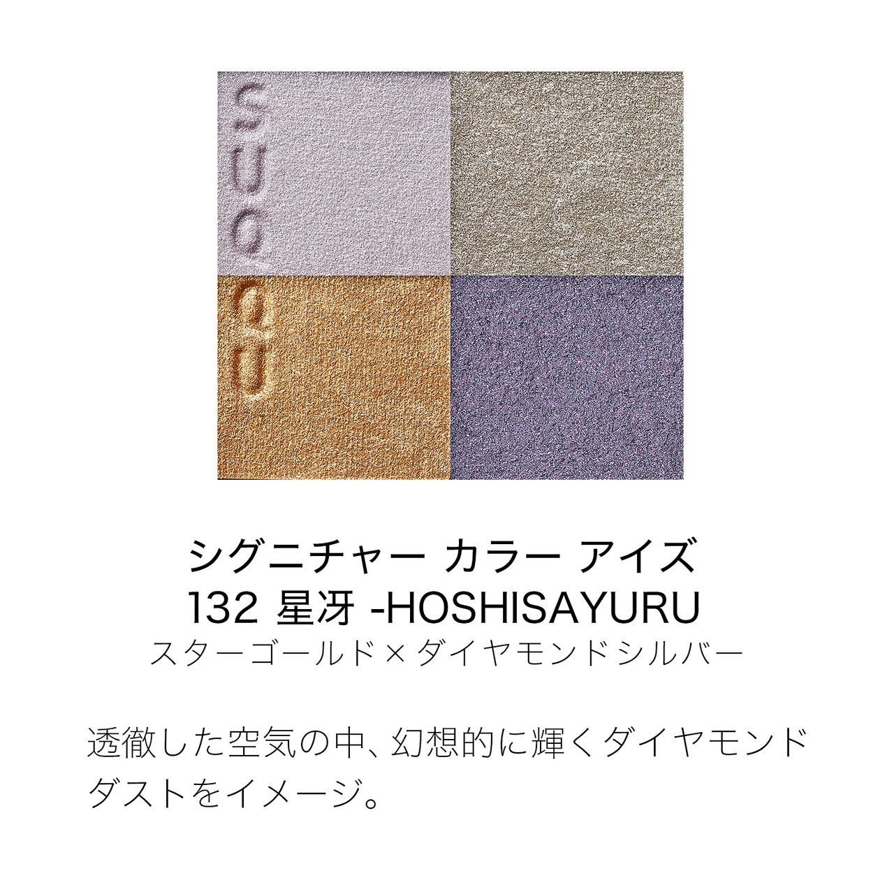
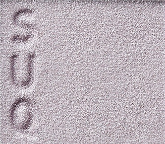
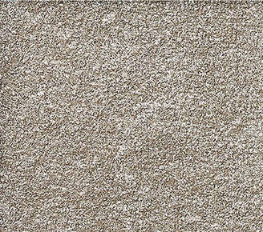
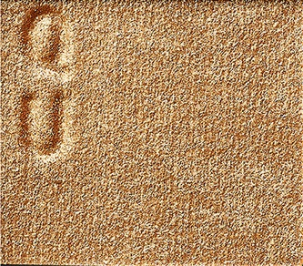
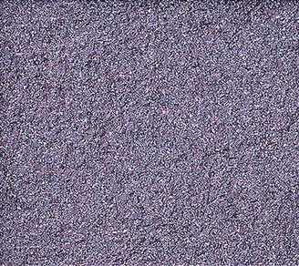

# SUQQU 4色 四色盘 星冴 Signature Color Eyes 132 Hoshisayuru
*发布：2023*

> 以透彻清冽的空气为背景，营造出仿若钻石尘埃在星空中幻想般闪耀的视觉意象。星金与钻石银的碰撞，在眼睑勾勒出冬夜繁星映照的璀璨光辉，精致而令人印象深刻。

> *Against the backdrop of crystalline winter air, this palette evokes the fantastical shimmer of diamond dust beneath a starlit sky. Star gold and diamond silver combine on the lids to recreate the radiant brilliance of a clear winter night — refined, luminous and unforgettable.*

---

**方法一（D→B→A→C）：** ①D沿睫毛根部晕染，②B扫下眼睑，③A精准点涂眼头，④C铺满眼窝。

**方法二（B→D→C→A）：** ①B铺满眼窝打底，②D晕染睫毛线三分之二处，③C铺于眼窝并与D融合晕开，④A从眼头叠加提亮。

---

## 色号 A：覆光色 Coat Color — 薰衣草银白珠光

使用：Apply precisely to inner corner and over lids to unify the look with a cool lavender-silver luminosity.

##### 色号 A：覆光色 (Coat Color) —— 薰衣草调银白珠光，含细腻冷调闪粉，如钻石尘埃般轻盈透亮。
用途：精准点涂眼头及泪沟，或叠于底色上营造整体冷调星光感；亦可单独铺满眼窝，演绎清冷仙气眼妆。

---

## 色号 B：底色 Base Color — 星金暖棕细闪

使用：Sweep across the eyelid as a warm base layer, lending a subtle star-gold shimmer to the skin.

##### 色号 B：底色 (Base Color) —— 暖调星金棕米细闪，含丰富珠光粒子，为眼妆打下温润闪耀的基底色。
用途：均匀铺满眼窝作底色，奠定整体金调星光底妆；与A色的冷调银光形成冷暖对比层次。

---

## 色号 C：主色 Main Color — 暖橙金珠光

使用：Blend across the lid for warm, golden radiance that catches the light like starlight on a winter night.

##### 色号 C：主色 (Main Color) —— 暖橙金调珠光，色彩饱满而光感丰盈，如冬夜星辉折射出的暖金光泽。
用途：铺于眼窝中心叠于B色之上，强调温暖光感；向眼尾延伸与D色融合，打造深邃星光层次。

---

## 色号 D：深色 Deep Color — 紫晶细闪

使用：Line the lash roots to add depth and define the eyes with a jewel-like purple shimmer.

##### 色号 D：深色 (Deep Color) —— 紫晶调细闪，冷邃而华贵，如夜空中星石般折射出神秘光芒。
用途：沿睫毛线晕染加深轮廓，叠于眼尾演绎深邃紫调烟熏；银调细闪在灯光下折射出迷人星辰般的光泽。
