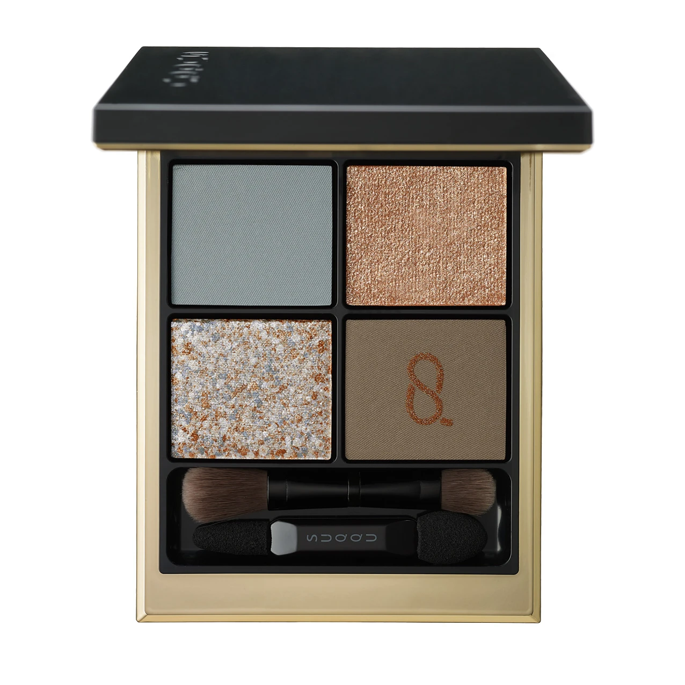
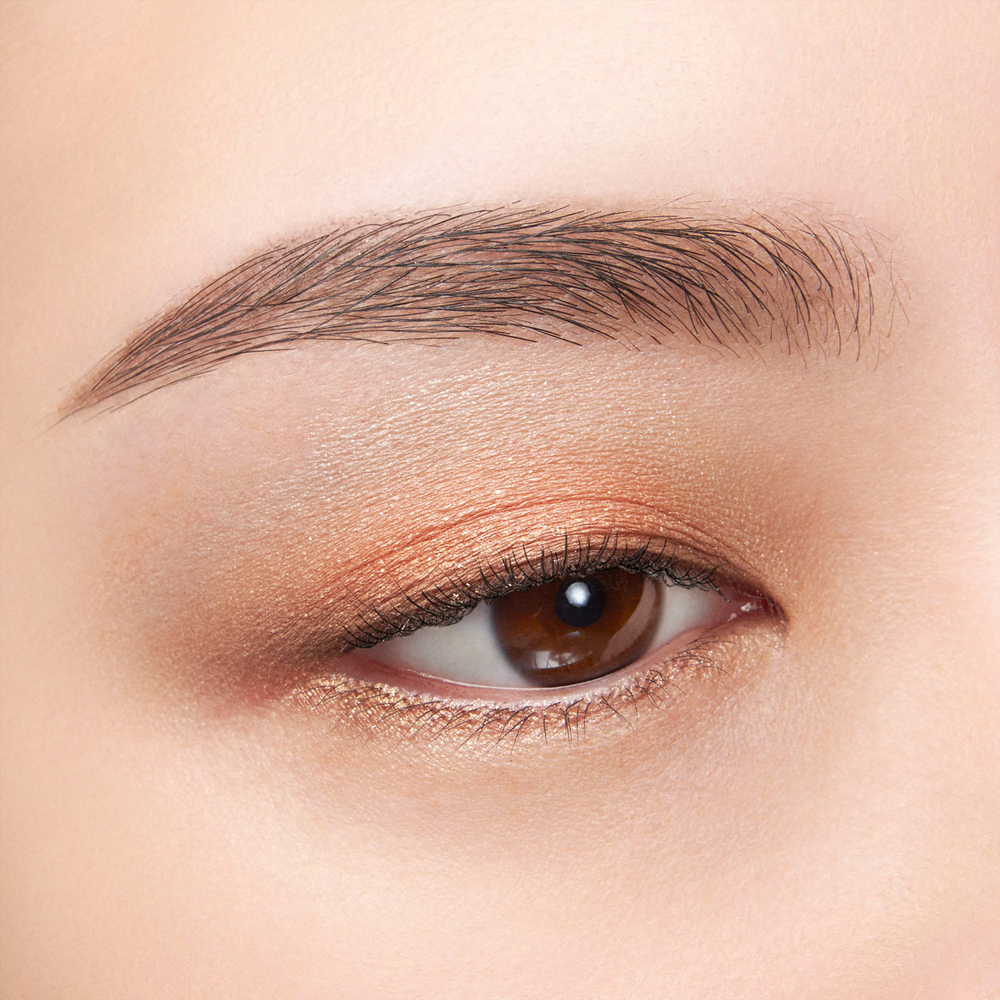
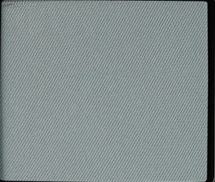
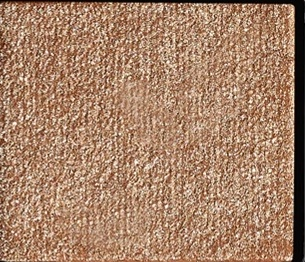
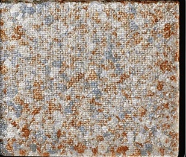
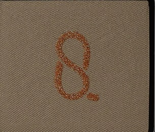

# SUQQU 4色 四色盘 日向折 Signature Color Eyes 135 Hinataori
*发布：2024*

> 春日向阳处，光以细线编织而成。淡雅的灰蓝如清晨的春寒，温柔的玫瑰金珠光如阳光刚刚穿透云层时的第一道暖意，银灰与铜金交织成的幻彩如光在薄雾中漫射时若隐若现的七彩——温卡其的沉稳托底，将晴日阳光的织锦定格于眼睑之上。

> *In the sun-facing slope of spring, light is woven in fine threads. Pale grey-blue like the chill of early morning, warm rose-gold shimmer as the first warmth breaks through cloud, silver and copper dancing together in the haze of light through mist, and warm khaki as the steady earth beneath. Hinataori — sunlight woven, spring held still.*

---

**方法一（D→B→A→C）：** ①D沿睫毛根部晕染，②B扫下眼睑，③A精准点涂眼头，④C铺满眼窝。

**方法二（B→D→C→A）：** ①B铺满眼窝打底，②D晕染睫毛线三分之二处，③C铺于眼窝并与D融合晕开，④A从眼头叠加提亮。

---

## 色号 A：覆光色 Coat Color — 灰蓝哑光

使用：Apply across the lid as a soft, cool grey-blue matte that creates a misty, ethereal spring base.

##### 色号 A：覆光色 (Coat Color) —— 柔和的灰蓝调哑光，带有清晨薄雾般的朦胧质感，冷调清醒，如初春清晨空气中的淡淡蓝寒。
用途：作为覆光色铺满眼窝，以清冷的灰蓝奠定朦胧春日底色；叠于其他色号上方可增添冷调质感层次。

---

## 色号 B：底色 Base Color — 玫瑰金珠光

使用：Blend across the lid for a warm, rich rose-gold shimmer that adds a luxurious, sun-lit warmth to the eyes.

##### 色号 B：底色 (Base Color) —— 温暖的玫瑰金珠光，含丰盈的金调与玫瑰调交织光泽，质感华润，如春日午后阳光穿透薄云时的橙金暖晕。
用途：均匀铺满眼窝打底，以丰盈的玫瑰金光为整体妆容注入温暖底气；与A色的冷调形成戏剧性的冷暖层次。

---

## 色号 C：主色 Main Color — 银铜双色混合闪

使用：Blend across the lid for a remarkable mixed shimmer where cool silver and warm copper particles weave together like light through mist.

##### 色号 C：主色 (Main Color) —— 银灰与暖铜两色珠光粒子混合压制而成的独特复合闪，冷暖交织、层次丰富，随光线角度呈现不同色彩倾向，是本盘最具视觉张力的色号。
用途：铺于眼窝中心为主要色彩层次，银铜的冷暖混合使眼妆充满质感与深度；叠于B色之上可增强混色的对比美感。

---

## 色号 D：深色 Deep Color — 暖卡其棕铜闪

使用：Apply to the lash roots to define the eye with a warm, tawny khaki matte grounded with subtle copper shimmer.

##### 色号 D：深色 (Deep Color) —— 温暖的卡其棕调哑光底，内含隐约的铜调闪粒，沉稳内敛，如阳光照在干燥土地上的暖调色泽，自然而耐看。
用途：沿睫毛线晕染收敛轮廓，以卡其铜调的低调深色为整体眼妆提供稳固的深度支撑。
